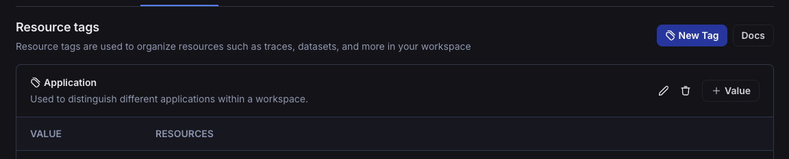

# Concepts

This conceptual guide covers topics related to managing users, organizations, and workspaces within LangSmith.

## Resource Hierarchy

### Organizations

An organization is a logical grouping of users within LangSmith with its own billing configuration. Typically, there is one organization per company. An organization can have multiple workspaces. For more details, see the [setup guide](../how_to_guides/organization_management/set_up_organization.mdx).

When you log in for the first time, a personal organization will be created for you automatically. If you'd like to collaborate with others, you can create a separate organization and invite your team members to join.
There are a few important differences between your personal organization and shared organizations:

| Feature             | Personal            | Shared                                                                                       |
| ------------------- | ------------------- | -------------------------------------------------------------------------------------------- |
| Maximum workspaces  | 1                   | Variable, depending on plan (see [pricing page](https://www.langchain.com/pricing-langsmith) |
| Collaboration       | Cannot invite users | Can invite users                                                                             |
| Billing: paid plans | Developer plan only | All other plans available                                                                    |

### Workspaces

:::info
Workspaces were formerly called Tenants. Some code and APIs may still reference the old name for a period of time during the transition.
:::

A workspace is a logical grouping of users and resources within an organization. A workspace separates trust boundaries for resources and access control.
Users may have permissions in a workspace that grant them access to the resources in that workspace, including tracing projects, datasets, annotation queues, and prompts. For more details, see the [setup guide](./how_to_guides/organization_management/set_up_workspace).

It is recommended to create a separate workspace for each team within your organization. To organize resources even further, you can use [Resource Tags](#resource-tags) to group resources within a workspace.

The following image shows a sample workspace settings page:

The following diagram explains the relationship between organizations, workspaces, and the different resources scoped to and within a workspace: 

 

See the table below for details on which features are available in which scope (organization or workspace):

| Resource/Setting                                                            | Scope            |
| --------------------------------------------------------------------------- | ---------------- |
| Trace Projects                                                              | Workspace        |
| Annotation Queues                                                           | Workspace        |
| Deployments                                                                 | Workspace        |
| Datasets &amp; Experiments                                                  | Workspace        |
| Prompts                                                                     | Workspace        |
| Resource Tags                                                               | Workspace        |
| API Keys                                                                    | Organization     |
| Settings including Secrets, Feedback config, Models, Rules, and Shared URLs | Workspace        |
| User management: Invite User to Workspace                                   | Workspace        |
| RBAC: Assigning Workspace Roles                                             | Workspace        |
| Data Retention, Usage Limits                                                | Workspace\*      |
| Plans and Billing, Credits, Invoices                                        | Organization     |
| User management: Invite User to Organization                                | Organization\*\* |
| Adding Workspaces                                                           | Organization     |
| Assigning Organization Roles                                                | Organization     |
| RBAC: Creating/Editing/Deleting Custom Roles                                | Organization     |

\*&nbsp;Data retention settings and usage limits will be available soon for the organization level as well
\*\*&nbsp;Self-hosted installations may enable workspace-level invites of users to the organization via a feature flag.
See the [self-hosted user management docs](../../self_hosting/configuration/user_management) for details.

### Resource tags

Resource tags allow you to organize resources within a workspaces. Each tag is a key-value pair that can be assigned to a resource.
Tags can be used to filter workspace-scoped resources in the UI and API: Projects, Datasets, Annotation Queues, Deployments, and Experiments.

Each new workspace comes with two default tag keys: `Application` and `Environment`; as the names suggest, these tags can be used to categorize resources based on the application and environment they belong to.
More tags can be added as needed.

LangSmith resource tags are very similar to tags in cloud services like [AWS](https://docs.aws.amazon.com/tag-editor/latest/userguide/tagging.html).

## User Management and RBAC

### Users

A user is a person who has access to LangSmith. Users can be members of one or more organizations and workspaces within those organizations.

Organization members are managed in organization settings:

And workspace members are managed in workspace settings:

### API keys

:::danger Legacy Keys deprecated as of October 22, 2024
We ended support for legacy API keys prefixed with `ls__` on October 22, 2024 in favor of personal access tokens (PATs) and service keys. We require using PATs and service keys for all new integrations. API keys prefixed with `ls__` will no longer work as of October 22, 2024.
:::

#### Expiration Dates

When you create an API key, you have the option to set an expiration date. Adding an expiration date keys enhances security and minimize the risk of unauthorized access. For example, you may set expiration dates on keys for temporary tasks that require elevated access.

By default, keys never expire. Once expired, an API key is no longer valid and cannot be reactivated or have its expiration modified.

#### Personal Access Tokens (PATs)

Personal Access Tokens (PATs) are used to authenticate requests to the LangSmith API. They are created by users and scoped to a user. The PAT will have the same permissions as the user that created it.
We recommend not using these to authenticate requests from your application, but rather using them for personal scripts or tools that interact with the LangSmith API. If the user associated with the PAT is removed from the organization, the PAT will no longer work.

PATs are prefixed with `lsv2_pt_`

#### Service keys

Service keys are similar to PATs, but are used to authenticate requests to the LangSmith API on behalf of a service account. Only admins can create service keys. The creator must be an admin in all of the workspaces the key is being scoped to, or an organization admin for org-scoped keys. We recommend using these for applications / services that need to interact with the LangSmith API, such as LangGraph agents or other integrations.
Service keys can be scoped to workspaces or an organization and can be used to authenticate requests to the LangSmith API for any workspaces within its scope.
For Enterprise users, service keys can also be assigned roles, including custom roles, which will give the key a set of permissions for the workspaces it is scoped to.

Service keys are prefixed with `lsv2_sk_`

:::note
To see how to create a service key or Personal Access Token, see the [setup guide](../how_to_guides/organization_management/create_account_api_key.mdx)
:::

### Organization roles

Organization roles are distinct from the Enterprise feature (RBAC) below and are used in the context of multiple [workspaces](#workspaces). Your organization role determines your workspace membership characteristics and your organization-level permissions. See the [organization setup guide](./how_to_guides/organization_management/set_up_organization#organization-roles) for more information.

The organization role selected also impacts workspace membership as described here:

- `Organization Admin` grants full access to manage all organization configuration, users, billing, and workspaces. **An `Organization Admin` has `Admin` access to all workspaces in an organization**
- `Organization User` may read organization information but cannot execute any write actions at the organization level. **An `Organization User` can be added to a subset of workspaces and assigned workspace roles as usual (if RBAC is enabled), which specify permissions at the workspace level.**

:::info
The `Organization User` role is only available in organizations on plans with multiple workspaces. In organizations limited to a single workspace, all users are `Organization Admins`.
Custom organization-scoped roles are not available yet.
:::

See the table below for all organization permissions:

|                                             | Organization User | Organization Admin |
| ------------------------------------------- | ----------------- | ------------------ |
| View organization configuration             | ✅                | ✅                 |
| View organization roles                     | ✅                | ✅                 |
| View organization members                   | ✅                | ✅                 |
| View data retention settings                | ✅                | ✅                 |
| View usage limits                           | ✅                | ✅                 |
| Admin access to all workspaces              |                   | ✅                 |
| Manage billing settings                     |                   | ✅                 |
| Create workspaces                           |                   | ✅                 |
| Create, edit, and delete organization roles |                   | ✅                 |
| Invite new users to organization            |                   | ✅                 |
| Delete user invites                         |                   | ✅                 |
| Remove users from an organization           |                   | ✅                 |
| Update data retention settings\*            |                   | ✅                 |
| Update usage limits\*                       |                   | ✅                 |

### Workspace roles (RBAC) {#workspace-roles}

:::note
RBAC (Role-Based Access Control) is a feature that is only available to Enterprise customers. If you are interested in this feature, please contact our sales team at sales@langchain.dev
Other plans default to using the Admin role for all users.
:::

Roles are used to define the set of permissions that a user has within a workspace. There are three built-in system roles that cannot be edited:

- `Admin` - has full access to all resources within the workspace
- `Viewer` - has read-only access to all resources within the workspace
- `Editor` - has full permissions except for workspace management (adding/removing users, changing roles, configuring service keys)

Organization admins can also create/edit custom roles with specific permissions for different resources.

Roles can be managed in organization settings under the `Roles` tab:

Alternatively, custom roles can also be created in the API key creation process.

For more details on assigning and creating roles, see the [access control setup guide](../how_to_guides/organization_management/set_up_access_control.mdx).

## Best Practices

### Environment Separation

Use [resource tags](#resource-tags) to organize resources by environment using the default tag key `Environment` and different values for the environment (e.g. `dev`, `staging`, `prod`). This tagging structure will allow you to organize your tracing projects today and easily enforce
permissions when we release attribute based access control (ABAC). ABAC on the resource tag will provide a fine-grained way to restrict access to production tracing projects, for example. We do not recommend that you use Workspaces for environment separation as you cannot share resources
across Workspaces. If you would like to promote a prompt from `staging` to `prod`, we recommend you use commit tags instead. See [docs](../prompt_engineering/concepts#tags) for more information.

## Usage and Billing

### Data Retention

In May 2024, LangSmith introduced a maximum data retention period on traces of 400 days. In June 2024, LangSmith introduced
a new data retention based pricing model where customers can configure a shorter data retention period on traces in exchange
for savings up to 10x. On this page, we'll go through how data retention works and is priced in LangSmith.

#### Why retention matters

- **Privacy**: Many data privacy regulations, such as GDPR in Europe or CCPA in California, require organizations to delete personal data
  once it's no longer necessary for the purposes for which it was collected. Setting retention periods aids in compliance with
  such regulations.
- **Cost**: LangSmith charges less for traces that have low data retention. See our tutorial on how to [optimize spend](./tutorials/manage_spend)
  for details.

#### How it works

LangSmith now has two tiers of traces based on Data Retention with the following characteristics:

|                      | Base             | Extended       |
| -------------------- | ---------------- | -------------- |
| **Price**            | $.50 / 1k traces | $5 / 1k traces |
| **Retention Period** | 14 days          | 400 days       |

**Data deletion after retention ends**

After the specified retention period, traces are no longer accessible via the runs table or API. All user data associated
with the trace (e.g. inputs and outputs) is deleted from our internal systems within a day thereafter. Some metadata
associated with each trace may be retained indefinitely for analytics and billing purposes.

**Data retention auto-upgrades**

:::caution
Auto upgrades can have an impact on your bill. Please read this section carefully to fully understand your
estimated LangSmith tracing costs.
:::

When you use certain features with `base` tier traces, their data retention will be automatically upgraded to
`extended` tier. This will increase both the retention period, and the cost of the trace.

The complete list of scenarios in which a trace will upgrade when:

- **Feedback** is added to any run on the trace
- An **Annotation Queue** receives any run from the trace
- A **Run Rule** matches any run within a trace

**Why auto-upgrade traces?**

We have two reasons behind the auto-upgrade model for tracing:

1. We think that traces that match any of these conditions are fundamentally more interesting than other traces, and
   therefore it is good for users to be able to keep them around longer.
2. We philosophically want to charge customers an order of magnitude lower for traces that may not be interacted with meaningfully.
   We think auto-upgrades align our pricing model with the value that LangSmith brings, where only traces with meaningful interaction
   are charged at a higher rate.

If you have questions or concerns about our pricing model, please feel free to reach out to support@langchain.dev and let us know your thoughts!

**How does data retention affect downstream features?**

- **Annotation Queues, Run Rules, and Feedback**: Traces that use these features will be [auto-upgraded](#data-retention-auto-upgrades).
- **Monitoring**: The monitoring tab will continue to work even after a base tier trace's data retention period ends. It is powered by
  trace metadata that exists for >30 days, meaning that your monitoring graphs will continue to stay accurate even on
  `base` tier traces.
- **Datasets**: Datasets have an indefinite data retention period. Restated differently, if you add a trace's inputs and outputs to a dataset,
  they will never be deleted. We suggest that if you are using LangSmith for data collection, you take advantage of the datasets
  feature.

#### Billing model

**Billable metrics**

On your LangSmith invoice, you will see two metrics that we charge for:

- LangSmith Traces (Base Charge)
- LangSmith Traces (Extended Data Retention Upgrades).

The first metric includes all traces, regardless of tier. The second metric just counts the number of extended retention traces.

**Why measure all traces + upgrades instead of base and extended traces?**

A natural question to ask when considering our pricing is why not just show the number of `base` tier and `extended` tier
traces directly on the invoice?

While we understand this would be more straightforward, it doesn't fit trace upgrades properly. Consider a
`base` tier trace that was recorded on June 30, and upgraded to `extended` tier on July 3. The `base` tier
trace occurred in the June billing period, but the upgrade occurred in the July billing period. Therefore,
we need to be able to measure these two events independently to properly bill our customers.

If your trace was recorded as an extended retention trace, then the `base` and `extended` metrics will both be recorded
with the same timestamp.

**Cost breakdown**

The Base Charge for a trace is .05¢ per trace. We priced the upgrade such that an `extended` retention trace
costs 10x the price of a base tier trace (.50¢ per trace) including both metrics. Thus, each upgrade costs .45¢.

### Rate Limits

LangSmith has rate limits which are designed to ensure the stability of the service for all users.

To ensure access and stability, LangSmith will respond with HTTP Status Code 429 indicating that rate or usage limits have been exceeded under the following circumstances:

#### Scenarios

###### Temporary throughput limit over a 1 minute period at our application load balancer

This 429 is the the result of exceeding a fixed number of API calls over a 1 minute window on a per API key/access token basis. The start of the window will vary slightly — it is not guaranteed to start at the start of a clock minute — and may change depending on application deployment events.

After the max events are received we will respond with a 429 until 60 seconds from the start of the evaluation window has been reached and then the process repeats.

This 429 is thrown by our application load balancer and is a mechanism in place for all LangSmith users independent of plan tier to ensure continuity of service for all users.

| Method        | Endpoint | Limit | Window   |
| ------------- | -------- | ----- | -------- |
| DELETE        | Sessions | 30    | 1 minute |
| POST OR PATCH | Runs     | 5000  | 1 minute |
| POST          | Feedback | 5000  | 1 minute |
| \*            | \*       | 2000  | 1 minute |

:::note
The LangSmith SDK takes steps to minimize the likelihood of reaching these limits on run-related endpoints by batching up to 100 runs from a single session ID into a single API call.
:::

###### Plan-level hourly trace event limit

This 429 is the result of reaching your maximum hourly events ingested and is evaluated in a fixed window starting at the beginning of each clock hour in UTC and resets at the top of each new hour.

An event in this context is the creation or update of a run. So if run is created, then subsequently updated in the same hourly window, that will count as 2 events against this limit.

This is thrown by our application and varies by plan tier, with organizations on our Startup/Plus and Enterprise plan tiers having higher hourly limits than our Free and Developer Plan Tiers which are designed for personal use.

| Plan                             | Limit          | Window |
| -------------------------------- | -------------- | ------ |
| Developer (no payment on file)   | 50,000 events  | 1 hour |
| Developer (with payment on file) | 250,000 events | 1 hour |
| Startup/Plus                     | 500,000 events | 1 hour |
| Enterprise                       | Custom         | Custom |

###### Plan-level hourly trace data ingest limit

This 429 is the result of reaching the maximum amount of data ingested across your trace inputs, outputs, and metadata and is evaluated in a fixed window starting at the beginning of each clock hour in UTC and resets at the top of each new hour.

Typically, inputs, outputs, and metadata are send on both run creation and update events. So if a run is created and is 2.0MB in size at creation, and 3.0MB in size when updated in the same hourly window, that will count as 5.0MB of storage against this limit.

This is thrown by our application and varies by plan tier, with organizations on our Startup/Plus and Enterprise plan tiers having higher hourly limits than our Free and Developer Plan Tiers which are designed for personal use.

| Plan                             | Limit  | Window |
| -------------------------------- | ------ | ------ |
| Developer (no payment on file)   | 500MB  | 1 hour |
| Developer (with payment on file) | 2.5GB  | 1 hour |
| Startup/Plus                     | 5.0GB  | 1 hour |
| Enterprise                       | Custom | Custom |

###### Plan-level monthly unique traces limit

This 429 is the result of reaching your maximum monthly traces ingested and is evaluated in a fixed window starting at the beginning of each calendar month in UTC and resets at the beginning of each new month.

This is thrown by our application and applies only to the Developer Plan Tier when there is no payment method on file.

| Plan                           | Limit        | Window  |
| ------------------------------ | ------------ | ------- |
| Developer (no payment on file) | 5,000 traces | 1 month |

###### Self-configured monthly usage limits

This 429 is the result of reaching your usage limit as configured by your organization admin and is evaluated in a fixed window starting at the beginning of each calendar month in UTC and resets at the beginning of each new month.

This is thrown by our application and varies by organization based on their configured settings.

#### Handling 429s responses in your application

Since some 429 responses are temporary and may succeed on a successive call, if you are directly calling the LangSmith API in your application we recommend implementing retry logic with exponential backoff and jitter.

For convenience, LangChain applications built with the LangSmith SDK has this capability built-in.

:::note
It is important to note that if you are saturating the endpoints for extended periods of time, retries may not be effective as your application will eventually run large enough backlogs to exhaust all retries.

If that is the case, we would like to discuss your needs more specifically. Please reach out to [LangSmith Support](mailto:support@langchain.dev) with details about your applications throughput needs and sample code and we can work with you to better understand whether the best approach is fixing a bug, changes to your application code, or a different LangSmith plan.
:::

### Usage Limits

LangSmith lets you configure usage limits on tracing. Note that these are _usage_ limits, not _spend_ limits, which
mean they let you limit the quantity of occurrences of some event rather than the total amount you will spend.

LangSmith lets you set two different monthly limits, mirroring our Billable Metrics discussed in the aforementioned data retention guide:

- All traces limit
- Extended data retention traces limit

These let you limit the number of total traces, and extended data retention traces respectively.

#### Properties of usage limiting

Usage limiting is approximate, meaning that we do not guarantee the exactness of the limit. In rare cases, there
may be a small period of time where additional traces are processed above the limit threshold before usage limiting
begins to apply.

#### Side effects of extended data retention traces limit

The extended data retention traces limit has side effects. If the limit is already reached, any feature that could
cause an auto-upgrade of tracing tiers becomes inaccessible. This is because an auto-upgrade of a trace would cause
another extended retention trace to be created, which in turn should not be allowed by the limit. Therefore, you can
no longer:

1. match run rules
2. add feedback to traces
3. add runs to annotation queues

Each of these features may cause an auto upgrade, so we shut them off when the limit is reached.

#### Updating usage limits

Usage limits can be updated from the `Settings` page under `Usage and Billing`. Limit values are cached, so it
may take a minute or two before the new limits apply.

### Related content

- Tutorial on how to [optimize spend](./tutorials/manage_spend)
