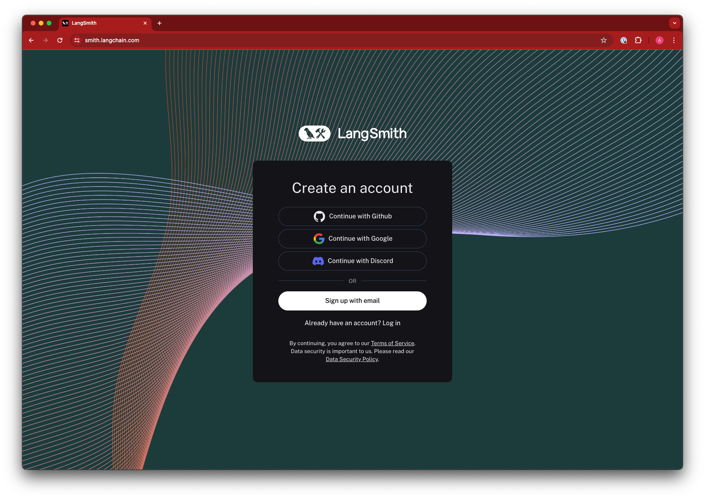
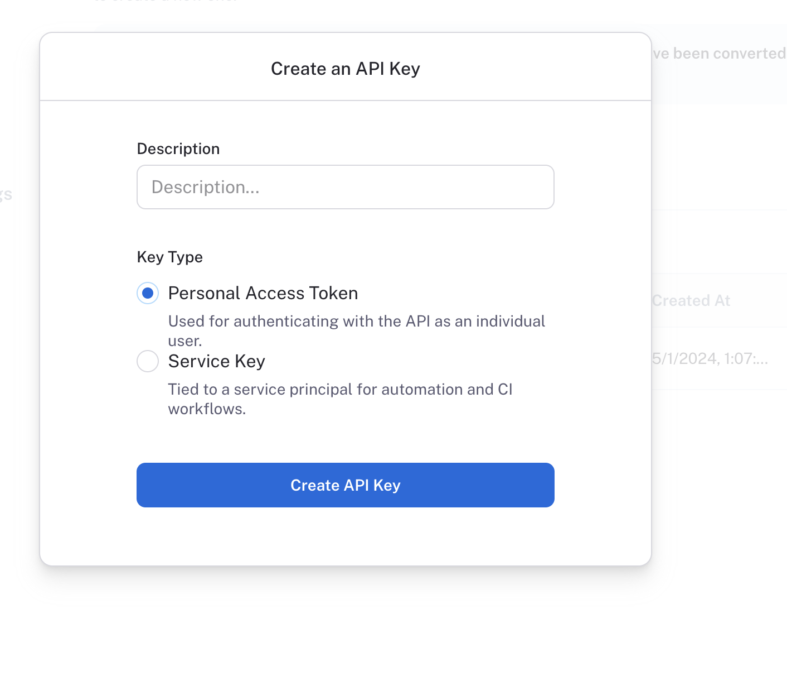

import { RegionalUrl } from "@site/src/components/RegionalUrls";

# Create an account and API key

## Create an account

To get started with LangSmith, you need to create an account. You can sign up for a free account <RegionalUrl text='here'/>.
We support logging in with Google, GitHub, and email.

## API keys

LangSmith supports two types of API keys: Service Keys and Personal Access Tokens.
Both types of tokens can be used to authenticate requests to the LangSmith API, but they have different use cases.

Read more about the differences between Service Keys and Personal Access Tokens under [admin concepts](../../concepts)

## Create an API key

To log traces and run evaluations with LangSmith, you will need to create an API key to authenticate your requests.
API keys can be scoped to a set of workspaces, or the entire organization.

To create either type of API key head to the <RegionalUrl text='Settings page' suffix='/settings'/>, then scroll to the **API Keys** section.
For service keys, choose between an organization-scoped and workspace-scoped key. If the key is workspace scoped, the workspaces must then be specified.
Enterprise users are also able to assign specific roles to the key, which adjusts its permissions.
Set the key's expiration; the key will become unusable after the number of days chosen, or never, if that is selected. Then click **Create API Key.**
:::note
The API key will be shown only once, so make sure to copy it and store it in a safe place.
:::

## Configure the SDK

You may set the following environment variables in addition to `LANGSMITH_API_KEY`.  
This is only required if using the EU instance.
`LANGSMITH_ENDPOINT=`<RegionalUrl type='api' link={false} />

This is only required for keys scoped to more than one workspace.
`LANGSMITH_WORKSPACE_ID=<Workspace ID>`
