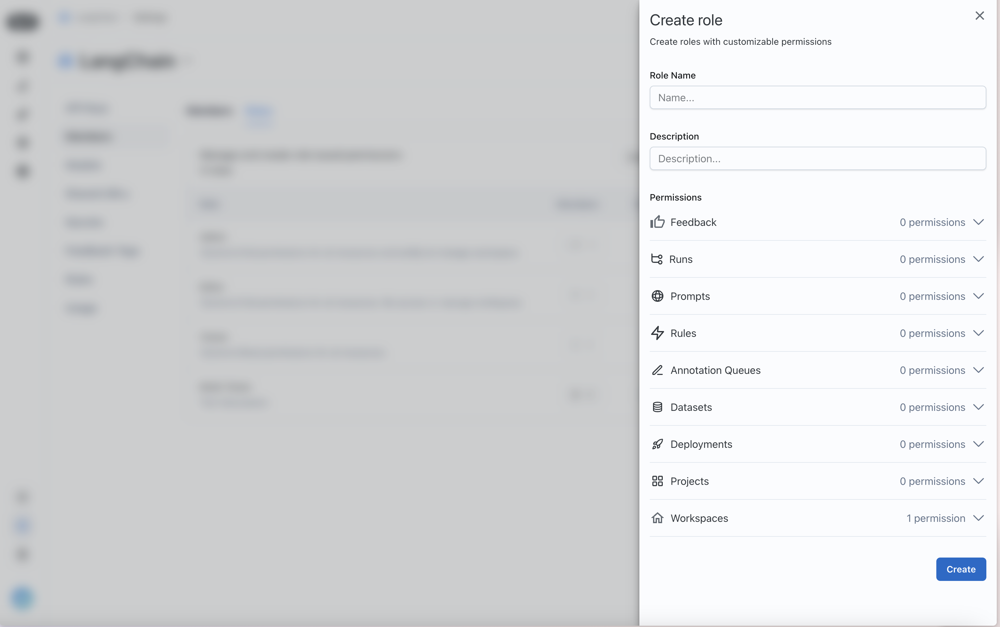
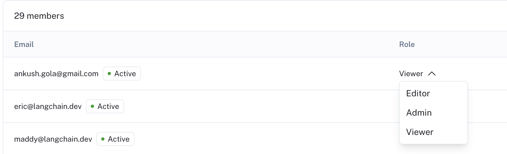
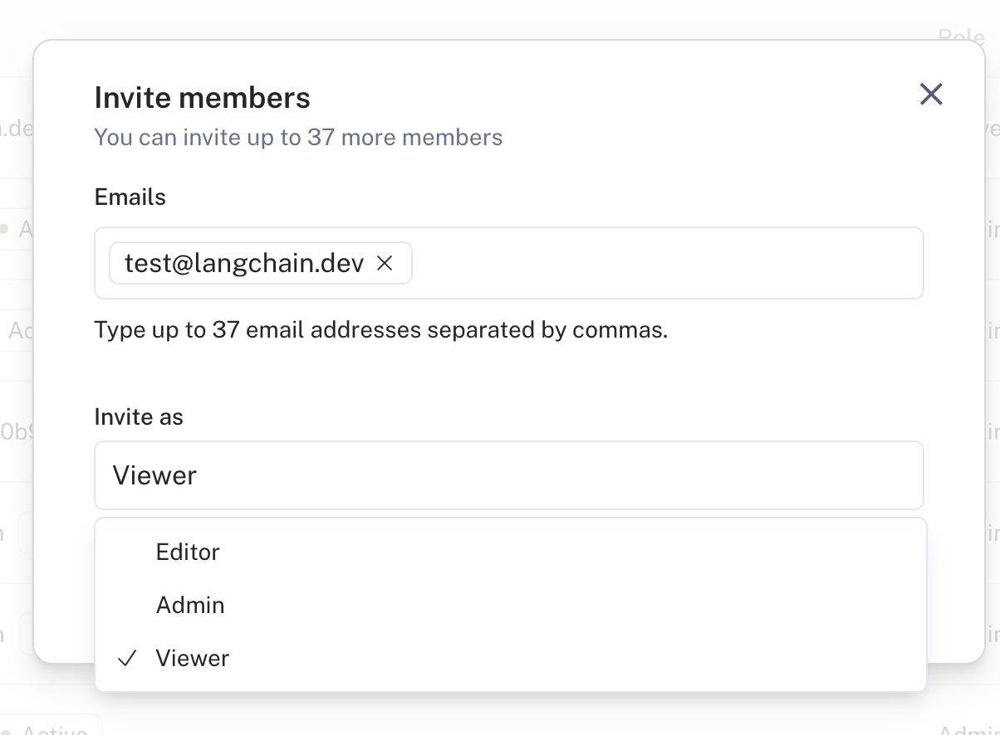

import { RegionalUrl } from "@site/src/components/RegionalUrls";

# Set up access control

:::note
RBAC (Role-Based Access Control) is a feature that is only available to Enterprise customers. If you are interested in this feature, please contact our sales team at sales@langchain.dev
Other plans default to using the Admin role for all users. Read more about roles under [admin concepts](../../concepts)
:::

:::tip Recommended Reading

Before diving into this content, it might be helpful to read the following:

- [Conceptual guide on organizations and workspaces](../../concepts)

:::

LangSmith relies on RBAC to manage user permissions **within a workspace**. This allows you to control who can access your LangSmith workspace and what they can do within it.
Only users with the `workspace:manage` permission can manage access control settings for a workspace.

## Create a role

By default, LangSmith comes with a set of system roles:

- `Admin` - has full access to all resources within the workspace
- `Viewer` - has read-only access to all resources within the workspace
- `Editor` - has full permissions except for workspace management (adding/removing users, changing roles, configuring service keys)

If these do not fit your access model, Organization Admins can create custom roles to suit your needs.

To create a role, navigate to the `Roles` tab in the `Members and roles` section of the <RegionalUrl text='Organization settings page' suffix='/settings'/>. Note that new roles that you create will be usable across all workspaces within your organization.

Click on the `Create Role` button to create a new role. You should see a form like the one below:

Assign permissions for the different LangSmith resources that you want to control access to.

## Assign a role to a user

Once you have your roles set up, you can assign them to users. To assign a role to a user, navigate to the `Workspace members` tab in the `Workspaces` section of the <RegionalUrl text='Organization settings page' suffix='/settings'/>

Each user will have a `Role` dropdown that you can use to assign a role to them.

You can also invite new users with a given role.

