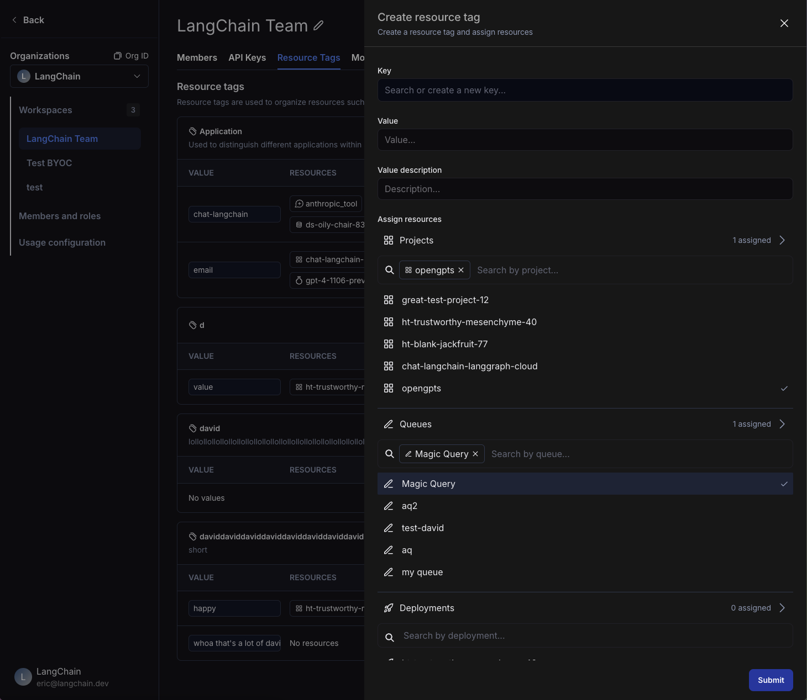
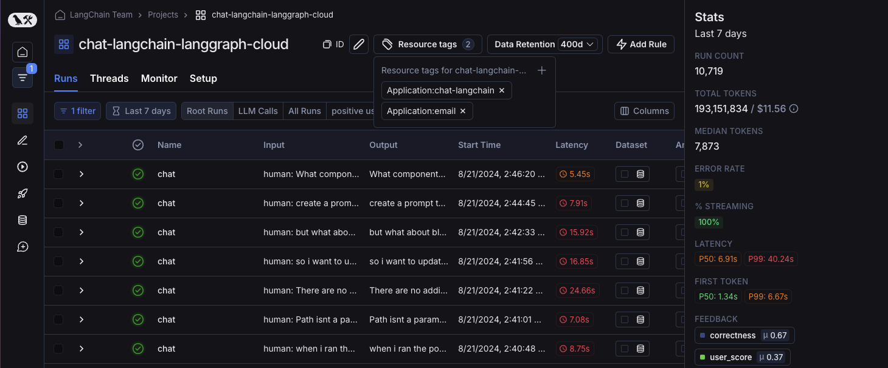
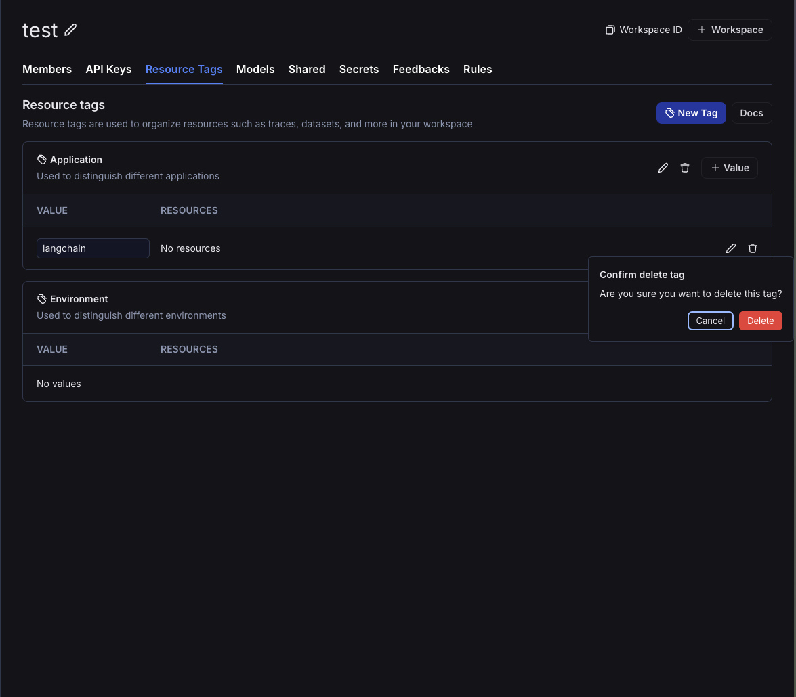
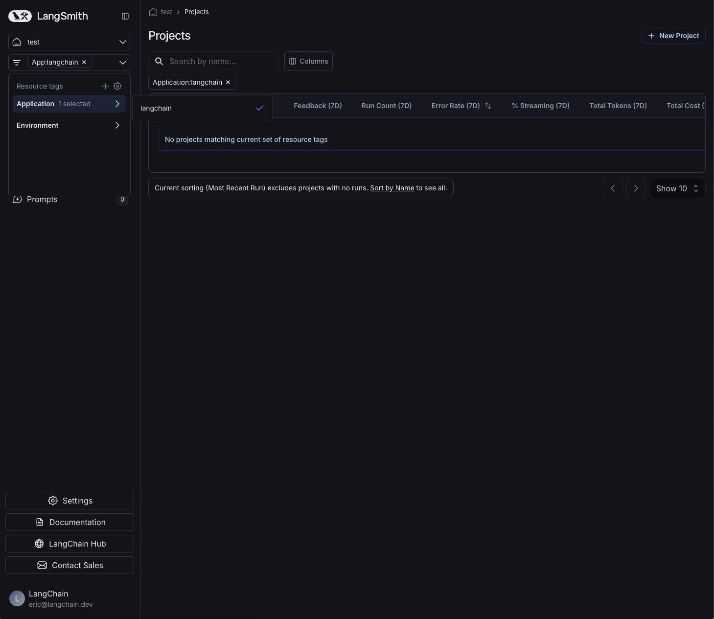

# Set up resource tags

:::tip Recommended Reading

Before diving into this content, it might be helpful to read the following:

- [Conceptual guide on organizations and workspaces](../../concepts/index)

:::

:::info Availability
Resource tags are available for Plus and Enterprise plans.
This feature will be rolling out week of August 19th.
:::

While workspaces help separate trust boundaries and access control, tags help you organize resources within a workspace. Tags are key-value pairs that you can attach to resources.

## Create a tag

To create a tag, head to the workspace settings and click on the "Resource Tags" tab.
Here, you'll be able to see the existing tag values, grouped by key. Two keys `Application` and `Environment` are created by default.

To create a new tag, click on the "New Tag" button. You'll be prompted to enter a key and a value for the tag. Note that you can use an existing key or create a new one.

## Assign a tag to a resource

Within the same side panel for creating a new tag, you can also create assign resources to tags. Search for corresponding resources in the "Assign Resources" section and select the resources you want to tag.

:::note
You can only tag workspace-scoped resources with resource tags. This includes Tracing Projects, Annotation Queues, Deployments, Experiments, Datasets, and Prompts.
:::

You can also assign tags to resources from the resource's detail page. Click on the Resource tags button to open up the tag panel and assign tags.

To un-assign a tag from a resource, click on the Trash icon next to the tag, both in the tag panel and the resource tag panel.

## Delete a tag

You can delete either a key or a value of a tag from the [workspace settings page](https://smith.langchain.com/settings/workspaces/resource_tags). To delete a key, click on the Trash icon next to the key. To delete a value, click on the Trash icon next to the value.

Note that if you delete a key, all values associated with that key will also be deleted. When you delete a value, you will lose all associations between that value and resources.

## Filter resources by tags

You can use resource tags to organize your experience navigating resources in the workspace.

To filter resources by tags in your workspace, open up the left-hand side panel and click on the tags icon. Here, you can select the tags you want to filter by.

In the homepage, you can see updated counts for resources based on the tags you've selected.

As you navigate through the different product surfaces, you will _only_ see resources that match the tags you've selected. At any time, you can clear the tags to see all resources in the workspace or select different tags to filter by.

