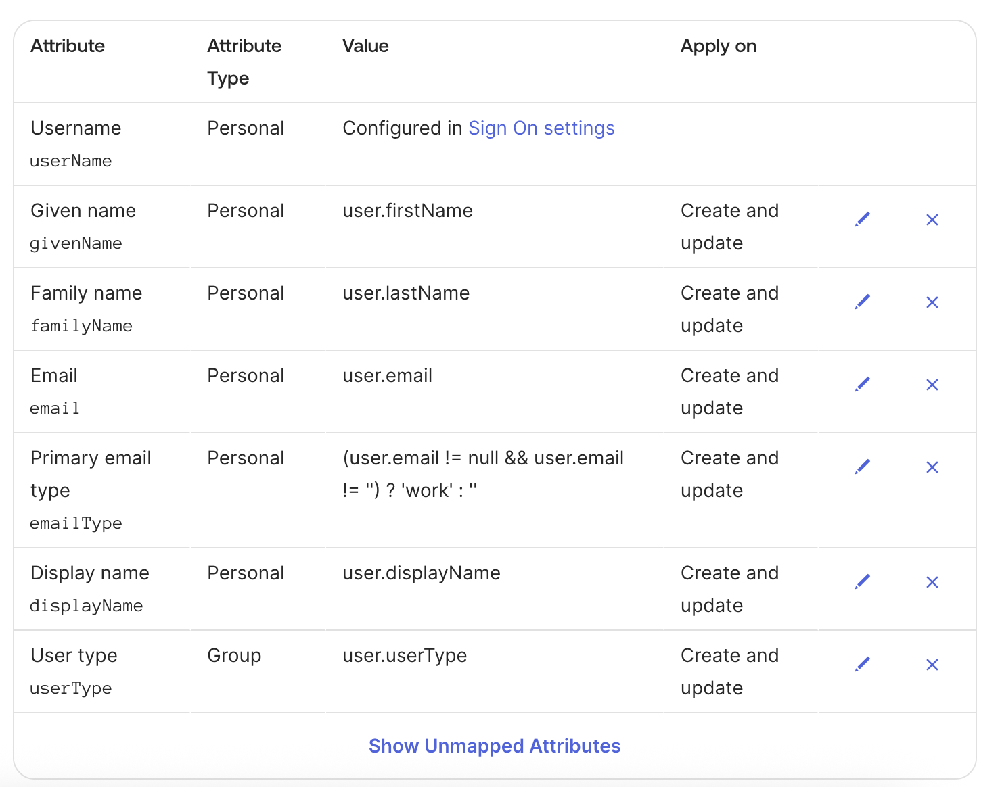

import { RegionalUrl } from "@site/src/components/RegionalUrls";

# SCIM User Provisioning

System for Cross-domain Identity Management (SCIM) is an open standard that allows for the automation of user provisioning. Using SCIM, you can automatically provision and deprovision users in your LangSmith organization and workspaces, keeping user access synchronized with your organization's identity provider.

:::note
SCIM is available for organizations on the [Enterprise plan](https://www.langchain.com/pricing). Please [contact sales](https://www.langchain.com/contact-sales) to learn more.

SCIM is available on Helm chart versions 0.10.41 (application version 0.10.108) and later.

At the moment, SCIM support is API-only (see instructions below).
:::

## What is SCIM?

SCIM enables automatic user provisioning and deprovisioning between your identity provider (IdP) and LangSmith. This eliminates the need for manual user management and ensures that user access is always up-to-date with your organization's identity system.

## Benefits of SCIM

- **Automated user management**: Users are automatically added, updated, and removed from LangSmith based on their status in your IdP
- **Reduced administrative overhead**: No need to manually manage user access across multiple systems
- **Improved security**: Users who leave your organization are automatically deprovisioned from LangSmith
- **Consistent access control**: User attributes and group memberships are synchronized between systems
- **Scalable**: Efficiently manage large teams with many workspaces and custom roles

## Supported Features

SCIM enables the following capabilities:

- **User provisioning**: Automatically add users to your LangSmith organization
- **User deprovisioning**: Automatically remove users from your organization
- **Attribute synchronization**: Keep user attributes (like full name) synchronized between your IdP and LangSmith
- **Group-based access**: Sync membership from IdP user groups to LangSmith workspaces
- **Role assignment**: Select specific [Organization Roles](../../concepts#organization-roles) and [Workspace Roles](../../concepts#workspace-roles) for groups of users

SCIM is supported for these authentication methods:

- Cloud: [SAML SSO](./set_up_saml_sso.mdx)
- Self-hosted: [OAuth2.0 with Client Secret](../../../self_hosting/configuration/sso#with-secret)

## Requirements

### Prerequisites

- Your organization must be on an Enterprise plan
- Your Identity Provider (IdP) must support SCIM 2.0
- Only [Organization Admins](../../concepts#organization-roles) can configure SCIM
- For cloud customers: [SAML SSO](./set_up_saml_sso.mdx) must be configurable for your organization
- For self-hosted customers: [OAuth with Client Secret](../../../self_hosting/configuration/sso#with-secret) authentication mode must be enabled
- For self-hosted customers: Network traffic must be allowed from the identity provider to LangSmith
  - Microsoft Entra ID supports allowlisting IP ranges or an agent-based solution to provide connectivity
    ([details](https://learn.microsoft.com/en-us/entra/identity/app-provisioning/use-scim-to-provision-users-and-groups#ip-ranges)).
  - Okta supports allow-listing IPs or domains ([details](https://help.okta.com/en-us/content/topics/security/ip-address-allow-listing.htm))
    or an agent-based solution ([details](https://help.okta.com/en-us/content/topics/provisioning/opp/opp-main.htm)) to provide connectivity.

### Role Precedence

When a user belongs to multiple groups for the same workspace, the following precedence applies:

1. **Organization Admin groups** take highest precedence - users in these groups will be `Admin` in all workspaces
2. **Most recently-created workspace-specific group** takes precedence over other workspace groups

:::note
When a group is deleted or a user is removed from a group, their access is updated according to their remaining group membership, following the precedence rules above.

SCIM group membership will override manually-assigned roles or roles assigned via Just-in-Time (JIT) provisioning. We recommend disabling JIT provisioning to avoid conflicts.
:::

## Configuration Steps

### Step 1: Configure SAML SSO (Cloud only)

:::note
If you use one of the identity providers [below](#identity-provider-idp-setup), follow the instructions there
to configure your specific identity provider. The instructions here must be additionally followed and are applicable for all identity providers.
:::

There are two scenarios for [SAML SSO](./set_up_saml_sso.mdx) configuration:

1. If SAML SSO is already configured for your organization, you should skip the steps to initially add the application (e.g. `Add application from Okta Integration Network`), as you already have an application configured and just need to enable provisioning.
1. If you are configuring SAML SSO for the first time alongside SCIM, first follow the instructions to [set up SAML SSO](./set_up_saml_sso.mdx), _then_ follow the instructions here to enable SCIM.

#### NameID Format

LangSmith uses the SAML NameID to identify users. The NameID is a required field in the SAML response and is case-insensitive.

The NameID must:

1. Be unique to each user.
1. Be a persistent value that never changes, such as a randomly generated unique user ID.
1. Match exactly on each sign-in attempt. It should not rely on user input.

The NameID should not be an email address or username because Email addresses and usernames are more likely to change over time and can be case-sensitive.

The NameID format must be `Persistent`, unless you are using a field, like email, that requires a different format.

### Step 2: Disable JIT Provisioning (Cloud only)

Before enabling SCIM, disable [Just-in-Time (JIT) provisioning](./set_up_saml_sso.mdx#just-in-time-jit-provisioning) to prevent conflicts between automatic and manual user provisioning. Use the `PATCH /orgs/current/info` <RegionalUrl
    text="endpoint"
    type="api"
    suffix="/redoc#tag/orgs/operation/update_current_organization_info_api_v1_orgs_current_info_patch"
  />:

```shell
curl -X PATCH $LANGCHAIN_ENDPOINT/orgs/current/info \
  -H "X-Api-Key: $LANGCHAIN_API_KEY" \
  -H "Content-Type: application/json" \
  -d '{"jit_provisioning_enabled": false}'
```

### Step 3: Generate SCIM Bearer Token

:::note
In self-hosted environments, the full URL below may look like `https://langsmith.internal.corp.dev/api/v1/platform/orgs/current/scim/tokens` (without subdomain, note the `/api/v1` path prefix) or `https://langsmith.internal.corp.dev/subdomain/api/v1/platform/orgs/current/scim/tokens` (with subdomain) - see the [ingress docs](../../../self_hosting/configuration/ingress.mdx) for more details.
:::

Generate a SCIM Bearer Token for your organization. This token will be used by your IdP to authenticate SCIM API requests.
Ensure env vars are set appropriately, for example:

```shell
curl -X POST $LANGCHAIN_ENDPOINT/v1/platform/orgs/current/scim/tokens \
  -H "X-Api-Key: $LANGCHAIN_API_KEY" \
  -H "X-Organization-Id: $LANGCHAIN_ORGANIZATION_ID" \
  -H "Content-Type: application/json" \
  -d '{"description": "Your description here"}'
```

Note that the SCIM Bearer Token value is not available outside of the response to this request.
These additional endpoints are present:

- `GET /v1/platform/orgs/current/scim/tokens`
- `GET /v1/platform/orgs/current/scim/tokens/{scim_token_id}`
- `PATCH /v1/platform/orgs/current/scim/tokens/{scim_token_id}` (only the `description` field is supported)
- `DELETE /v1/platform/orgs/current/scim/tokens/{scim_token_id}`

### Step 4: Configure your Identity Provider

Follow the IdP-specific instructions below to configure SCIM integration.

## Email Verification

In cloud only, creating a new user with SCIM triggers an email to the user.
They must verify their email address by clicking the link in this email.
The link expires in 24 hours, and can be resent if needed by removing and re-adding the user via SCIM.

## Attributes and Mapping

### Group Naming Convention

Group membership maps to LangSmith Workspace membership and workspace roles with a specific naming convention:

#### Organization Admin Groups

Format: `<optional_prefix>Organization Admin` or `<optional_prefix>Organization Admins`

Examples:

- `LS:Organization Admins`
- `Groups-Organization Admins`
- `Organization Admin`

#### Workspace-Specific Groups

Format: `<optional_prefix><org_role_name>:<workspace_name>:<workspace_role_name>`

Examples:

- `LS:Organization User:Production:Annotators`
- `Groups-Organization User:Engineering:Developers`
- `Organization User:Marketing:Viewers`

### Mapping

While specific instructions depending on the identity provider may vary, these mappings show what is supported by the LangSmith SCIM integration:

#### User Attributes

| **LangSmith App Attribute**    | **Identity Provider Attribute**                       | **Matching Precedence** |
| ------------------------------ | ----------------------------------------------------- | ----------------------- |
| `userName`<sup>1</sup>         | email address                                         |                         |
| `active`                       | `!deactivated`                                        |                         |
| `emails[type eq "work"].value` | email address<sup>2</sup>                             |                         |
| `name.formatted`               | `displayName` OR `givenName + familyName`<sup>3</sup> |                         |
| `externalId`                   | `sub`<sup>4</sup>                                     | 1                       |

1. `userName` is not required by LangSmith
1. Email address is required
1. Use the computed expression if your `displayName` does not match the format of `Firstname Lastname`
1. To avoid inconsistency, this should match the SAML `NameID` assertion (in cloud) and the `sub` OAuth2.0 claim (in self-hosted).

#### Group Attributes

| **LangSmith App Attribute** | **Identity Provider Attribute** | **Matching Precedence** |
| --------------------------- | ------------------------------- | ----------------------- |
| `displayName`               | `displayName`<sup>1</sup>       | 1                       |
| `externalId`                | `objectId`                      |                         |
| `members`                   | `members`                       |                         |

1. Groups must follow the naming convention described in the [Group Naming Convention](#group-naming-convention) section.
   If your company has a group naming policy, you should instead map from the `description` identity provider attribute and
   set the description based on the [Group Naming Convention](#group-naming-convention) section.

## Identity Provider (IdP) Setup

### Azure Entra ID

For additional information, see Microsoft's [documentation](https://learn.microsoft.com/en-us/entra/identity/app-provisioning/user-provisioning).

**Step 1: Configure SCIM in your Enterprise Application**

1. Log in to the [Azure portal](https://portal.azure.com/#home) with a privileged role (e.g. Global Administrator)
2. Navigate to your existing LangSmith Enterprise Application
3. In the left-side navigation, select `Manage > Provisioning`
4. Click `Get started`

**Step 2: Configure Admin Credentials**

1. Under `Admin Credentials`:
   - **Tenant URL**:
     - US: `https://api.smith.langchain.com/scim/v2`
     - EU: `https://eu.api.smith.langchain.com/scim/v2`
     - Self-hosted: `<langsmith_url>/scim/v2`
   - **Secret Token**: Enter the SCIM Bearer Token generated in Step 3 above
2. Click `Test Connection` to verify the configuration
3. Click `Save`

**Step 3: Configure Attribute Mappings**

Configure the following attribute mappings under `Mappings`:

**User Attributes**

Set `Target Object Actions` to `Create` and `Update` (start with `Delete` disabled for safety):

| **LangSmith App Attribute**    | **Microsoft Entra ID Attribute**                                 | **Matching Precedence** |
| ------------------------------ | ---------------------------------------------------------------- | ----------------------- |
| `userName`                     | `userPrincipalName`                                              |                         |
| `active`                       | `Not([IsSoftDeleted])`                                           |                         |
| `emails[type eq "work"].value` | `mail`<sup>1</sup>                                               |                         |
| `name.formatted`               | `displayName` OR `Join(" ", [givenName], [surname])`<sup>2</sup> |                         |
| `externalId`                   | `objectId`<sup>3</sup>                                           | 1                       |

1. User's email address must be present in Entra ID
2. Use the `Join` expression if your `displayName` does not match the format of `Firstname Lastname`
3. To avoid inconsistency, this should match the SAML NameID assertion and the `sub` OAuth2.0 claim.
   For SAML SSO in cloud, the `Unique User Identifier (Name ID)` required claim should be `user.objectID` and the `Name identifier format` should be `persistent`.

**Group Attributes**

Set `Target Object Actions` to `Create` and `Update` only (start with `Delete` disabled for safety):

| **LangSmith App Attribute** | **Microsoft Entra ID Attribute** | **Matching Precedence** |
| --------------------------- | -------------------------------- | ----------------------- |
| `displayName`               | `displayName`<sup>1</sup>        | 1                       |
| `externalId`                | `objectId`                       |                         |
| `members`                   | `members`                        |                         |

1. Groups must follow the naming convention described in the [Group Naming Convention](#group-naming-convention) section.
   If your company has a group naming policy, you should instead map from the `description` Microsoft Entra ID Attribute and
   set the description based on the [Group Naming Convention](#group-naming-convention) section.

**Step 4: Assign Users and Groups**

1. Under `Applications > Applications`, select your LangSmith Enterprise Application
2. Under the `Assignments` tab, click `Assign` then either `Assign to People` or `Assign to Groups`
3. Make the desired selection(s), then `Assign` and `Done`

**Step 5: Enable Provisioning**

1. Set `Provisioning Status` to `On` under `Provisioning`
2. Monitor the initial sync to ensure users and groups are provisioned correctly
3. Once verified, enable `Delete` actions for both User and Group mappings

### Okta

:::note
You must use the [Okta Lifecycle Management](https://www.okta.com/products/lifecycle-management/) product. This product tier is required to use SCIM on Okta.
:::

**Step 1: Add application from Okta Integration Network**

:::note
If you have already configured SSO login via SAML (cloud) or OAuth2.0 with OIDC (self-hosted), you may skip this step.
:::

See [SAML SSO setup](./set_up_saml_sso#okta) for cloud or [OAuth2.0 setup](../../../self_hosting/configuration/sso#identity-provider-setup-okta) for self-hosted.

**Step 2: Configure API Integration**

1. In the Provisioning tab, select Configure API integration.
1. Select Enable API integration.
1. For Base URL (if present):

- US: `https://api.smith.langchain.com/scim/v2`
- EU: `https://eu.api.smith.langchain.com/scim/v2`
- Self-hosted: `<langsmith_url>/scim/v2` (note there is no `/api/v1` path prefix) or if subdomain is configured `<langsmith_url>/subdomain/scim/v2`

4. For API Token, paste the SCIM token you [generated above](#step-3-generate-scim-bearer-token)
1. Keep `Import Groups` checked.
1. To verify the configuration, select Test API Credentials.
1. Select Save.
1. After saving the API integration details, new settings tabs appear on the left. Select `To App`.
1. Select Edit.
1. Select the Enable checkbox for Create Users, Update Users, and Deactivate Users.
1. Select Save.
1. Assign users and/or groups in the Assignments tab. Assigned users are created and managed in your LangSmith group.

**Step 3: Configure User Provisioning Settings**

1. Configure provisioning: under `Provisioning > To App > Provisioning to App`, click `Edit` then
   check `Create Users`, `Update User Attributes`, and `Deactivate Users`
1. Under `<application_name> Attribute Mappings`, set the user attribute mappings as shown below, and delete the rest:



**Step 4: Push Groups**

:::note
Okta does not support group attributes besides the group name itself, so group name _must_ follow the naming convention described in the [Group Naming Convention](#group-naming-convention) section.
:::

Follow Okta's instructions [here](https://help.okta.com/en-us/content/topics/users-groups-profiles/usgp-enable-group-push.htm) to configure groups to push by name or by rule.

### Other Identity Providers

Other identity providers have not been tested but may function depending on their SCIM implementation.

## Troubleshooting and Tips

### Support

If you have issues setting up SCIM, please reach out to [support@langchain.dev](mailto:support@langchain.dev).

### FAQ

#### _Can I use SCIM without SAML SSO?_

- **Cloud**: No, SAML SSO is required for SCIM in cloud deployments
- **Self-hosted**: Yes, SCIM works with OAuth with Client Secret authentication mode

#### _What happens if I have both JIT provisioning and SCIM enabled?_

JIT provisioning and SCIM can conflict with each other. We recommend disabling JIT provisioning before enabling SCIM to ensure consistent user provisioning behavior.

#### _How do I change a user's role or workspace access?_

Update the user's group membership in your IdP. The changes will be synchronized to LangSmith according to the [role precedence rules](#role-precedence).

#### _What happens when a user is removed from all groups?_

The user will be deprovisioned from your LangSmith organization according to your IdP's deprovisioning settings.

#### _Can I use custom group names?_

Yes. If your identity provider supports syncing alternate fields to the `displayName` group attribute, you may use an alternate attribute (like `description`) as the `displayName` in LangSmith and retain full customizability of the identity provider group name. Otherwise, groups must follow the specific naming convention described in the [Group Naming Convention](#group-naming-convention) section to properly map to LangSmith roles and workspaces.

#### _Why is my Okta integration not working?_

See Okta's troubleshooting guide here: https://help.okta.com/en-us/content/topics/users-groups-profiles/usgp-group-push-troubleshoot.htm.
