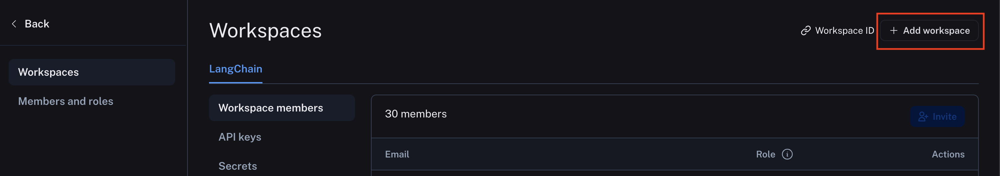
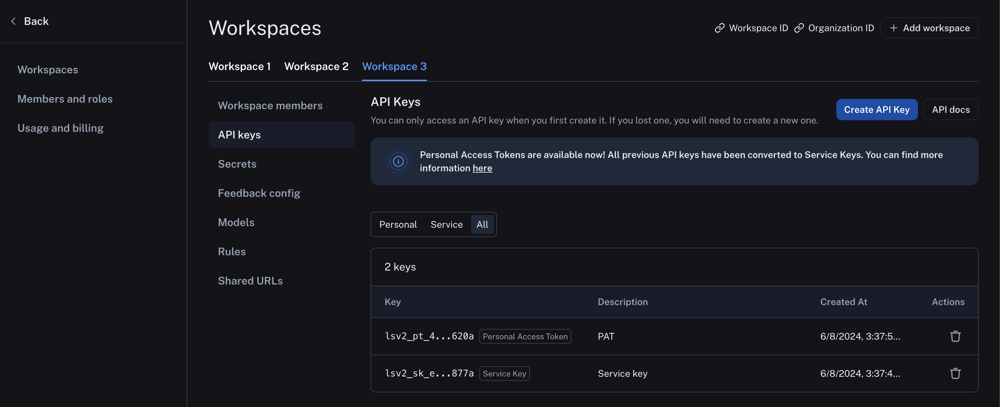

import { RegionalUrl } from "@site/src/components/RegionalUrls";

# Set up a workspace

:::tip Recommended Reading

Before diving into this content, it might be helpful to read the following:

- [Conceptual guide on organizations and workspaces](../../concepts/index)

:::

When you log in for the first time, a default [workspace](../../concepts/index#workspaces) will be created for you automatically in your [personal organization](./set_up_organization#personal-vs-shared-organizations).  
Workspaces are often used to separate resources between different teams or business units, ensuring clear trust boundaries between them. Within each workspace, Role-Based Access Control (RBAC) is implemented to manage permissions and access levels, ensuring that users only have access to the resources and settings necessary for their role. Most LangSmith activity happens in the context of a workspace, each of which has its own settings and access controls.

To organize resources _within_ a workspace, you can use [resource tags](./set_up_resource_tags).

## Create a workspace

To create a new workspace, head to the <RegionalUrl text='Settings page' suffix='/settings'/> `Workspaces` tab in your shared organization and click **Add Workspace**.
Once your workspace has been created, you can manage its members and other configuration by selecting it on this page.

:::note
Different plans have different limits placed on the number of workspaces that can be used in an organization.
Please see the [pricing page](../../pricing) for more information.
:::

## Manage users

:::info
Only workspace `Admins` may manage workspace membership and, if RBAC is enabled, change a user's workspace role.
:::

For users that are already members of an organization, a workspace admin may add them to a workspace in the `Workspace members` tab under <RegionalUrl text='workspace settings page' suffix='/settings/workspaces'/>.  
Users may also be invited directly to one or more workspaces when they are [invited to an organization](./set_up_organization.mdx#manage-users).

## Configure workspace settings

Workspace configuration exists in the <RegionalUrl text='workspace settings page' suffix='/settings/workspaces'/> tab. Select the workspace to configure and then the desired configuration sub-tab. The example below shows the `API keys`, and other configuration options including secrets, models, and shared URLs are available here as well.

