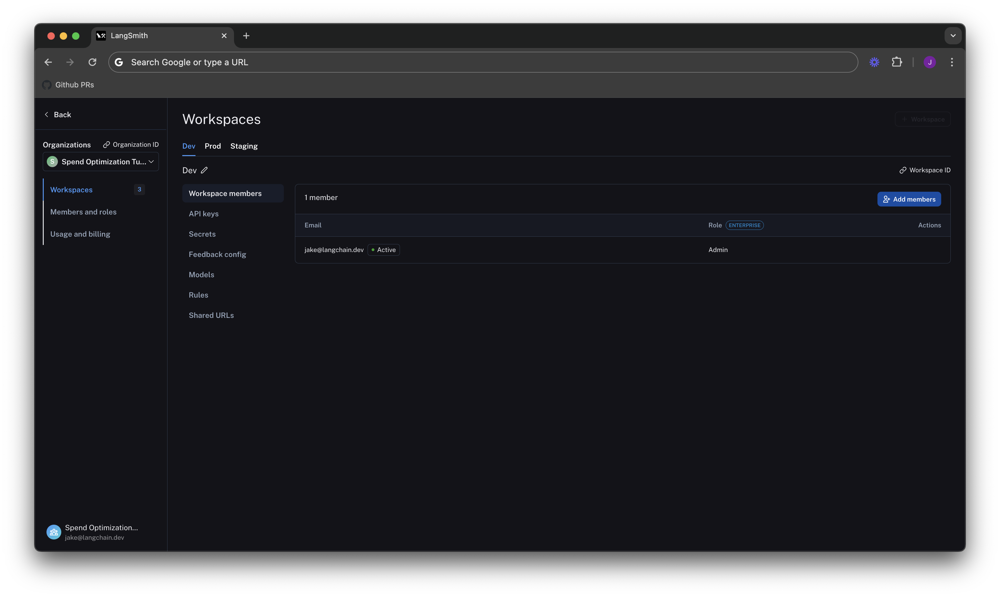
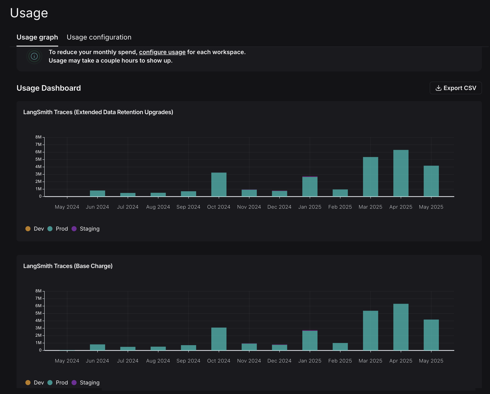
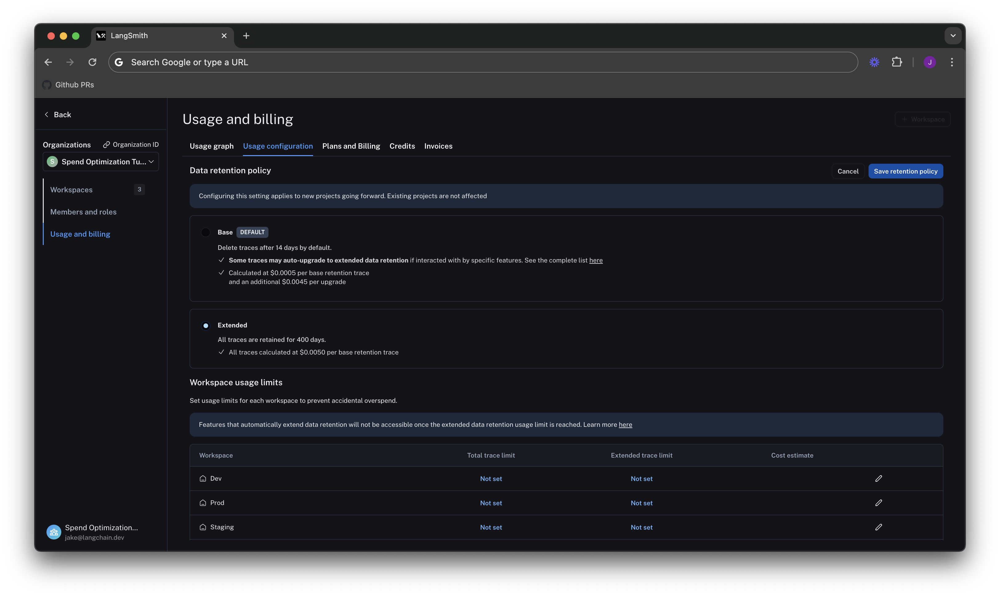
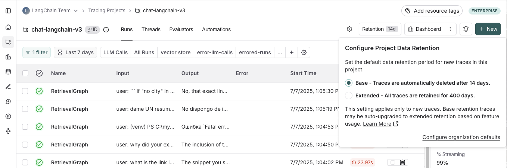
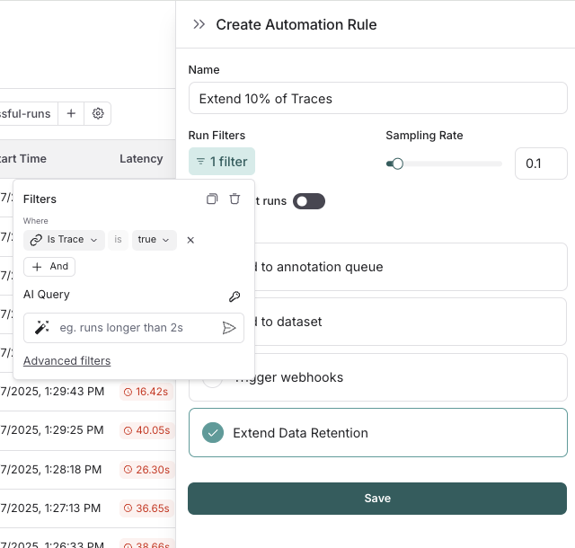
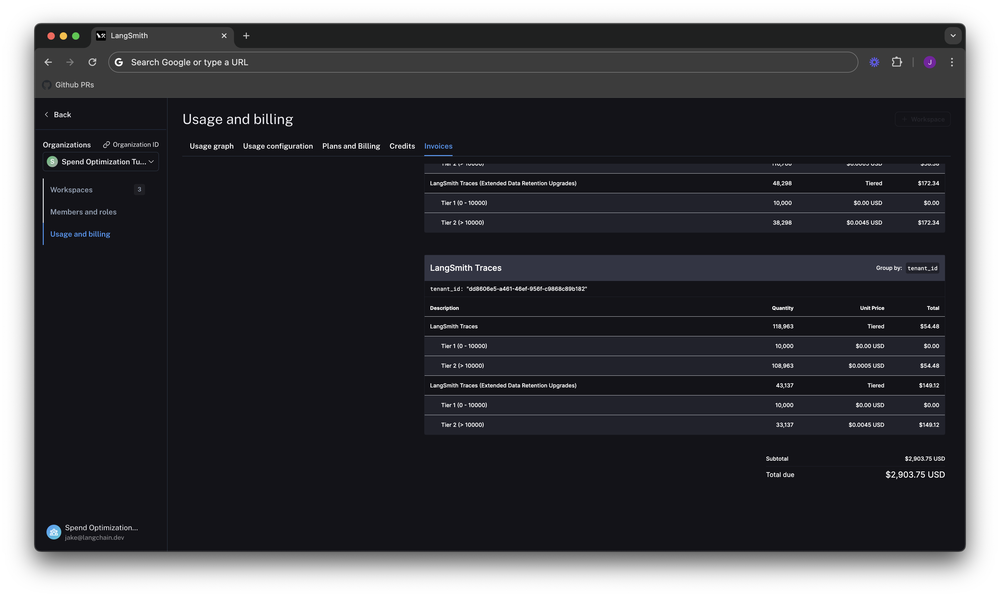
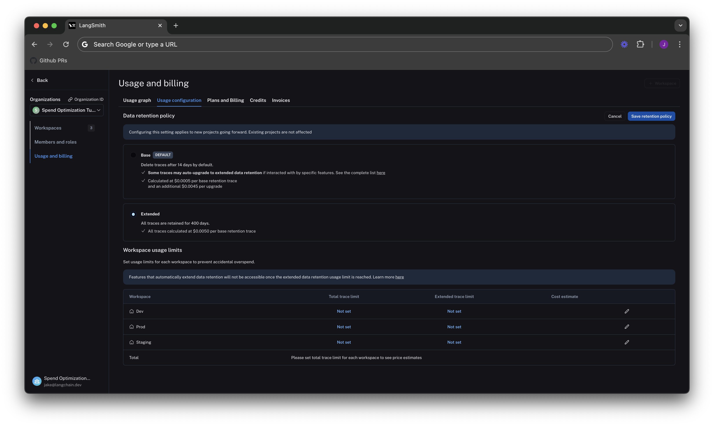
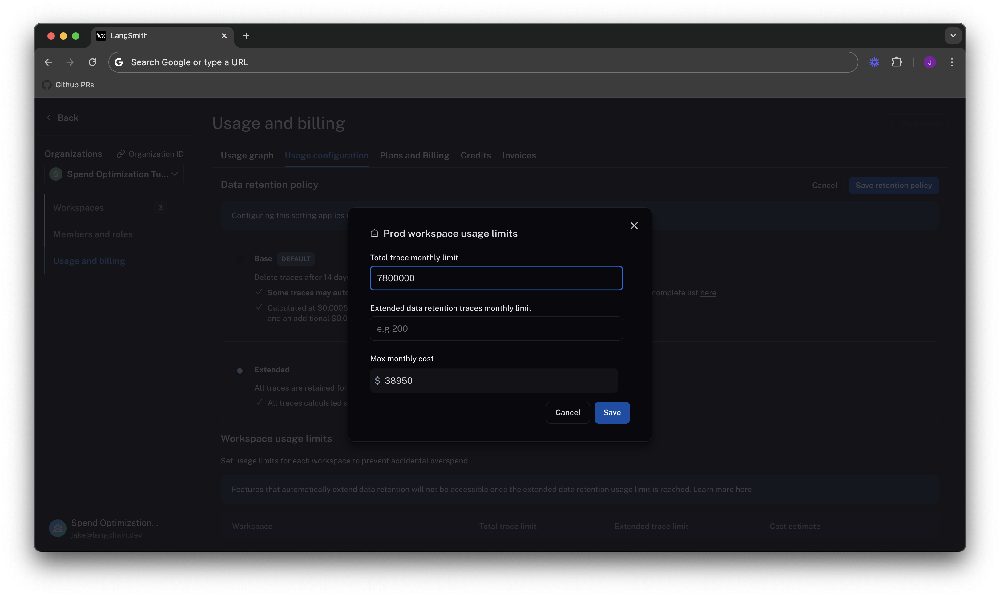
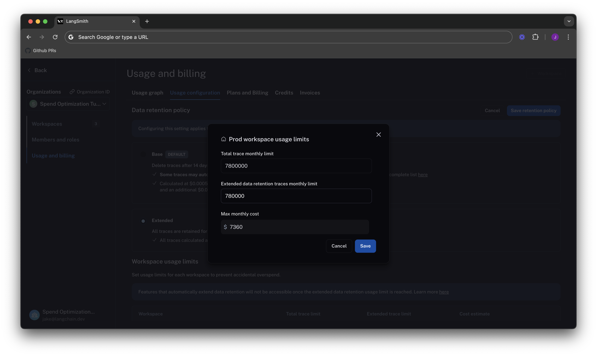
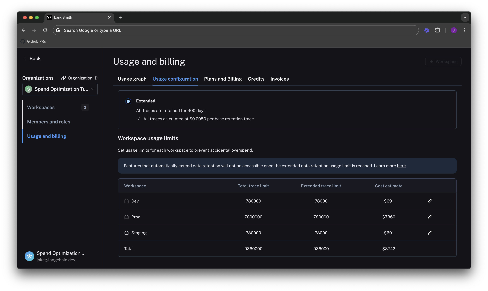

import {
  CodeTabs,
  python,
  typescript,
  shell,
} from "@site/src/components/InstructionsWithCode";

# Optimize tracing spend on LangSmith

:::tip Recommended Reading
Before diving into this content, it might be helpful to read the following:

- [Data Retention Conceptual Docs](/administration/concepts#data-retention)
- [Usage Limiting Conceptual Docs](/administration/concepts#usage-limit)

:::

:::note
Some of the features mentioned in this guide are not currently available in Enterprise plan due to its
custom nature of billing. If you are on Enterprise plan and have questions about cost optimization,
please reach out to your sales rep or support@langchain.dev.
:::

This tutorial walks through optimizing your spend on LangSmith. In it, we will learn how to optimize existing spend
and prevent future overspend on a realistic real-world example. We will use an existing LangSmith organization with high usage.
Concepts can be transferred to your own organization.

## Problem Setup

In this tutorial, we take an existing organization that has three workspaces, one for each deployment stage
(Dev, Staging, and Prod):



## Understand your current usage

The first step of any optimization process is to understand current usage. LangSmith gives two ways to do this: Usage Graph
and Invoices.

### Usage Graph

The usage graph lets us examine how much of each usage based pricing metric we have consumed lately. It does not directly show
spend (which we will see later on our draft invoice).

We can navigate to the Usage Graph under `Settings` -> `Usage and Billing` -> `Usage Graph`.



We see in the graph above that there are two usage metrics that LangSmith charges for:

- LangSmith Traces (Base Charge)
- LangSmith Traces (Extended Data Retention Upgrades).

The first metric tracks all traces that you send to LangSmith. The second tracks all traces that also have our Extended 400 Day Data Retention.
For more details, see our [data retention conceptual docs](/administration/concepts#data-retention). Notice that these graphs look
identical, which will come into play later in the tutorial.

LangSmith Traces usage is measured per workspace, because workspaces often represent development environments (as in our example),
or teams within an organization. As a LangSmith administrator, we want to understand spend granularly per each of these units. In
this case where we just want to cut spend, we can focus on the environment responsible for the majority of costs first for the greatest savings.

### Invoices

We understand what usage looks like in terms of traces, but we now need to translate that into spend. To do so,
we head to the `Invoices` tab. The first invoice that will appear on screen is a draft of your current month's
invoice, which shows your running spend thus far this month.


:::note
LangSmith's Usage Graph and Invoice use the term `tenant_id` to refer to a workspace ID. They are interchangeable.
:::

In the above GIF, we see that the charges for LangSmith Traces are broken up by "tenant_id" (i.e. Workspace ID), meaning we can track tracing spend
on each of our workspaces. In the first few days of June, the vast majority of the total spend of ~$2,000 is in our production
workspace. Further, the majority of spend in that workspace was on extended data retention trace upgrades.

These upgrades occur for two reasons:

1. You use extended data retention tracing, meaning that, by default, your traces are retained for 400 days
2. You use base data retention tracing, and use a feature that automatically extends the data retention of a trace ([see our Auto-Upgrade conceptual docs](/administration/concepts#data-retention))

Given that the number of total traces per day is equal to the number of extended retention traces per day, it's most likely the
case that this org is using extended data retention tracing everywhere. As such, we start by optimizing our retention settings.

## Optimization 1: manage data retention

LangSmith charges differently based on a trace's data retention (see our [data retention conceptual docs](/administration/concepts#data-retention)),
where short-lived traces are an order of magnitude less expensive than ones that last for a long time. In this optimization, we will
show how to get optimal settings for data retention without sacrificing historical observability, and
show the effect it has on our bill.

### Change org level retention defaults for new projects

Navigate to the **Usage configuration** tab, and look at our organization level retention settings. Modifying this setting affects all **new projects** that are created going forward in all workspaces in our org.

:::note
For backwards compatibility, older organizations may have this defaulted to **Extended**. Organizations created after June 3rd, 2024
have this defaulted to **Base**.
:::



### Change project level retention defaults

Data retention settings are adjustable per project on the tracing project page.

Navigate to **Projects** > **_Your project name_** > Select **Retention** and modify the default retention of the project to **Base**. This will only affect retention (and pricing) for **traces going forward**.



### Apply extended data retention to a percentage of traces

You may not want all traces to expire after 14 days. You can automatically extend the retention of traces that match some criteria by creating an [automation rule](/observability/how_to_guides/rules). You might want to apply extended data retention to specific types of traces, such as:

- 10% of all traces: For general analysis or analyzing trends long-term
- Errored traces: To thoroughly investigate and debug issues
- Traces with specific metadata: For long-term examination of particular features or user flows

To configure this:

1. Navigate to **Projects** > **_Your project name_** > Select **+ New** > Select **New Automation**
2. Name your rule and optionally apply filters or a sample rate. For more information on configuring filters, see [filtering techniques](/observability/how_to_guides/filter_traces_in_application#filter-operators)

:::note
When an automation rule matches any [run](/observability/concepts#runs) within a [trace](/observability/concepts#traces), then all runs within the trace are upgraded to be retained for 400 days.
:::

For example, this is what the configuration looks like to keep 10% of all traces for extended data retention:



If you want to keep a subset of traces for **longer than 400 days** for data collection purposes, you can create another run
rule that sends some runs to a dataset of your choosing. A dataset allows you to store the trace inputs and outputs (e.g., as a key-value dataset),
and will persist indefinitely, even after the trace gets deleted.

### See results after 7 days

While the total amount of traces per day stayed the same, the extended data retention traces was cut heavily. In the invoice, we can see thatwe've only spent about $900 in the last 7 days, as opposed to $2,000 in the previous 4.

That's a cost reduction of nearly 75% per day!



## Optimization 2: limit usage

In the previous section, we managed data retention settings to _optimize existing spend_. In this section, we will
use usage limits to _prevent future overspend_.

LangSmith has two usage limits: total traces and extended retention traces. These correspond to the two metrics we've
been tracking on our usage graph. We can use these in tandem to have granular control over spend.

To set limits, we navigate back to `Settings` -> `Usage and Billing` -> `Usage configuration`. There is a table at the
bottom of the page that lets you set usage limits per workspace. For each workspace, the two limits appear, along
with a cost estimate:



Lets start by setting limits on our production usage, since that is where the majority of spend comes from.

### Setting a good total traces limit

Picking the right "total traces" limit depends on the expected load of traces that you will send to LangSmith. You should
clearly think about your assumptions before setting a limit.

For example:

- **Current Load**: Our gen AI application is called between 1.2-1.5 times per second, and each API request has a trace associated with it,
  meaning we log around 100,000-130,000 traces per day
- **Expected Growth in Load**: We expect to double in size in the near future.

From these assumptions, we can do a quick back-of-the-envelope calculation to get a good limit of:

```
limit = current_load_per_day * expected_growth * days/month
      = 130,000 * 2 * 30
      = 7,800,000 traces / month
```

We click on the edit icon on the right side of the table for our Prod row, and can enter this limit as follows:



:::note
When set without the extended data retention traces limit, the maximum cost estimator assumes that all traces are using extended data retention.
:::

### Cutting maximum spend with an extended data retention limit

If we are not a big enterprise, we may shudder at the ~$40k per month bill.

We saw from [Optimization 1](#optimization-1-manage-data-retention) that the easiest way to cut cost was through managing data retention.
The same can be said for limits. If we only want to keep ~10% of traces to be around more than 14 days, we can set a limit on the maximum
high retention traces we can keep. That would be `.10 * 7,800,000 = 780,000`.



As we can see, the maximum cost is cut from ~40k per month to ~7.5k per month, because we no longer allow as many expensive
data retention upgrades. This lets us be confident that new users on the platform will not accidentally cause cost to balloon.

:::note
The extended data retention limit can cause features other than traces to stop working once reached. If you plan to
use this feature, please read more about its functionality [here](../../administration/concepts#side-effects-of-extended-data-retention-traces-limit).
:::

### Set dev/staging limits and view total spent limit across workspaces

Following the same logic for our dev and staging environments, we set limits at 10% of the production
limit on usage for each workspace.

While this works with our usage pattern, setting good dev and staging limits may vary depending on
your use case with LangSmith. For example, if you run evals as part of CI/CD in dev or staging, you may
want to be more liberal with your usage limits to avoid test failures.

Now that our limits are set, we can see that LangSmith shows a maximum spend estimate across all workspaces:



With this estimator, we can be confident that we will not end up with an unexpected credit card bill at the end of the month.

## Summary

In this tutorial, we learned how to:

1. Cut down our existing costs with data retention policies
2. Prevent future overspend with usage limits

If you have questions about further optimizing your spend, please reach out to support@langchain.dev.
