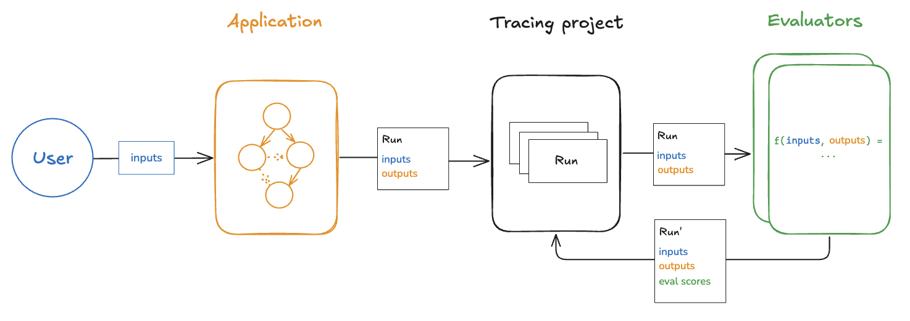

# Evaluation concepts

The quality and development speed of AI applications is often limited by high-quality evaluation datasets and metrics, which enable you to both optimize and test your applications.

LangSmith makes building high-quality evaluations easy.
This guide explains the LangSmith evaluation framework and AI evaluation techniques more broadly.
The building blocks of the LangSmith framework are:

- [**Datasets**:](/evaluation/concepts#datasets) Collections of test inputs and reference outputs.
- [**Evaluators**](/evaluation/concepts#evaluators): Functions for scoring outputs.

## Datasets

A dataset is a collection of examples used for evaluating an application. An example is a test input, reference output pair.

### Examples

Each example consists of:

- **Inputs**: a dictionary of input variables to pass to your application.
- **Reference outputs** (optional): a dictionary of reference outputs. These do not get passed to your application, they are only used in evaluators.
- **Metadata** (optional): a dictionary of additional information that can be used to create filtered views of a dataset.

### Dataset curation

There are various ways to build datasets for evaluation, including:

#### Manually curated examples

This is how we typically recommend people get started creating datasets.
From building your application, you probably have some idea of what types of inputs you expect your application to be able to handle,
and what "good" responses may be.
You probably want to cover a few different common edge cases or situations you can imagine.
Even 10-20 high-quality, manually-curated examples can go a long way.

#### Historical traces

Once you have an application in production, you start getting valuable information: how are users actually using it?
These real-world runs make for great examples because they're, well, the most realistic!

If you're getting a lot of traffic, how can you determine which runs are valuable to add to a dataset?
There are a few techniques you can use:

- **User feedback**: If possible - try to collect end user feedback. You can then see which datapoints got negative feedback.
  That is super valuable! These are spots where your application did not perform well.
  You should add these to your dataset to test against in the future.
- **Heuristics**: You can also use other heuristics to identify "interesting" datapoints. For example, runs that took a long time to complete could be interesting to look at and add to a dataset.
- **LLM feedback**: You can use another LLM to detect noteworthy runs. For example, you could use an LLM to label chatbot conversations where the user had to rephrase their question or correct the model in some way, indicating the chatbot did not initially respond correctly.

#### Synthetic data

Once you have a few examples, you can try to artificially generate some more.
It's generally advised to have a few good hand-crafted examples before this, as this synthetic data will often resemble them in some way.
This can be a useful way to get a lot of datapoints, quickly.

### Splits

When setting up your evaluation, you may want to partition your dataset into different splits. For example, you might use a smaller split for many rapid and cheap iterations and a larger split for your final evaluation. In addition, splits can be important for the interpretability of your experiments. For example, if you have a RAG application, you may want your dataset splits to focus on different types of questions (e.g., factual, opinion, etc) and to evaluate your application on each split separately.

Learn how to [create and manage dataset splits](/evaluation/how_to_guides/manage_datasets_in_application#create-and-manage-dataset-splits).

### Versions

Datasets are [versioned](/evaluation/how_to_guides/version_datasets) such that every time you add, update, or delete examples in your dataset, a new version of the dataset is created.
This makes it easy to inspect and revert changes to your dataset in case you make a mistake.
You can also [tag versions](/evaluation/how_to_guides/version_datasets#tag-a-version) of your dataset to give them a more human-readable name.
This can be useful for marking important milestones in your dataset's history.

You can run evaluations on specific versions of a dataset. This can be useful when running evaluations in CI, to make sure that a dataset update doesn't accidentally break your CI pipelines.

## Evaluators

Evaluators are functions that score how well your application performs on a particular example.

#### Evaluator inputs

Evaluators receive these inputs:

- [Example](/evaluation/concepts#examples): The example(s) from your [Dataset](/evaluation/concepts#datasets). Contains inputs, (reference) outputs, and metadata.
- [Run](/observability/concepts#runs): The actual outputs and intermediate steps (child runs) from passing the example inputs to the application.

#### Evaluator outputs

An evaluator returns one or more metrics. These should be returned as a dictionary or list of dictionaries of the form:

- `key`: The name of the metric.
- `score` | `value`: The value of the metric. Use `score` if it's a numerical metric and `value` if it's categorical.
- `comment` (optional): The reasoning or additional string information justifying the score.

#### Defining evaluators

There are a number of ways to define and run evaluators:

- **Custom code**: Define [custom evaluators](/evaluation/how_to_guides/custom_evaluator) as Python or TypeScript functions and run them client-side using the SDKs or server-side via the UI.
- **Built-in evaluators**: LangSmith has a number of built-in evaluators that you can configure and run via the UI.

You can run evaluators using the LangSmith SDK ([Python](https://docs.smith.langchain.com/reference/python) and TypeScript), via the [Prompt Playground](../../prompt_engineering/concepts#prompt-playground), or by configuring [Rules](../../observability/how_to_guides/monitoring/rules) to automatically run them on particular tracing projects or datasets.

#### Evaluation techniques

There are a few high-level approaches to LLM evaluation:

### Human

Human evaluation is [often a great starting point for evaluation](https://hamel.dev/blog/posts/evals/#looking-at-your-traces). LangSmith makes it easy to review your LLM application outputs as well as the traces (all intermediate steps).

LangSmith's [annotation queues](/evaluation/concepts#annotation-queues) make it easy to get human feedback on your application's outputs.

### Heuristic

Heuristic evaluators are deterministic, rule-based functions. These are good for simple checks like making sure that a chatbot's response isn't empty, that a snippet of generated code can be compiled, or that a classification is exactly correct.

### LLM-as-judge

LLM-as-judge evaluators use LLMs to score the application's output. To use them, you typically encode the grading rules / criteria in the LLM prompt. They can be reference-free (e.g., check if system output contains offensive content or adheres to specific criteria). Or, they can compare task output to a reference output (e.g., check if the output is factually accurate relative to the reference).

With LLM-as-judge evaluators, it is important to carefully review the resulting scores and tune the grader prompt if needed. Often it is helpful to write these as few-shot evaluators, where you provide examples of inputs, outputs, and expected grades as part of the grader prompt.

Learn about [how to define an LLM-as-a-judge evaluator](/evaluation/how_to_guides/llm_as_judge).

### Pairwise

Pairwise evaluators allow you to compare the outputs of two versions of an application.
Think [LMSYS Chatbot Arena](https://chat.lmsys.org/) - this is the same concept, but applied to AI applications more generally, not just models!
This can use either a heuristic ("which response is longer"), an LLM (with a specific pairwise prompt), or human (asking them to manually annotate examples).

**When should you use pairwise evaluation?**

Pairwise evaluation is helpful when it is difficult to directly score an LLM output, but easier to compare two outputs.
This can be the case for tasks like summarization - it may be hard to give a summary an absolute score, but easy to choose which of two summaries is more informative.

Learn [how run pairwise evaluations](/evaluation/how_to_guides/evaluate_pairwise).

## Experiment

Each time we evaluate an application on a dataset, we are conducting an experiment.
An experiment is a single execution of the example inputs in your dataset through your application.
Typically, we will run multiple experiments on a given dataset, testing different configurations of our application (e.g., different prompts or LLMs).
In LangSmith, you can easily view all the experiments associated with your dataset.
Additionally, you can [compare multiple experiments in a comparison view](/evaluation/how_to_guides/compare_experiment_results).

## Annotation queues

Human feedback is often the most valuable feedback you can gather on your application.
With [annotation queues](/evaluation/how_to_guides/annotation_queues) you can flag runs of your application for annotation.
Human annotators then have a streamlined view to review and provide feedback on the runs in a queue.
Often (some subset of) these annotated runs are then transferred to a [dataset](/evaluation/concepts#datasets) for future evaluations.
While you can always [annotate runs inline](/evaluation/how_to_guides/annotate_traces_inline), annotation queues provide another option to group runs together, specify annotation criteria, and configure permissions.

Learn more about [annotation queues and human feedback](/evaluation/how_to_guides#annotation-queues-and-human-feedback).

## Offline evaluation

Evaluating an application on a dataset is what we call "offline" evaluation.
It is offline because we're evaluating on a pre-compiled set of data.
An online evaluation, on the other hand, is one in which we evaluate a deployed application's outputs on real traffic, in near realtime.
Offline evaluations are used for testing a version(s) of your application pre-deployment.

You can run offline evaluations client-side using the LangSmith SDK ([Python](https://docs.smith.langchain.com/reference/python) and TypeScript). You can run them server-side via the [Prompt Playground](../../prompt_engineering/concepts#prompt-playground) or by configuring [automations](/observability/how_to_guides/monitoring/rules) to run certain evaluators on every new experiment against a specific dataset.

### Benchmarking

Perhaps the most common type of offline evaluation is one in which we curate a dataset of representative inputs, define the key performance metrics, and benchmark multiple versions of our application to find the best one.
Benchmarking can be laborious because for many use cases you have to curate a dataset with gold-standard reference outputs and design good metrics for comparing experimental outputs to them.
For a RAG Q&A bot this might look like a dataset of questions and reference answers, and an LLM-as-judge evaluator that determines if the actual answer is semantically equivalent to the reference answer.
For a ReACT agent this might look like a dataset of user requests and a reference set of all the tool calls the model is supposed to make, and a heuristic evaluator that checks if all of the reference tool calls were made.

### Unit tests

Unit tests are used in software development to verify the correctness of individual system components.
[Unit tests in the context of LLMs are often rule-based assertions](https://hamel.dev/blog/posts/evals/#level-1-unit-tests) on LLM inputs or outputs (e.g., checking that LLM-generated code can be compiled, JSON can be loaded, etc.) that validate basic functionality.

Unit tests are often written with the expectation that they should always pass.
These types of tests are nice to run as part of CI.
Note that when doing so it is useful to set up a cache to minimize LLM calls (because those can quickly rack up!).

### Regression tests

Regression tests are used to measure performance across versions of your application over time.
They are used to, at the very least, ensure that a new app version does not regress on examples that your current version correctly handles, and ideally to measure how much better your new version is relative to the current.
Often these are triggered when you are making app updates (e.g. updating models or architectures) that are expected to influence the user experience.

LangSmith's comparison view has native support for regression testing, allowing you to quickly see examples that have changed relative to the baseline.
Regressions are highlighted red, improvements green.

### Backtesting

Backtesting is an approach that combines dataset creation (discussed above) with evaluation. If you have a collection of production logs, you can turn them into a dataset. Then, you can re-run those production examples with newer application versions. This allows you to assess performance on past and realistic user inputs.

This is commonly used to evaluate new model versions.
Anthropic dropped a new model? No problem! Grab the 1000 most recent runs through your application and pass them through the new model.
Then compare those results to what actually happened in production.

### Pairwise evaluation

For some tasks [it is easier](https://www.oreilly.com/radar/what-we-learned-from-a-year-of-building-with-llms-part-i/) for a human or LLM grader to determine if "version A is better than B" than to assign an absolute score to either A or B.
Pairwise evaluations are just this — a scoring of the outputs of two versions against each other as opposed to against some reference output or absolute criteria.
Pairwise evaluations are often useful when using LLM-as-judge evaluators on more general tasks.
For example, if you have a summarizer application, it may be easier for an LLM-as-judge to determine "Which of these two summaries is more clear and concise?" than to give an absolute score like "Give this summary a score of 1-10 in terms of clarity and concision."

Learn [how run pairwise evaluations](/evaluation/how_to_guides/evaluate_pairwise).

## Online evaluation

Evaluating a deployed application's outputs in (roughly) realtime is what we call "online" evaluation.
In this case there is no dataset involved and no possibility of reference outputs — we're running evaluators on real inputs and real outputs as they're produced.
This is be useful for monitoring your application and flagging unintended behavior.
Online evaluation can also work hand-in-hand with offline evaluation: for example, an online evaluator can be used to classify input questions into a set of categories that can be later used to curate a dataset for offline evaluation.

Online evaluators are generally intended to be run server-side. LangSmith has built-in [LLM-as-judge evaluators](/evaluation/how_to_guides/llm_as_judge) that you can configure, or you can define custom code evaluators that are also run within LangSmith.

## Application-specific techniques

Below, we will discuss evaluation of a few specific, popular LLM applications.

### Agents

[LLM-powered autonomous agents](https://lilianweng.github.io/posts/2023-06-23-agent/) combine three components (1) Tool calling, (2) Memory, and (3) Planning. Agents [use tool calling](https://python.langchain.com/v0.1/docs/modules/agents/agent_types/tool_calling/) with planning (e.g., often via prompting) and memory (e.g., often short-term message history) to generate responses. [Tool calling](https://python.langchain.com/v0.1/docs/modules/model_io/chat/function_calling/) allows a model to respond to a given prompt by generating two things: (1) a tool to invoke and (2) the input arguments required.

Below is a tool-calling agent in [LangGraph](https://langchain-ai.github.io/langgraph/tutorials/introduction/). The `assistant node` is an LLM that determines whether to invoke a tool based upon the input. The `tool condition` sees if a tool was selected by the `assistant node` and, if so, routes to the `tool node`. The `tool node` executes the tool and returns the output as a tool message to the `assistant node`. This loop continues until as long as the `assistant node` selects a tool. If no tool is selected, then the agent directly returns the LLM response.

This sets up three general types of agent evaluations that users are often interested in:

- `Final Response`: Evaluate the agent's final response.
- `Single step`: Evaluate any agent step in isolation (e.g., whether it selects the appropriate tool).
- `Trajectory`: Evaluate whether the agent took the expected path (e.g., of tool calls) to arrive at the final answer.

Below we will cover what these are, the components (inputs, outputs, evaluators) needed for each one, and when you should consider this.
Note that you likely will want to do multiple (if not all!) of these types of evaluations - they are not mutually exclusive!

#### Evaluating an agent's final response

One way to evaluate an agent is to assess its overall performance on a task. This basically involves treating the agent as a black box and simply evaluating whether or not it gets the job done.

The inputs should be the user input and (optionally) a list of tools. In some cases, tool are hardcoded as part of the agent and they don't need to be passed in. In other cases, the agent is more generic, meaning it does not have a fixed set of tools and tools need to be passed in at run time.

The output should be the agent's final response.

The evaluator varies depending on the task you are asking the agent to do. Many agents perform a relatively complex set of steps and the output a final text response. Similar to RAG, LLM-as-judge evaluators are often effective for evaluation in these cases because they can assess whether the agent got a job done directly from the text response.

However, there are several downsides to this type of evaluation. First, it usually takes a while to run. Second, you are not evaluating anything that happens inside the agent, so it can be hard to debug when failures occur. Third, it can sometimes be hard to define appropriate evaluation metrics.

#### Evaluating a single step of an agent

Agents generally perform multiple actions. While it is useful to evaluate them end-to-end, it can also be useful to evaluate these individual actions. This generally involves evaluating a single step of the agent - the LLM call where it decides what to do.

The inputs should be the input to a single step. Depending on what you are testing, this could just be the raw user input (e.g., a prompt and / or a set of tools) or it can also include previously completed steps.

The outputs are just the output of that step, which is usually the LLM response. The LLM response often contains tool calls, indicating what action the agent should take next.

The evaluator for this is usually some binary score for whether the correct tool call was selected, as well as some heuristic for whether the input to the tool was correct. The reference tool can be simply specified as a string.

There are several benefits to this type of evaluation. It allows you to evaluate individual actions, which lets you hone in where your application may be failing. They are also relatively fast to run (because they only involve a single LLM call) and evaluation often uses simple heuristic evaluation of the selected tool relative to the reference tool. One downside is that they don't capture the full agent - only one particular step. Another downside is that dataset creation can be challenging, particular if you want to include past history in the agent input. It is pretty easy to generate a dataset for steps early on in an agent's trajectory (e.g., this may only include the input prompt), but it can be difficult to generate a dataset for steps later on in the trajectory (e.g., including numerous prior agent actions and responses).

#### Evaluating an agent's trajectory

Evaluating an agent's trajectory involves evaluating all the steps an agent took.

The inputs are again the inputs to the overall agent (the user input, and optionally a list of tools).

The outputs are a list of tool calls, which can be formulated as an "exact" trajectory (e.g., an expected sequence of tool calls) or simply a set of tool calls that are expected (in any order).

The evaluator here is some function over the steps taken. Assessing the "exact" trajectory can use a single binary score that confirms an exact match for each tool name in the sequence. This is simple, but has some flaws. Sometimes there can be multiple correct paths. This evaluation also does not capture the difference between a trajectory being off by a single step versus being completely wrong.

To address these flaws, evaluation metrics can focused on the number of "incorrect" steps taken, which better accounts for trajectories that are close versus ones that deviate significantly. Evaluation metrics can also focus on whether all of the expected tools are called in any order.

However, none of these approaches evaluate the input to the tools; they only focus on the tools selected. In order to account for this, another evaluation technique is to pass the full agent's trajectory (along with a reference trajectory) as a set of messages (e.g., all LLM responses and tool calls) an LLM-as-judge. This can evaluate the complete behavior of the agent, but it is the most challenging reference to compile (luckily, using a framework like LangGraph can help with this!). Another downside is that evaluation metrics can be somewhat tricky to come up with.

### Retrieval augmented generation (RAG)

Retrieval Augmented Generation (RAG) is a powerful technique that involves retrieving relevant documents based on a user's input and passing them to a language model for processing. RAG enables AI applications to generate more informed and context-aware responses by leveraging external knowledge.

:::info

For a comprehensive review of RAG concepts, see our [`RAG From Scratch` series](https://github.com/langchain-ai/rag-from-scratch).

:::

#### Dataset

When evaluating RAG applications, a key consideration is whether you have (or can easily obtain) reference answers for each input question. Reference answers serve as ground truth for assessing the correctness of the generated responses. However, even in the absence of reference answers, various evaluations can still be performed using reference-free RAG evaluation prompts (examples provided below).

#### Evaluator

`LLM-as-judge` is a commonly used evaluator for RAG because it's an effective way to evaluate factual accuracy or consistency between texts.

When evaluating RAG applications, you can have evaluators that require reference outputs and those that don't:

1. **Require reference output**: Compare the RAG chain's generated answer or retrievals against a reference answer (or retrievals) to assess its correctness.
2. **Don't require reference output**: Perform self-consistency checks using prompts that don't require a reference answer (represented by orange, green, and red in the above figure).

#### Applying RAG Evaluation

When applying RAG evaluation, consider the following approaches:

1. `Offline evaluation`: Use offline evaluation for any prompts that rely on a reference answer. This is most commonly used for RAG answer correctness evaluation, where the reference is a ground truth (correct) answer.

2. `Online evaluation`: Employ online evaluation for any reference-free prompts. This allows you to assess the RAG application's performance in real-time scenarios.

3. `Pairwise evaluation`: Utilize pairwise evaluation to compare answers produced by different RAG chains. This evaluation focuses on user-specified criteria (e.g., answer format or style) rather than correctness, which can be evaluated using self-consistency or a ground truth reference.

#### RAG evaluation summary

| Evaluator           | Detail                                            | Needs reference output | LLM-as-judge?                                                                         | Pairwise relevant |
| ------------------- | ------------------------------------------------- | ---------------------- | ------------------------------------------------------------------------------------- | ----------------- |
| Document relevance  | Are documents relevant to the question?           | No                     | Yes - [prompt](https://smith.langchain.com/hub/langchain-ai/rag-document-relevance)   | No                |
| Answer faithfulness | Is the answer grounded in the documents?          | No                     | Yes - [prompt](https://smith.langchain.com/hub/langchain-ai/rag-answer-hallucination) | No                |
| Answer helpfulness  | Does the answer help address the question?        | No                     | Yes - [prompt](https://smith.langchain.com/hub/langchain-ai/rag-answer-helpfulness)   | No                |
| Answer correctness  | Is the answer consistent with a reference answer? | Yes                    | Yes - [prompt](https://smith.langchain.com/hub/langchain-ai/rag-answer-vs-reference)  | No                |
| Pairwise comparison | How do multiple answer versions compare?          | No                     | Yes - [prompt](https://smith.langchain.com/hub/langchain-ai/pairwise-evaluation-rag)  | Yes               |

### Summarization

Summarization is one specific type of free-form writing. The evaluation aim is typically to examine the writing (summary) relative to a set of criteria.

`Developer curated examples` of texts to summarize are commonly used for evaluation (see a dataset example [here](https://smith.langchain.com/public/659b07af-1cab-4e18-b21a-91a69a4c3990/d)). However, `user logs` from a production (summarization) app can be used for online evaluation with any of the `Reference-free` evaluation prompts below.

`LLM-as-judge` is typically used for evaluation of summarization (as well as other types of writing) using `Reference-free` prompts that follow provided criteria to grade a summary. It is less common to provide a particular `Reference` summary, because summarization is a creative task and there are many possible correct answers.

`Online` or `Offline` evaluation are feasible because of the `Reference-free` prompt used. `Pairwise` evaluation is also a powerful way to perform comparisons between different summarization chains (e.g., different summarization prompts or LLMs):

| Use Case         | Detail                                                                     | Needs reference output | LLM-as-judge?                                                                                | Pairwise relevant |
| ---------------- | -------------------------------------------------------------------------- | ---------------------- | -------------------------------------------------------------------------------------------- | ----------------- |
| Factual accuracy | Is the summary accurate relative to the source documents?                  | No                     | Yes - [prompt](https://smith.langchain.com/hub/langchain-ai/summary-accurancy-evaluator)     | Yes               |
| Faithfulness     | Is the summary grounded in the source documents (e.g., no hallucinations)? | No                     | Yes - [prompt](https://smith.langchain.com/hub/langchain-ai/summary-hallucination-evaluator) | Yes               |
| Helpfulness      | Is summary helpful relative to user need?                                  | No                     | Yes - [prompt](https://smith.langchain.com/hub/langchain-ai/summary-helpfulness-evaluator)   | Yes               |

### Classification and tagging

Classification and tagging apply a label to a given input (e.g., for toxicity detection, sentiment analysis, etc). Classification/tagging evaluation typically employs the following components, which we will review in detail below:

A central consideration for classification/tagging evaluation is whether you have a dataset with `reference` labels or not. If not, users frequently want to define an evaluator that uses criteria to apply label (e.g., toxicity, etc) to an input (e.g., text, user-question, etc). However, if ground truth class labels are provided, then the evaluation objective is focused on scoring a classification/tagging chain relative to the ground truth class label (e.g., using metrics such as precision, recall, etc).

If ground truth reference labels are provided, then it's common to simply define a [custom heuristic evaluator](./how_to_guides/custom_evaluator) to compare ground truth labels to the chain output. However, it is increasingly common given the emergence of LLMs simply use `LLM-as-judge` to perform the classification/tagging of an input based upon specified criteria (without a ground truth reference).

`Online` or `Offline` evaluation is feasible when using `LLM-as-judge` with the `Reference-free` prompt used. In particular, this is well suited to `Online` evaluation when a user wants to tag / classify application input (e.g., for toxicity, etc).

| Use Case  | Detail              | Needs reference output | LLM-as-judge? | Pairwise relevant |
| --------- | ------------------- | ---------------------- | ------------- | ----------------- |
| Accuracy  | Standard definition | Yes                    | No            | No                |
| Precision | Standard definition | Yes                    | No            | No                |
| Recall    | Standard definition | Yes                    | No            | No                |
