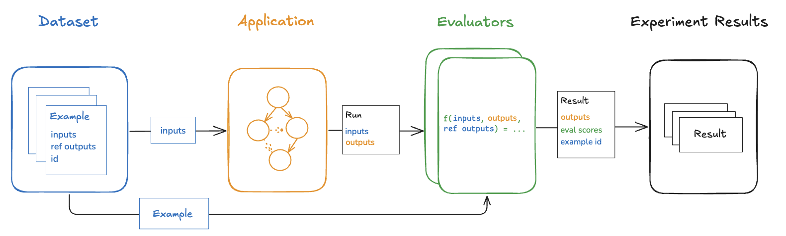

# Evaluation Concepts

The pace of AI application development is often limited by high-quality evaluations.
Evaluations are methods designed to assess the performance and capabilities of AI applications.

Good evaluations enable you to:
- Iteratively improve prompts
- Select optimal models
- Test different architectures
- Ensure deployed applications maintain expected performance

This guide explains the key concepts behind the LangSmith evaluation framework and evaluations for AI applications more broadly.

## Core Components

LangSmith evaluations consist of two essential parts:
- [**Datasets**](#datasets): Collections of test inputs and optional reference outputs
- [**Evaluators**](#evaluators): Functions that score outputs based on dataset inputs

## Datasets

A dataset contains a collection of examples used for evaluating an application.

### Examples

Each example in a dataset consists of three components:

1. **Inputs**: A dictionary of input variables passed to your application
2. **Reference outputs** (optional): A dictionary of expected outputs used only by evaluators
3. **Metadata** (optional): Additional information for creating filtered dataset views

### Dataset Curation

There are several effective approaches to building evaluation datasets:

#### 1. Manually Curated Examples
This is our recommended starting point for dataset creation. Benefits include:
- Leverages your understanding of expected application inputs
- Allows definition of "good" response criteria
- Enables coverage of common edge cases
- Even 10-20 high-quality examples can provide valuable insights

#### 2. Historical Traces
Once your application is in production, real user interactions become valuable examples. Selection methods include:

- **User Feedback**: 
  - Collect end user responses
  - Focus on examples with negative feedback
  - Identify areas where application underperformed

- **Heuristics**: 
  - Identify "interesting" datapoints
  - Flag runs with longer completion times
  - Track unusual patterns

- **LLM Feedback**: 
  - Use LLMs to detect noteworthy runs
  - Flag conversations requiring user rephrasing
  - Identify incorrect initial responses

#### 3. Synthetic Data
After establishing baseline examples, synthetic data can expand your dataset:
- Build upon existing hand-crafted examples
- Useful for rapid dataset growth
- Maintain quality through careful generation

### Splits

Dataset splits serve multiple purposes in evaluation:
- Enable rapid iteration on smaller subsets
- Support final evaluation on larger datasets
- Improve experiment interpretability

For example, in RAG applications, splits can focus on different question types:
- Factual questions
- Opinion-based questions
- Complex reasoning tasks

Learn how to [create and manage dataset splits](/evaluation/how_to_guides/manage_datasets_in_application#create-and-manage-dataset-splits).

### Versions

Dataset versioning is a key feature that:
- Creates new versions upon any modification (add/update/delete)
- Enables inspection and reverting of changes
- Supports [version tagging](/evaluation/how_to_guides/version_datasets#tag-a-version) for human-readable milestones

Version-specific evaluations are particularly valuable for CI pipelines, ensuring dataset updates don't disrupt existing processes.

## Evaluators

Evaluators are functions that assess application performance on specific examples.

### Evaluator Components

#### Inputs
Evaluators receive:
- [Example](/evaluation/concepts#examples): Dataset examples containing:
  - Inputs
  - Reference outputs (optional)
  - Metadata
- [Run](/observability/concepts#runs): Actual application performance data:
  - Outputs
  - Intermediate steps (child runs)

#### Outputs
Evaluators return metrics as dictionaries or lists of dictionaries containing:
- `key`: Metric name
- `score` | `value`: Metric result (numerical or categorical)
- `comment` (optional): Reasoning or additional context

### Evaluator Implementation

Multiple approaches are available:
1. **Custom code**: 
   - Define evaluators in Python or TypeScript
   - Run client-side via SDKs
   - Execute server-side through UI

2. **Built-in evaluators**: 
   - Use LangSmith's pre-configured evaluators
   - Configure via UI

Evaluators can be executed through:
- LangSmith SDK ([Python](https://docs.smith.langchain.com/reference/python) and TypeScript)
- [Prompt Playground](../../prompt_engineering/concepts#prompt-playground)
- [Rules](../../observability/how_to_guides/monitoring/rules) for automated evaluation

### Evaluation Techniques

#### 1. Human Evaluation
- Often the best starting point
- Enables detailed review of outputs and traces
- Facilitated by LangSmith's [annotation queues](/evaluation/concepts#annotation-queues)

#### 2. Heuristic Evaluation
- Deterministic, rule-based functions
- Ideal for simple checks:
  - Non-empty chatbot responses
  - Code compilation verification
  - Exact classification matching

#### 3. LLM-as-judge
Evaluators using LLMs to score outputs:
- Encode grading criteria in prompts
- Can be reference-free or reference-based
- Require careful review and prompt tuning
- Benefit from few-shot examples in grader prompts

Learn about [implementing LLM-as-judge evaluators](/evaluation/how_to_guides/llm_as_judge).

#### 4. Pairwise Evaluation
Compare outputs from two application versions:
- Similar to [LMSYS Chatbot Arena](https://chat.lmsys.org/)
- Applicable to general AI applications
- Can use:
  - Heuristics
  - LLM-based comparison
  - Human annotation

**When to use pairwise evaluation:**
- Direct scoring is difficult
- Comparing outputs is more straightforward
- Example: Summarization quality assessment

Learn [how to implement pairwise evaluations](/evaluation/how_to_guides/evaluate_pairwise).

## Experiment

An experiment represents a single evaluation run of your application on a dataset:
- Tests specific application configurations
- Enables comparison of different:
  - Prompts
  - LLMs
  - Architectures
- Supports [multi-experiment comparison](/evaluation/how_to_guides/compare_experiment_results)

## Annotation Queues

Human feedback provides crucial insights for application improvement. [Annotation queues](/evaluation/how_to_guides/annotation_queues) enable:
- Systematic flagging of runs for review
- Streamlined interface for annotators
- Efficient feedback collection

While [inline run annotation](/evaluation/how_to_guides/annotate_traces_inline) is always available, annotation queues offer additional benefits:
- Grouped run organization
- Specific annotation criteria
- Configurable permissions
- Easy transfer to evaluation datasets

Learn more about [annotation queues and human feedback](/evaluation/how_to_guides#annotation-queues-and-human-feedback).

## Offline Evaluation

Offline evaluation involves testing applications on pre-compiled datasets before deployment, contrasting with online evaluation which assesses live application performance.

You can run offline evaluations:
- Client-side: Using LangSmith SDK ([Python](https://docs.smith.langchain.com/reference/python) and TypeScript)
- Server-side: Via [Prompt Playground](../../prompt_engineering/concepts#prompt-playground)
- Automated: Through [automations](/observability/how_to_guides/monitoring/rules)

### Benchmarking

Benchmarking is a common offline evaluation approach that involves:
1. Curating representative input datasets
2. Defining key performance metrics
3. Testing multiple application versions

Challenges include:
- Dataset curation effort
- Creating gold-standard references
- Designing effective metrics

**Example**: RAG Q&A bot evaluation
- Dataset: Questions with reference answers
- Evaluator: LLM-as-judge for semantic equivalence
- Metrics: Answer accuracy and relevance

**Example**: ReACT agent evaluation
- Dataset: User requests with expected tool calls
- Evaluator: Heuristic checking of tool call sequences
- Metrics: Tool call accuracy and completeness

### Unit Tests

Unit tests verify individual component functionality:
- Focus on basic assertions
- Expected to consistently pass
- Ideal for CI integration

⚠️ **Important**: Consider caching for CI to manage LLM costs

### Regression Tests

Regression tests track performance across versions:
- Ensure new versions maintain existing functionality
- Measure improvements over previous versions
- Typically triggered by significant updates:
  - Model changes
  - Architecture modifications
  - Major prompt revisions

LangSmith's comparison view highlights:
- Regressions (red)
- Improvements (green)
- Performance changes relative to baseline

### Backtesting

Backtesting combines dataset creation with evaluation:
1. Convert production logs to evaluation datasets
2. Run updated versions on historical inputs
3. Compare against original production results

**Common Use Case**: Model Version Testing
- Collect recent production runs
- Test with new model versions
- Compare performance metrics

### Pairwise Evaluation

Pairwise evaluation is particularly valuable when:
- Absolute scoring is challenging
- Relative comparisons are more reliable
- Evaluating general tasks

For example, in summarization:
- Instead of: "Rate this summary 1-10"
- Better: "Which summary is clearer and more concise?"

Learn [how to implement pairwise evaluations](/evaluation/how_to_guides/evaluate_pairwise).

## Online Evaluation

Online evaluation assesses deployed applications in real-time:
- No pre-existing dataset
- No reference outputs available
- Focus on immediate behavior assessment

Use cases include:
- Application monitoring
- Behavior flagging
- Performance tracking

Online evaluators typically run server-side using:
- Built-in [LLM-as-judge evaluators](/evaluation/how_to_guides/llm_as_judge)
- Custom code evaluators within LangSmith

## Application-specific Techniques

### Agents

[LLM-powered autonomous agents](https://lilianweng.github.io/posts/2023-06-23-agent/) combine three core components:
1. Tool calling
2. Memory
3. Planning

Agents [leverage tool calling](https://python.langchain.com/v0.1/docs/modules/agents/agent_types/tool_calling/) with planning (often via prompting) and memory (typically short-term message history) for response generation. [Tool calling](https://python.langchain.com/v0.1/docs/modules/model_io/chat/function_calling/) enables models to:
- Select appropriate tools
- Generate required input arguments

#### Agent Architecture Example

Below shows a tool-calling agent in [LangGraph](https://langchain-ai.github.io/langgraph/tutorials/introduction/):

1. `assistant node`: LLM determines tool usage based on input
2. `tool condition`: Routes to tool node if tool selected
3. `tool node`: Executes tool and returns output
4. Loop continues until no tool is selected

#### Evaluation Types

This architecture enables three primary evaluation approaches:

1. **Final Response Evaluation**
   - Assesses overall task completion
   - Treats agent as black box
   - Evaluates end result

2. **Single Step Evaluation**
   - Examines individual actions
   - Focuses on tool selection
   - Evaluates step accuracy

3. **Trajectory Evaluation**
   - Analyzes complete action sequence
   - Verifies expected tool call paths
   - Assesses overall strategy

#### Detailed Evaluation Approaches

##### 1. Final Response Evaluation

**Components needed:**
- Inputs: User input and optional tool list
- Output: Final agent response
- Evaluator: Task-dependent, often LLM-as-judge

**Considerations:**
- (+) Evaluates complete task success
- (-) Longer execution time
- (-) Limited debugging insight
- (-) Complex metric definition

##### 2. Single Step Evaluation

**Components needed:**
- Inputs: Single step context
- Outputs: LLM response/tool calls
- Evaluator: Binary scoring for tool selection

**Benefits:**
- Precise debugging
- Fast execution
- Simple evaluation metrics

**Challenges:**
- Dataset creation complexity
- Limited context consideration
- Focuses on individual steps only

##### 3. Trajectory Evaluation

**Evaluation methods:**
1. Exact sequence matching
2. Tool set verification
3. Full trajectory analysis

**Metrics options:**
- Binary exact match
- Step deviation count
- Expected tool coverage
- LLM-based trajectory assessment

### RAG (Retrieval Augmented Generation)

:::info
For comprehensive RAG understanding, see our [`RAG From Scratch` series](https://github.com/langchain-ai/rag-from-scratch).
:::

#### Dataset Considerations

Key factors:
- Reference answer availability
- Ease of obtaining ground truth
- Evaluation goals

#### Evaluation Types

1. **Reference-based**
   - Compares against ground truth
   - Assesses correctness
   - Requires reference outputs

2. **Reference-free**
   - Self-consistency checks
   - No reference required
   - Multiple evaluation aspects

#### RAG Evaluation Framework

| Evaluator           | Purpose                                           | Reference Needed | LLM-as-judge                                                                         | Pairwise Compatible |
|--------------------|----------------------------------------------------|------------------|------------------------------------------------------------------------------------|-------------------|
| Document relevance  | Assess retrieval quality                           | No               | [prompt](https://smith.langchain.com/hub/langchain-ai/rag-document-relevance)       | No                |
| Answer faithfulness | Verify grounding in documents                      | No               | [prompt](https://smith.langchain.com/hub/langchain-ai/rag-answer-hallucination)     | No                |
| Answer helpfulness  | Evaluate user value                                | No               | [prompt](https://smith.langchain.com/hub/langchain-ai/rag-answer-helpfulness)       | No                |
| Answer correctness  | Check reference consistency                        | Yes              | [prompt](https://smith.langchain.com/hub/langchain-ai/rag-answer-vs-reference)      | No                |
| Pairwise comparison | Compare multiple versions                          | No               | [prompt](https://smith.langchain.com/hub/langchain-ai/pairwise-evaluation-rag)      | Yes               |

### Summarization

Summarization evaluation focuses on assessing free-form writing against specific criteria.

#### Dataset Sources

1. **Developer Examples**
   - Manually curated texts
   - [Example dataset](https://smith.langchain.com/public/659b07af-1cab-4e18-b21a-91a69a4c3990/d)

2. **Production Logs**
   - Real user interactions
   - Online evaluation compatible

#### Evaluation Framework

| Use Case         | Purpose                                                      | Reference Needed | LLM-as-judge                                                                            |
|-----------------|--------------------------------------------------------------|------------------|----------------------------------------------------------------------------------------|
| Factual accuracy | Verify source accuracy                                       | No               | [prompt](https://smith.langchain.com/hub/langchain-ai/summary-accurancy-evaluator)      |
| Faithfulness     | Check for hallucinations                                     | No               | [prompt](https://smith.langchain.com/hub/langchain-ai/summary-hallucination-evaluator)  |
| Helpfulness      | Assess user value                                            | No               | [prompt](https://smith.langchain.com/hub/langchain-ai/summary-helpfulness-evaluator)    |

### Classification/Tagging

Classification evaluation approaches depend on reference label availability.

#### With Reference Labels

Standard metrics:
- Accuracy
- Precision
- Recall

Implementation: Custom [heuristic evaluator](./how_to_guides/custom_evaluator)

#### Without Reference Labels

Approach:
- LLM-as-judge evaluation
- Criteria-based assessment
- Suitable for online evaluation

| Metric    | Reference Required | LLM-as-judge | Best Use Case        |
|-----------|-------------------|---------------|---------------------|
| Accuracy  | Yes               | No            | Binary classification|
| Precision | Yes               | No            | False positive focus |
| Recall    | Yes               | No            | False negative focus |