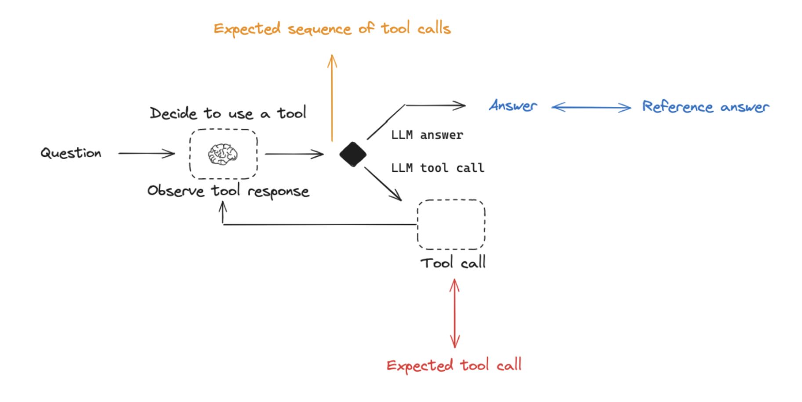

# Evaluation concepts

The pace of AI application development is often rate-limited by high-quality evaluations because there is a paradox of choice. Developers often wonder how to engineer their prompt or which LLM best balances accuracy, latency, and cost. High quality evaluations can help you rapidly answer these types of questions with confidence.

LangSmith allows you to build high-quality evaluations for your AI application. This conceptual guide will give you the foundations to get started. First, let's introduce the core components of LangSmith evaluation:

- `Dataset`: These are the inputs to your application used for conducting evaluations.
- `Evaluator`: An evaluator is a function responsible for scoring your AI application based on the provided dataset.

## Datasets

A dataset is a collection of examples used for evaluating an application. Each example has:

- `inputs`: a dictionary of input variables to pass to your application
- `outputs` (optional): a dictionary of reference outputs. These do not get passed to your application, they are only used in evaluators
- `metadata` (optional): a dictionary of additional information that can be used to create filtered views of a dataset

### Creating datasets

There are various ways to build datasets for evaluation, including:

**Manually curated examples**

This is how we typically recommend people get started creating datasets.
From building your application, you probably have some idea of what types of inputs you expect your application to be able to handle,
and what "good" responses may be.
You probably want to cover a few different common edge cases or situations you can imagine.
Even 10-20 high-quality, manually-curated examples can go a long way.

**Historical logs**

Once you have an application in production, you start getting valuable information: how are users actually using it?
This information can be valuable to capture and store in datasets. This allows you to test against these
use cases as you iterate on your application.

If your application is going well, you will likely get a lot of usage! How can you determine which datapoints are valuable to add?
There are a few heuristics you can follow.
If possible - try to collect end user feedback. You can then see which datapoints got negative feedback.
That is super valuable! These are spots where your application did not perform well.
You should add these to your dataset to test against in the future. You can also use other heuristics
to identify "interesting" datapoints - for example, runs that took a long time to complete could be interesting to look at and add to a dataset.

**Synthetic data**

Once you have a few examples, you can try to artificially generate examples.
It's generally advised to have a few good hand-craft examples before this, as this synthetic data will often resemble them in some way.
This can be a useful way to get a lot of datapoints, quickly.

:::tip

To learn more about creating datasets in LangSmith, see our LangSmith Evaluation series:

- See our video on [`Manually curated datasets`](https://youtu.be/N9hjO-Uy1Vo?feature=shared).
- See our videos on [`Datasets from traces`](https://youtu.be/hPqhQJPIVI8?feature=shared)

:::

### Partitioning datasets

When setting up your evaluation, you may want to partition your dataset into different splits. This can help save cost. For example, you might use a smaller split for many rapid iterations and a larger split for your final evaluation. In addition, splits can be important for the interpretability of your experiments. For example, if you have a RAG application, you may want your dataset splits to focus on different types of questions (e.g., factual, opinion, etc) and to evaluate your application on each split separately.

:::tip

To learn more about creating dataset splits in LangSmith:

- See our video on [`dataset splits`](https://youtu.be/FQMn_FQV-fI?feature=shared) in the LangSmith Evaluation series.
- See our documentation [here](../how_to_guides/manage_datasets_in_application#create-and-manage-dataset-splits).

:::

## Evaluators

Evaluators are functions in LangSmith that score how well your application performs on a particular example.
Evaluators receive these inputs:

- `Example`: The example from your Dataset.
- `Root_run`: The output and intermediate steps from running the inputs through the application.

The evaluator returns an `EvaluationResult` (or a similarly structured dictionary), which consists of:

- `Key`: The name of the metric being evaluated.
- `Score`: The value of the metric for this example.
- `Comment`: The reasoning or additional string information justifying the score.

There are a few approaches and types of scoring functions that can be used in LangSmith evaluation.

### Human

Human evaluation is [often a great starting point for evaluation](https://hamel.dev/blog/posts/evals/#looking-at-your-traces). LangSmith makes it easy to review your LLM application outputs as well as the traces (all intermediate steps).

:::tip

See our [video](https://www.youtube.com/watch?v=Vn8A3BxfplE) using LangSmith to capture human feedback for prompt engineering.

:::

### Heuristic

Heuristic evaluators are hard-coded functions that perform computations to determine a score. To use them, you typically will need a set of rules that can be easily encoded into a function. They can be `reference-free` (e.g., check the output for empty string or valid JSON). Or they can compare task output to a `reference` (e.g., check if the output matches the reference exactly).

:::tip

For some tasks, like code generation, custom heuristic evaluation (e.g., import and code execution-evaluation) are often extremely useful and superior to other evaluations (e.g., LLM-as-judge, discussed below).

- Watch the [`Custom evaluator` video in our LangSmith Evaluation series](https://www.youtube.com/watch?v=w31v_kFvcNw) for a comprehensive overview.
- Read our [documentation](../how_to_guides/custom_evaluator) on custom evaluators.
- See our [blog](https://blog.langchain.dev/code-execution-with-langgraph/) using custom evaluators for code generation.

:::

### LLM-as-judge

LLM-as-judge evaluators use LLMs to score system output. To use them, you typically encode the grading rules / criteria in the LLM prompt. They can be `reference-free` (e.g., check if system output contains offensive content or adheres to specific criteria). Or, they can compare task output to a `reference` (e.g., check if the output is factually accurate relative to the reference).

:::tip

Check out our video on [LLM-as-judge evaluators](https://youtu.be/y5GvqOi4bJQ?feature=shared) in our LangSmith Evaluation series.

:::

With LLM-as-judge evaluators, it is important to carefully review the resulting scores and tune the grader prompt if needed. Often a process of trial-and-error is required to get LLM-as-judge evaluator prompts to produce reliable scores.

:::tip

See documentation on our workflow to audit and manually correct evaluator scores [here](../how_to_guides/audit_evaluator_scores).

:::

### Pairwise

Pairwise evaluators allow you to compare the outputs of two versions of an application.
Think [LMSYS Chatbot Arena](https://chat.lmsys.org/) - this is the same concept, but applied to AI applications more generally, not just models!
This can use either a heuristic ("which response is longer"), an LLM (with a specific pairwise prompt), or human (asking them to manually annotate examples).

**When should you use pairwise evaluation?** Pairwise evaluation is helpful when it is difficult to directly score an LLM output, but easier to compare two outputs.
This can be the case for tasks like summarization - it may be hard to give a summary a perfect score on a scale of 1-10, but easier to tell if it's better than a baseline.

## Applying evaluations

We can visualize the above ideas collectively in the below diagram. To review, `datasets` are composed of `examples` that can be curated from a variety of sources such as historical logs or user curated examples. `Evaluators` are functions that score how well your application performs on each `example` in your `dataset`. Evaluators can use different scoring functions, such as `human`, `heuristic`, `LLM-as-judge`, or `pairwise`. And if the `dataset` contains `reference` outputs, then the evaluator can compare the application output to the `reference`.

Each time we run an evaluation, we are conducting an experiment. An experiment is a single execution of all the example inputs in your `dataset` through your `task`. Typically, we will run multiple experiments on a given `dataset`, testing different tweaks to our `task` (e.g., different prompts or LLMs). In LangSmith, you can easily view all the experiments associated with your `dataset` and track your application's performance over time. Additionally, you can compare multiple experiments in a comparison view.

In the `Dataset` section above, we discussed a few ways to build datasets (e.g., from historical logs or manual curation). One common way to use these datasets is offline evaluation, which is usually conducted prior to deployment of your LLM application. Below we'll discuss a few common paradigms for offline evaluation.

### Unit Tests

Unit tests are often used in software development to verify the correctness of individual system components. [Unit tests are often lightweight assertions](https://hamel.dev/blog/posts/evals/#level-1-unit-tests) on LLM inputs or outputs (e.g., type or schema checks). Often these are triggered by any change to your application as quick assertions of basic functionality.
This means they often use heuristics to evaluate.

You generally expect unit tests to always pass (this is not strictly true, but more so than other types of evaluation flows).
These types of tests are nice to run as part of CI, but when doing so it is useful to set up a cache (or something similar)
to cache LLM calls (because those can quickly rack up!).

:::tip

To learn more about unit tests with LangSmith, check out our unit testing [video](https://youtu.be/ZA6ygagspjA?feature=shared).

:::

### Regression Testing

Regression testing is often used to measure performance across versions of your application over time. They are used to ensure new app versions do not regress on examples that your current version is passing. In practice, they help you assess how much better or worse your new version is relative to the baseline. Often these are triggered when you are making app updates that are expected to influence the user experience.
They are also commonly done when evaluating new or different models.

:::tip

- To learn more about regression testing with LangSmith, see our regression testing [video](https://youtu.be/xTMngs6JWNM?feature=shared)
- See our video focusing on regression testing applied to GPT4-o vs GPT4-turbo [video](https://youtu.be/_ssozegykRs?feature=shared).

:::

LangSmith's comparison view has native support for regression testing, allowing you to quickly see examples that have changed relative to the baseline (with regressions on specific examples shown in red and improvements in green):

### Back-testing

Back-testing is an approach that combines dataset creation (discussed above) with evaluation. If you have a collection of production logs, you can turn them into a dataset. Then, you can re-run those production examples with newer application versions. This allows you to assess performance on past and realistic user inputs.

This is commonly used to evaluate new model versions.
Anthropic dropped a new model? No problem! Grab the 1000 most recent runs through your application and pass them through the new model.
Then compare those results to what actually happened in production.

:::tip

See our video on [`Back-testing`](https://youtu.be/3cDtDI2W-xA?feature=shared) to learn about this workflow.

:::

### Pairwise-testing

It [can be easier](https://www.oreilly.com/radar/what-we-learned-from-a-year-of-building-with-llms-part-i/) for a human (or an LLM grader) to determine `A is better than B` than to assign an individual score to either A or B. This helps to explain why some have observed that pairwise evaluations can be a more stable scoring approach than assigning individual scores to each experiment, particularly when working with LLM-as-judge evaluators.

:::tip

- Watch the [`Pairwise evaluation` video in our LangSmith Evaluation series](https://youtu.be/yskkOAfTwcQ?feature=shared).
- See our [blog post on pairwise evaluation](https://blog.langchain.dev/pairwise-evaluations-with-langsmith/).

:::

### Online Evaluation

Whereas offline evaluation focuses on pre-deployment testing, online evaluation allow you to evaluate an application in production. This can be useful for applying guardrails to LLM inputs or outputs, such as correctness and toxicity. Online evaluation can also work hand-in-hand with offline evaluation: for example, an online evaluator can be used to classify input questions into a set of categories that can be later used to curate a dataset for offline evaluation.

:::tip

Explore our videos on online evaluation:

- [`Online evaluation` in our LangSmith Evaluation series](https://youtu.be/4NbV44E-hCU?feature=shared)
- [`Online evaluation` with focus on guardrails in our LangSmith Evaluation series](https://youtu.be/jypHvE1vN5U?feature=shared)
- [`Online evaluation` with focus on RAG in our LangSmith Evaluation series](https://youtu.be/O0x6AcImDpM?feature=shared)

:::

### Experiment Configurations

LangSmith evaluations are kicked off using a single function, `evaluate`, which takes in a `dataset`, `evaluator`, and various optional configurations, some of which we discuss below.

:::tip

See documentation on using `evaluate` [here](../how_to_guides/evaluate_llm_application).

:::

#### Repetitions

One of the most common questions when evaluating AI applications is: how can I build confidence in the result of an experiment? This is particularly relevant for LLM applications (e.g., agents), which can exhibit considerable run-to-run variability. Repetitions involve running the same evaluation multiple times and aggregating the results to smooth out run-to-run variability and examine the reproducibility of the AI application's performance. LangSmith `evaluate` function allows you to easily set the number of repetitions and aggregates (the mean) of replicate experiments for you in the UI.

:::tip

- See the [video on `Repetitions` in our LangSmith Evaluation series](https://youtu.be/Pvz24JdzzF8)
- See our documentation on [`Repetitions`](../how_to_guides/repetition)

:::

---

# Evaluating Specific LLM Applications

Below, we will discuss evaluation of a few specific, popular LLM applications.

## Agents

[LLM-powered autonomous agents](https://lilianweng.github.io/posts/2023-06-23-agent/) combine three components (1) Tool calling, (2) Memory, and (3) Planning. Agents [use tool calling](https://python.langchain.com/v0.1/docs/modules/agents/agent_types/tool_calling/) with planning (e.g., often via prompting) and memory (e.g., often short-term message history) to generate responses. [Tool calling](https://python.langchain.com/v0.1/docs/modules/model_io/chat/function_calling/) allows a model to respond to a given prompt by generating two things: (1) a tool to invoke and (2) the input arguments required.

Below is a tool-calling agent in [LangGraph](https://langchain-ai.github.io/langgraph/tutorials/introduction/). The `assistant node` is an LLM that determines whether to invoke a tool based upon the input. The `tool condition` sees if a tool was selected by the `assistant node` and, if so, routes to the `tool node`. The `tool node` executes the tool and returns the output as a tool message to the `assistant node`. This loop continues until as long as the `assistant node` selects a tool. If no tool is selected, then the agent directly returns the LLM response.

This sets up three general types of agent evaluations that users are often interested in:

- `Final Response`: Evaluate the agent's final response.
- `Single step`: Evaluate any agent step in isolation (e.g., whether it selects the appropriate tool).
- `Trajectory`: Evaluate whether the agent took the expected path (e.g., of tool calls) to arrive at the final answer.

Below we will cover what these are, the components (inputs, outputs, evaluators) needed for each one, and when you should consider this.
Note that you likely will want to do multiple (if not all!) of these types of evaluations - they are not mutually exclusive!

### Evaluating an agent's final response

One way to evaluate an agent is to assess its overall performance on a task. This basically involves treating the agent as a black box and simply evaluating whether or not it gets the job done.

The inputs should be the user input and (optionally) a list of tools. In some cases, tool are hardcoded as part of the agent and they don't need to be passed in. In other cases, the agent is more generic, meaning it does not have a fixed set of tools and tools need to be passed in at run time.

The output should be the agent's final response.

The evaluator varies depending on the task you are asking the agent to do. Many agents perform a relatively complex set of steps and the output a final text response. Similar to RAG, LLM-as-judge evaluators are often effective for evaluation in these cases because they can assess whether the agent got a job done directly from the text response.

However, there are several downsides to this type of evaluation. First, it usually takes a while to run. Second, you are not evaluating anything that happens inside the agent, so it can be hard to debug when failures occur. Third, it can sometimes be hard to define appropriate evaluation metrics.

:::tip

See our tutorial on [evaluating agent response](../tutorials/agents).

:::

### Evaluating a single step of an agent

Agents generally perform multiple actions. While it is useful to evaluate them end-to-end, it can also be useful to evaluate these individual actions. This generally involves evaluating a single step of the agent - the LLM call where it decides what to do.

The inputs should be the input to a single step. Depending on what you are testing, this could just be the raw user input (e.g., a prompt and / or a set of tools) or it can also include previously completed steps.

The outputs are just the output of that step, which is usually the LLM response. The LLM response often contains tool calls, indicating what action the agent should take next.

The evaluator for this is usually some binary score for whether the correct tool call was selected, as well as some heuristic for whether the input to the tool was correct. The reference tool can be simply specified as a string.

There are several benefits to this type of evaluation. It allows you to evaluate individual actions, which lets you hone in where your application may be failing. They are also relatively fast to run (because they only involve a single LLM call) and evaluation often uses simple heuristic evaluation of the selected tool relative to the reference tool. One downside is that they don't capture the full agent - only one particular step. Another downside is that dataset creation can be challenging, particular if you want to include past history in the agent input. It is pretty easy to generate a dataset for steps early on in an agent's trajectory (e.g., this may only include the input prompt), but it can be difficult to generate a dataset for steps later on in the trajectory (e.g., including numerous prior agent actions and responses).

:::tip

See our tutorial on [evaluating a single step of an agent](../tutorials/agents#single-step-evaluation).

:::

### Evaluating an agent's trajectory

Evaluating an agent's trajectory involves looking at all the steps an agent took and evaluating that sequence of steps.

The inputs are again the inputs to the overall agent (the user input, and optionally a list of tools).

The outputs are a list of tool calls, which can be formulated as an "exact" trajectory (e.g., an expected sequence of tool calls) or simply a list of tool calls that are expected (in any order).

The evaluator here is some function over the steps taken. Assessing the "exact" trajectory can use a single binary score that confirms an exact match for each tool name in the sequence. This is simple, but has some flaws. Sometimes there can be multiple correct paths. This evaluation also does not capture the difference between a trajectory being off by a single step versus being completely wrong.

To address these flaws, evaluation metrics can focused on the number of "incorrect" steps taken, which better accounts for trajectories that are close versus ones that deviate significantly. Evaluation metrics can also focus on whether all of the expected tools are called in any order.

However, none of these approaches evaluate the input to the tools; they only focus on the tools selected. In order to account for this, another evaluation technique is to pass the full agent's trajectory (along with a reference trajectory) as a set of messages (e.g., all LLM responses and tool calls) an LLM-as-judge. This can evaluate the complete behavior of the agent, but it is the most challenging reference to compile (luckily, using a framework like LangGraph can help with this!). Another downside is that evaluation metrics can be somewhat tricky to come up with.

:::tip

See our tutorial on [evaluating agent trajectory](../tutorials/agents#trajectory).

:::

### Best practices

Agents can be both costly (in terms of LLM invocations) and unreliable (due to variability in tool calling). Some approaches to help address these effects:

:::tip

- Test [multiple tool calling LLMs](https://python.langchain.com/v0.2/docs/integrations/chat/) with your agent.
- It's possible that faster and / or lower cost LLMs show acceptable performance for your application.
- Trying evaluating the agent at multiple levels - both end-to-end, as well as at particular steps
- Use repetitions to smooth out noise, as tool selection and agent behavior can show run-to-run variability.
- See the [video on `Repetitions` in our LangSmith Evaluation series](https://youtu.be/Pvz24JdzzF8)

:::

## Retrieval Augmented Generation (RAG)

Retrieval Augmented Generation (RAG) is a powerful technique that involves retrieving relevant documents based on a user's input and passing them to a language model for processing. RAG enables AI applications to generate more informed and context-aware responses by leveraging external knowledge.

:::tip

For a comprehensive review of RAG concepts, see our [`RAG From Scratch` series](https://github.com/langchain-ai/rag-from-scratch).

:::

### Dataset

When evaluating RAG applications, a key consideration is whether you have (or can easily obtain) reference answers for each input question. Reference answers serve as ground truth for assessing the correctness of the generated responses. However, even in the absence of reference answers, various evaluations can still be performed using reference-free RAG evaluation prompts (examples provided below).

### Evaluator

`LLM-as-judge` is a commonly used evaluator for RAG because it's an effective way to evaluate factual accuracy or consistency between texts.

When evaluating RAG applications, you have two main options:

1. `Reference` answer: Compare the RAG chain's generated answer or retrievals against a reference answer (or retrievals) to assess its correctness.
2. `Reference-free`: Perform self-consistency checks using prompts that don't require a reference answer (represented by orange, green, and red in the above figure).

:::tip

Dive deeper into RAG evaluation concepts with our LangSmith video series:

- [RAG answer correctness evaluation](https://youtu.be/lTfhw_9cJqc?feature=shared)
- [RAG answer hallucination](https://youtu.be/IlNglM9bKLw?feature=shared)
- [RAG document relevance](https://youtu.be/Fr_7HtHjcf0?feature=shared)
- [RAG intermediate steps evaluation](https://youtu.be/yx3JMAaNggQ?feature=shared)

:::

### Applying RAG Evaluation

When applying RAG evaluation, consider the following approaches:

1. `Offline evaluation`: Use offline evaluation for any prompts that rely on a reference answer. This is most commonly used for RAG answer correctness evaluation, where the reference is a ground truth (correct) answer.

2. `Online evaluation`: Employ online evaluation for any reference-free prompts. This allows you to assess the RAG application's performance in real-time scenarios.

3. `Pairwise evaluation`: Utilize pairwise evaluation to compare answers produced by different RAG chains. This evaluation focuses on user-specified criteria (e.g., answer format or style) rather than correctness, which can be evaluated using self-consistency or a ground truth reference.

:::tip

Explore our LangSmith video series for more insights on RAG evaluation:

- [RAG with online evaluation](https://youtu.be/O0x6AcImDpM?feature=shared)
- [RAG pairwise evaluation](https://youtu.be/yskkOAfTwcQ?feature=shared)

:::

### RAG evaluation summary

| Use Case            | Detail                                            | Reference-free? | LLM-as-judge?                                                                         | Pairwise relevant |
| ------------------- | ------------------------------------------------- | --------------- | ------------------------------------------------------------------------------------- | ----------------- |
| Document relevance  | Are documents relevant to the question?           | Yes             | Yes - [prompt](https://smith.langchain.com/hub/langchain-ai/rag-document-relevance)   | No                |
| Answer faithfulness | Is the answer grounded in the documents?          | Yes             | Yes - [prompt](https://smith.langchain.com/hub/langchain-ai/rag-answer-hallucination) | No                |
| Answer helpfulness  | Does the answer help address the question?        | Yes             | Yes - [prompt](https://smith.langchain.com/hub/langchain-ai/rag-answer-helpfulness)   | No                |
| Answer correctness  | Is the answer consistent with a reference answer? | No              | Yes - [prompt](https://smith.langchain.com/hub/langchain-ai/rag-answer-vs-reference)  | No                |
| Chain comparison    | How do multiple answer versions compare?          | Yes             | Yes - [prompt](https://smith.langchain.com/hub/langchain-ai/pairwise-evaluation-rag)  | Yes               |

## Common use-cases

### Summarization

Summarization is one specific type of free-form writing. The evaluation aim is typically to examine the writing (summary) relative to a set of criteria.

`Developer curated examples` of texts to summarize are commonly used for evaluation (see a dataset example [here](https://smith.langchain.com/public/659b07af-1cab-4e18-b21a-91a69a4c3990/d)). However, `user logs` from a production (summarization) app can be used for online evaluation with any of the `Reference-free` evaluation prompts below.

`LLM-as-judge` is typically used for evaluation of summarization (as well as other types of writing) using `Reference-free` prompts that follow provided criteria to grade a summary. It is less common to provide a particular `Reference` summary, because summarization is a creative task and there are many possible correct answers.

`Online` or `Offline` evaluation are feasible because of the `Reference-free` prompt used. `Pairwise` evaluation is also a powerful way to perform comparisons between different summarization chains (e.g., different summarization prompts or LLMs):

:::tip

See our LangSmith video series to go deeper on these concepts:

- Video on pairwise evaluation: https://youtu.be/yskkOAfTwcQ?feature=shared

:::

| Use Case         | Detail                                                                     | Reference-free? | LLM-as-judge?                                                                                | Pairwise relevant |
| ---------------- | -------------------------------------------------------------------------- | --------------- | -------------------------------------------------------------------------------------------- | ----------------- |
| Factual accuracy | Is the summary accurate relative to the source documents?                  | Yes             | Yes - [prompt](https://smith.langchain.com/hub/langchain-ai/summary-accurancy-evaluator)     | Yes               |
| Faithfulness     | Is the summary grounded in the source documents (e.g., no hallucinations)? | Yes             | Yes - [prompt](https://smith.langchain.com/hub/langchain-ai/summary-hallucination-evaluator) | Yes               |
| Helpfulness      | Is summary helpful relative to user need?                                  | Yes             | Yes - [prompt](https://smith.langchain.com/hub/langchain-ai/summary-helpfulness-evaluator)   | Yes               |

### Classification / Tagging

Classification / Tagging applies a label to a given input (e.g., for toxicity detection, sentiment analysis, etc). Classification / Tagging evaluation typically employs the following components, which we will review in detail below:

A central consideration for Classification / Tagging evaluation is whether you have a dataset with `reference` labels or not. If not, users frequently want to define an evaluator that uses criteria to apply label (e.g., toxicity, etc) to an input (e.g., text, user-question, etc). However, if ground truth class labels are provided, then the evaluation objective is focused on scoring a Classification / Tagging chain relative to the ground truth class label (e.g., using metrics such as precision, recall, etc).

If ground truth reference labels are provided, then it's common to simply define a [custom heuristic evaluator](../how_to_guides/custom_evaluator) to compare ground truth labels to the chain output. However, it is increasingly common given the emergence of LLMs simply use `LLM-as-judge` to perform the Classification / Tagging of an input based upon specified criteria (without a ground truth reference).

`Online` or `Offline` evaluation is feasible when using `LLM-as-judge` with the `Reference-free` prompt used. In particular, this is well suited to `Online` evaluation when a user wants to tag / classify application input (e.g., for toxicity, etc).

:::tip

See our LangSmith video series to go deeper on these concepts:

- Online evaluation video: https://youtu.be/O0x6AcImDpM?feature=shared

:::

| Use Case  | Detail                          | Reference-free?         | LLM-as-judge?                                                        | Pairwise relevant |
| --------- | ------------------------------- | ----------------------- | -------------------------------------------------------------------- | ----------------- |
| Criteria  | Tag if specific criteria is met | Yes                     | Yes - [prompt](https://smith.langchain.com/hub/langchain-ai/tagging) | No                |
| Accuracy  | Standard definition             | No (ground truth class) | No                                                                   | No                |
| Precision | Standard definition             | No (ground truth class) | No                                                                   | No                |
| Recall    | Standard definition             | No (ground truth class) | No                                                                   | No                |
