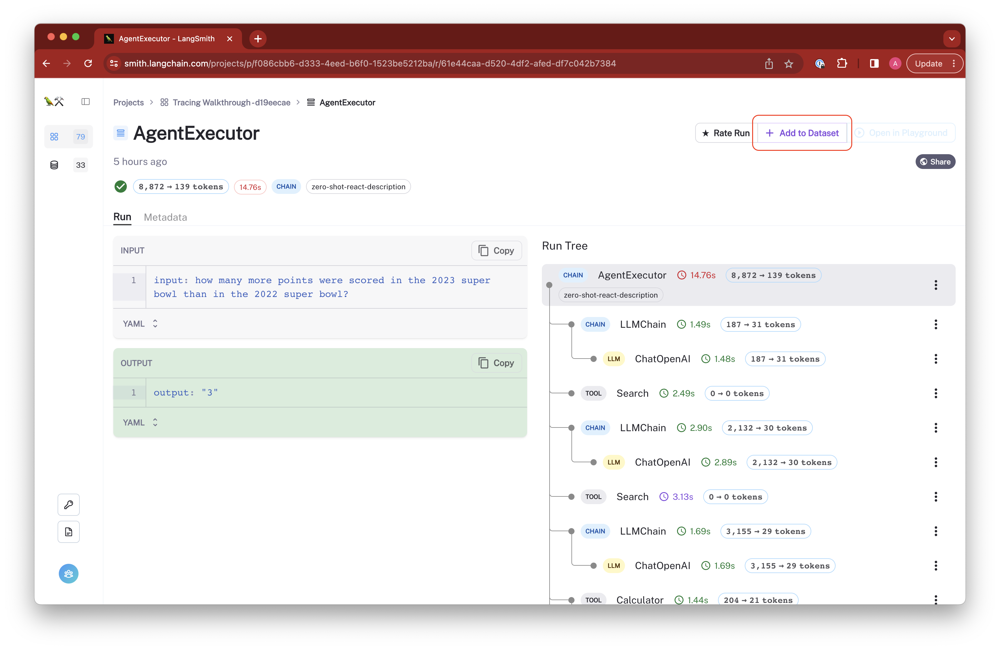
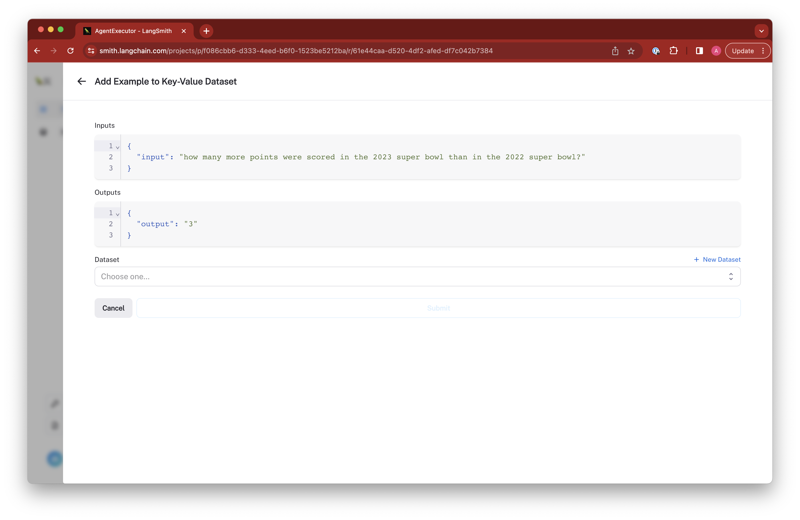
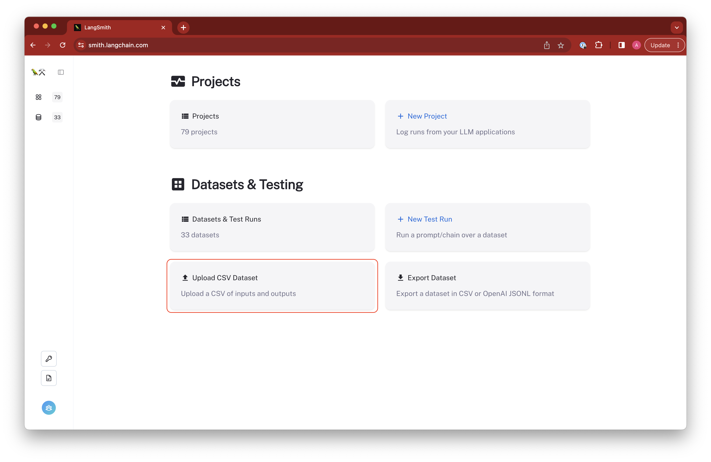
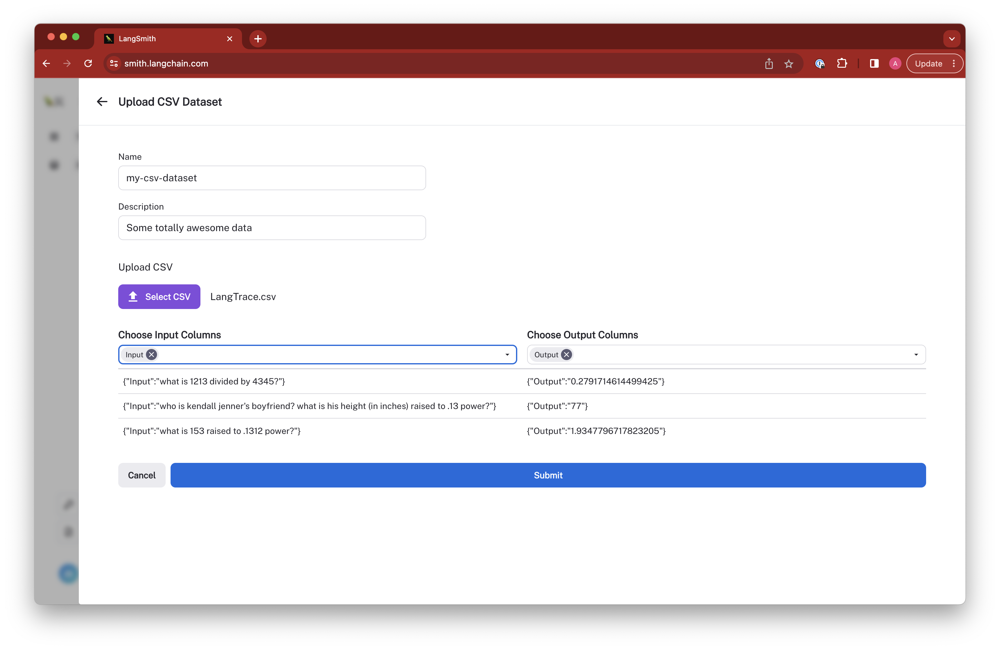
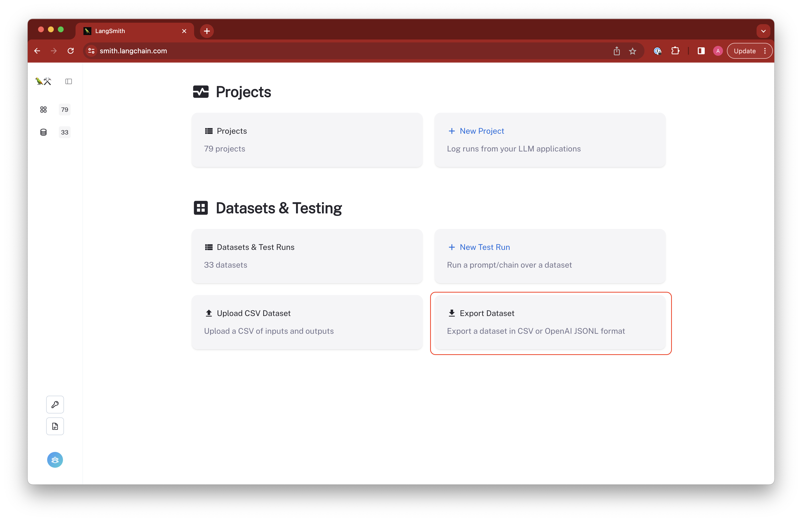
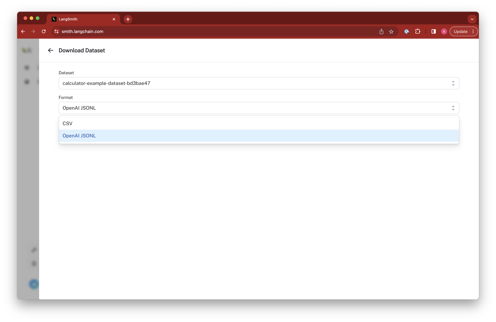

import {
  CodeTabs,
  ShellBlock,
  PythonBlock,
  TypeScriptBlock,
} from "@site/src/components/InstructionsWithCode";

# How to manage datasets in the web app

The easiest way to interact with datasets is directly in the LangSmith app. Here, you can create and edit datasets and example rows. Below are a few ways to interact with them.

### From Existing Runs

We typically construct datasets over time by collecting representative examples from debugging or other runs. To do this, we first filter the runs to find the ones we want to add to the dataset. Then, we create a dataset and add the runs as examples.

You can do this from any 'run' details page by clicking the 'Add to Dataset' button in the top right-hand corner.

From there, we select the dataset to organize it in and update the ground truth output values if necessary.

### Upload a CSV

The easiest way to create a dataset from your own data is by clicking the 'upload a CSV dataset' button on the home page or in the top right-hand corner of the 'Datasets & Testing' page.

Select a name and description for the dataset, and then confirm that the inferred input and output columns are correct.

### Exporting datasets to other formats

You can export your LangSmith dataset to CSV or OpenAI evals format directly from the web application.

To do so, click "Export Dataset" from the homepage.
To do so, select a dataset, click on "Examples", and then click the "Export Dataset" button at the top of the examples table.

This will open a modal where you can select the format you want to export to.

