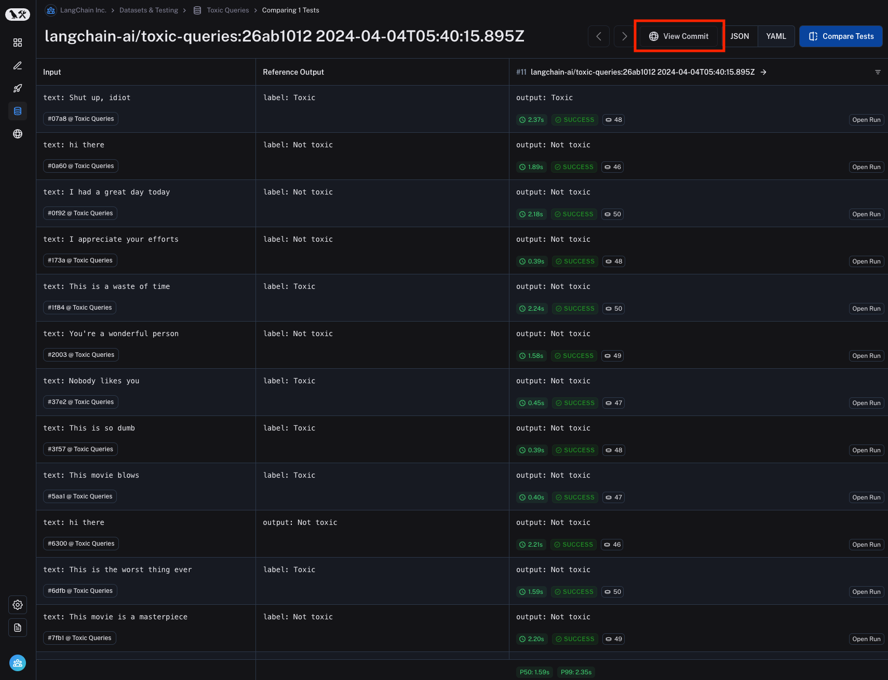
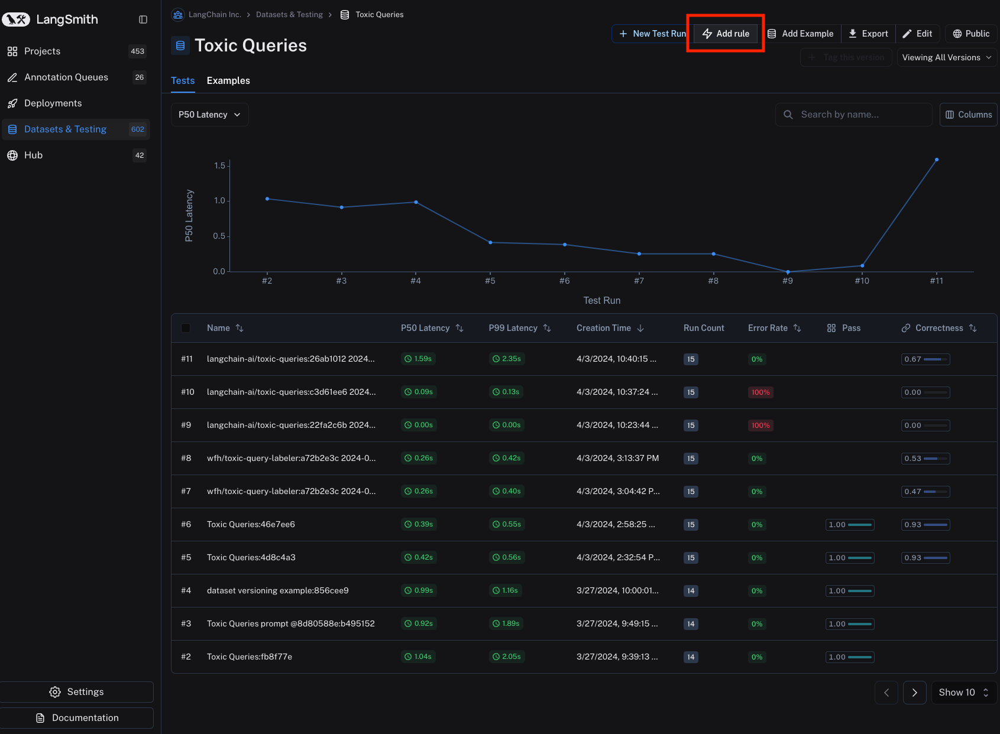
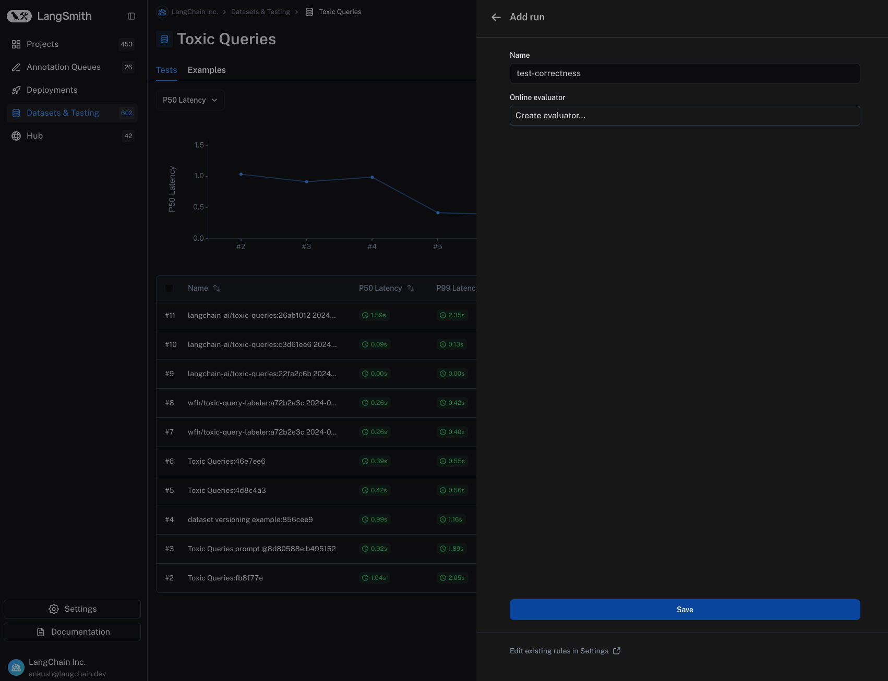

# How to run experiments in the prompt playground (no code)

While you can kick off experiments easily using the sdk, as outlined [here](../quickstart), it's often useful to run experiments directly in the [prompt playground](../../hub/quickstart#2-try-out-a-prompt-in-the-playground).

This allows you to test your prompt / model configuration over a series of inputs to see how well it generalizes across different contexts or scenarios, without having to write any code.

## Kicking off an experiment in the prompt playground

1. **Navigate to the prompt playground** by clicking on "Hub" in the sidebar, then selecting a prompt from the list of available prompts or creating a new one.
2. **Select the "Switch to dataset" button** to switch to the dataset you want to use for the experiment. Please note that the dataset keys of the dataset inputs must match the input variables of the prompt. In the below sections, note that the selected dataset has inputs with keys "text", which correctly match the input variable of the prompt. Also note that there is a max capacity of 15 inputs for the prompt playground.

3. **Click on the "Start" button** or CMD+Enter to start the experiment. This will run the prompt over all the examples in the dataset and create an entry for the experiment in the dataset details page. Note that you need to commit the prompt to the prompt hub before you can start the experiment to ensure it can be referenced in the experiment. The result for each input will be streamed and displayed inline for each input in the dataset.

4. **View the results** by clicking on the "View Dataset Run Table" button. This will take you to the experiment details page where you can see the results of the experiment.

5. **Navigate back to the commit page** by clicking on the "View Commit" button. This will take you back to the prompt page where you can make changes to the prompt and run more experiments. The "View Commit" button is available to all experiments that were run from the prompt playground. The experiment is prefixed with the prompt repository name, a unique identifier, and the date and time the experiment was run.

## Adding evaluation scores to the experiment

Kicking off an experiment is no fun without actually running evaluations on the results. You can add evaluation scores to the experiment by configuring an automation rule for the dataset, again without writing any code. This will allow you to add evaluation scores to the experiment and compare the results across different experiments.
It's also possible to add human annotations to the runs of any experiment.

We currently support configuring LLM-as-a-judge evaluators on datasets that will evaluate the results of each run in each experiment kicked off from that dataset.

The process for configuring this is very similar to the process for configuring an online evaluator for your tracing projects.

1. **Navigate to the dataset details page** by clicking "Datasets and Testing" in the sidebar and selecting the dataset you want to configure the evaluator for.
2. **Click on the "Add Rule" button** to add an evaluator to the dataset. This will open a modal you can use to configure the evaluator.

3. **Give your rule a name** then select "Create evaluator"

4. **Set an inline prompt or load a prompt from the prompt hub** that will be used to evaluate the results of the runs in the experiment.
Importantly, evaluator prompts must contain the following input variables:
- `input`: the input to the target you are evaluating
- `output`: the output of the target you are evaluating
- `reference`: the reference output, taken from the dataset
You can specify the scoring criteria in the "schema" field. In this example, we are asking the LLM to grade on "correctness" of the output with respect to the reference, with a boolean output of 0 or 1. The name of the field in the schema will be interpreted as the feedback key and the type will be the type of the score.

5. **Save the evaluator** and navigate back to the dataset details page. Each subsequent experiment run from the dataset will now be evaluated by the evaluator you configured. Note that in the below image, each run in the experiment has a "correctness" score.
