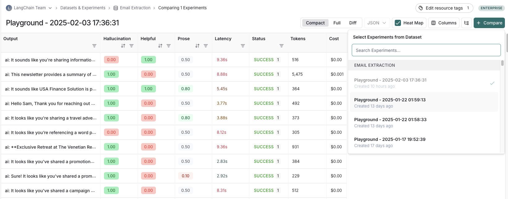

import Admonition from "@theme/Admonition";

# Analyze a single experiment
After running an experiment, you can use LangSmith's experiment view to analyze the results and draw insights about your experiment's performance.

This guide will walk you through viewing experiment results and highlight the features available in the experiments view.

## Open the experiment view
To open the experiment view, select the relevant Dataset from the **Dataset & Experiments** page and then select the experiment you want to view.

## View experiment results

### Customizing columns

By default, the experiment view shows the input, output, and reference output for each [example](/evaluation/concepts#examples) in the dataset, feedback scores from evaluations and experiment metrics like cost, token counts, latency and status.  

You can customize the columns using the **Display** button to make it easier to interpret experiment results:
- **Break out fields from inputs, outputs, and reference outputs** into their own columns. This is especially helpful if you have long inputs/outputs/reference outputs and want to surface important fields
- **Hide and reorder columns** to create focused views for analysis 
- **Control decimal precision on feedback scores**. By default, we surface numerical feedback scores with a decimal precision of 2 and this is now customizable

:::tip
You can set default configurations for an entire dataset or temporarily save settings just for yourself.
::: 

### Heatmap view
The experiment view defaults to a heat map enabled view, making it easy to identify patterns, spot outliers, and understand score distributions across your dataset. Based on the type of evaluator, you can configure if a higher or lower feedback score indicates better performance for each metric by clicking on the three dots in the heat map button. 

### Sort and filter
To sort or filter feedback scores, you can use the actions in the column headers.

### Table views
Depending on the view most useful for your analysis, you can change the formatting of the table by toggling between a compact view, a full, view, and a diff view. 
- The `Compact` view shows each run as a one-line row, for ease of comparing scores at a glance.
- The `Full` view shows the full output for each run for digging into the details of individual runs.
- The `Diff` view shows the text difference between the reference output and the output for each run.

### View the traces
Hover over any of the output cells, and click on the trace icon to view the trace for that run. This will open up a trace in the side panel.

To view the entire tracing project, click on the "View Project" button in the top right of the header.

### View evaluator runs
For evaluator scores, you can view the source run by hovering over the evaluator score cell and clicking on the arrow icon. This will open up a trace in the side panel. If you're running a LLM-as-a-judge evaluator, you can view the prompt used for the evaluator in this run. 
If your experiment has [repetitions](/evaluation/concepts#repetitions), you can click on the aggregate average score to find links to all of the individual runs.

## Group results by metadata
You can add metadata to examples to categorize and organize them. For example, if you're evaluating factual accuracy on a question answering dataset, the metadata might include which subject area each question belongs to. Metadata can be added either [via the UI](./manage_datasets_in_application#edit-example-metadata) or [via the SDK](./manage_datasets_programmatically#update-single-example).

To analyze results by metadata, use the "Group by" dropdown in the top right corner of the experiment view and select your desired metadata key. This displays average feedback scores, latency, total tokens, and cost for each metadata group.

<Admonition type="info">
You will only be able to group by example metadata on experiments created after February 20th, 2025. Any experiments before that date can still be grouped by metadata, but only if the metadata is on the experiment traces themselves.
</Admonition>

## Repetitions
If you've run your experiment with [repetitions](/evaluation/concepts#repetitions), there will be arrows in the output results column so you can view outputs in the table. To view each run from the repetition, hover over the output cell and click the expanded view.

When you run an experiment with repetitions, LangSmith displays the average for each feedback score in the table. Click on the feedback score to view the feedback scores from individual runs, or to view the standard deviation across repetitions. 

## Compare to another experiment
In the top right of the experiment view, you can select another experiment to compare to. This will open up a comparison view, where you can see how the two experiments compare.
To learn more about the comparison view, see [how to compare experiment results](./compare_experiment_results).

