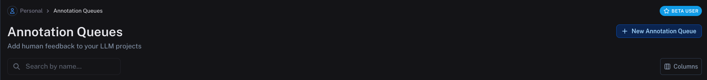
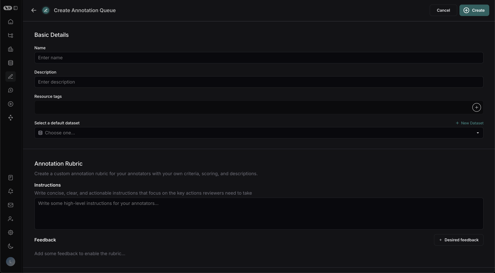
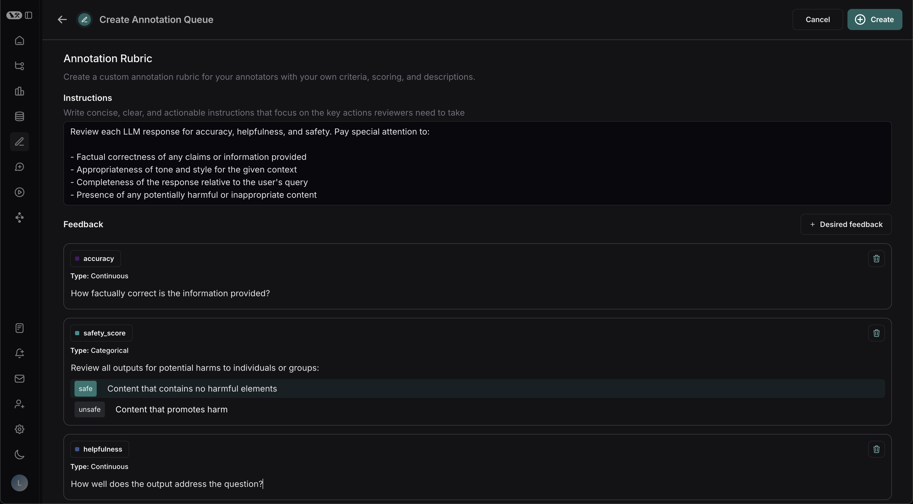
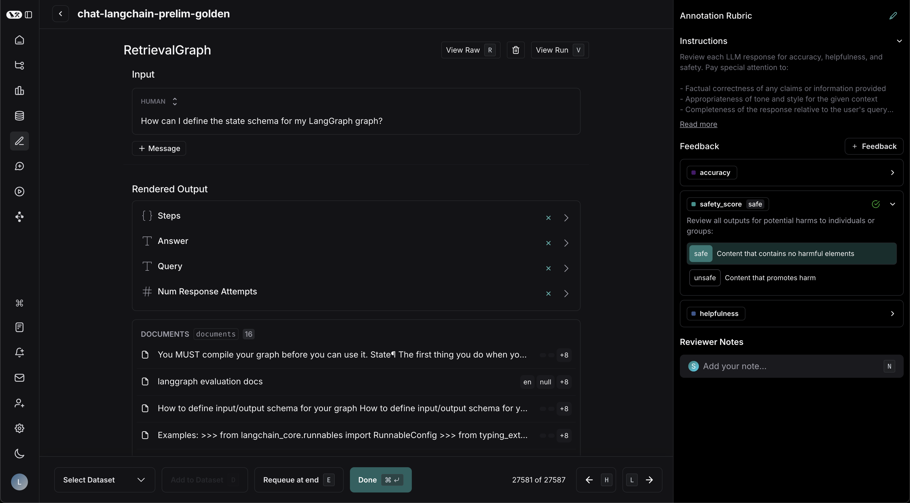
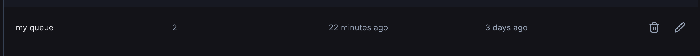
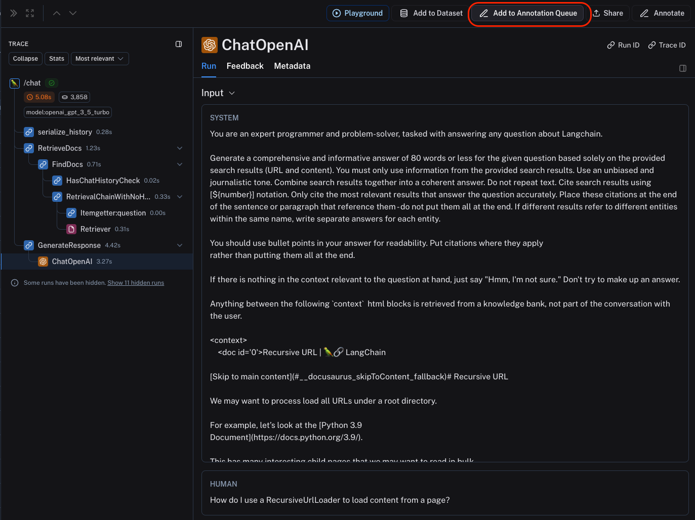
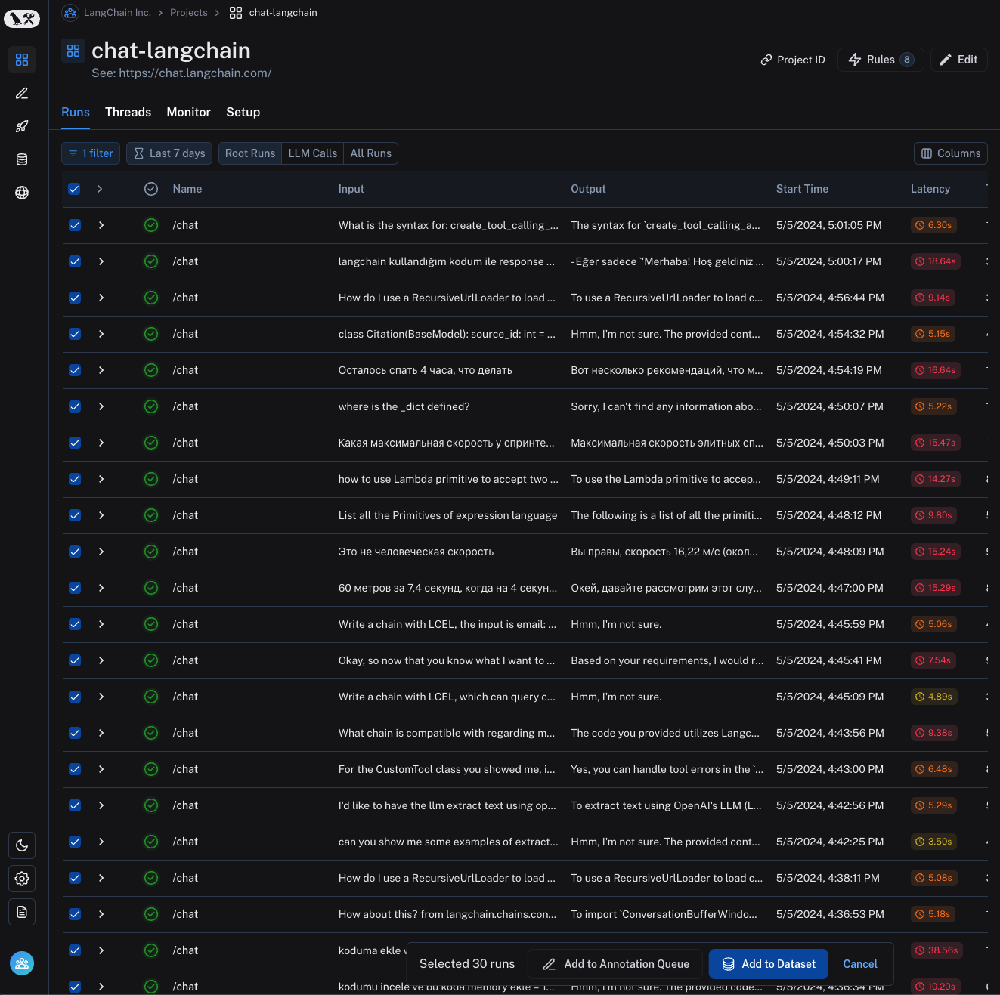
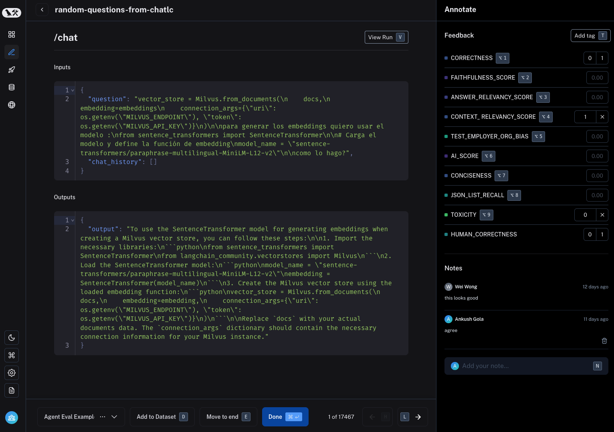

# Use annotation queues

Annotation queues are a powerful LangSmith feature that provide a streamlined, directed view for human annotators to attach feedback to specific runs.
While you can always [annotate runs inline](./annotate_traces_inline), annotation queues provide another option to group runs together, then have annotators review and provide feedback on them.

## Create an annotation queue

To create an annotation queue, navigate to the **Annotation queues** section through the homepage or left-hand navigation bar.
Then click **+ New annotation queue** in the top right corner.

### Basic Details

Fill in the form with the **name** and **description** of the queue.
You can also assign a **default dataset** to queue, which will streamline the process of sending the inputs and outputs of certain runs to datasets in your LangSmith workspace.

### Annotation Rubric

First, type some high-level instructions for your annotators, which will be shown in the sidebar on every run.

Next, click "+ Desired Feedback" to add feedback keys to your annotation queue. Annotators will be presented with these feedback keys on each run.
Add a description for each, as well as a short description of each category if the feedback is categorical.

Reviewers will see this:

### Collaborator Settings

There are a few settings related to multiple annotators:

- **Number of reviewers per run**: This determines the number of reviewers that must mark a run as "Done" for it to be removed from the queue. If you check "All workspace members review each run," then a run will remain in the queue until all workspace members have marked it "Done".
- **Enable reservations on runs**: We recommend enabling reservations.
  This will prevent multiple annotators from reviewing the same run at the same time.

1. **How do reservations work?**

When a reviewer views a run, the run is reserved for that reviewer for the specified "reservation length". If there are multiple reviewers per run as specified above, the run can be reserved by multiple reviewers (up to the number of reviewers per run) at the same time.

2. **What happens if time runs out?**

If a reviewer has viewed a run and then leaves the run without marking it "Done", the reservation will expire after the specified "reservation length".
The run is then released back into the queue and can be reserved by another reviewer.

:::note
Clicking "Requeue at end" will only move the current run to the end of the current user's queue; it won't affect the queue order of any other user. It will also release the reservation that the current user has on that run.
:::

Because of these settings, it's possible (and likely) that the number of runs visible to an individual in an annotation queue differs from the total number of runs in the queue as well as anyone else's queue size.

You can update these settings at any time by clicking on the pencil icon in the **Annotation Queues** section.

## Assign runs to an annotation queue

To assign runs to an annotation queue, either:

1. Click on **Add to Annotation Queue** in top right corner of any trace view. You can add ANY intermediate run (span) of the trace to an annotation queue, not just the root span.
   

2. Select multiple runs in the runs table then click **Add to Annotation Queue** at the bottom of the page.
   

3. [Set up an automation rule](../../../observability/how_to_guides/monitoring/rules) that automatically assigns runs which pass a certain filter and sampling condition to an annotation queue.

:::tip

It is often a very good idea to assign runs that have a certain user feedback score (eg thumbs up, thumbs down) from the application to an annotation queue. This way, you can identify and address issues that are causing user dissatisfaction.
To learn more about how to capture user feedback from your LLM application, follow [this guide](./attach_user_feedback).

:::

## Review runs in an annotation queue

To review runs in an annotation queue, navigate to the **Annotation Queues** section through the homepage or left-hand navigation bar.
Then click on the queue you want to review. This will take you to a focused, cyclical view of the runs in the queue that require review.

You can attach a comment, attach a score for a particular feedback criteria, add the run a dataset and/or mark the run as reviewed.
You can also remove the run from the queue for all users, despite any current reservations or settings for the queue, by clicking the **Trash** icon next to "View run".

The keyboard shortcuts shown can help streamline the review process.

