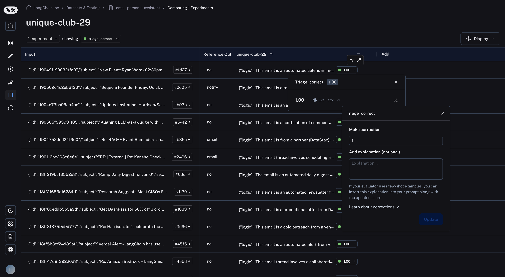
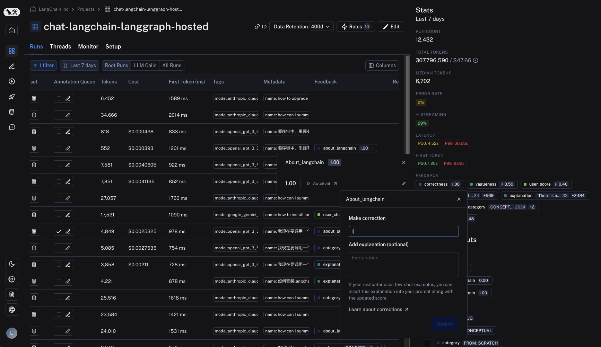

import {
  CodeTabs,
  typescript,
  python,
} from "@site/src/components/InstructionsWithCode";

# How to audit evaluator scores

LLM-as-a-judge evaluators don't always get it right. Because of this, it is often useful for a human to manually audit the scores left by an evaluator and correct them where necessary. LangSmith allows you to make corrections on evaluator scores in the UI or SDK.

## In the comparison view

In the comparison view, you may click on any feedback tag to bring up the feedback details. From there, click the "edit" icon on the right to bring up the corrections view. You may then type in your desired score in the text box under "Make correction".
If you would like, you may also attach an explanation to your correction. This is useful if you are using a [few-shot evaluator](./create_few_shot_evaluators) and will be automatically inserted into your few-shot examples
in place of the `few_shot_explanation` prompt variable.

## In the runs table

In the runs table, find the "Feedback" column and click on the feedback tag to bring up the feedback details. Again, click the "edit" icon on the right to bring up the corrections view.

## In the SDK

Corrections can be made via the SDK's `update_feedback` function, with the `correction` dict. You must specify a `score` key which corresponds to a number for it to be rendered in the UI.

<CodeTabs
  groupId="client-language"
  tabs={[
    python`
      import langsmith
      
      client = langsmith.Client()
      client.update_feedback(
        my_feedback_id,
        correction={
            "score": 1,
        },
      )
    `,
    typescript`
      import { Client } from 'langsmith';
      
      const client = new Client();
      await client.updateFeedback(
        myFeedbackId,
        {
            correction: {
                score: 1,
            }
        }
      )
    `,
  ]}
/>
