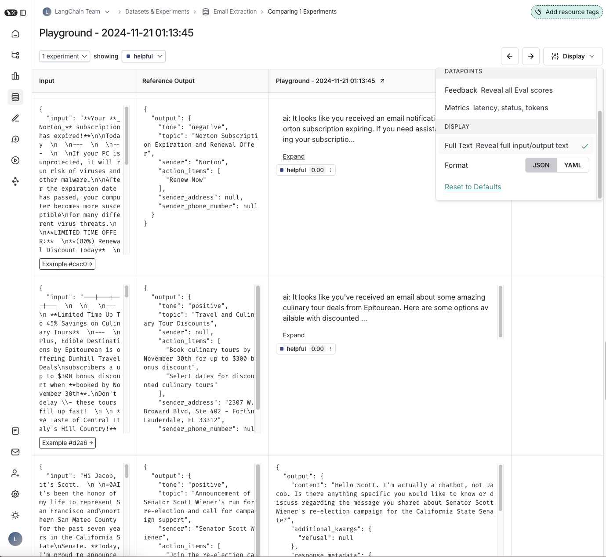
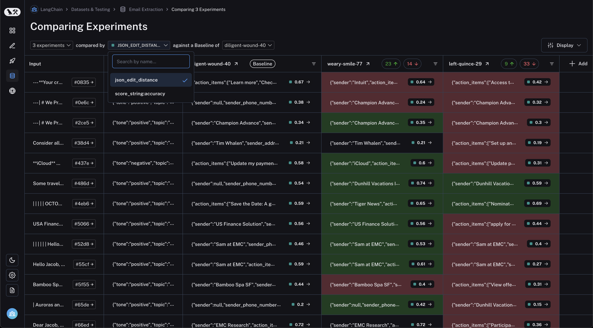
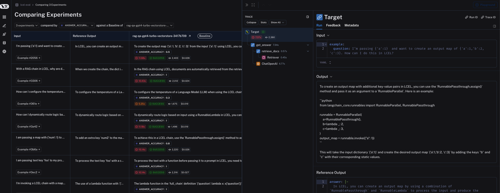
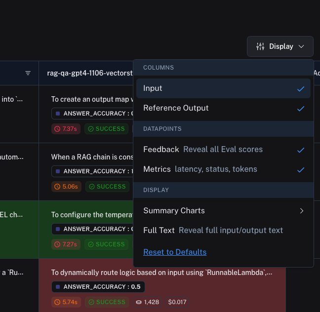

# How to compare experiment results

Oftentimes, when you are iterating on your LLM application (such as changing the model or the prompt), you will want to compare the results of different experiments.

LangSmith supports a powerful comparison view that lets you hone in on key differences, regressions, and improvements between different experiments.

## Open the comparison view

To open the comparison view, select two or more experiments from the "Experiments" tab from a given dataset page. Then, click on the "Compare" button at the bottom of the page.

## Toggle different views

You can toggle between different views by clicking on the "Display" dropdown at the top right of the page. You can toggle different views to be displayed.

Toggling Full Text will show the full text of the input, output and reference output for each run. If the reference output is too long to display in the table, you can click on expand to view the full content.

## View regressions and improvements

In the LangSmith comparison view, runs that _regressed_ on your specified feedback key against your baseline experiment will be highlighted in red, while runs that _improved_
will be highlighted in green. At the top of each column, you can see how many runs in that experiment did better and how many did worse than your baseline experiment.

## Filter on regressions or improvements

Click on the regressions or improvements buttons on the top of each column to filter to the runs that regressed or improved in that specific experiment.

## Update baseline experiment

In order to track regressions, you need a baseline experiment against which to compare. This will be automatically assigned as the first experiment in your comparison, but you can
change it from the dropdown at the top of the page.

## Select feedback key

You will also want to select the feedback key (evaluation metric) on which you would like focus on. This can be selected via another dropdown at the top. Again, one will be assigned by
default, but you can adjust as needed.

## Open a trace

If tracing is enabled for the evaluation run, you can click on the trace icon in the hover state of any experiment cell to open the trace view for that run. This will open up a trace in the side panel.

## Expand detailed view

From any cell, you can click on the expand icon in the hover state to open up a detailed view of all experiment results on that particular example input, along with feedback keys and scores.

## Update display settings

You can adjust the display settings for comparison view by clicking on "Display" in the top right corner.

Here, you'll be able to toggle feedback, metrics, summary charts, and expand full text.

