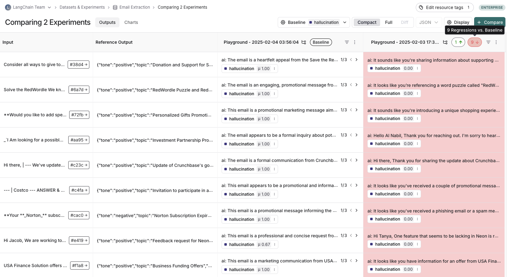
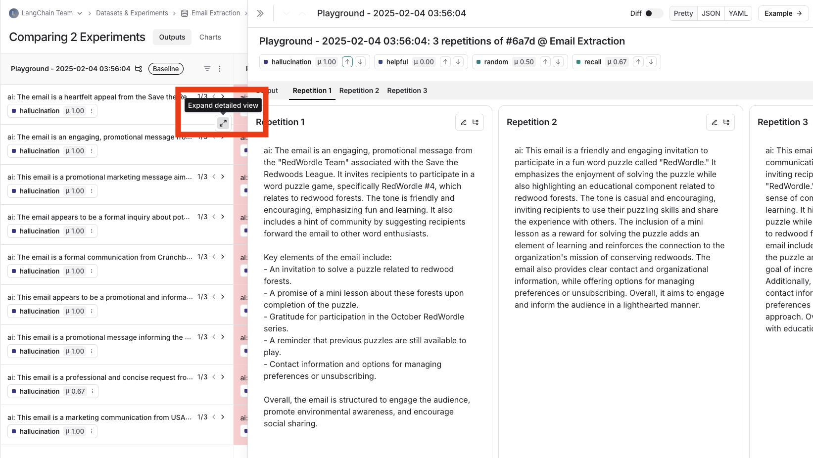
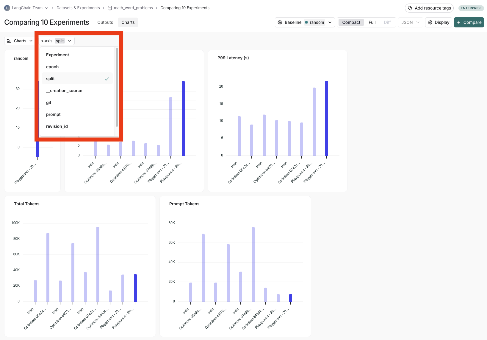

# How to compare experiment results

Oftentimes, when you are iterating on your LLM application (such as changing the model or the prompt), you will want to compare the results of different experiments.

LangSmith supports a powerful comparison view that lets you hone in on key differences, regressions, and improvements between different experiments.

## Open the comparison view

To open the experiment comparison view, click the **Dataset & Experiments** page, select the relevant Dataset,  select two or more experiments on the Experiments tab and click compare.

## Adjust the table display

You can toggle between different views by clicking "Full" or "Compact" at the top of the page.

Toggling Full Text will show the full text of the input, output and reference output for each run. If the reference output is too long to display in the table, you can click on expand to view the full content.

You can also select and hide individual feedback keys or individual metrics in the display settings dropdown to isolate the information you want to see.

## View regressions and improvements

In the LangSmith comparison view, runs that _regressed_ on your specified feedback key against your baseline experiment will be highlighted in red, while runs that _improved_
will be highlighted in green. At the top of each column, you can see how many runs in that experiment did better and how many did worse than your baseline experiment.

## Filter on regressions or improvements

Click on the regressions or improvements buttons on the top of each column to filter to the runs that regressed or improved in that specific experiment.

## Update baseline experiment and metric

In order to track regressions, you need to:
1. Select a baseline experiment against which to compare and a metric to measure. By default, the newest experiment is selected as the baseline. 
2. Select feedback key (evaluation metric) you want to focus compare against. One will be assigned by default, but you can adjust as needed.
3. Configure whether a higher score is better for the selected feedback key. This preference will be stored.

## Open a trace

If tracing is enabled for the evaluation run, you can click on the trace icon in the hover state of any experiment cell to open the trace view for that run. This will open up a trace in the side panel.

## Expand detailed view

From any cell, you can click on the expand icon in the hover state to open up a detailed view of all experiment results on that particular example input, along with feedback keys and scores.

## View summary charts

You can also view summary charts by clicking on the "Charts" tab at the top of the page.

## Use experiment metadata as chart labels

You can configure the x-axis labels for the charts based on [experiment metadata](./filter_experiments_ui#background-add-metadata-to-your-experiments).

Select a metadata key to see change the x-axis labels of the charts.

