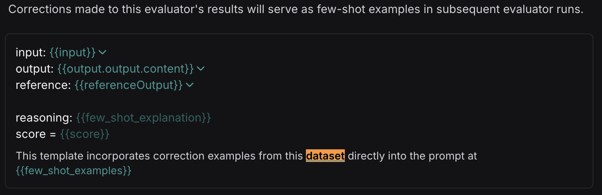

# How to improve your evaluator with few-shot examples

Using LLM-as-a-Judge evaluators can be very helpful when you can't evaluate your system programmatically. However, iterating on these prompts adds overhead to the development process of an LLM-based application - you now need to maintain both your application **and** your evaluators. To make this process easier, LangSmith provides the ability to improve the alignment of LLM-as-a-judge evaluator to human preferences using [human corrections](/evaluation/how_to_guides/create_few_shot_evaluators#make-corrections).

This guide covers how to apply corrections to feedback scores to enable few-shot examples. 

## Create your evaluator

Before learning how to apply corrections, [set up your LLM-as-a-judge evaluator to use corrections](/evaluation/how_to_guides/llm_as_judge). 

## Make corrections

:::info Key concepts
[Audit evaluator scores](./audit_evaluator_scores)
:::

As you start logging traces or running experiments, you will likely disagree with some of the scores that your evaluator has given. When you [make corrections to these scores](./audit_evaluator_scores), you will
begin seeing examples populated inside your corrections dataset. As you make corrections, make sure to attach explanations - these will get populated into your evaluator prompt in place of the `few_shot_explanation` variable.

The inputs to the few-shot examples will be the relevant fields from the inputs, outputs, and reference (if this an offline evaluator) of your chain/dataset.
The outputs will be the corrected evaluator score and the explanations that you created when you left the corrections. Feel free to edit these to your liking. Here is an example of a few-shot example in a corrections dataset:

Note that the corrections may take a minute or two to be populated into your few-shot dataset. Once they are there, future runs of your evaluator will include them in the prompt!

## View your corrections dataset

In order to view your corrections dataset, go to your rule and click "Edit Rule" (or "Edit Evaluator" from a dataset):

If this is an online evaluator (in a tracing project), you will need to click to edit your prompt:

From this screen, you will see a button that says "View few-shot dataset". Clicking this will bring you to your dataset of corrections, where you can view and update your few-shot examples:

