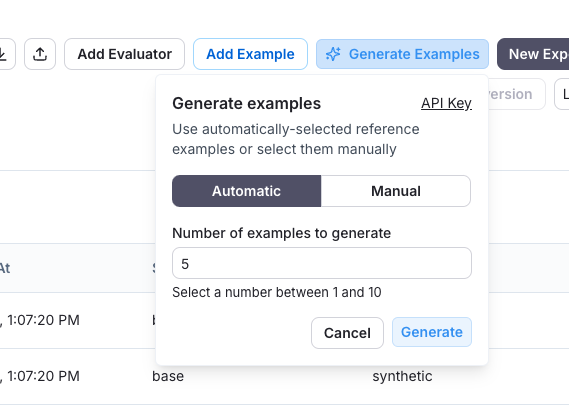
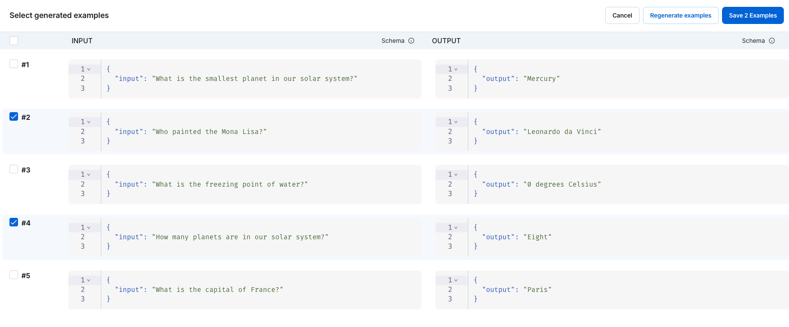
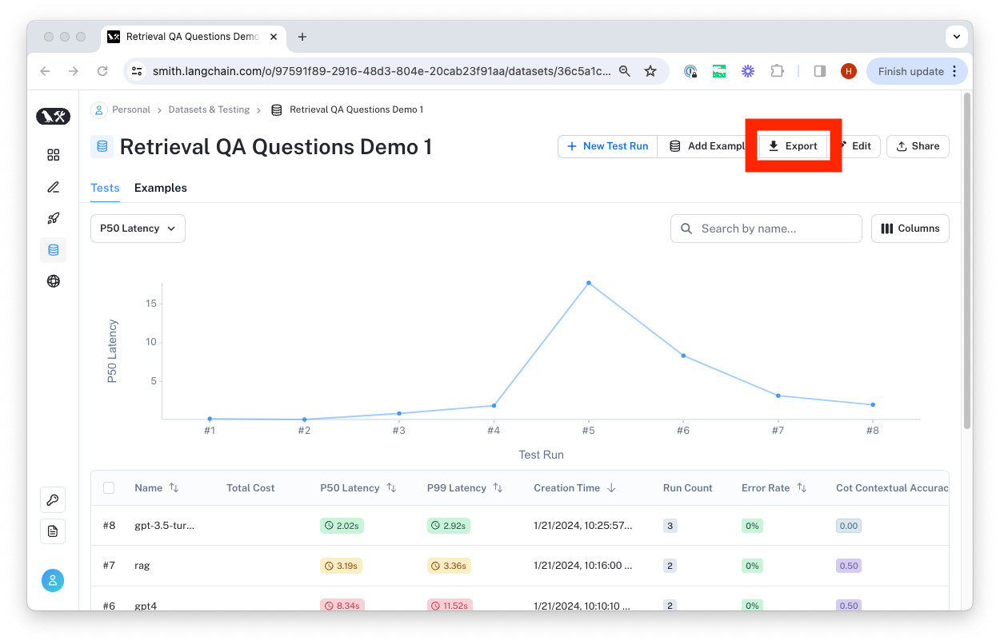
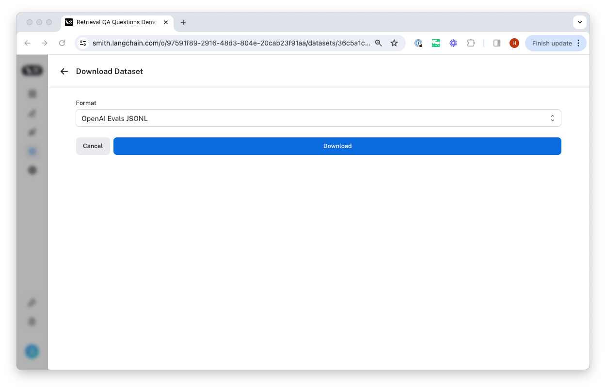
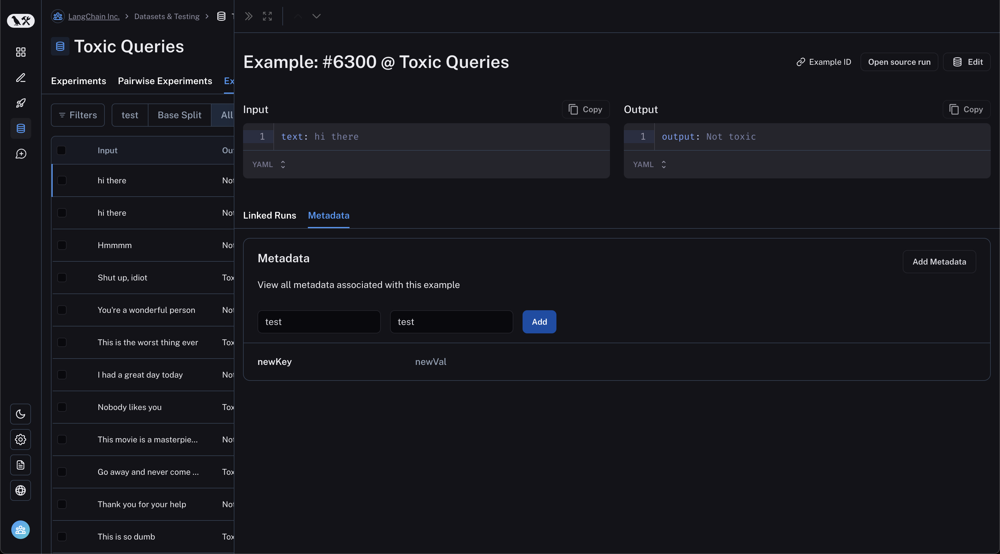

# Manage datasets in the application

:::tip Recommended Reading
Before diving into this content, it might be helpful to read the following:

- [Concepts guide on evaluation and datasets](../../concepts#datasets-and-examples)

:::

The easiest way to interact with datasets is directly in the LangSmith app. Here, you can create and edit datasets and examples.

## Set up your dataset

To create a dataset, head to the Datasets & Experiments page in LangSmith, and click `+ Dataset`. You'll have 2 options for
getting started:

### Option 1: Create from CSV

Select a name and description for the dataset, and then confirm that the inferred input and output columns are correct.

### Option 2: Create empty Dataset

#### Set up a schema

LangSmith datasets store arbitrary JSON objects. We recommend (but do not require) that you define a schema for your dataset.
Dataset schemas are defined with standard [JSON schema](https://json-schema.org/), with the addition of a few [prebuilt types](/reference/data_formats/dataset_json_types)
that make it easier to type common primitives like messages and tools.

Certain fields in your schema have a `+ Transformations` option.
Transformations are preprocessing steps that, if enabled, update your examples when you add them to the dataset.
For example the `convert to OpenAI messages` transformation will convert message-like objects, like LangChain messages, to OpenAI message format.

For the full list of available transformations, see [our reference](/reference/data_formats/dataset_transformations).

:::note
If you plan to collect production traces in your dataset from LangChain
[ChatModels](https://python.langchain.com/docs/concepts/chat_models/)
or from OpenAI calls using the [LangSmith OpenAI wrapper](/observability/how_to_guides/tracing/annotate_code#wrap-the-openai-client), we offer a prebuilt schema and transformation that stores examples in a format that is easy to use downstream. You can also customize the template settings to match your use case.

Please see the [dataset transformations reference](/reference/data_formats/dataset_transformations) for more information.
:::

## Add runs to your dataset in the UI

There are a few ways to add examples to your dataset in UI.

### Add runs from the tracing project UI

A common pattern for constructing datasets is to simply use the application and convert interesting traces into dataset examples. To do this, we first filter
through our tracing projects to find the runs we want to add to the dataset. Then we add the inputs, outputs, and metadata from these runs to the dataset.

:::tip
An extremely powerful technique to build datasets is to drill-down into the most interesting traces, such as traces that were tagged with poor user feedback, and add them to a dataset.
For tips on how to filter traces, see the [filtering traces](../../../observability/how_to_guides/monitoring/filter_traces_in_application) guide.
:::

There are two ways to add data from tracing projects to datasets.

The first way is to multi-select runs from the runs table:

The second is to navigate to the run details page and click `Add to -> Dataset` on the top right corner:

When you select the proper dataset from the run details page (this one using transformations to optimize for collecting LLM runs),
a modal will pop up letting you know if any transformations were applied / if schema validation failed. You can then optionally edit
the run before adding it to the dataset.

### Automatically add runs to a dataset

You can use [run rules](../../../observability/how_to_guides/monitoring/rules) to automatically add traces to a dataset based on certain conditions. For example, you could add all traces that have a certain tag to a dataset.

### Add runs from an annotation queue

Annotation queues are configured optionally with a default dataset, though they allow you to add runs to any dataset
by simply pressing the dataset switcher on the bottom of the screen. Once you select the right dataset, you click `Add to Dataset`
or hit the hot key `D` to add the run to it.

Any modifications you make to the run in your annotation queue will carry over to
the dataset, and all metadata associated with the run will also be copied.

Note you can also set up rules to add runs that meet criteria to an annotation queue, and then follow the guide below for adding from annotation queues.

### Add runs directly via the Datasets UI

Go to the Datasets & Experiments UI, click the `Examples` tab, and `+ Example`. This will let you define examples in JSON inline.

### Add synthetic examples created by an LLM via the Datasets UI

If you have a schema defined on your dataset, when you click `+ Example` you'll see an option to `Generate examples`. This will use an LLM to create synthetic examples.

You have to do the following:

1. **Select few-shot examples**: Choose a set of examples to guide the LLM's generation. You can manually select these examples from your dataset or use the automatic selection option.
2. **Specify the number of examples**: Enter the number of synthetic examples you want to generate.
3. **Configure API Key**: Ensure your OpenAI API key is entered at the "API Key" link.
   

After clicking "Generate," the examples will appear on the page. You can choose which examples to add to your dataset, with the option to edit them before finalizing.
Each example will be validated against your specified dataset schema and tagged as "synthetic" in the source metadata.

## Export a dataset

You can export your LangSmith dataset to CSV or OpenAI evals format directly from the web application.

To do so, click "Export Dataset" from the homepage.
To do so, select a dataset, click on "Examples", and then click the "Export Dataset" button at the top of the examples table.

This will open a modal where you can select the format you want to export to.

## Create and manage dataset splits

Dataset splits are divisions of your dataset that you can use to segment your data. For example, it is common
in machine learning workflows to split datasets into training, validation, and test sets. This can be useful
to prevent overfitting - where a model performs well on the training data but poorly on unseen data. In evaluation
workflows, it can be useful to do this when you have a dataset with multiple categories that you may want to evaluate
separately; or if you are testing a new use case that you may want to include in your dataset in the future, but want
to keep separate for now. Note that the same effect can be achieved manually via metadata - but we expect splits
to be used for higher level organization of your dataset to split it into separate groups for evaluation, whereas
metadata would be used more for storing information on your examples like tags and information about its origin.

In machine learning, it is best practice to keep your splits separate (each example belongs to exactly one split).
However, we allow you to select multiple splits for the same example in LangSmith because it can make sense for
some evaluation workflows - for example, if an example falls into multiple categories on which you may want to
evaluate your application.

In order to create and manage splits in the app, you can select some examples in your dataset and click "Add to Split". From the resulting popup menu,
you can select and unselect splits for the selected examples, or create a new split.

## Edit example metadata

You can add metadata to your examples by clicking on an example and then clicking on the "Metadata" tab in the side pane.
From this page, you can update/delete existing metadata, or add new metadata. You may use this to store information about
your examples, such as tags or version info, which you can [then filter by when you call `list_examples` in the SDK](./manage_datasets_programmatically#list-examples-by-metadata).

## Filter examples

You can filter examples by metadata key/value or full-text search. To filter examples, click "Filter" in the top left of the table:

Next, click "Add filter" and select "Full Text" or "Metadata" from the resulting dropdown. You may add multiple filters, and only examples that satisfy all of the
filters will be displayed in the table.

