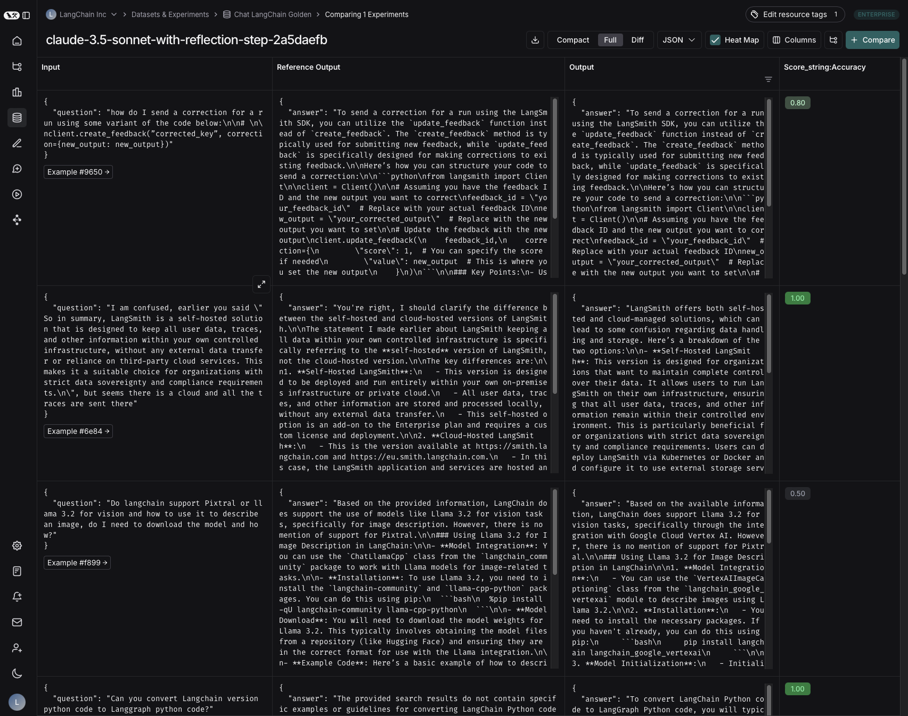

# How to download experiment results as a CSV

LangSmith lets you download experiment results as a CSV file, making it easy to analyze and share your results.

## Download experiment results as a CSV

To download your experiment results as a CSV, click the download icon at the top of the experiment view. The icon is directly to the left of the ["Compact" toggle](./compare_experiment_results#adjust-the-table-display).

