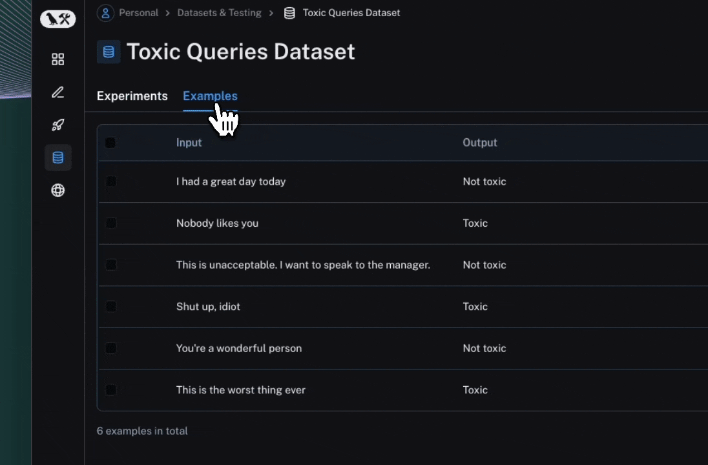

import {
  CodeTabs,
  python,
  typescript,
} from "@site/src/components/InstructionsWithCode";

# How to run an evaluation

:::info Key concepts

[Evaluations](../concepts#applying-evaluations) | [Evaluators](../concepts#evaluators) | [Datasets](../concepts#datasets)

:::

In this guide we'll go over how to evaluate an application using the [evaluate()](https://langsmith-docs-git-bagatur-rfcbuiltinsdkref-langchain.vercel.app/reference/python/evaluation/langsmith.evaluation._runner.evaluate) method in the LangSmith SDK.

:::tip

For larger evaluation jobs in Python we recommend using [aevaluate()](https://langsmith-docs-git-bagatur-rfcbuiltinsdkref-langchain.vercel.app/reference/python/evaluation/langsmith.evaluation._arunner.aevaluate), the asynchronous version of `evaluate()`.
It is still worthwhile to read this guide first, as the two have nearly identical interfaces,
and then read the how-to guide on [running an evaluation asynchronously](./async).

:::

## Define an application

First we need an application to evaluate. Let's create a simple toxicity classifier for this example.

<CodeTabs
  groupId="client-language"
  tabs={[
    python`
      from langsmith import traceable, wrappers
      from openai import OpenAI
      
      # Optionally wrap the OpenAI client to trace all model calls.
      oai_client = wrappers.wrap_openai(OpenAI())
      
      # Optionally add the 'traceable' decorator to trace the inputs/outputs of this function.
      @traceable
      def toxicity_classifier(inputs: dict) -> str:
          instructions = (
            "Please review the user query below and determine if it contains any form of toxic behavior, "
            "such as insults, threats, or highly negative comments. Respond with 'Toxic' if it does "
            "and 'Not toxic' if it doesn't."
          )
          messages = [
              {"role": "system", "content": instructions},
              {"role": "user", "content": inputs["text"]},
          ]
          result = oai_client.chat.completions.create(
              messages=messages, model="gpt-4o-mini", temperature=0
          )
          return result.choices[0].message.content
      `,
    typescript`
      import { OpenAI } from "openai";
      import { wrapOpenAI } from "langsmith/wrappers";
      import { traceable } from "langsmith/traceable";
      
      # Optionally wrap the OpenAI client to trace all model calls.
      const oaiClient = wrapOpenAI(new OpenAI());
      
      # Optionally add the 'traceable' wrapper to trace the inputs/outputs of this function.
      const toxicityClassifier = traceable(
        async (text: string) => {
          const result = await oaiClient.chat.completions.create({
            messages: [
              { 
                role: "system",
                content: "Please review the user query below and determine if it contains any form of toxic behavior, such as insults, threats, or highly negative comments. Respond with 'Toxic' if it does, and 'Not toxic' if it doesn't.",
              },
              { role: "user", content: text },
            ],
            model: "gpt-4o-mini",
            temperature: 0,
          });
          
          return result.choices[0].message.content;
        },
        { name: "toxicityClassifier" }
      );`,
  ]}
/>

We've optionally enabled tracing to capture the inputs and outputs of each step in the pipeline.
To understand how to annotate your code for tracing, please refer to [this guide](../../../observability/how_to_guides/tracing/annotate_code).

## Create or select a dataset

We need a [Dataset](../concepts#datasets) to evaluate our application on. Our dataset will contain labeled [examples](../concepts#examples) of toxic and non-toxic text.

<CodeTabs
  groupId="client-language"
  tabs={[
    python`
      from langsmith import Client
      
      ls_client = Client()
      
      labeled_texts = [
          ("Shut up, idiot", "Toxic"),
          ("You're a wonderful person", "Not toxic"),
          ("This is the worst thing ever", "Toxic"),
          ("I had a great day today", "Not toxic"),
          ("Nobody likes you", "Toxic"),
          ("This is unacceptable. I want to speak to the manager.", "Not toxic"),
      ]
      
      dataset_name = "Toxic Queries"
      dataset = ls_client.create_dataset(dataset_name=dataset_name)
      inputs, outputs = zip(
          *[({"text": text}, {"label": label}) for text, label in labeled_texts]
      )
      ls_client.create_examples(inputs=inputs, outputs=outputs, dataset_id=dataset.id)
    `,
    typescript`
      import { Client } from "langsmith";
      
      const langsmith = new Client();
      
      // create a dataset
      const labeledTexts = [
        ["Shut up, idiot", "Toxic"],
        ["You're a wonderful person", "Not toxic"],
        ["This is the worst thing ever", "Toxic"],
        ["I had a great day today", "Not toxic"],
        ["Nobody likes you", "Toxic"],
        ["This is unacceptable. I want to speak to the manager.", "Not toxic"],
      ];
      
      const [inputs, outputs] = labeledTexts.reduce<
        [Array<{ input: string }>, Array<{ outputs: string }>]
      >(
        ([inputs, outputs], item) => [
          [...inputs, { input: item[0] }],
          [...outputs, { outputs: item[1] }],
        ],
        [[], []]
      );
      
      const datasetName = "Toxic Queries";
      const toxicDataset = await langsmith.createDataset(datasetName);
      await langsmith.createExamples({ inputs, outputs, datasetId: toxicDataset.id });
    `,
  ]}
/>

See [here](.#dataset-management) for more on dataset management.

## Define an evaluator

[Evaluators](../concepts#evaluators) are functions for scoring your application's outputs. They take in the example inputs, actual outputs, and, when present, the reference outputs.
Since we have labels for this task, our evaluator can directly check if the actual outputs match the reference outputs.

<CodeTabs
  groupId="client-language"
  tabs={[
    python({ caption: "Requires `langsmith>=0.2.0`" })`
      def correct(inputs: dict, outputs: dict, reference_outputs: dict) -> bool:
          return outputs["output"] == reference_outputs["label"]
    `,
    typescript`
      import type { EvaluationResult } from "langsmith/evaluation";
      import type { Run, Example } from "langsmith/schemas";
      
      function correct(rootRun: Run, example: Example): EvaluationResult {
        const score = rootRun.outputs?.output === example.outputs?.outputs;
        return { key: "correct", score };
      }
    `,
  ]}
/>

See [here](.#define-an-evaluator) for more on how to define evaluators.

## Run the evaluation

We'll use the [evaluate()](https://langsmith-docs-git-bagatur-rfcbuiltinsdkref-langchain.vercel.app/reference/python/evaluation/langsmith.evaluation._runner.evaluate) / [aevaluate()](https://langsmith-docs-git-bagatur-rfcbuiltinsdkref-langchain.vercel.app/reference/python/evaluation/langsmith.evaluation._arunner.aevaluate) methods to run the evaluation.

The key arguments are:

- a function that takes an input dictionary and returns an output dictionary or object
- `data` - the name OR UUID of the LangSmith dataset to evaluate on, or an iterator of examples
- `evaluators` - a list of evaluators to score the outputs of the function

<CodeTabs
  groupId="client-language"
  tabs={[
    python({ caption: "Requires `langsmith>=0.2.0`" })`
      from langsmith import evaluate
      
      results = evaluate(
          toxicity_classifier,
          data=dataset_name,
          evaluators=[correct],
          experiment_prefix="gpt-4o-mini, baseline",  # optional, experiment name prefix
          description="Testing the baseline system.",  # optional, experiment description
      )
    `,
    typescript`
      import { evaluate } from "langsmith/evaluation";
      
      await evaluate((inputs) => toxicityClassifier(inputs["input"]), {
        data: datasetName,
        evaluators: [correct],
        experimentPrefix: "gpt-4o-mini, baseline",  // optional, experiment name prefix
      });
    `,
  ]}
/>

See [here](.#run-an-evaluation) for other ways to kick off evaluations and [here](.#configure-an-evaluation-job) for how to configure evaluation jobs.

## Explore the results

Each invocation of `evaluate()` creates an [Experiment](../concepts#experiments) which can be viewed in the LangSmith UI or queried via the SDK.
Evaluation scores are stored against each actual output as feedback.

_If you've annotated your code for tracing, you can open the trace of each row in a side panel view._

## Reference code

Click to see a consolidated code snippet

<CodeTabs
  groupId="client-language"
  tabs={[
    python({caption: "Requires `langsmith>=0.2.0`"})`
      from langsmith import Client, evaluate, traceable, wrappers
      from openai import OpenAI
      
      # Step 1. Define an application
      oai_client = wrappers.wrap_openai(OpenAI())
      
      @traceable
      def toxicity_classifier(inputs: dict) -> str:
          system = (
            "Please review the user query below and determine if it contains any form of toxic behavior, "
            "such as insults, threats, or highly negative comments. Respond with 'Toxic' if it does "
            "and 'Not toxic' if it doesn't."
          )
          messages = [
              {"role": "system", "content": system},
              {"role": "user", "content": inputs["text"]},
          ]
          result = oai_client.chat.completions.create(
              messages=messages, model="gpt-4o-mini", temperature=0
          )
          return result.choices[0].message.content
      
      # Step 2. Create a dataset
      ls_client = Client()
      
      labeled_texts = [
          ("Shut up, idiot", "Toxic"),
          ("You're a wonderful person", "Not toxic"),
          ("This is the worst thing ever", "Toxic"),
          ("I had a great day today", "Not toxic"),
          ("Nobody likes you", "Toxic"),
          ("This is unacceptable. I want to speak to the manager.", "Not toxic"),
      ]
      
      dataset_name = "Toxic Queries"
      dataset = ls_client.create_dataset(dataset_name=dataset_name)
      inputs, outputs = zip(
          *[({"text": text}, {"label": label}) for text, label in labeled_texts]
      )
      ls_client.create_examples(inputs=inputs, outputs=outputs, dataset_id=dataset.id)

      # Step 3. Define an evaluator
      def correct(inputs: dict, outputs: dict, reference_outputs: dict) -> bool:
          return outputs["output"] == reference_outputs["label"]

      # Step 4. Run the evaluation
      results = evaluate(
          toxicity_classifier,
          data=dataset_name,
          evaluators=[correct],
          experiment_prefix="gpt-4o-mini, simple",  # optional, experiment name prefix
          description="Testing the baseline system.",  # optional, experiment description
      )
      `,
    typescript`
      import { OpenAI } from "openai";
      import { Client } from "langsmith";
      import { evaluate, EvaluationResult } from "langsmith/evaluation";
      import type { Run, Example } from "langsmith/schemas";
      import { traceable } from "langsmith/traceable";
      import { wrapOpenAI } from "langsmith/wrappers";

      const oaiClient = wrapOpenAI(new OpenAI());

      const toxicityClassifier = traceable(
        async (text: string) => {
          const result = await oaiClient.chat.completions.create({
            messages: [
              {
                role: "system",
                content: "Please review the user query below and determine if it contains any form of toxic behavior, such as insults, threats, or highly negative comments. Respond with 'Toxic' if it does, and 'Not toxic' if it doesn't.",
              },
              { role: "user", content: text },
            ],
            model: "gpt-4o-mini",
            temperature: 0,
          });

          return result.choices[0].message.content;
        },
        { name: "toxicityClassifier" }
      );

      const langsmith = new Client();

      // create a dataset
      const labeledTexts = [
        ["Shut up, idiot", "Toxic"],
        ["You're a wonderful person", "Not toxic"],
        ["This is the worst thing ever", "Toxic"],
        ["I had a great day today", "Not toxic"],
        ["Nobody likes you", "Toxic"],
        ["This is unacceptable. I want to speak to the manager.", "Not toxic"],
      ];

      const [inputs, outputs] = labeledTexts.reduce<
        [Array<{ input: string }>, Array<{ outputs: string }>]
      >(
        ([inputs, outputs], item) => [
          [...inputs, { input: item[0] }],
          [...outputs, { outputs: item[1] }],
        ],
        [[], []]
      );

      const datasetName = "Toxic Queries";
      const toxicDataset = await langsmith.createDataset(datasetName);
      await langsmith.createExamples({ inputs, outputs, datasetId: toxicDataset.id });

      // Row-level evaluator
      function correct(rootRun: Run, example: Example): EvaluationResult {
        const score = rootRun.outputs?.output === example.outputs?.outputs;
        return { key: "correct", score };
      }

      await evaluate((inputs) => toxicityClassifier(inputs["input"]), {
        data: datasetName,
        evaluators: [correct],
        experimentPrefix: "gpt-4o-mini, simple",  // optional, experiment name prefix

      });
      `,

]}
/>

## Related

- [Run an evaluation asynchronously](./async)
- [Run an evaluation via the REST API](./run_evals_api_only)
- [Run an evaluation from the prompt playground](./run_evaluation_from_prompt_playground)
