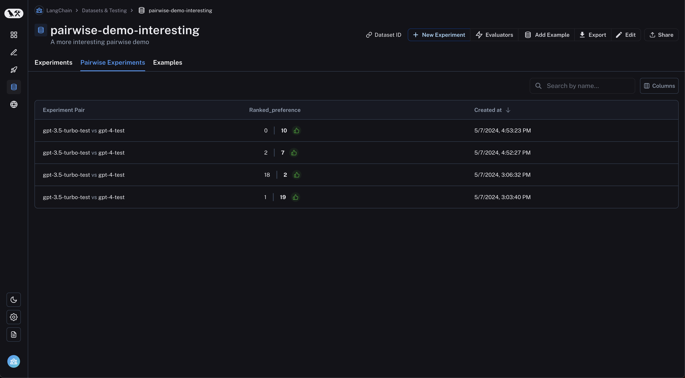
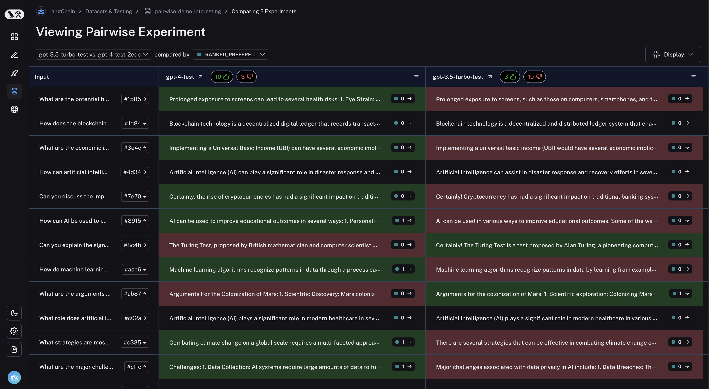
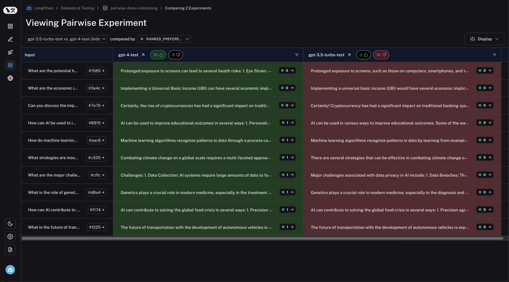

import {
  CodeTabs,
  python,
  typescript,
} from "@site/src/components/InstructionsWithCode";

# How to run pairwise evaluations

:::info Key concepts

- [Pairwise evaluations](../concepts#pairwise)

:::

LangSmith supports evaluating **existing** experiments in a comparative manner.
This allows you to score the outputs from multiple experiments against each other, rather than being confined to evaluating outputs one at a time.
Think [LMSYS Chatbot Arena](https://chat.lmsys.org/) - this is the same concept!
To do this, use the [evaluate()](https://langsmith-docs-git-bagatur-rfcbuiltinsdkref-langchain.vercel.app/reference/python/evaluation/langsmith.evaluation._runner.evaluate) function with two existing experiments.

If you haven't already created experiments to compare, check out our [quick start](../) or our [how-to guide](./evaluate_llm_application) to get started with evaluations.

## `evaluate()` comparative args

:::info
This guide requires `langsmith` Python version `>=0.2.0` or JS version `>=0.2.9`.
:::

At its simplest, `evaluate` / `aevaluate` function takes the following arguments:

| Argument     | Description                                                                                                                        |
| ------------ | ---------------------------------------------------------------------------------------------------------------------------------- |
| `target`     | A list of the two **existing experiments** you would like to evaluate against each other. These can be uuids or experiment names.  |
| `evaluators` | A list of the pairwise evaluators that you would like to attach to this evaluation. See the section below for how to define these. |

Along with these, you can also pass in the following optional args:

| Argument                                 | Description                                                                                                                                                                                                                                                                                                                                                                    |
| ---------------------------------------- | ------------------------------------------------------------------------------------------------------------------------------------------------------------------------------------------------------------------------------------------------------------------------------------------------------------------------------------------------------------------------------ |
| `randomize_order` / `randomizeOrder`     | An optional boolean indicating whether the order of the outputs should be randomized for each evaluation. This is a strategy for minimizing positional bias in your prompt: often, the LLM will be biased towards one of the responses based on the order. This should mainly be addressed via prompt engineering, but this is another optional mitigation. Defaults to False. |
| `experiment_prefix` / `experimentPrefix` | A prefix to be attached to the beginning of the pairwise experiment name. Defaults to None.                                                                                                                                                                                                                                                                                    |
| `description`                            | A description of the pairwise experiment. Defaults to None.                                                                                                                                                                                                                                                                                                                    |
| `max_concurrency` / `maxConcurrency`     | The maximum number of concurrent evaluations to run. Defaults to 5.                                                                                                                                                                                                                                                                                                            |
| `client`                                 | The LangSmith client to use. Defaults to None.                                                                                                                                                                                                                                                                                                                                 |
| `metadata`                               | Metadata to attach to your pairwise experiment. Defaults to None.                                                                                                                                                                                                                                                                                                              |
| `load_nested` / `loadNested`             | Whether to load all child runs for the experiment. When False, only the root trace will be passed to your evaluator. Defaults to False.                                                                                                                                                                                                                                        |

## Define a pairwise evaluator

Pairwise evaluators are just functions with an expected signature.

### Evaluator args

Custom evaluator functions must have specific argument names. They can take any subset of the following arguments:

- `inputs: dict`: A dictionary of the inputs corresponding to a single example in a dataset.
- `outputs: list[dict]`: A two-item list of the dict outputs produced by each experiment on the given inputs.
- `reference_outputs` / `referenceOutputs: dict`: A dictionary of the reference outputs associated with the example, if available.
- `runs: list[Run]`: A two-item list of the full [Run](/reference/data_formats/run_data_format) objects generated by the two experiments on the given example. Use this if you need access to intermediate steps or metadata about each run.
- `example: Example`: The full dataset [Example](/reference/data_formats/example_data_format), including the example inputs, outputs (if available), and metdata (if available).

For most use cases you'll only need `inputs`, `outputs`, and `reference_outputs` / `referenceOutputs`. `run` and `example` are useful only if you need some extra trace or example metadata outside of the actual inputs and outputs of the application.

### Evaluator output

Custom evaluators are expected to return one of the following types:

Python and JS/TS

- `dict`: dictionary with keys:
  - `key`, which represents the feedback key that will be logged
  - `scores`, which is a mapping from run ID to score for that run.

Currently Python only

- `list[int | float | bool]`: a two-item list of scores. The list is assumed to have the same order as the `runs` / `outputs` evaluator args. The evaluator function name is used for the feedback key.

Note that you should choose a feedback key that is distinct from standard feedbacks on your run. We recommend prefixing pairwise feedback keys with `pairwise_` or `ranked_`.

## Run a pairwise evaluation

The following example uses [a prompt](https://smith.langchain.com/hub/langchain-ai/pairwise-evaluation-2)
which asks the LLM to decide which is better between two AI assistant responses. It uses structured output to parse the AI's response: 0, 1, or 2.

:::info Optional LangChain Usage

In the Python example below, we are pulling [this structured prompt](https://smith.langchain.com/hub/langchain-ai/pairwise-evaluation-2) from the [LangChain Hub](../../../prompt_engineering/how_to_guides/prompts/langchain_hub) and using it with a LangChain chat model wrapper.

**Usage of LangChain is totally optional.** To illustrate this point, the TypeScript example uses the OpenAI SDK directly.

:::

<CodeTabs
  tabs={[
    python({caption: "Requires `langsmith>=0.2.0`"})`
      from langchain import hub
      from langchain.chat_models import init_chat_model
      from langsmith import evaluate

      # See the prompt: https://smith.langchain.com/hub/langchain-ai/pairwise-evaluation-2
      prompt = hub.pull("langchain-ai/pairwise-evaluation-2")
      model = init_chat_model("gpt-4o")
      chain = prompt | model

      def ranked_preference(inputs: dict, outputs: list[dict]) -> list:
          # Assumes example inputs have a 'question' key and experiment
          # outputs have an 'answer' key.
          response = chain.invoke({
              "question": inputs["question"],
              "answer_a": outputs[0].get("answer", "N/A"),
              "answer_b": outputs[1].get("answer", "N/A"),
          })

          if response["Preference"] == 1:
              scores = [1, 0]
          elif response["Preference"] == 2:
              scores = [0, 1]
          else:
              scores = [0, 0]
          return scores

      evaluate(
          ["experiment-1", "experiment-2"],  # Replace with the names/IDs of your experiments
          evaluators=[ranked_preference],
          randomize_order=True,
          max_concurrency=4,
      )
    `,
    typescript({caption: "Requires `langsmith>=0.2.9`"})`
      import { evaluate} from "langsmith/evaluation";
      import { Run } from "langsmith/schemas";
      import { wrapOpenAI } from "langsmith/wrappers";
      import OpenAI from "openai";
      import { z } from "zod";

      const openai = wrapOpenAI(new OpenAI());

      async function rankedPreference({ inputs, runs }: { inputs: Record<string, any>, runs: Run[] }) {
        const scores: Record<string, number> = {};
        const [runA, runB] = runs;

        if (!runA || !runB) throw new Error("Expected at least two runs");

        const payload = {
          question: inputs.question,
          answer_a: runA?.outputs?.output ?? "N/A",
          answer_b: runB?.outputs?.output ?? "N/A",
        };

        const output = await openai.chat.completions.create({
          model: "gpt-4-turbo",
          messages: [
            {
              role: "system",
              content: [
                "Please act as an impartial judge and evaluate the quality of the responses provided by two AI assistants to the user question displayed below.",
                "You should choose the assistant that follows the user's instructions and answers the user's question better.",
                "Your evaluation should consider factors such as the helpfulness, relevance, accuracy, depth, creativity, and level of detail of their responses.",
                "Begin your evaluation by comparing the two responses and provide a short explanation.",
                "Avoid any position biases and ensure that the order in which the responses were presented does not influence your decision.",
                "Do not allow the length of the responses to influence your evaluation. Do not favor certain names of the assistants. Be as objective as possible.",
              ].join(" "),
            },
            {
              role: "user",
              content: [
                \`[User Question] \${payload.question}\`,
                \`[The Start of Assistant A's Answer] \${payload.answer_a} [The End of Assistant A's Answer]\`,
                \`The Start of Assistant B's Answer] \${payload.answer_b} [The End of Assistant B's Answer]\`,
              ].join("\\n\\n"),
            },
          ],
          tool_choice: {
            type: "function",
            function: { name: "Score" },
          },
          tools: [
            {
              type: "function",
              function: {
                name: "Score",
                description: [
                  \`After providing your explanation, output your final verdict by strictly following this format:\`,
                  \`Output "1" if Assistant A answer is better based upon the factors above.\`,
                  \`Output "2" if Assistant B answer is better based upon the factors above.\`,
                  \`Output "0" if it is a tie.\`,
                ].join(" "),
                parameters: {
                  type: "object",
                  properties: {
                    Preference: {
                      type: "integer",
                      description: "Which assistant answer is preferred?",
                    },
                  },
                },
              },
            },
          ],
        });

        const { Preference } = z
          .object({ Preference: z.number() })
          .parse(
            JSON.parse(output.choices[0].message.tool_calls[0].function.arguments)
          );

        if (Preference === 1) {
          scores[runA.id] = 1;
          scores[runB.id] = 0;
        } else if (Preference === 2) {
          scores[runA.id] = 0;
          scores[runB.id] = 1;
        } else {
          scores[runA.id] = 0;
          scores[runB.id] = 0;
        }

        return { key: "ranked_preference", scores };
      }

      await evaluate(["earnest-name-40", "reflecting-pump-91"], {
        evaluators: [rankedPreference],
      });
    `,

]}
/>

## View pairwise experiments

Navigate to the "Pairwise Experiments" tab from the dataset page:

Click on a pairwise experiment that you would like to inspect, and you will be brought to the Comparison View:

You may filter to runs where the first experiment was better or vice versa by clicking the thumbs up/thumbs down buttons in the table header:

