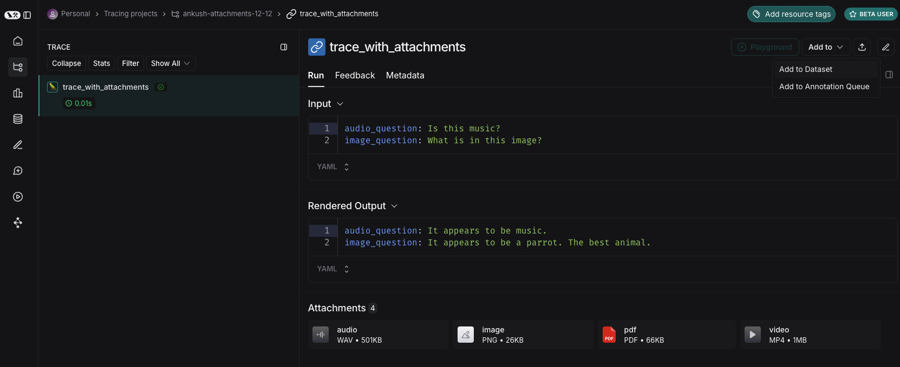
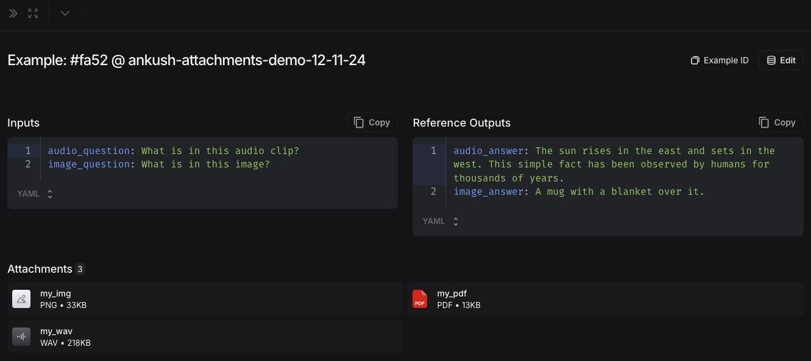

import {
  python,
  CodeTabs,
  PythonBlock,
  TypeScriptBlock,
} from "@site/src/components/InstructionsWithCode";
import Tabs from '@theme/Tabs';
import TabItem from '@theme/TabItem';

# Run an evaluation with multimodal content

LangSmith supports creating dataset examples with file attachments, which you can consume when running evals over that dataset.

Attachments are particularly valuable for LLM applications that work with multimodal inputs or outputs, such as images, audio, or documents. While you can include multimodal data in your examples by base64 encoding it, this approach is inefficient - the encoded data takes up more space than the original binary files, resulting in slower transfers to and from LangSmith. Using attachments instead provides two key benefits:

1. Faster upload and download speeds due to more efficient binary file transfers
2. Enhanced visualization of different file types in the LangSmith UI

<Tabs className="interface-tabs" queryString="mode">
  <TabItem value="sdk" label="SDK">

## Create examples with attachments

To upload examples with attachments using the SDK, use the [create_examples](https://docs.smith.langchain.com/reference/python/client/langsmith.client.Client#langsmith.client.Client.create_examples) / [update_examples](https://docs.smith.langchain.com/reference/python/client/langsmith.client.Client#langsmith.client.Client.update_examples) Python methods or the [uploadExamplesMultipart](https://docs.smith.langchain.com/reference/js/classes/client.Client#uploadexamplesmultipart) / [updateExamplesMultipart](https://docs.smith.langchain.com/reference/js/classes/client.Client#updateexamplesmultipart) TypeScript methods.

<CodeTabs
  tabs={[
    PythonBlock(`import requests
import uuid
from pathlib import Path
from langsmith import Client

# Publicly available test files
pdf_url = "https://www.w3.org/WAI/ER/tests/xhtml/testfiles/resources/pdf/dummy.pdf"
wav_url = "https://openaiassets.blob.core.windows.net/$web/API/docs/audio/alloy.wav"
img_url = "https://www.w3.org/Graphics/PNG/nurbcup2si.png"

# Fetch the files as bytes
pdf_bytes = requests.get(pdf_url).content
wav_bytes = requests.get(wav_url).content
img_bytes = requests.get(img_url).content

# Create the dataset
ls_client = Client()
dataset_name = "attachment-test-dataset"
dataset = ls_client.create_dataset(
    dataset_name=dataset_name,
    description="Test dataset for evals with publicly available attachments",
)

inputs = {
    "audio_question": "What is in this audio clip?",
    "image_question": "What is in this image?",
}

outputs = {
    "audio_answer": "The sun rises in the east and sets in the west. This simple fact has been observed by humans for thousands of years.",
    "image_answer": "A mug with a blanket over it.",
}

# Define an example with attachments
example_id = uuid.uuid4()
example = {
    "id": example_id,
    "inputs": inputs,
    "outputs": outputs,
    "attachments": {
        "my_pdf": {"mime_type": "application/pdf", "data": pdf_bytes},
        "my_wav": {"mime_type": "audio/wav", "data": wav_bytes},
        "my_img": {"mime_type": "image/png", "data": img_bytes},
        # Example of an attachment specified via a local file path:
        # "my_local_img": {"mime_type": "image/png", "data": Path(__file__).parent / "my_local_img.png"},
    },
}

# Create the example
ls_client.create_examples(
    dataset_id=dataset.id, 
    examples=[example], 
    # Uncomment this flag if you'd like to upload attachments from local files:
    # dangerously_allow_filesystem=True
)
`,
    `Requires \`langsmith>=0.3.13\``
),
    TypeScriptBlock(`import { Client } from "langsmith";
  import { v4 as uuid4 } from "uuid";\n
// Publicly available test files
const pdfUrl = "https://www.w3.org/WAI/ER/tests/xhtml/testfiles/resources/pdf/dummy.pdf";
const wavUrl = "https://openaiassets.blob.core.windows.net/$web/API/docs/audio/alloy.wav";
const pngUrl = "https://www.w3.org/Graphics/PNG/nurbcup2si.png";\n
// Helper function to fetch file as ArrayBuffer
async function fetchArrayBuffer(url: string): Promise<ArrayBuffer> {
const response = await fetch(url);
if (!response.ok) {
    throw new Error(\`Failed to fetch \${url}\: $\{response.statusText\}\`);
}
    return response.arrayBuffer();
}\n
// Fetch files as ArrayBuffer
const pdfArrayBuffer = await fetchArrayBuffer(pdfUrl);
const wavArrayBuffer = await fetchArrayBuffer(wavUrl);
const pngArrayBuffer = await fetchArrayBuffer(pngUrl);\n
// Create the LangSmith client (Ensure LANGSMITH_API_KEY is set in env)
const langsmithClient = new Client();\n
// Create a unique dataset name
const datasetName = "attachment-test-dataset:" + uuid4().substring(0, 8);\n
// Create the dataset
const dataset = await langsmithClient.createDataset(datasetName, {
    description: "Test dataset for evals with publicly available attachments",
});\n
// Define the example with attachments
const exampleId = uuid4();
const example = {
    id: exampleId,
    inputs: {
        audio_question: "What is in this audio clip?",
        image_question: "What is in this image?",
    },
    outputs: {
        audio_answer: "The sun rises in the east and sets in the west. This simple fact has been observed by humans for thousands of years.",
        image_answer: "A mug with a blanket over it.",
    },
attachments: {
my_pdf: {
mimeType: "application/pdf",
data: pdfArrayBuffer
},
my_wav: {
mimeType: "audio/wav",
data: wavArrayBuffer
},
my_img: {
mimeType: "image/png",
data: pngArrayBuffer
},
},
};

// Upload the example with attachments to the dataset
await langsmithClient.uploadExamplesMultipart(dataset.id, [example]);`,
        `Requires version >= 0.2.13\n
    You can use the \`uploadExamplesMultipart\` method to upload examples with attachments.\n
Note that this is a different method from the standard \`createExamples\` method, which currently does not support attachments.
Each attachment requires either a \`Uint8Array\` or an \`ArrayBuffer\` as the data type.\n

- \`Uint8Array\`: Useful for handling binary data directly.
- \`ArrayBuffer\`: Represents fixed-length binary data, which can be converted to \`Uint8Array\` as needed.\n
Note that you cannot directly pass in a file path in the TypeScript SDK, as accessing local files is not supported in all runtime environments.\n
`),
  ]}
  groupId="client-language"
  />

:::info Uploading from filesystem

Along with being passed in as bytes, attachments can be specified as paths to local files.
To do so pass in a path for the attachment `data` value and specify arg `dangerously_allow_filesystem=True`:

```python
client.create_examples(..., dangerously_allow_filesystem=True)
```

:::

## Run evaluations

### Define a target function 

Now that we have a dataset that includes examples with attachments, we can define a target function to run over these examples.
The following example simply uses OpenAI's GPT-4o model to answer questions about an image and an audio clip.

<CodeTabs
  tabs={[
    PythonBlock(`from langsmith.wrappers import wrap_openai\n
import base64
from openai import OpenAI\n
client = wrap_openai(OpenAI())\n
# Define target function that uses attachments
def file_qa(inputs, attachments): # Read the audio bytes from the reader and encode them in base64
    audio_reader = attachments["my_wav"]["reader"]
    audio_b64 = base64.b64encode(audio_reader.read()).decode('utf-8')
    audio_completion = client.chat.completions.create(
        model="gpt-4o-audio-preview",
        messages=[
            {
                "role": "user",
                "content": [
                    {
                        "type": "text",
                        "text": inputs["audio_question"]
                    },
                    {
                        "type": "input_audio",
                        "input_audio": {
                            "data": audio_b64,
                            "format": "wav"
                        }
                    }
                ]
            }
        ]
    )\n
    # Most models support taking in an image URL directly in addition to base64 encoded images
    # You can pipe the image pre-signed URL directly to the model
    image_url = attachments["my_img"]["presigned_url"]
    image_completion = client.chat.completions.create(
        model="gpt-4o-mini",
        messages=[
          {
            "role": "user",
            "content": [
              {"type": "text", "text": inputs["image_question"]},
              {
                "type": "image_url",
                "image_url": {
                  "url": image_url,
                },
              },
            ],
          }
        ],
    )\n
    return {
        "audio_answer": audio_completion.choices[0].message.content,
        "image_answer": image_completion.choices[0].message.content,
    }
`,
`The target function you are evaluating must have two positional arguments in order to consume the attachments associated with the example, the first must be called \`inputs\` and the second must be called \`attachments\`.
- The \`inputs\` argument is a dictionary that contains the input data for the example, excluding the attachments.
- The \`attachments\` argument is a dictionary that maps the attachment name to a dictionary containing a presigned url, mime_type, and a reader of the bytes content of the file. You can use either the presigned url or the reader to get the file contents.
Each value in the attachments dictionary is a dictionary with the following structure:
\`\`\`
{
      "presigned_url": str,
      "mime_type": str,
      "reader": BinaryIO
}
\`\`\`
  `),
    TypeScriptBlock(`import OpenAI from "openai";
import { wrapOpenAI } from "langsmith/wrappers";

const client: any = wrapOpenAI(new OpenAI());

async function fileQA(inputs: Record<string, any>, config?: Record<string, any>) {
const presignedUrl = config?.attachments?.["my_wav"]?.presigned_url;
if (!presignedUrl) {
throw new Error("No presigned URL provided for audio.");
}

const response = await fetch(presignedUrl);
if (!response.ok) {
throw new Error(\`Failed to fetch audio: $\{response.statusText\}\`);
}

const arrayBuffer = await response.arrayBuffer();
const uint8Array = new Uint8Array(arrayBuffer);
const audioB64 = Buffer.from(uint8Array).toString("base64");

const audioCompletion = await client.chat.completions.create({
model: "gpt-4o-audio-preview",
messages: [
{
role: "user",
content: [
{ type: "text", text: inputs["audio_question"] },
{
type: "input_audio",
input_audio: {
data: audioB64,
format: "wav",
},
},
],
},
],
});

const imageUrl = config?.attachments?.["my_img"]?.presigned_url
const imageCompletion = await client.chat.completions.create({
model: "gpt-4o-mini",
messages: [
{
role: "user",
content: [
{ type: "text", text: inputs["image_question"] },
{
type: "image_url",
image_url: {
url: imageUrl,
},
},
],
},
],
});

return {
audio_answer: audioCompletion.choices[0].message.content,
image_answer: imageCompletion.choices[0].message.content,
};
}`,
    `In the TypeScript SDK, the \`config\` argument is used to pass in the attachments to the target function if \`includeAttachments\` is set to \`true\`.\n
The \`config\` will contain \`attachments\` which is an object mapping the attachment name to an object of the form:\n
\`\`\`
{
presigned_url: string,
mime_type: string,
}
\`\`\``
),
]}
groupId="client-language"
/>

### Define custom evaluators

The exact same rules apply as above to determine whether the evaluator should receive attachments.

The evaluator below uses an LLM to judge if the reasoning and the answer are consistent.
To learn more about how to define llm-based evaluators, please see [this guide](./llm_as_judge).

<CodeTabs
  tabs={[
    PythonBlock(`# Assumes you've installed pydantic
from pydantic import BaseModel\n
def valid_image_description(outputs: dict, attachments: dict) -> bool:
    """Use an LLM to judge if the image description and images are consistent."""\n
    instructions = """
    Does the description of the following image make sense?
    Please carefully review the image and the description to determine if the description is valid."""\n
    class Response(BaseModel):
        description_is_valid: bool\n
    image_url = attachments["my_img"]["presigned_url"]
    response = client.beta.chat.completions.parse(
        model="gpt-4o",
        messages=[
            {
                "role": "system",
                "content": instructions
            },
            {
                "role": "user",
                "content": [
                    {"type": "image_url", "image_url": {"url": image_url}},
                    {"type": "text", "text": outputs["image_answer"]}
                ]
            }
        ],
        response_format=Response
    )\n
    return response.choices[0].message.parsed.description_is_valid\n
ls_client.evaluate(
    file_qa,
    data=dataset_name,
    evaluators=[valid_image_description],
)
`),
TypeScriptBlock(`import { zodResponseFormat } from 'openai/helpers/zod';
import { z } from 'zod';
import { evaluate } from "langsmith/evaluation";

const DescriptionResponse = z.object({
description_is_valid: z.boolean(),
});

async function validImageDescription({
outputs,
attachments,
}: {
outputs?: any;
attachments?: any;
}): Promise<{ key: string; score: boolean}> {
const instructions = \`Does the description of the following image make sense?
Please carefully review the image and the description to determine if the description is valid.\`;

    const imageUrl = attachments?.["my_img"]?.presigned_url

    const completion = await client.beta.chat.completions.parse({
        model: "gpt-4o",
        messages: [
            {
                role: "system",
                content: instructions,
            },
            {
                role: "user",
                content: [
                    { type: "image_url", image_url: { url: imageUrl } },
                    { type: "text", text: outputs?.image_answer },
                ],
            },
        ],
        response_format: zodResponseFormat(DescriptionResponse, 'imageResponse'),
    });

    const score: boolean = completion.choices[0]?.message?.parsed?.description_is_valid ?? false;
    return { key: "valid_image_description", score };

}

const resp = await evaluate(fileQA, {
data: datasetName,
// Need to pass flag to include attachments
includeAttachments: true,
evaluators: [validImageDescription],
client: langsmithClient
});`),
]}
groupId="client-language"
/>

## Update examples with attachments

In the code above, we showed how to add examples with attachments to a dataset.
It is also possible to update these same examples using the SDK.

As with existing examples, datasets are versioned when you update them with attachments. Therefore, you can navigate to the dataset version history to see the changes made to each example.
To learn more, please see [this guide](./manage_datasets_in_application).

When updating an example with attachments, you can update attachments in a few different ways:

- Pass in new attachments
- Rename existing attachments
- Delete existing attachments

Note that:
- Any existing attachments that are not explicitly renamed or retained **will be deleted**.
- An error will be raised if you pass in a non-existent attachment name to `retain` or `rename`.
- New attachments take precedence over existing attachments in case the same attachment name appears in the `attachments` and `attachment_operations` fields.

<CodeTabs
  tabs={[
    PythonBlock(`example_update = {
    "id": example_id,
    "attachments": {
        # These are net new attachments
        "my_new_file": ("text/plain", b"foo bar"),
    },
    "inputs": inputs,
    "outputs": outputs,
    # Any attachments not in rename/retain will be deleted.
    # In this case, that would be "my_img" if we uploaded it.
    "attachments_operations": {
        # Retained attachments will stay exactly the same
        "retain": ["my_pdf"],
        # Renaming attachments preserves the original data
        "rename": {
            "my_wav": "my_new_wav",
        }
    },
}

ls_client.update_examples(dataset_id=dataset.id, updates=[example_update])
`),
    TypeScriptBlock(`import { ExampleUpdateWithAttachments } from "langsmith/schemas";

const exampleUpdate: ExampleUpdateWithAttachments = {
id: exampleId,
attachments: {
// These are net new attachments
"my_new_file": {
mimeType: "text/plain",
data: Buffer.from("foo bar")
},
},
attachments_operations: {
// Retained attachments will stay exactly the same
retain: ["my_img"],
// Renaming attachments preserves the original data
rename: {
"my_wav": "my_new_wav",
},
// Any attachments not in rename/retain will be deleted
// In this case, that would be "my_pdf"
},
};

await langsmithClient.updateExamplesMultipart(
dataset.id,
[exampleUpdate],
);
`),
]}
groupId="client-language"
/>

  </TabItem>
  <TabItem value="ui" label="UI">
## Create examples with attachments

You can add examples with attachments to a dataset in a few different ways.

### From existing runs

When adding runs to a LangSmith dataset, attachments can be selectively propagated from the source run to the destination example.
To learn more, please see [this guide](./manage_datasets_in_application#add-runs-from-the-tracing-project-ui).



### From scratch

You can upload examples with attachments directly from the LangSmith UI. Click the `+ Example` button in the `Examples` tab of the dataset UI.
Then upload attachments using the "Upload Files" button:


Once uploaded, you can view examples with attachments in the LangSmith UI. Each attachment will be rendered with a preview for easy inspection.


## Create a multimodal prompt
The LangSmith UI allows you to include attachments in your prompts when evaluating multimodal models:

First, click the file icon in the message where you want to add multimodal content.
Next, add a template variable for the attachment(s) you want to include for each example.
- For a single attachment type: Use the suggested variable name. Note: all examples must have an attachment with this name.
- For multiple attachments or if your attachments have varying names from one example to another: Use the `All attachments` variable to include all available attachments for each example.


## Define custom evaluators

:::note Multimodal evaluators
The LangSmith playground does not currently support pulling multimodal content into evaluators. If this would be helpful for your use case, please let us know in the [LangChain's community Slack](https://langchaincommunity.slack.com/) (sign up [here](https://www.langchain.com/join-community) if you're not already a member)!
:::

You can evaluate a model's text output by adding an evaluator that takes in the example's inputs and outputs.
Even without multimodal support in your evaluators, you can still run text-only evaluations. For example:

- OCR → text correction: Use a vision model to extract text from a document, then evaluate the accuracy of the extracted output.
- Speech-to-text → transcription quality: Use a voice model to transcribe audio to text, then evaluate the transcription against your reference.

For more information on defining custom evaluators, see the [LLM as Judge](../how_to_guides/llm_as_judge) guide.

## Update examples with attachments

:::note Attachment Size Limit
Attachments are limited to 20MB in size in the UI.
:::

When editing an example in the UI, you can:
- Upload new attachments
- Rename and delete attachments  
- Reset attachments to their previous state using the quick reset button

Changes are not saved until you click submit.


  </TabItem>
</Tabs>
