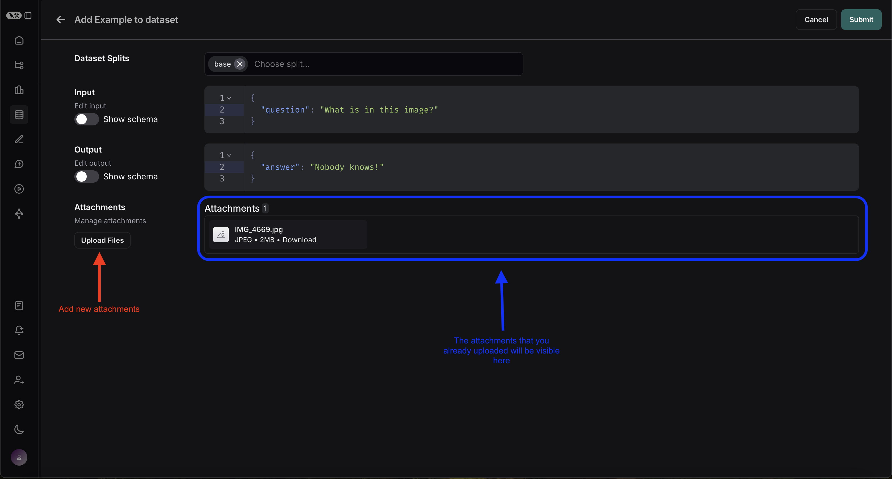

import {
  python,
  CodeTabs,
  PythonBlock,
  TypeScriptBlock,
} from "@site/src/components/InstructionsWithCode";

# Evaluate applications with large file inputs

In addition to supporting [file attachments with traces](../../../observability/how_to_guides/tracing/upload_files_with_traces), LangSmith supports arbitrary file attachments with your examples, which you can consume when you run experiments.

This is particularly useful when working with LLM applications that require multimodal inputs or outputs.

:::tip Using separate attachments outside of inputs/outputs
When dealing with large files, it's recommended to upload them as attachments rather than embedding them in your JSON inputs or outputs via base64 encoding.

Attachments are more efficient because base64 encoding increases data size, leading to slower uploads and downloads.
This also avoid potential performance bottlenecks with parsing large JSON payloads.

Finally, attachments are more user-friendly in the LangSmith UI, as they are rendered as files with previews, rather than as base64-encoded strings.
:::

## Add examples with attachments to a LangSmith dataset

### SDK

To upload examples with attachments using the SDK, you need to use the `upload_examples_multipart` method of the LangSmith client.
This method allows you to pass in a list of examples with attachments.

:::note Minimum SDK Versions
The following features are available in the following SDK versions:

- Python SDK: >=0.2.3
- JS/TS SDK: >=0.2.13
  :::

<CodeTabs
  tabs={[
    PythonBlock(`import requests
import uuid\n
from langsmith import Client
from langsmith.schemas import ExampleUploadWithAttachments, Attachment\n
# Publicly available test files\n
pdf_url = "https://www.w3.org/WAI/ER/tests/xhtml/testfiles/resources/pdf/dummy.pdf"
wav_url = "https://openaiassets.blob.core.windows.net/$web/API/docs/audio/alloy.wav"
png_url = "https://www.w3.org/Graphics/PNG/nurbcup2si.png"\n
# Fetch the files as bytes\n
pdf_bytes = requests.get(pdf_url).content
wav_bytes = requests.get(wav_url).content
png_bytes = requests.get(png_url).content\n
# Define the LANGCHAIN_API_KEY environment variable with your API key\n
langsmith_client = Client()\n
dataset_name = "attachment-test-dataset:" + str(uuid.uuid4())[0:8]\n
dataset = langsmith_client.create_dataset(
    dataset_name=dataset_name,
    description="Test dataset for evals with publicly available attachments",
)\n
# Create example id\n
example_id = uuid.uuid4()\n
# Define the example with attachments\n
example = ExampleUploadWithAttachments(
    id=example_id,
    inputs={
        "audio_question": "What is in this audio clip?",
        "image_question": "What is in this image?"
    },
    outputs={
        "audio_answer": "The sun rises in the east and sets in the west. This simple fact has been observed by humans for thousands of years.",
        "image_answer": "A mug with a blanket over it."
    },
    attachments={
        "my_pdf": ("application/pdf", pdf_bytes),
        "my_wav": ("audio/wav", wav_bytes),
        "my_img": Attachment(mime_type="image/png", data=png_bytes)
    },
)\n
# Upload the examples with attachments
langsmith_client.upload_examples_multipart(dataset_id=dataset.id, uploads=[example])
`,
        `In the Python SDK, you can use the \`upload_examples_multipart\` method to upload examples with attachments.\n
Note that this is a different method from the standard \`create_examples\` method, which currently not support attachments.\n
Utilize the \`ExampleUploadWithAttachments\` type to define examples with attachments.\n
Each \`Attachment\` requires:
- \`mime_type\` (str): The MIME type of the file (e.g., \`"image/png"\`).
- \`data\` (bytes): The binary content of the file.\n
  You can also define an attachment with a tuple tuple of the form \`(mime_type, data)\` for convenience.
  `
),
    TypeScriptBlock(`import { Client } from "langsmith";
  import { v4 as uuid4 } from "uuid";\n
// Publicly available test files
const pdfUrl = "https://www.w3.org/WAI/ER/tests/xhtml/testfiles/resources/pdf/dummy.pdf";
const wavUrl = "https://openaiassets.blob.core.windows.net/$web/API/docs/audio/alloy.wav";
const pngUrl = "https://www.w3.org/Graphics/PNG/nurbcup2si.png";\n
// Helper function to fetch file as ArrayBuffer
async function fetchArrayBuffer(url: string): Promise<ArrayBuffer> {
const response = await fetch(url);
if (!response.ok) {
    throw new Error(\`Failed to fetch \${url}\: $\{response.statusText\}\`);
}
    return response.arrayBuffer();
}\n
// Fetch files as ArrayBuffer
const pdfArrayBuffer = await fetchArrayBuffer(pdfUrl);
const wavArrayBuffer = await fetchArrayBuffer(wavUrl);
const pngArrayBuffer = await fetchArrayBuffer(pngUrl);\n
// Create the LangSmith client (Ensure LANGCHAIN_API_KEY is set in env)
const langsmithClient = new Client();\n
// Create a unique dataset name
const datasetName = "attachment-test-dataset:" + uuid4().substring(0, 8);\n
// Create the dataset
const dataset = await langsmithClient.createDataset(datasetName, {
    description: "Test dataset for evals with publicly available attachments",
});\n
// Define the example with attachments
const exampleId = uuid4();
const example = {
    id: exampleId,
    inputs: {
        audio_question: "What is in this audio clip?",
        image_question: "What is in this image?",
    },
    outputs: {
        audio_answer: "The sun rises in the east and sets in the west. This simple fact has been observed by humans for thousands of years.",
        image_answer: "A mug with a blanket over it.",
    },
attachments: {
my_pdf: {
mimeType: "application/pdf",
data: pdfArrayBuffer
},
my_wav: {
mimeType: "audio/wav",
data: wavArrayBuffer
},
my_img: {
mimeType: "image/png",
data: pngArrayBuffer
},
},
};

// Upload the example with attachments to the dataset
await langsmithClient.uploadExamplesMultipart(dataset.id, [example]);`,
        `In the TypeScript SDK, you can use the \`uploadExamplesMultipart\` method to upload examples with attachments.\n
Note that this is a different method from the standard \`createExamples\` method, which currently does not support attachments.
Each attachment requires either a \`Uint8Array\` or an \`ArrayBuffer\` as the data type.\n

- \`Uint8Array\`: Useful for handling binary data directly.
- \`ArrayBuffer\`: Represents fixed-length binary data, which can be converted to \`Uint8Array\` as needed.\n`),
  ]}
  groupId="client-language"
  />

Once you upload examples with attachments, you can view them in the LangSmith UI. Each attachment will be rendered as a file with a preview, making it easy to inspect the contents.

### From existing runs

When adding runs to a LangSmith dataset, attachments can be selectively propagated from the source run to the destination example.
To learn more, please see [this guide](./manage_datasets_in_application#add-runs-from-the-tracing-project-ui).

### From the LangSmith UI

You can also upload examples with attachments directly from the LangSmith UI. You can do so by clicking the `+ Example` button in the `Examples` tab of the dataset UI.
You can then upload the attachments that you want by using the "Upload Files" button:

## Running evaluations with attachments

Once you have a dataset that contains examples with file attachments, you can run evaluations that process these attachments.

### Define a target function with attachments

Now that we have a dataset that includes examples with attachments, we can define a target function to run our LLM application on these examples.

<CodeTabs
  tabs={[
    PythonBlock(`from langsmith.wrappers import wrap_openai\n
import base64
from openai import OpenAI\n
client = wrap_openai(OpenAI())\n
# Define target function that uses attachments\n
def file_qa(inputs, attachments): # Read the audio bytes from the reader and encode them in base64
    audio_reader = attachments["my_wav"]["reader"]
    audio_b64 = base64.b64encode(audio_reader.read()).decode('utf-8')
    audio_completion = client.chat.completions.create(
    model="gpt-4o-audio-preview",
    messages=[
        {
            "role": "user",
            "content": [
                {
                    "type": "text",
                    "text": inputs["audio_question"]
                },
                {
                    "type": "input_audio",
                    "input_audio": {
                        "data": audio_b64,
                        "format": "wav"
                    }
                }
            ]
        }
    ]\n
    # Most models support taking in an image URL directly in addition to base64 encoded images
    # You can pipe the image pre-signed URL directly to the model
    image_url = attachments["my_img"]["presigned_url"]
    image_completion = client.chat.completions.create(
        model="gpt-4o-mini",
        messages=[
          {
            "role": "user",
            "content": [
              {"type": "text", "text": inputs["image_question"]},
              {
                "type": "image_url",
                "image_url": {
                  "url": image_url,
                },
              },
            ],
          }
        ],
    )\n
    return {
        "audio_answer": audio_completion.choices[0].message.content,
        "image_answer": image_completion.choices[0].message.content,
    }
`,
`The target function you are evaluating must have two positional arguments in order to consume the attachments associated with the example, the first must be called \`inputs\` and the second must be called \`attachments\`.
- The \`inputs\` argument is a dictionary that contains the input data for the example, excluding the attachments.
- The \`attachments\` argument is a dictionary that maps the attachment name to a dictionary containing a presigned url and a reader of the bytes content of the file. Either can be used to read the bytes of the file:
Each value in the attachments dictionary is a dictionary with the following structure:
\`\`\`
{
      "presigned_url": str,
      "reader": BinaryIO
}
\`\`\`
  `),
    TypeScriptBlock(`import OpenAI from "openai";
import { wrapOpenAI } from "langsmith/wrappers";

const client: any = wrapOpenAI(new OpenAI());

async function fileQA(inputs: Record<string, any>, config?: Record<string, any>) {
const presignedUrl = config?.attachments?.["my_wav"]?.presigned_url;
if (!presignedUrl) {
throw new Error("No presigned URL provided for audio.");
}

const response = await fetch(presignedUrl);
if (!response.ok) {
throw new Error(\`Failed to fetch audio: $\{response.statusText\}\`);
}

const arrayBuffer = await response.arrayBuffer();
const uint8Array = new Uint8Array(arrayBuffer);
const audioB64 = Buffer.from(uint8Array).toString("base64");

const audioCompletion = await client.chat.completions.create({
model: "gpt-4o-audio-preview",
messages: [
{
role: "user",
content: [
{ type: "text", text: inputs["audio_question"] },
{
type: "input_audio",
input_audio: {
data: audioB64,
format: "wav",
},
},
],
},
],
});

const imageUrl = config?.attachments?.["my_img"]?.presigned_url
const imageCompletion = await client.chat.completions.create({
model: "gpt-4o-mini",
messages: [
{
role: "user",
content: [
{ type: "text", text: inputs["image_question"] },
{
type: "image_url",
image_url: {
url: imageUrl,
},
},
],
},
],
});

return {
audio_answer: audioCompletion.choices[0].message.content,
image_answer: imageCompletion.choices[0].message.content,
};
}`,
    `In the TypeScript SDK, the \`config\` argument is used to pass in the attachments to the target function if \`includeAttachments\` is set to \`true\`.\n
The \`config\` will contain \`attachments\` which is an object mapping the attachment name to an object of the form:
\`\`\`
{
presigned_url: string,
}
\`\`\``
),
]}
groupId="client-language"
/>

### Define custom evaluators with attachments

In addition to using attachments inside of your target function, you can also use them inside of your evaluators as follows.
The exact same rules apply as above to determine whether the evaluator should receive attachments.

<CodeTabs
  tabs={[
    PythonBlock(`# Assumes you've installed pydantic
from pydantic import BaseModel

def valid_image_description(outputs: dict, attachments: dict) -> bool:
"""Use an LLM to judge if the reasoning and the answer are consistent."""

    instructions = """
    Does the description of the following image make sense?
    Please carefully review the image and the description to determine if the description is valid."""

    class Response(BaseModel):
      description_is_valid: bool

    image_url = attachments["my_img"]["presigned_url"]
    response = client.beta.chat.completions.parse(
        model="gpt-4o",
        messages=[
            {
                "role": "system",
                "content": instructions
            },
            {
                "role": "user",
                "content": [
                    {"type": "image_url", "image_url": {"url": image_url}},
                    {"type": "text", "text": outputs["image_answer"]}
                ]
            }
        ],
        response_format=Response
    )

    return response.choices[0].message.parsed.description_is_valid

langsmith_client.evaluate(
file_qa,
data=dataset_name,
evaluators=[valid_image_description],
)
`),
TypeScriptBlock(`import { zodResponseFormat } from 'openai/helpers/zod';
import { z } from 'zod';
import { evaluate } from "langsmith/evaluation";

const DescriptionResponse = z.object({
description_is_valid: z.boolean(),
});

async function validImageDescription({
outputs,
attachments,
}: {
outputs?: any;
attachments?: any;
}): Promise<{ key: string; score: boolean}> {
const instructions = \`Does the description of the following image make sense?
Please carefully review the image and the description to determine if the description is valid.\`;

    const imageUrl = attachments?.["my_img"]?.presigned_url

    const completion = await client.beta.chat.completions.parse({
        model: "gpt-4o",
        messages: [
            {
                role: "system",
                content: instructions,
            },
            {
                role: "user",
                content: [
                    { type: "image_url", image_url: { url: imageUrl } },
                    { type: "text", text: outputs?.image_answer },
                ],
            },
        ],
        response_format: zodResponseFormat(DescriptionResponse, 'imageResponse'),
    });

    const score: boolean = completion.choices[0]?.message?.parsed?.description_is_valid ?? false;
    return { key: "valid_image_description", score };

}

const resp = await evaluate(fileQA, {
data: datasetName,
// Need to pass flag to include attachments
includeAttachments: true,
evaluators: [validImageDescription],
client: langsmithClient
});`),
]}
groupId="client-language"
/>

## Manage datasets with attachments

### Manage programmatically

In the code [above](#add-examples-with-attachments-to-a-langsmith-dataset), we showed how to add examples with attachments to a dataset.
is also possible to update these same examples using the SDK.

As with existing examples, datasets are versioned when you update them with attachments. Therefore, you can navigate to the dataset version history to see the changes made to each example.
To learn more, please see [this guide](./manage_datasets_in_application).

When updating an example with attachments, you can update attachments in a few different ways:

- Pass in new attachments
- Rename existing attachments
- Delete existing attachments

<CodeTabs
  tabs={[
    PythonBlock(`from langsmith.schemas import ExampleUpdateWithAttachments, AttachmentsOperations
    
example_update = ExampleUpdateWithAttachments(
    id=example_id,
    attachments={
        # These are net new attachments
        "my_new_file": ("text/plain", b"foo bar"),
    },
    attachments_operations=AttachmentsOperations(
        # Retained attachments will stay exactly the same
        retain=["my_img"],
        # Renaming attachments preserves the original data
        rename={
            "my_wav": "my_new_wav",
        }
        # Any attachments not in rename/retain will be deleted
        # In this case, that would be "my_pdf"
    ),
)

langsmith_client.update_example_with_attachments(dataset_id=dataset.id, updates=[example_update])
`),
    TypeScriptBlock(`import { ExampleUpdateWithAttachments } from "langsmith/schemas";

const exampleUpdate: ExampleUpdateWithAttachments = {
id: exampleId,
attachments: {
// These are net new attachments
"my_new_file": {
mimeType: "text/plain",
data: Buffer.from("foo bar")
},
},
attachments_operations: {
// Retained attachments will stay exactly the same
retain: ["my_img"],
// Renaming attachments preserves the original data
rename: {
"my_wav": "my_new_wav",
},
// Any attachments not in rename/retain will be deleted
// In this case, that would be "my_pdf"
},
};

await langsmithClient.updateExamplesMultipart(
dataset.id,
[exampleUpdate],
);
`),
]}
groupId="client-language"
/>

:::warning Attachment Operations
Currently, errors are not thrown if you pass the wrong attaachment name to `rename` or `retain`.
New attachments **ALWAYS** take precedence over existing attachments. So if you upload a new attachment
name "foo" and try to retain or rename an existing attachment to "foo", the new attachment will be used instead.

Anything not in `rename` or `retain` will be deleted.
:::

### From the LangSmith UI

:::note Attachment Size Limit
Attachments are limited to 20MB in size in the UI.
:::

When editing an example in the UI, you can upload new attachments, rename and delete attachemnts,
and there is also a quick reset button to restore the attachments to what previously existed on the example.
No changes will be saved until you click submit.

