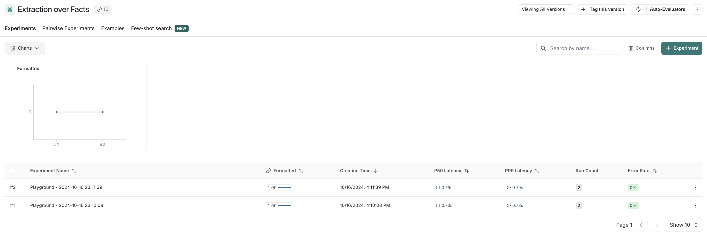

# Bind an evaluator to a dataset in the UI

While you can specify evaluators to grade the results of your experiments programmatically (see [this guide](./evaluate_llm_application) for more information), you can also bind evaluators to a dataset in the UI.
This allows you to configure automatic evaluators that grade your experiment results. We have support for both LLM-based evaluators, and custom python code evaluators.

The process for configuring this is very similar to the process for configuring an [online evaluator](../monitoring/online_evaluations) for traces.

:::note Only affects subsequent experiment runs
When you configure an evaluator for a dataset, it will only affect the experiment runs that are created after the evaluator is configured. It will not affect the evaluation of experiment runs that were created before the evaluator was configured.
:::

1. **Navigate to the dataset details page** by clicking **Datasets and Testing** in the sidebar and selecting the dataset you want to configure the evaluator for.
2. **Click on the `Add Auto-Evaluator` button** to add an evaluator to the dataset. This will open a modal you can use to configure the evaluator.

The next steps vary based on the evaluator type.

## LLM as judge evaluators

1. **Select the LLM as judge type evaluator**
2. **Give your evaluator a name** and **set an inline prompt or load a prompt from the prompt hub** that will be used to evaluate the results of the runs in the experiment.


Importantly, evaluator prompts can only contain the following input variables:

- `input` (required): the input to the target you are evaluating
- `output` (required): the output of the target you are evaluating
- `reference`: the reference output, taken from the dataset

:::note

Automatic evaluators you configure in the application will only work if the `inputs` to your evaluation target, `outputs` from your evaluation target, and `examples` in your dataset are all single-key dictionaries.
LangSmith will automatically extract the values from the dictionaries and pass them to the evaluator.

LangSmith currently doesn't support setting up evaluators in the application that act on multiple keys in the `inputs` or `outputs` or `examples` dictionaries.

:::

You can specify the scoring criteria in the "schema" field. In this example, we are asking the LLM to grade on "correctness" of the output with respect to the reference, with a boolean output of 0 or 1. The name of the field in the schema will be interpreted as the feedback key and the type will be the type of the score.


3. **Save the evaluator** and navigate back to the dataset details page. Each **subsequent** experiment run from the dataset will now be evaluated by the evaluator you configured. Note that in the below image, each run in the experiment has a "correctness" score.


## Custom code evaluators

1. **Select the `Custom code` type evaluator**
2. **Write your evaluation function**

:::note Custom code evaluators restrictions.

**Allowed Libraries**: You can import all standard library functions, as well as the following public packages:

```
  numpy (v2.2.2): "numpy"
  pandas (v1.5.2): "pandas"
  jsonschema (v4.21.1): "jsonschema"
  scipy (v1.14.1): "scipy"
  sklearn (v1.26.4): "scikit-learn"
```

**Network Access**: You cannot access the internet from a custom code evaluator.
:::

In the UI, you will see a panel that lets you write your code inline, with some starter code:


Custom Code evaluators take in two arguments:

- A `Run` ([reference](/reference/data_formats/run_data_format)). This represents the new run in your
  experiment. For example, if you ran an experiment via SDK, this would contain the input/output from your
  chain or model you are testing.
- An `Example`. This represents the reference example in your dataset that the chain or model you are testing
  uses. The `inputs` to the Run and Example should be the same. If your Example has a reference `outputs`, then
  you can use this to compare to the run's output for scoring.

They return a single value:

- Feedback(s) Dictionary: A dictionary whose keys are the type of feedback you want to return, and values are the
  score you will give for that feedback key. For example, `{"correctness": 1, "silliness": 0}` would create two types
  of feedback on the run in your experiment, one saying it is correct, and the other saying it is not silly.

In the below screenshot, you can see an example of a simple function that validates that each run in the experiment
has a known json field:

```{python}
import json

def perform_eval(run, example):
  output_to_validate = run['outputs']
  is_valid_json = 0

  # assert you can serialize/deserialize as json
  try:
    json.loads(json.dumps(output_to_validate))
  except Exception as e:
    return { "formatted": False }

  # assert output facts exist
  if "facts" not in output_to_validate:
    return { "formatted": False }

  # assert required fields exist
  if "years_mentioned" not in output_to_validate["facts"]:
    return { "formatted": False }

  return {"formatted": True}
```

3. **Test and save your evaluation function**

Before saving, you can click test, and LangSmith will run your code over a past run+example pair to make sure your evaluation code works.

This auto evaluator will now leave feedback on any type of future experiment, whether it be from the SDK or via Playground.

4. **See the results in action**

To visualize the feedback left on new experiments, try running a new experiment via playground.

On the dataset, if you now click to the `experiments` tab -> `+ Experiment` -> `Run in Playground`, you can see the results in action.
Your runs in your experiments will be automatically marked with the key specified in your code sample above (here, `formatted`):


And if you navigate back to your dataset, you'll see summary stats for said experiment in the `experiments` tab:


