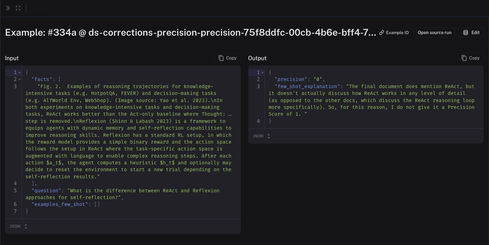

# Create few-shot evaluators

Using LLM-as-a-Judge evaluators can be very helpful when you can't evaluate your system programmatically. However, improving/iterating on these prompts can add unnecessary
overhead to the development process of an LLM-based application - you now need to maintain both your application **and** your evaluators. To make this process easier, LangSmith allows
you to automatically collect human corrections on evaluator prompts, which are then inserted into your prompt as few-shot examples.

:::tip Recommended Reading
Before learning how to create few-shot evaluators, it might be helpful to learn how to setup automations (both online and offline) and how to leave corrections on evaluator scores:

- [Set up online evaluations](/observability/how_to_guides/monitoring/online_evaluations)
- [Bind an evaluator to a dataset in the UI (offline evaluation)](./bind_evaluator_to_dataset)
- [Audit evaluator scores](./audit_evaluator_scores)

:::

## Create your evaluator

:::tip
The default maximum few-shot examples to use in the prompt is 5. Examples are pulled randomly from your dataset (if you have more than the maximum).

:::

When creating an [online](/observability/how_to_guides/monitoring/online_evaluations) or [offline](./bind_evaluator_to_dataset) evaluator - from a tracing project or a dataset, respectively - you will see the option to use corrections as few-shot examples. Note that these types of evaluators
are only supported when using mustache prompts - you will not be able to click this option if your prompt uses f-string formatting. When you select this,
we will auto-create a few-shot prompt for you. Each individual few-shot example will be formatted according to this prompt, and inserted into your main prompt in place of the `{{Few-shot examples}}`
template variable which will be auto-added above. Your few-shot prompt should contain the same variables as your main prompt, plus a `few_shot_explanation` and a score variable which should have the same name
as your output key. For example, if your main prompt has variables `question` and `response`, and your evaluator outputs a `correctness` score, then your few-shot prompt should have `question`, `response`,
`few_shot_explanation`, and `correctness`.

You may also specify the number of few-shot examples to use. The default is 5. If your examples will tend to be very long, you may want to set this number lower to save tokens - whereas if your examples tend
to be short, you can set a higher number in order to give your evaluator more examples to learn from. If you have more examples in your dataset than this number, we will randomly choose them for you.

Note that few-shot examples are not currently supported in evaluators that use Hub prompts.

Once you create your evaluator, we will automatically create a dataset for you, which will be auto-populated with few-shot examples once you start making corrections.

## Make corrections

:::note Main Article
[Audit evaluator scores](./audit_evaluator_scores)
:::
As you start logging traces or running experiments, you will likely disagree with some of the scores that your evaluator has given. When you [make corrections to these scores](./audit_evaluator_scores), you will
begin seeing examples populated inside your corrections dataset. As you make corrections, make sure to attach explanations - these will get populated into your evaluator prompt in place of the `few_shot_explanation` variable.

The inputs to the few-shot examples will be the relevant fields from the inputs, outputs, and reference (if this an offline evaluator) of your chain/dataset.
The outputs will be the corrected evaluator score and the explanations that you created when you left the corrections. Feel free to edit these to your liking. Here is an example of a few-shot example in a corrections dataset:

Note that the corrections may take a minute or two to be populated into your few-shot dataset. Once they are there, future runs of your evaluator will include them in the prompt!

## View your corrections dataset

In order to view your corrections dataset, go to your rule and click "Edit Rule" (or "Edit Evaluator" from a dataset):

If this is an online evaluator (in a tracing project), you will need to click to edit your prompt:

From this screen, you will see a button that says "View few-shot dataset". Clicking this will bring you to your dataset of corrections, where you can view and update your few-shot examples:

