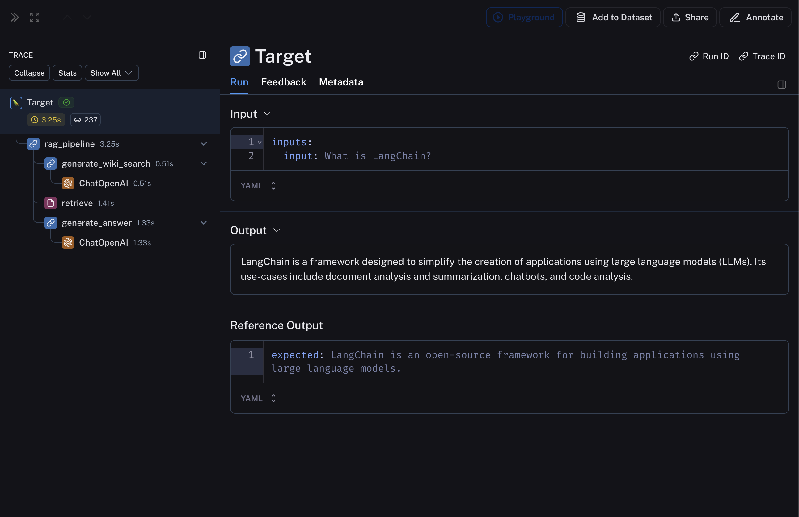
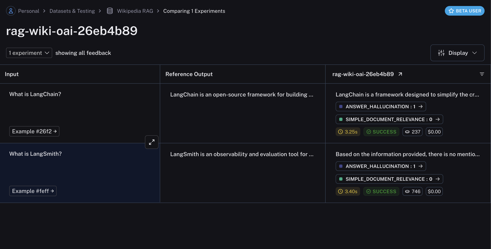

import {
  CodeTabs,
  PythonBlock,
  python,
  TypeScriptBlock,
  typescript,
} from "@site/src/components/InstructionsWithCode";

# Evaluate on intermediate steps

While, in many scenarios, it is sufficient to evaluate the final output of your task, in some cases you might want to evaluate the intermediate steps of your pipeline.

For example, for retrieval-augmented generation (RAG), you might want to

1. Evaluate the retrieval step to ensure that the correct documents are retrieved w.r.t the input query.
2. Evaluate the generation step to ensure that the correct answer is generated w.r.t the retrieved documents.

In this guide, we will use a simple, fully-custom evaluator for evaluating criteria 1 and an LLM-based evaluator for evaluating criteria 2 to highlight both scenarios.

In order to evaluate the intermediate steps of your pipeline, your evaluator function should traverse and process the `root_run`/`rootRun` argument, which is a `Run` object that contains the intermediate steps of your pipeline.

## 1. Define your LLM pipeline

The below RAG pipeline consists of 1) generating a Wikipedia query given the input question, 2) retrieving relevant documents from Wikipedia, and 3) generating an answer given the retrieved documents.

<CodeTabs
  tabs={[
    PythonBlock(`import openai
import wikipedia as wp\n
from langsmith import traceable
from langsmith.wrappers import wrap_openai\n
openai = wrap_openai(openai.Client())\n
@traceable
def generate_wiki_search(question):
    messages = [
        {"role": "system", "content": "Generate a search query to pass into wikipedia to answer the user's question. Return only the search query and nothing more. This will passed in directly to the wikipedia search engine."},
        {"role": "user", "content": question}
    ]
    result = openai.chat.completions.create(messages=messages, model="gpt-4o-mini", temperature=0)
    return result.choices[0].message.content\n
@traceable(run_type="retriever")
def retrieve(query):
    results = []
    for term in wp.search(query, results = 10):
        try:
            page = wp.page(term, auto_suggest=False)
            results.append({
                "page_content": page.summary,
                "type": "Document",
                "metadata": {"url": page.url}
            })
        except wp.DisambiguationError:
            pass
        if len(results) >= 2:
            return results\n
@traceable
def generate_answer(question, context):
    messages = [
        {"role": "system", "content": f"Answer the user's question based ONLY on the content below:\\n\\n{context}"},
        {"role": "user", "content": question}
    ]
    result = openai.chat.completions.create(messages=messages, model="gpt-4o-mini", temperature=0)
    return result.choices[0].message.content\n
@traceable
def rag_pipeline(question):
    query = generate_wiki_search(question)
    context = "\\n\\n".join([doc["page_content"] for doc in retrieve(query)])
    answer = generate_answer(question, context)
    return answer`),
    typescript`
    import OpenAI from "openai";
    import wiki from "wikipedia";
    import { Client } from "langsmith";
    import { traceable } from "langsmith/traceable";
    import { wrapOpenAI } from "langsmith/wrappers";
    
    const openai = wrapOpenAI(new OpenAI());
    
    const generateWikiSearch = traceable(
      async (input: { question: string }) => {
        const messages = [
          {
            role: "system" as const,
            content:
              "Generate a search query to pass into Wikipedia to answer the user's question. Return only the search query and nothing more. This will be passed in directly to the Wikipedia search engine.",
          },
          { role: "user" as const, content: input.question },
        ];
        
        const chatCompletion = await openai.chat.completions.create({
          model: "gpt-4o-mini",
          messages: messages,
          temperature: 0,
        });
        
        return chatCompletion.choices[0].message.content ?? "";
      },
      { name: "generateWikiSearch" }
    );
    
    const retrieve = traceable(
      async (input: { query: string; numDocuments: number }) => {
        const { results } = await wiki.search(input.query, { limit: 10 });
        const finalResults: Array<{
          page_content: string;
          type: "Document";
          metadata: { url: string };
        }> = [];
      
        for (const result of results) {
          if (finalResults.length >= input.numDocuments) {
            // Just return the top 2 pages for now
            break;
          }
          const page = await wiki.page(result.title, { autoSuggest: false });
          const summary = await page.summary();
          finalResults.push({
            page_content: summary.extract,
            type: "Document",
            metadata: { url: page.fullurl },
          });
        }
    
        return finalResults;
      },
      { name: "retrieve", run_type: "retriever" }
    );
    
    const generateAnswer = traceable(
      async (input: { question: string; context: string }) => {
        const messages = [
          {
            role: "system" as const,
            content: \`Answer the user's question based only on the content below:\\n\\n$\{input.context\}\`,
          },
          { role: "user" as const, content: input.question },
        ];
      
        const chatCompletion = await openai.chat.completions.create({
          model: "gpt-4o-mini",
          messages: messages,
          temperature: 0,
        });
        return chatCompletion.choices[0].message.content ?? "";
      },
      { name: "generateAnswer" }
    );
    
    const ragPipeline = traceable(
      async ({ question }: { question: string }, numDocuments: number = 2) => {
        const query = await generateWikiSearch({ question });
        const retrieverResults = await retrieve({ query, numDocuments });
        const context = retrieverResults
          .map((result) => result.page_content)
          .join("\\n\\n");
        const answer = await generateAnswer({ question, context });
        return answer;
      },
      { name: "ragPipeline" }
    );`,
  ]}
  groupId="client-language"
/>

This pipeline will produce a trace that looks something like:

## 2. Create a dataset and examples to evaluate the pipeline

We are building a very simple dataset with a couple of examples to evaluate the pipeline.

<CodeTabs
  tabs={[
    python`
      from langsmith import Client
      
      client = Client()
      
      examples = [
          ("What is LangChain?", "LangChain is an open-source framework for building applications using large language models."),
          ("What is LangSmith?", "LangSmith is an observability and evaluation tool for LLM products, built by LangChain Inc.")
      ]
      
      dataset_name = "Wikipedia RAG"
      if not client.has_dataset(dataset_name=dataset_name):
          dataset = client.create_dataset(dataset_name=dataset_name)
          inputs, outputs = zip(
              *[({"input": input}, {"expected": expected}) for input, expected in examples]
          )
          client.create_examples(inputs=inputs, outputs=outputs, dataset_id=dataset.id)
    `,
    typescript`
      import { Client } from "langsmith";
      const client = new Client();
      
      const examples = [
        [
          "What is LangChain?",
          "LangChain is an open-source framework for building applications using large language models.",
        ],
        [
          "What is LangSmith?",
          "LangSmith is an observability and evaluation tool for LLM products, built by LangChain Inc.",
        ],
      ];
      
      const datasetName = "Wikipedia RAG";
      
      const inputs = examples.map(([input, _]) => ({ input }));
      const outputs = examples.map(([_, expected]) => ({ expected }));
      
      const dataset = await client.createDataset(datasetName);
      await client.createExamples({ datasetId: dataset.id, inputs, outputs });
    `,
  ]}
  groupId="client-language"
/>

## 3. Define your custom evaluators

As mentioned above, we will define two evaluators: one that evaluates the relevance of the retrieved documents w.r.t the input query and another that evaluates the hallucination of the generated answer w.r.t the retrieved documents.
We will be using LangChain LLM wrappers, along with [`with_structured_output`](https://python.langchain.com/v0.1/docs/modules/model_io/chat/structured_output/) to define the evaluator for hallucination.

The key here is that the evaluator function should traverse the `root_run` / `rootRun` argument to access the intermediate steps of the pipeline. The evaluator can then process the inputs and outputs of the intermediate steps to evaluate according to the desired criteria.

<CodeTabs
  tabs={[
    PythonBlock(`from langsmith.evaluation import LangChainStringEvaluator, evaluate
from langsmith.schemas import Example, Run
from langchain_openai import ChatOpenAI
from langchain_core.prompts import ChatPromptTemplate
from langchain_core.pydantic_v1 import BaseModel, Field\n
def document_relevance(root_run: Run, example: Example) -> dict:
    """
    A very simple evaluator that checks to see if the input of the retrieval step exists
    in the retrieved docs.
    """
    rag_pipeline_run = next(run for run in root_run.child_runs if run.name == "rag_pipeline")
    retrieve_run = next(run for run in rag_pipeline_run.child_runs if run.name == "retrieve")
    page_contents = "\\n\\n".join(doc["page_content"] for doc in retrieve_run.outputs["output"])
    score = retrieve_run.inputs["query"] in page_contents
    return {"key": "simple_document_relevance", "score": score}\n
def hallucination(root_run: Run, example: Example) -> dict:
    """
    A simple evaluator that checks to see the answer is grounded in the documents
    """
    # Get documents and answer
    rag_pipeline_run = next(run for run in root_run.child_runs if run.name == "rag_pipeline")
    retrieve_run = next(run for run in rag_pipeline_run.child_runs if run.name == "retrieve")
    page_contents = "\\n\\n".join(doc["page_content"] for doc in retrieve_run.outputs["output"])
    generation = rag_pipeline_run.outputs["output"]\n
    # Data model
    class GradeHallucinations(BaseModel):
        """Binary score for hallucination present in generation answer."""\n
        binary_score: int = Field(description="Answer is grounded in the facts, 1 or 0")\n
    # LLM with function call
    llm = ChatOpenAI(model="gpt-4o-mini", temperature=0)
    structured_llm_grader = llm.with_structured_output(GradeHallucinations)\n
    # Prompt
    system = """You are a grader assessing whether an LLM generation is grounded in / supported by a set of retrieved facts. \\n
        Give a binary score 1 or 0, where 1 means that the answer is grounded in / supported by the set of facts."""
    hallucination_prompt = ChatPromptTemplate.from_messages(
        [
            ("system", system),
            ("human", "Set of facts: \\n\\n {documents} \\n\\n LLM generation: {generation}"),
        ]
    )\n
    hallucination_grader = hallucination_prompt | structured_llm_grader
    score = hallucination_grader.invoke({"documents": page_contents, "generation": generation})
    return {"key": "answer_hallucination", "score": int(score.binary_score)}`),
    typescript`
      import { EvaluationResult } from "langsmith/evaluation";
      import { Run, Example } from "langsmith/schemas";
      
      import { ChatPromptTemplate } from "@langchain/core/prompts";
      import { ChatOpenAI } from "@langchain/openai";
      import { z } from "zod";
      
      function findNestedRun(run: Run, search: (run: Run) => boolean): Run | null {
        const queue: Run[] = [run];
        while (queue.length > 0) {
          const currentRun = queue.shift()!;
          if (search(currentRun)) return currentRun;
          queue.push(...currentRun.child_runs);
        }
        return null;
      }
      
      // A very simple evaluator that checks to see if the input of the retrieval step exists
      // in the retrieved docs.
      function documentRelevance(rootRun: Run, example: Example): EvaluationResult {
        const retrieveRun = findNestedRun(rootRun, (run) => run.name === "retrieve");
        const docs: Array<{ page_content: string }> | undefined =
          retrieveRun.outputs?.outputs;
        
        const pageContents = docs?.map((doc) => doc.page_content).join("\\n\\n");
        const score = pageContents.includes(retrieveRun.inputs?.query);
        return { key: "simple_document_relevance", score };
      }
      
      async function hallucination(
        rootRun: Run,
        example: Example
      ): Promise<EvaluationResult> {
        const rag = findNestedRun(rootRun, (run) => run.name === "ragPipeline");
        const retrieve = findNestedRun(rootRun, (run) => run.name === "retrieve");
        
        const docs: Array<{ page_content: string }> | undefined =
          retrieve.outputs?.outputs;
        
        const documents = docs?.map((doc) => doc.page_content).join("\\n\\n");
        
        const prompt = ChatPromptTemplate.fromMessages<{
          documents: string;
          generation: string;
        }>([
          [
            "system",
            [
              \`You are a grader assessing whether an LLM generation is grounded in / supported by a set of retrieved facts. \\n\`,
              \`Give a binary score 1 or 0, where 1 means that the answer is grounded in / supported by the set of facts.\`,
            ].join("\\n"),
          ],
          [
            "human",
            "Set of facts: \\n\\n {documents} \\n\\n LLM generation: {generation}",
          ],
        ]);
        
        const llm = new ChatOpenAI({
          model: "gpt-4o-mini",
          temperature: 0,
        }).withStructuredOutput(
          z
            .object({
              binary_score: z
                .number()
                .describe("Answer is grounded in the facts, 1 or 0"),
            })
            .describe("Binary score for hallucination present in generation answer.")
        );
        
        const grader = prompt.pipe(llm);
        const score = await grader.invoke({
          documents,
          generation: rag.outputs?.outputs,
        });
        
        return { key: "answer_hallucination", score: score.binary_score };
      }
    `,
  ]}
  groupId="client-language"
/>

## 4. Evaluate the pipeline

Finally, we'll run `evaluate` with the custom evaluators defined above.

<CodeTabs
  tabs={[
    python`
      from langsmith.evaluation import evaluate
      
      experiment_results = evaluate(
          lambda inputs: rag_pipeline(inputs["input"]),
          data=dataset_name,
          evaluators=[document_relevance, hallucination],
          experiment_prefix="rag-wiki-oai"
      )
    `,
    typescript`
      import { evaluate } from "langsmith/evaluation";
      
      await evaluate((inputs) => ragPipeline({ question: inputs.input }), {
        data: datasetName,
        evaluators: [hallucination, documentRelevance],
        experimentPrefix: "rag-wiki-oai",
      });
    `,
  ]}
  groupId="client-language"
/>

The experiment will contain the results of the evaluation, including the scores and comments from the evaluators:

