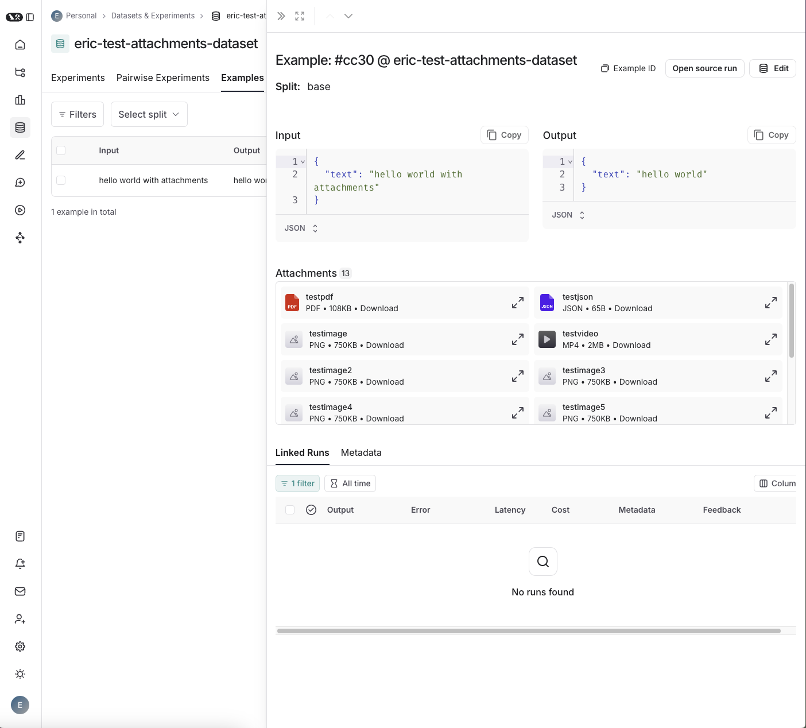
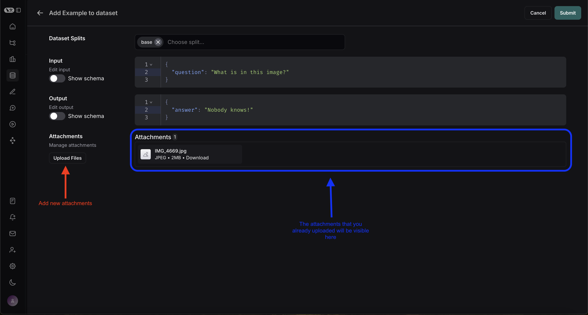

import { python } from "@site/src/components/InstructionsWithCode";

# Evaluate applications with large file inputs

In addition to supporting [file attachments with traces](../../../observability/how_to_guides/tracing/upload_files_with_traces), LangSmith supports arbitrary file attachments with your examples, which you can consume when you run experiments.

:::tip Using separate attachments outside of inputs/outputs
When dealing with large files, it's recommended to upload them as attachments rather than embedding them in your JSON inputs or outputs via base64 encoding.

Attachments are more efficient because base64 encoding increases data size, leading to slower uploads and downloads.
This also avoid potential performance bottlenecks with parsing large JSON payloads.

Finally, attachments are more user-friendly in the LangSmith UI, as they are rendered as files with previews, rather than as base64-encoded strings.
:::

## Create a dataset with attachments

### SDK

To create a dataset with attachments using the SDK, you need to use the `upload_examples_multipart` method of the LangSmith client.
This method allows you to pass in a list of examples with attachments.

Each attachment is represented as a dictionary, mapping the attachment name to a tuple containing the MIME type and the file content.
The file content can be either a path to the file or the bytes content of the file.

:::note Working with large files
It is typically recommended to pass in the file path directly for large files, as reading the file content into memory can be inefficient.
When a file path is passed, LangSmith will stream the file content directly from the path, rather than loading the entire file into memory.
:::

```python
from langsmith import Client
from langsmith.schemas import ExampleUploadWithAttachments, Attachment
from pathlib import Path

# Define the LANGCHAIN_API_KEY environment variable with your api key
langsmith_client = Client()

dataset = langsmith_client.create_dataset(
    dataset_name="attachment-test-dataset",
    description="Test dataset for evals with attachments",
)

# Define the example
example = ExampleUploadWithAttachments(
    dataset_id=dataset.id,
    inputs={"question": "What were the cumulative earnings earned from online orders in the midwest during Q2?"},
    outputs={"answer": "$123456"},
    attachments={
        # Each attachments is just a name with a mime type and the path or bytes content of the file
        "my_pdf": ("application/pdf", Path("./foo_earnings.pdf").read_bytes()),
        # We can pass multiple attachments (of different types!), as long as they have different names
        "my_pptx": ("application/pptx", Path("./foo_earnings.pptx").read_bytes()),
        # We can also pass in the file path directly. This is recommended for large files, as it avoids loading the entire file into memory
        "my_txt": ("text/plain", Path("./foo_earnings.txt")),
        # We can also explicitly define an Attachment object if we want
        "my_img": Attachment(mime_type="image/png", data=Path("./foo_earnings.img").read_bytes())
    },
)

# Upsert the examples
langsmith_client.upload_examples_multipart(uploads=[example])
```

Once you upload examples with attachments, you can view them in the LangSmith UI. Each attachment will be rendered as a file with a preview, making it easy to inspect the contents.


### From existing runs

When adding runs to a LangSmith dataset, attachments can be selectively propagated from the source run to the destination example.
To do learn more, please see [this guide](./../datasets/manage_datasets_in_application#add-runs-from-the-tracing-project-ui).

### From the LangSmith UI

You can also add examples with attachments from the LangSmith UI. You can do so by clicking the `+ Example` button in the `Examples` tab of the dataset UI.
You can then upload the attachments that you want by using the "Upload Files" button:



## Running evaluations with attachments

Once you have a dataset that contains examples with file attachments, you can run evaluations that process these attachments.

### Define a target function with attachments

Now that we have a dataset that includes examples with attachments, we can define a target function to run our LLM application on these examples.
The target function must have two positional arguments in order to consume the attachments associated with the example, the first must be called `inputs` and the second must be called `attachments`.

- The `inputs` argument is a dictionary that contains the input data for the example, excluding the attachments.
- The `attachments` argument is a dictionary that maps the attachment name to a tuple containing a presigned url and a reader of the bytes content of the file. Either can be used to read the bytes of the file:
  ```
  {
      "attachment_name": (presigned_url, reader)
  }
  ```

```python
from langchain_openai import ChatOpenAI
from langchain_core.messages import SystemMessage, HumanMessage
import fitz
from io import BytesIO
import base64

model = ChatOpenAI(model="gpt-4o-mini")

def pdf_to_image_bytes(pdf_bytes, image_format='PNG'):
    pdf_document = fitz.open(stream=pdf_bytes, filetype="pdf")
    images = []
    for page in pdf_document:
        pix = page.get_pixmap()
        img_bytes = BytesIO()
        pix.pil_save(img_bytes, format=image_format)
        # Encode the bytes in base64
        base64_bytes = base64.b64encode(img_bytes.getvalue()).decode('utf-8')
        images.append(base64_bytes)
    pdf_document.close()
    return images


def pdf_qa(inputs, attachments):
    system_message = SystemMessage(
        content="The images are of the pdf that the question is referencing. Use the images to generate your answer."
    )
    # The attachment tuple returned contains the presigned url first and then a reader of the bytes
    # Either can be used to read the bytes of the file
    pdf_signed_url, pdf_reader = attachments['my_pdf']
    pdf_images = pdf_to_image_bytes(pdf_reader.read())
    image_signed_url, image_reader = attachments['my_image']
    human_message = HumanMessage(
        content=[
            {"type": "text", "text": inputs["question"]},
        ] + [{"type": "image_url", "image_url": {"url": f"data:image/png;base64,{image}"}} for image in pdf_images],
        # Certain providers also allow you to just pass in the URL for certain files
        # instead of having to convert to a base64 string first
        + [{"type": "image_url", "image_url": {"url": image_signed_url}}]
    )
    messages = [system_message, human_message]
    return {"answer": model.invoke(messages).content}
```

### Define custom evaluators with attachments

In addition to using attachments inside of your target function, you can also use them inside of your evaluators as follows:

```python
from pydantic import BaseModel, Field

class Hallucination(BaseModel):
    """Hallucination detection"""
    reason: str = Field(description="Why you believe there was oor wasn't hallucination")
    hallucination: int = Field(ge=0, le=1, description="1 if hallucination detected, 0 if not")


def hallucination_evaluator(outputs: dict, attachments: dict):
    image_signed_url, image_reader = attachments['my_image']
    message = HumanMessage(
        content = [
            {"type": "text", "text": f"Does this description: {} of the following image contain any hallucinations?"},
            {"type": "image_url", "image_url": {"url": image_signed_url}}
        ]
    )
    hallucination_model = model.with_structured_output(Hallucination)
    return {"key": "hallincation", "score": hallucination_model.invoke(message).hallucination }

evaluate(
    target=pdf_qa,
    data="attachment-test-dataset",
    evaluators=[hallucination_evaluator]
    client=langsmith_client,
)
```

We can also do this asynchronously:


```python
from pydantic import BaseModel, Field

class Hallucination(BaseModel):
    """Hallucination detection"""
    reason: str = Field(description="Why you believe there was oor wasn't hallucination")
    hallucination: int = Field(ge=0, le=1, description="1 if hallucination detected, 0 if not")


async def ahallucination_evaluator(outputs: dict, attachments: dict):
    image_signed_url, image_reader = attachments['my_image']
    message = HumanMessage(
        content = [
            {"type": "text", "text": f"Does this description: {} of the following image contain any hallucinations?"},
            {"type": "image_url", "image_url": {"url": image_signed_url}}
        ]
    )
    hallucination_model = model.with_structured_output(Hallucination)
    return {"key": "hallincation", "score": hallucination_model.invoke(message).hallucination }

await aevaluate(
    target=atarget,
    data="attachment-test-dataset",
    evaluators=[ahallucination_evaluator]
    client=langsmith_client,
)
```

## Managing datasets with attachments

TODO: FILL THIS OUT ONCE UPDATE ENDPOINTS EXIST