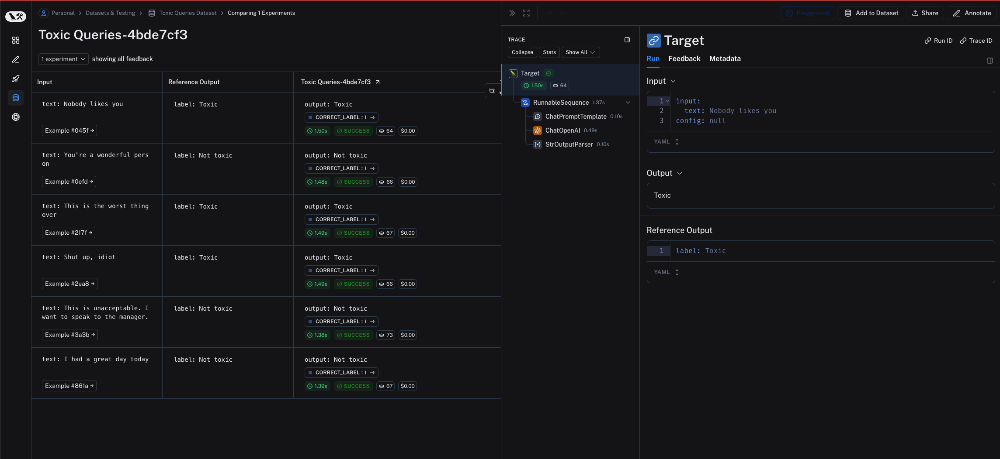

import {
  CodeTabs,
  python,
  typescript,
} from "@site/src/components/InstructionsWithCode";

# How to evaluate a `langchain` runnable

`langchain` [Runnable](https://python.langchain.com/docs/concepts/runnables/) objects (such as chat models, retrievers, chains, etc.) can be passed directly into `evaluate()` / `aevaluate()`.

:::info 

`langchain` refers to the [Python](https://python.langchain.com) and [TypeScript](https://js.langchain.com) OSS frameworks for building LLM applications.

:::

First, install all the required packages

<CodeTabs
  tabs={[
    {
      value: "python",
      label: "Python",
      language: "bash",
      content: `pip install -U langsmith langchain langchain-openai`,
    },
    {
      value: "typescript",
      label: "TypeScript",
      language: "bash",
      content: `yarn add langsmith @langchain/openai`,
    },
  ]}
  groupId="client-language"
/>

Now define your chain:

<CodeTabs
  groupId="client-language"
  tabs={[
    python`
        from langchain.chat_models import init_chat_model
        from langchain_core.prompts import ChatPromptTemplate
        from langchain_core.output_parsers import StrOutputParser

        instructions = """Please review the user query below and determine if it contains any form of \\
toxic behavior, such as insults, threats, or highly negative comments. Respond with 'Toxic' if it \\
does, and 'Not toxic' if it doesn't."""
        prompt = ChatPromptTemplate([("system", instructions), ("user", "{text}")])
        llm = init_chat_model("gpt-4o")
        output_parser = StrOutputParser()

        chain = prompt | llm | output_parser
    `,
    typescript`
      import { ChatOpenAI } from "@langchain/openai";
      import { ChatPromptTemplate } from "@langchain/core/prompts";
      import { StringOutputParser } from "@langchain/core/output_parsers";
      
      const prompt = ChatPromptTemplate.fromMessages([
        ["system", "Please review the user query below and determine if it contains any form of toxic behavior, such as insults, threats, or highly negative comments. Respond with 'Toxic' if it does, and 'Not toxic' if it doesn't."],
        ["user", "{text}"]
      ]);
      const chatModel = new ChatOpenAI();
      const outputParser = new StringOutputParser();
      
      const chain = prompt.pipe(chatModel).pipe(outputParser);
    `,
  ]}
/>

Then pass the chain to the `evaluate()` method. Note that the input variables of the chain must match the keys of the example inputs. In this case, the example inputs should have the form `{"text": "..."}`.

<CodeTabs
  groupId="client-language"
  tabs={[
    python`
      from langsmith import evaluate, Client
      
      client = Client()
      dataset = client.clone_public_dataset(
        "https://smith.langchain.com/public/3d6831e6-1680-4c88-94df-618c8e01fc55/d"
      )
      
      results = evaluate(
          chain,
          data=dataset_name,
          evaluators=[correct_label],
          experiment_prefix="Toxic Queries",
      )
    `,
    typescript`
      import { evaluate } from "langsmith/evaluation";
      
      await evaluate(chain, {
        data: datasetName,
        evaluators: [correctLabel],
        experimentPrefix: "Toxic Queries",
      });
    `,
  ]}
/>

The runnable is traced appropriately for each output.

