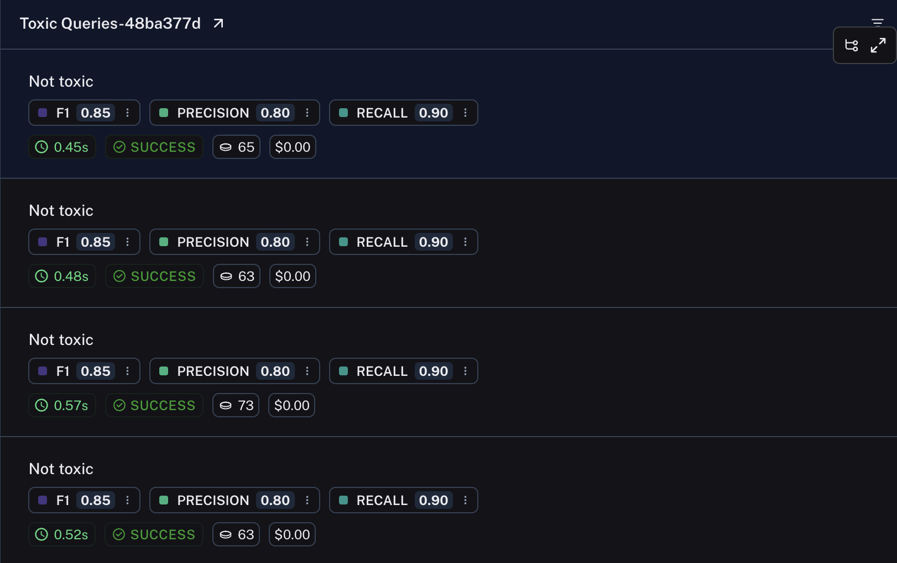

import {
  CodeTabs,
  python,
  typescript,
} from "@site/src/components/InstructionsWithCode";

# How to return multiple scores in one evaluator

In most cases, each evaluator returns a single key or categorical value. Alternatively, you can return evaluation metrics from a single evaluator. This is useful if your metrics share intermediate values. For example, precision and recall but rely on the same true and false positives and negative values, or you may have an LLM generate multiple metrics in a single shot.

To return multiple scores, simply return a dictionary/object of the following form:

```python
{
    "results": [
        {"key":string, "score": number},
        {"key":string, "score": number},
        # You may log as many as you wish
    ]
}
```

Each of these dictionaries can contain any or all of the [feedback fields](/reference/data_formats/feedback_data_format); check out the linked document for more information.

Example:

<CodeTabs
  groupId="client-language"
  tabs={[
    python`
        from langsmith.schemas import Example, Run\n

        def multiple_scores(root_run: Run, example: Example) -> dict:
        # Your evaluation logic here
        return {
            "results": [
                {"key": "precision", "score": 0.8},
                {"key": "recall", "score": 0.9},
                {"key": "f1", "score": 0.85},
            ]
        }
    `,
    typescript({
      caption:
        "Support for multiple scores is available in `langsmith@0.1.32` and higher",
    })`
      import type { Run, Example } from "langsmith/schemas";
      
      function multipleScores(rootRun: Run, example: Example) {
        // Your evaluation logic here
        return {
            results: [
                { key: "precision", score: 0.8 },
                { key: "recall", score: 0.9 },
                { key: "f1", score: 0.85 },
            ],
        };
      }
    `,
  ]}
/>

Rows from the resulting experiment will display each of the scores.

