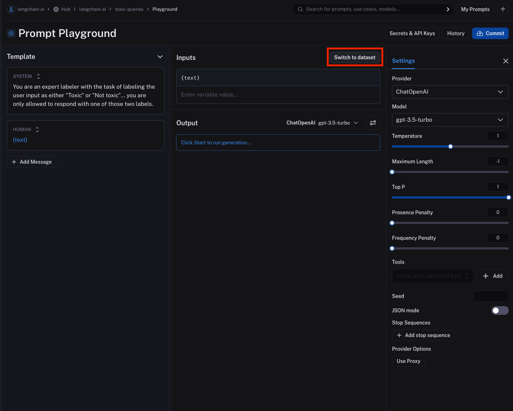
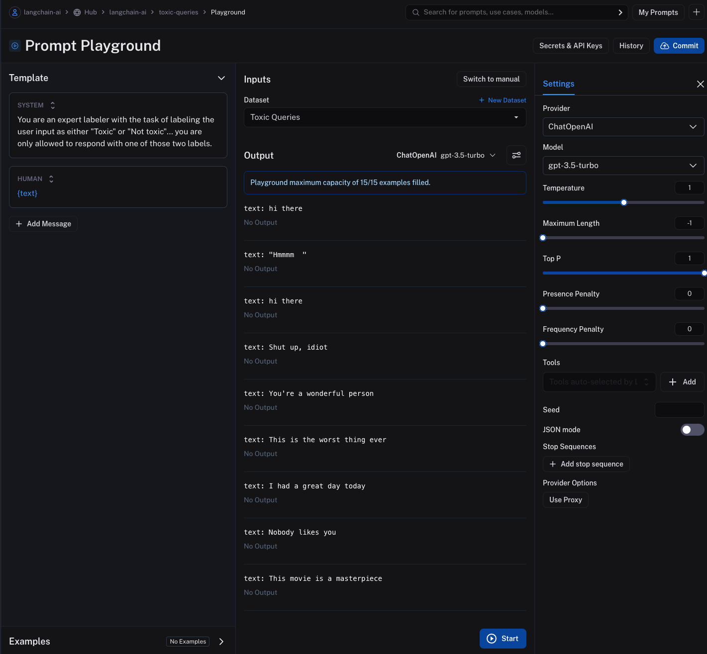
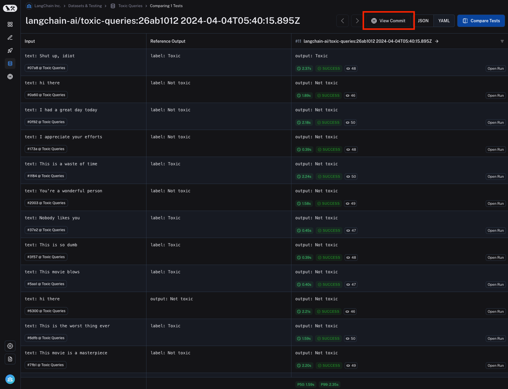

# Run an evaluation from the prompt playground

While you can kick off experiments easily using the sdk, as outlined [here](./evaluate_llm_application), it's often useful to run experiments directly in the prompt playground.

This allows you to test your prompt / model configuration over a series of inputs to see how well it generalizes across different contexts or scenarios, without having to write any code.

## Create an experiment in the prompt playground

1. **Navigate to the prompt playground** by clicking on "Prompts" in the sidebar, then selecting a prompt from the list of available prompts or creating a new one.
2. **Select the "Switch to dataset" button** to switch to the dataset you want to use for the experiment. Please note that the dataset keys of the dataset inputs must match the input variables of the prompt. In the below sections, note that the selected dataset has inputs with keys "text", which correctly match the input variable of the prompt. Also note that there is a max capacity of 15 inputs for the prompt playground.
   
3. **Click on the "Start" button** or CMD+Enter to start the experiment. This will run the prompt over all the examples in the dataset and create an entry for the experiment in the dataset details page. Note that you need to commit the prompt to the prompt hub before you can start the experiment to ensure it can be referenced in the experiment. The result for each input will be streamed and displayed inline for each input in the dataset.
   
4. **View the results** by clicking on the "View Experiment" button at the bottom of the page. This will take you to the experiment details page where you can see the results of the experiment.
5. **Navigate back to the commit page** by clicking on the "View Commit" button. This will take you back to the prompt page where you can make changes to the prompt and run more experiments. The "View Commit" button is available to all experiments that were run from the prompt playground. The experiment is prefixed with the prompt repository name, a unique identifier, and the date and time the experiment was run.
   

## Add evaluation scores to the experiment

You can add evaluation scores to experiments by [binding an evaluator to the dataset](./bind_evaluator_to_dataset), again without writing any code.

You can also programmatically [evaluate an existing experiment](./evaluate_existing_experiment) using the SDK.
