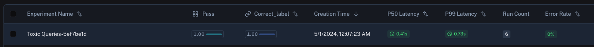

import {
  CodeTabs,
  python,
  typescript,
} from "@site/src/components/InstructionsWithCode";

# How to run an aggregate evaluation

Some metrics can only be defined on the entire experiment level as opposed to the individual runs of the experiment.
For example, you may want to compute the overall pass rate or f1 score of your evaluation target across all examples in the dataset.
These are called `summary_evaluators`. Instead of taking in a single `Run` and `Example`, these evaluators take a list of each.

Below, we'll implement a very simple summary evaluator that computes overall pass rate:

<CodeTabs
  groupId="client-language"
  tabs={[
    python`
      from langsmith.schemas import Example, Run
      
      def summary_eval(runs: list[Run], examples: list[Example]) -> dict:
          correct = 0
          for i, run in enumerate(runs):
              if run.outputs["output"] == examples[i].outputs["label"]:
                  correct += 1
          if correct / len(runs) > 0.5:
              return {"key": "pass", "score": True}
          else:
              return {"key": "pass", "score": False}
    `,
    typescript`
      import { Run, Example } from "langsmith/schemas";
      
      function summaryEval(runs: Run[], examples: Example[]) {
        let correct = 0;
        
        for (let i = 0; i < runs.length; i++) {
          if (runs[i].outputs["output"] === examples[i].outputs["label"]) {
            correct += 1;
          }
        }
        
        return { key: "pass", score: correct / runs.length > 0.5 };
      }
    `,
  ]}
/>

You can then pass this evaluator to the `evaluate` method as follows:

<CodeTabs
  groupId="client-language"
  tabs={[
    python`
      results = evaluate(
          lambda inputs: label_query(inputs["text"]),
          data=dataset_name,
          evaluators=[correct_label],
          summary_evaluators=[summary_eval],
          experiment_prefix="Toxic Queries",
      )
    `,
    typescript`
      await evaluate((inputs) => labelQuery(inputs["input"]), {
        data: datasetName,
        evaluators: [correctLabel],
        summaryEvaluators: [summaryEval],
        experimentPrefix: "Toxic Queries",
      });
    `,
  ]}
/>

In the LangSmith UI, you'll the summary evaluator's score displayed with the corresponding key.

