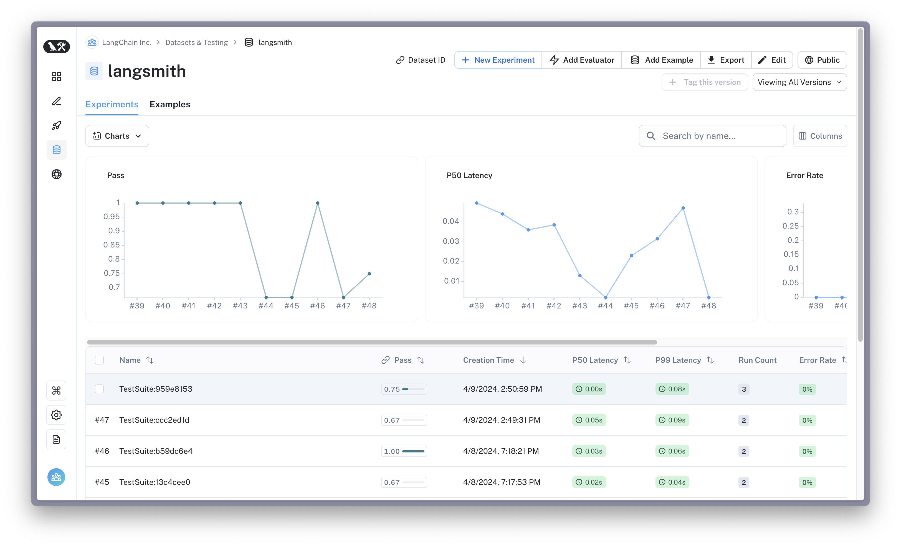

# How to unit test applications (Python only)

LangSmith functional tests are assertions and expectations designed to **quickly** identify obvious bugs and regressions in your AI system. Relative to evaluations, tests typically are designed to be **fast** and **cheap** to run, focusing on **specific** functionality and edge cases.
We recommend using LangSmith to track any unit tests, end-to-end integration tests, or other specific assertions that touch an LLM or other non-deterministic part of your AI system.
These should run on every commit in your CI pipeline to catch regressions early.

:::note
`@unit` currently requires `langsmith` python version `>=0.1.74` (named `@unit` for versions `>=0.1.42`). If you are interested in unit testing functionality in TypeScript or other languages, please let us know at [support@langchain.dev](mailto:support@langchain.dev).  
:::

## Write a @unit

To write a LangSmith functional test, decorate your test function with `@unit`.
If you want to track the full nested trace of the system or component being tested, you can mark those functions with `@traceable`. For example:

```python
 my_app/main.py
from langsmith import traceable

@traceable # Optional
def generate_sql(user_query):
    # Replace with your SQL generation logic
    # e.g., my_llm(my_prompt.format(user_query))
    return "SELECT * FROM customers"
```

Then define your test:

```python tests/test_my_app.py
 tests/test_my_app.py
from langsmith import unit
from my_app.main import generate_sql

@unit
def test_sql_generation_select_all():
    user_query = "Get all users from the customers table"
    sql = generate_sql(user_query)
    # LangSmith logs any exception raised by `assert` / `pytest.fail` / `raise` / etc.
    # as a test failure
    # highlight-next-line
    assert sql == "SELECT * FROM customers"
```

## Run tests

You can use a standard testing framework such as `pytest` ([docs](https://docs.pytest.org/en/7.1.x/contents.html)) to run. For example:

```bash
pytest tests/
```

Each time you run this test suite, LangSmith collects the pass/fail rate and other traces as a new `TestSuiteResult`, logging the `pass` rate (1 for pass, 0 for fail) over all the applicable tests.

The test suite syncs to a corresponding dataset named after your package or github repository.



## Going further

`@unit` is designed to stay out of your way and works well with familiar `pytest` features. For example:

#### Defining inputs as fixtures

Pytest fixtures let you define functions that serve as reusable inputs for your tests. LangSmith automatically syncs any test case inputs defined as fixtures. For example:

```python
import pytest

@pytest.fixture
def user_query():
    return "Get all users from the customers table"

@pytest.fixture
def expected_sql():
    return "SELECT * FROM customers"

 output_keys indicate which test arguments to save as 'outputs' in the dataset (Optional)
 Otherwise, all arguments are saved as 'inputs'
@unit(output_keys=["expected_sql"])
def test_sql_generation_with_fixture(user_query, expected_sql):
    sql = generate_sql(user_query)
    assert sql == expected_sql
```

#### Parametrizing tests

Parametrizing tests lets you run the same assertions across multiple sets of inputs. Use `pytest`'s `parametrize` decorator to achieve this. For example:

```python
@unit
@pytest.mark.parametrize(
    "user_query, expected_sql",
    [
        ("Get all users from the customers table", "SELECT * FROM customers"),
        ("Get all users from the orders table", "SELECT * FROM orders"),
    ],
)
def test_sql_generation_parametrized(user_query, expected_sql):
    sql = generate_sql(user_query)
    assert sql == expected_sql
```

**Note:** as the parametrized list grows, you may consider using `evaluate()` instead. This parallelizes the evaluation and makes it easier to control individual experiments and the corresponding dataset.

#### Expectations

LangSmith provides an `expect` utility to help define expectations about your LLM output. For example:

```python
from langsmith import expect

@unit
def test_sql_generation_select_all():
    user_query = "Get all users from the customers table"
    sql = generate_sql(user_query)
    expect(sql).to_contain("customers")
```

This will log the binary "expectation" score to the experiment results, additionally `assert`ing that the expectation is met possibly triggering a test failure.

`expect` also provides "fuzzy match" methods. For example:

```python
@unit
@pytest.mark.parametrize(
    "query, expectation",
    [
       ("what's the capital of France?", "Paris"),
    ],
)
def test_embedding_similarity(query, expectation):
    prediction = my_chatbot(query)
    expect.embedding_distance(
        # This step logs the distance as feedback for this run
        prediction=prediction, expectation=expectation
    # Adding a matcher (in this case, 'to_be_*"), logs 'expectation' feedback
    ).to_be_less_than(0.5) # Optional predicate to assert against
    expect.edit_distance(
        # This computes the normalized Damerau-Levenshtein distance between the two strings
        prediction=prediction, expectation=expectation
    # If no predicate is provided below, 'assert' isn't called, but the score is still logged
    )
```

This test case will be assigned 4 scores:

1. The `embedding_distance` between the prediction and the expectation
2. The binary `expectation` score (1 if cosine distance is less than 0.5, 0 if not)
3. The `edit_distance` between the prediction and the expectation
4. The overall test pass/fail score (binary)

The `expect` utility is modeled off of [Jest](https://jestjs.io/docs/expect)'s expect API, with some off-the-shelf functionality to make it easier to grade your LLMs.

#### Dry-run mode

If you want to run the tests without syncing the results to LangSmith, you can set `LANGCHAIN_TEST_TRACKING=false` in your environment.

```bash
LANGCHAIN_TEST_TRACKING=false pytest tests/
```

The tests will run as normal, but the experiment logs will not be sent to LangSmith.

#### Caching

LLMs on every commit in CI can get expensive. To save time and resources, LangSmith lets you cache results to disk. Any identical inputs will be loaded from the cache so you don't have to call out to your LLM provider unless there are changes to the model, prompt, or retrieved data.

To enable caching, run with `LANGCHAIN_TEST_CACHE=/my/cache/path`. For example:

```bash
LANGCHAIN_TEST_CACHE=tests/cassettes pytest tests/my_llm_tests
```

All requests will be cached to `tests/cassettes` and loaded from there on subsequent runs. If you check this in to your repository, your CI will be able to use the cache as well.

#### Using `watch` mode

With caching enabled, you can iterate quickly on your tests using `watch` mode without worrying about unnecessarily hitting your LLM provider. For example, using [`pytest-watch`](https://pypi.org/project/pytest-watch/):

```bash
pip install pytest-watch
LANGCHAIN_TEST_CACHE=tests/cassettes ptw tests/my_llm_tests
```

## Explanations

The `@unit` test decorator converts any test into a parametrized LangSmith example. By default, all tests within a given file will be grouped as a single "test suite" with a corresponding dataset. You can configure which test suite a test belongs to by passing the `test_suite_name` parameter to `@unit`.

The following metrics are available off-the-shelf:

| Feedback             | Description                                                 | Example                                                                                                               |
| -------------------- | ----------------------------------------------------------- | --------------------------------------------------------------------------------------------------------------------- |
| `pass`               | Binary pass/fail score, 1 for pass, 0 for fail              | `assert False` # Fails                                                                                                |
| `expectation`        | Binary expectation score, 1 if expectation is met, 0 if not | `expect(prediction).against(lambda x: re.search(r"\b[a-f\d]{8}-[a-f\d]{4}-[a-f\d]{4}-[a-f\d]{4}-[a-f\d]{12}\b", x)` ) |
| `embedding_distance` | Cosine distance between two embeddings                      | expect.embedding_distance(prediction=prediction, expectation=expectation)                                             |
| `edit_distance`      | Edit distance between two strings                           | expect.edit_distance(prediction=prediction, expectation=expectation)                                                  |

You can also log any arbitrary feedback within a unit test manually using the `client`.

```python
from langsmith import unit, Client
from langsmith.run_helpers import get_current_run_tree

client = Client()

@unit
def test_foo():
    run_tree = get_current_run_tree()
    client.create_feedback(run_id=run_tree.id, key="my_custom_feedback", score=1)
```

## Reference

### `expect`

`expect` makes it easy to make approximate assertions on test results and log scores to LangSmith.
Off-the-shelf, it allows you to compute and compare embedding distances, edit distances, and make custom assertions on values.

#### `expect.embedding_distance(prediction, reference, *, config=None)`

Compute the embedding distance between the prediction and reference.

This logs the embedding distance to LangSmith and returns a [`Matcher`](#matcher) instance for making assertions on the distance value.

By default, this uses the OpenAI API for computing embeddings.

**Parameters**

- `prediction` (str): The predicted string to compare.
- `reference` (str): The reference string to compare against.
- `config` (Optional[EmbeddingConfig]): Optional configuration for the embedding distance evaluator. Supported options:
  - `encoder`: A custom encoder function to encode the list of input strings to embeddings. Defaults to the OpenAI API.
  - `metric`: The distance metric to use for comparison. Supported values: "cosine", "euclidean", "manhattan", "chebyshev", "hamming".

**Returns**

A [`Matcher`](#matcher) instance for the embedding distance value.

#### `expect.edit_distance(prediction, reference, *, config=None)`

Compute the string distance between the prediction and reference.

This logs the string distance (Damerau-Levenshtein) to LangSmith and returns a [`Matcher`](#matcher) instance for making assertions on the distance value.

This depends on the `rapidfuzz` package for string distance computation.

**Parameters**

- `prediction` (str): The predicted string to compare.
- `reference` (str): The reference string to compare against.
- `config` (Optional[EditDistanceConfig]): Optional configuration for the string distance evaluator. Supported options:
  - `metric`: The distance metric to use for comparison. Supported values: "damerau_levenshtein", "levenshtein", "jaro", "jaro_winkler", "hamming", "indel".
  - `normalize_score`: Whether to normalize the score between 0 and 1.

**Returns**

A [`Matcher`](#matcher) instance for the string distance value.

#### `expect.value(value)`

Create a [`Matcher`](#matcher) instance for making assertions on the given value.

**Parameters**

- `value` (Any): The value to make assertions on.

**Returns**

A [`Matcher`](#matcher) instance for the given value.

#### `Matcher`

A class for making assertions on expectation values.

**`to_be_less_than(value)`**

Assert that the expectation value is less than the given value.

**`to_be_greater_than(value)` **

Assert that the expectation value is greater than the given value.

**`to_be_between(min_value, max_value)`**

Assert that the expectation value is between the given min and max values.

**`to_be_approximately(value, precision=2)`**

Assert that the expectation value is approximately equal to the given value.

**`to_equal(value)`**

Assert that the expectation value equals the given value.

**`to_contain(value)`**

Assert that the expectation value contains the given value.

**`against(func)`**

Assert the expectation value against a custom function.

### `test` API

The `@unit` decorator is used to mark a function as a test case for LangSmith. It ensures that the necessary example data is created and associated with the test function. The decorated function will be executed as a test case, and the results will be recorded and reported by LangSmith.

#### `@unit(id=None, output_keys=None, client=None, test_suite_name=None)`

Create a test case in LangSmith.

**Parameters**

- `id` (Optional[uuid.UUID]): A unique identifier for the test case. If not provided, an ID will be generated based on the test function's module and name.
- `output_keys` (Optional[Sequence[str]]): A list of keys to be considered as the output keys for the test case. These keys will be extracted from the test function's inputs and stored as the expected outputs.
- `client` (Optional[ls_client.Client]): An instance of the LangSmith client to be used for communication with the LangSmith service. If not provided, a default client will be used.
- `test_suite_name` (Optional[str]): The name of the test suite to which the test case belongs. If not provided, the test suite name will be determined based on the environment or the package name.

**Environment Variables**

- `LANGSMITH_TEST_TRACKING`: Set this variable to the path of a directory to enable caching of test results. This is useful for re-running tests without re-executing the code. Requires the 'langsmith[vcr]' package.
