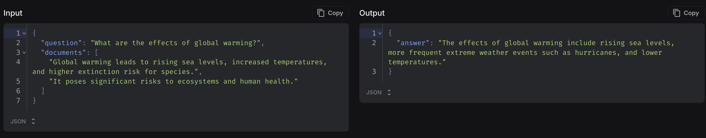
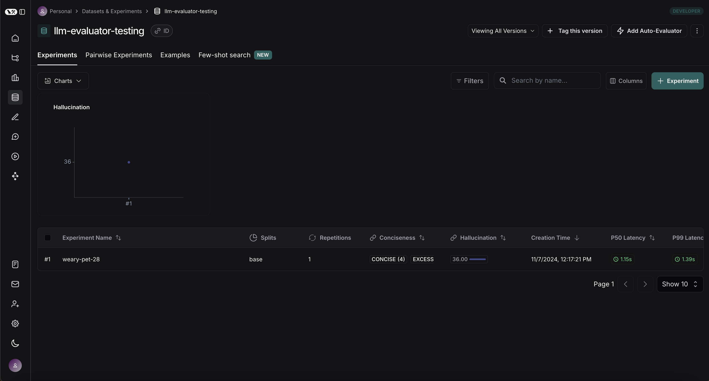
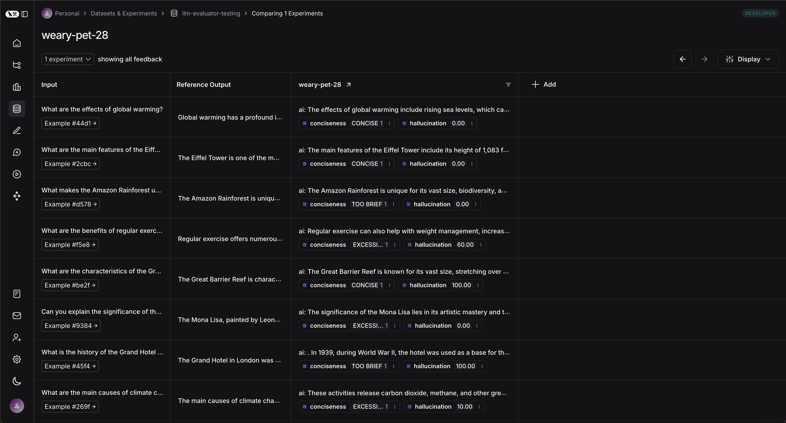
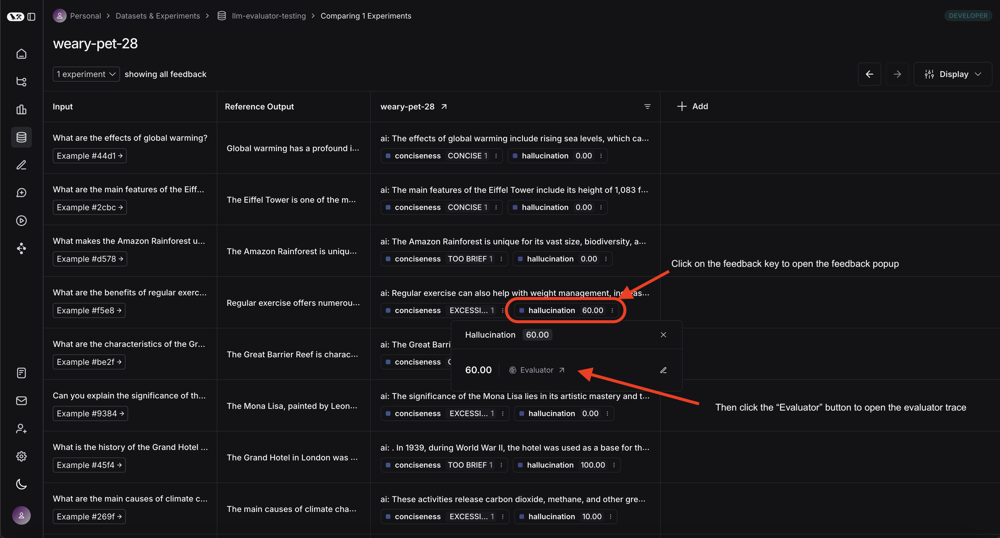
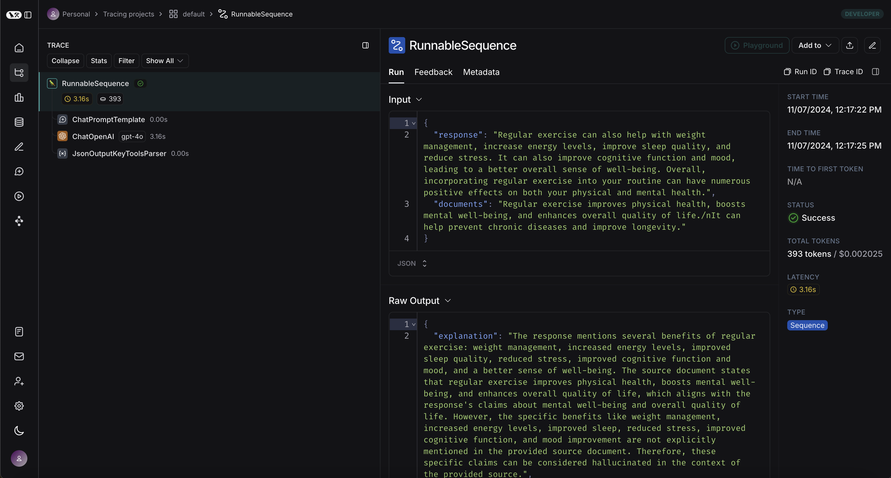

import {
  CodeTabs,
  typescript,
  python,
} from "@site/src/components/InstructionsWithCode";

# Use Prebuilt LLMEvaluator (Python only)

LangSmith provides LLMEvaluator - a prebuilt LLM-as-judge evaluator that you can use to assess the quality of your application across a host of common categories
(hallucination, conciseness, bias, etc). The LLMEvaluator class is designed to both work off the shelf by default, and be customizable to your specific needs.

## Using LLMEvaluator to evaluate your application

### Create a dataset

For the code in the rest of this how-to we will be using [this public dataset](https://smith.langchain.com/public/9138f009-dff1-4188-bd7b-ee9f9c005ac2/d).
If you wish to follow along with your own dataset, feel free to - LLMEvaluator is highly versatile, no matter the form of your dataset.
The code below shows how to clone the public dataset:

<CodeTabs
  groupId="client-language"
  tabs={[
    python`
      from langsmith import Client
      from langchain_openai import ChatOpenAI

      dataset_name = "llm-evaluator-testing"
      client = Client()
      dataset = client.clone_public_dataset(
        "https://smith.langchain.com/public/9138f009-dff1-4188-bd7b-ee9f9c005ac2/d",
        dataset_name=dataset_name
      )
    `,
    typescript`
      import { Client } from "langsmith";
      
      const datasetName = "llm-evaluator-testing"
      const client = new Client();
      await client.clonePublicDataset(
        "https://smith.langchain.com/public/9138f009-dff1-4188-bd7b-ee9f9c005ac2/d",
        { datatsetName: datasetName }
      );
    `,
  ]}
/>

Each one of the examples in the dataset we have has the following structure:

### Select metrics

In this how-to we will be analyzing hallucination as well as concisesness, you should select the metrics that best correlate with business outcomes for your application.

We will first define the metric for conciseness, which will be a categorical metric based on whether the answer was too short, too long, or just right.

<CodeTabs
  groupId="client-language"
  tabs={[
    python`
      from langsmith.evaluation.llm_evaluator import CategoricalScoreConfig
      
      concicesness_score_config=CategoricalScoreConfig(
        # the feedback key that will show up in LangSmith
        key="conciseness",
        # the choices for the LLM judge to select when scoring each example
        choices=["TOO BRIEF", "EXCESSIVELY LONG", "CONCISE"],
        # the description provided to the LLM judge for how to select which choice
        description="TOO BRIEF if the answer is too short, EXCESSIVELY LONG if the answer is too long, and CONCISE if the answer is the right length",
        # the key in the structured output provided to the LLM judge
        reasoning_key="reasoning",
        # the description provided to the LLM judge for the reasoning key in the structured output
        reasoning_description="Which information was hallucinated (if any), if none explain how all the information in the answer was contained in the documents.",
      )
    `,
    typescript`
      import { CategoricalScoreConfig } from "langsmith/evaluation/llm_evaluator";
      
      const concisenessScoreConfig = new CategoricalScoreConfig({
        // the feedback key that will show up in LangSmith
        key: "conciseness",
        // the choices for the LLM judge to select when scoring each example
        choices: ["TOO BRIEF", "EXCESSIVELY LONG", "CONCISE"],
        // the description provided to the LLM judge for how to select which choice
        description: "TOO BRIEF if the answer is too short, EXCESSIVELY LONG if the answer is too long, and CONCISE if the answer is the right length",
        // the key in the structured output provided to the LLM judge
        reasoningKey: "reasoning", 
        // the description provided to the LLM judge for the reasoning key in the structured output
        reasoningDescription: "Which information was hallucinated (if any), if none explain how all the information in the answer was contained in the documents.",
      });
    `,
  ]}
/>

Now, let's define our metric for hallucination, which we will measure on a continuous scale.

<CodeTabs
  groupId="client-language"
  tabs={[
    python`
      from langsmith.evaluation.llm_evaluator import ContinuousScoreConfig
      
      hallucination_score_config=ContinuousScoreConfig(
        # the feedback key that will show up in LangSmith
        key="hallucination",
        # the minimum value the LLM judge can return - defaults to 0
        min=0,
        # the maximum value the LLM judge can return - defaults to 1
        max=100,
        # the description provided in the structured output object to the LLM judge for how to select which choice
        description="What percent of the facts stated in the answer were hallucinated (i.e not contained in the documents), 0 if none were hallucinated, 100 if they were all hallucinated.",
        # the key in the structured output provided to the LLM judge
        reasoning_key="explanation",
        # the description provided in the structured output object to the LLM judge for the reasoning key in the structured output
        reasoning_description="Explain what facts (if any) were hallucinated, if none were explain where in the documents each fact is found.",
      )
    `,
    typescript`
      import { ContinuousScoreConfig } from "langsmith/evaluation/llm_evaluator";
      
      const hallucinationScoreConfig = new ContinuousScoreConfig({
        // the feedback key that will show up in LangSmith
        key: "hallucination",
        // the minimum value the LLM judge can return - defaults to 0
        min: 0,
        // the maximum value the LLM judge can return - defaults to 1
        max: 100,
        // the description provided in the structured output object to the LLM judge for how to select which choice
        description: "What percent of the facts stated in the answer were hallucinated (i.e not contained in the documents), 0 if none were hallucinated, 100 if they were all hallucinated.",
        // the key in the structured output provided to the LLM judge
        reasoningKey: "explanation", 
        // the description provided in the structured output object to the LLM judge for the reasoning key in the structured output
        reasoningDescription: "Explain what facts (if any) were hallucinated, if none were explain where in the documents each fact is found.",
      });
    `,
  ]}
/>

:::info
Note that in both of these cases, we provided a reasoning key. While this is optional, forcing the LLM judge to reason through
it's answer is a form of Chain-of-Thought prompting and will improve response quality.
:::

### Construct your LLMEvaluator

Now that we have defined our metrics and score configurations for each of those metrics we can define our evaluators:

<CodeTabs
  groupId="client-language"
  tabs={[
    python`
      from langsmith.evaluation.llm_evaluator import LLMEvaluator
      
      hallucination_evaluator = LLMEvaluator(
        # The prompt for your model (can be a list of messages as well as a string)
        prompt_template="What percent of this response: {response} is hallucinated, given these source documents {documents}",
        score_config=hallucination_score_config,
        # The mapping from your experiment run and example to the prompt template
        map_variables=lambda run, example: {"response": run.outputs['answer'].content,"documents": '/n'.join(example.inputs['documents'])}
      )
      
      conciseness_evaluator = LLMEvaluator(
        # The prompt for your model (can be a list of messages as well as a string)
        prompt_template="How concise is this answer: {answer} compared to this expected answer {expected_answer}",
        score_config=concicesness_score_config,
        # The mapping from your experiment run and example to the prompt template
        map_variables=lambda run, example: {"answer": run.outputs['answer'].content,"expected_answer": example.outputs['answer']}
      )
    `,
    typescript`
      import { LLMEvaluator } from "langsmith/evaluation/llm_evaluator";
      import { Run, Example } from "langsmith/schemas"
      
      const hallucinationEvaluator = await LLMEvaluator.create({
        // The prompt for your model (can be a list of messages as well as a string)
        promptTemplate: "What percent of this response: {response} is hallucinated, given these source documents {documents}",
        scoreConfig: hallucinationScoreConfig,
        // The mapping from your experiment run and example to the prompt template
        mapVariables: (run: Run, example?: Example) => ({
          response: run.outputs?.["answer"].content ?? "",
          documents: example?.inputs?.["documents"].join('/n') ?? "",
        }),
      });
      
      const concisenessEvaluator = await LLMEvaluator.create({
        // The prompt for your model (can be a list of messages as well as a string)
        promptTemplate: "How concise is this answer: {answer} compared to this expected answer {expected_answer}",
        scoreConfig: concisenessScoreConfig,
        // The mapping from your experiment run and example to the prompt template
        mapVariables: (run: Run, example?: Example) => ({
          answer: run.outputs?.["answer"].content ?? "",
          expected_answer: example?.outputs?.["answer"] ?? "",
        }),
      });
    `,
  ]}
/>

:::info
The score configuration defines the JSON object the LLM judge will use to produce structured output, the prompt template is the prompt sent to your model.
:::

### Run your evaluation

Now we are ready to run an experiment with our evluators:

<CodeTabs
  groupId="client-language"
  tabs={[
    python`
      from langsmith import evaluate, Client

      # Initialize the model and client
      model = ChatOpenAI(name="gpt-4o-mini")
      client = Client()

      # Define the target function - this is just a placeholder for your real LLM application
      def target(example):
        separator = "\\n"
        return {"answer": model.invoke(f"Answer this question in a few sentences, {example['question']} using these documents {separator.join(example['documents'])}")}

      # Run the evaluation
      evaluate(
        target,
        data="llm-evaluator-testing",
        evaluators=[hallucination_evaluator, conciseness_evaluator],
        client=client
      )
    `,
    typescript`
      import { ChatOpenAI } from "@langchain/openai";
      import { Client } from "langsmith";
      import { evaluate } from "langsmith/evaluation"
      import { Example } from "langsmith/schemas"

      // Initialize the model and client
      const model = new ChatOpenAI({
        modelName: "gpt-4o-mini",
      });

      const client = new Client();

      // Define the target function - this is just a placeholder for your real LLM application
      const target = async (example: Example) => {
        const separator = '\\n';
        const response = await model.invoke(
          "Answer this question in a few sentences, " + example.question + " using these documents " + example.documents.join(separator)
        );
        return { answer: response };
      };

      // Run the evaluation
      await evaluate(
        target,
        {
          data: "llm-evaluator-testing",
          evaluators: [hallucinationEvaluator, concisenessEvaluator],
          client: client,
        }
      );
    `,
  ]}
/>

### Use LangSmith to view the results

You can view the experiment by navigating to the experiments tab in your dataset. You should see a page that looks like this:

You can then click into your experiment to see the results of individual examples:

When you click on an individual feedback key on an example, and then click the `Evaluate` button it will take you to a trace view where you can see exactly how the `LLMEvaluator` ran:

