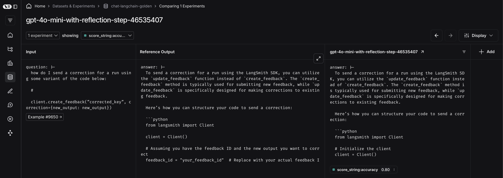
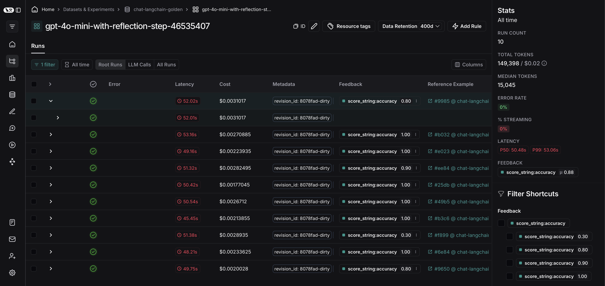
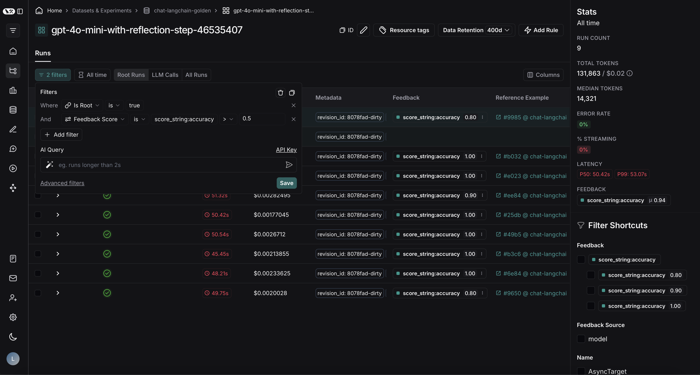
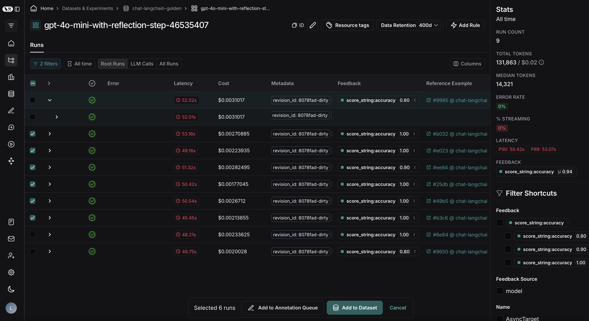

# How to export filtered traces from experiment to dataset

After running an offline evaluation in LangSmith, you may want to export traces that met some evaluation criteria to a dataset.

## View experiment traces

To do so, first click on the arrow next to your experiment name. This will direct you to a project that contains the traces generated from your experiment.

From there, you can filter the traces based on your evaluation criteria. In this example, I want to filter for all traces that received an accuracy score greater than 0.5.

Afte applying the filter on my project, I can multi-select runs I'd like to add to my dataset, and click the 'Add to Dataset' at the bottom of my screen.

