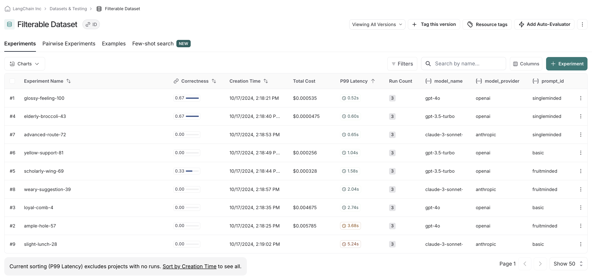
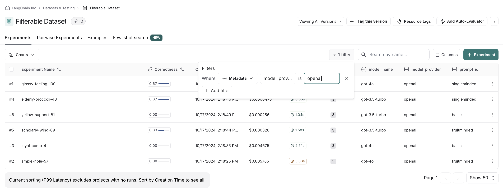
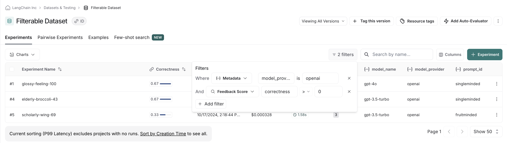
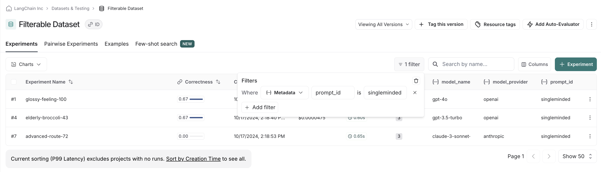

import {
  CodeTabs,
  python,
  typescript,
  PythonBlock,
  TypeScriptBlock,
} from "@site/src/components/InstructionsWithCode";

# How to filter experiments in the UI

LangSmith lets you filter your previous experiments by feedback scores and metadata to make it easy
to find only the experiments you care about.

## Background: add metadata to your experiments

When you run an experiment in the SDK, you can attach metadata to make it easier to filter in UI. This
is helpful if you know what axes you want to drill down into when running experiments.

In our example, we are going to attach metadata to our experiment around the model used, the model provider,
and a known ID of the prompt:

<CodeTabs
  groupId="client-language"
  tabs={[
    python`
      models = {
          "openai-gpt-4o": ChatOpenAI(model="gpt-4o", temperature=0),
          "openai-gpt-4o-mini": ChatOpenAI(model="gpt-4o-mini", temperature=0),
          "anthropic-claude-3-sonnet-20240229": ChatAnthropic(temperature=0, model_name="claude-3-sonnet-20240229")
      }
      prompts = {
          "singleminded": "always answer questions with the word banana.",
          "fruitminded": "always discuss fruit in your answers.",
          "basic": "you are a chatbot."
      }
      def answer_evaluator(run, example) -> dict:
          llm = ChatOpenAI(model="gpt-4o", temperature=0)
          answer_grader = hub.pull("langchain-ai/rag-answer-vs-reference") | llm \n
          score = answer_grader.invoke(
              {
                  "question": example.inputs["question"],
                  "correct_answer": example.outputs["answer"],
                  "student_answer": run.outputs,
              }
          )
          return {"key": "correctness", "score": score["Score"]}
          
      dataset_name = "Filterable Dataset"
      for model_type, model in models.items():
          for prompt_type, prompt in prompts.items():
              
              def predict(example):
                  return model.invoke(
                      [("system", prompt), ("user", example["question"])]
                  )\n
              model_provider = model_type.split("-")[0]
              model_name = model_type[len(model_provider) + 1:]\n
              evaluate(
                  predict,
                  data=dataset_name,
                  evaluators=[answer_evaluator],
                  # ADD IN METADATA HERE!!
                  metadata={
                      "model_provider": model_provider,
                      "model_name": model_name,
                      "prompt_id": prompt_type
                  }
              )
    `,
  ]}
/>

## Filter experiments in the UI

In the UI, we see all experiments that have been run by default.

If we, say, have a preference for openai models, we can easily filter down and see scores within just openai
models first:

We can stack filters, allowing us to filter out low scores on correctness to make sure we only compare
relevant experiments:

Finally, we can clear and reset filters. For example, if we see there is clear there's a winner with the
`singleminded` prompt, we can change filtering settings to see if any other model providers' models work
as well with it:

