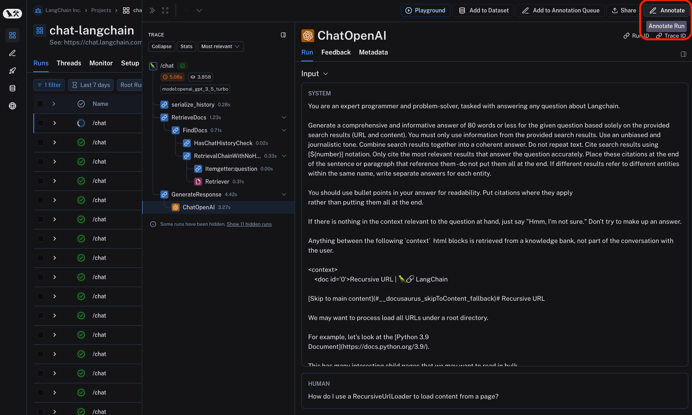
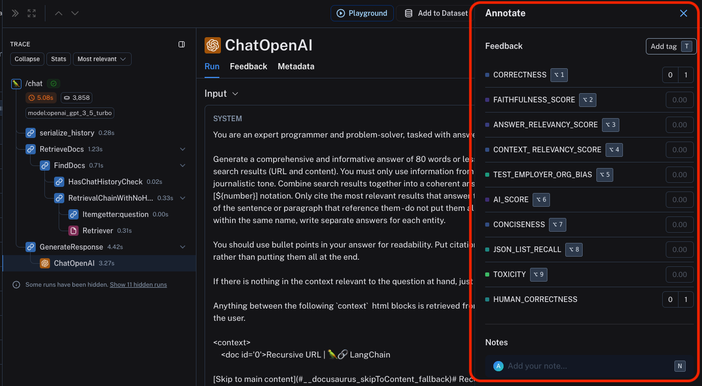

# Annotate traces and runs inline

LangSmith allows you to manually annotate traces with feedback within the application. This can be useful for adding context to a trace, such as a user's comment or a note about a specific issue.
You can annotate a trace either inline or by sending the trace to an annotation queue, which allows you closely inspect and log feedbacks to runs one at a time.
Feedback tags are associated with your [workspace](../../concepts/admin#workspaces).

:::note

You can attach user feedback to ANY intermediate run (span) of the trace, not just the root span.
This is useful for critiquing specific parts of the LLM application, such as the retrieval step or generation step of the RAG pipeline.

:::

To annotate a trace inline, click on the `Annotate` in the upper right corner of trace view for any particular run that is part of the trace.

This will open up a pane that allows you to choose from feedback tags associated with your workspace and add a score for particular tags. You can also add a standalone comment. Follow [this guide](./set_up_feedback_criteria) to set up feedback tags for your workspace.
You can also set up new feedback criteria from within the pane itself.

You can use the labeled keyboard shortcuts to streamline the annotation process.
