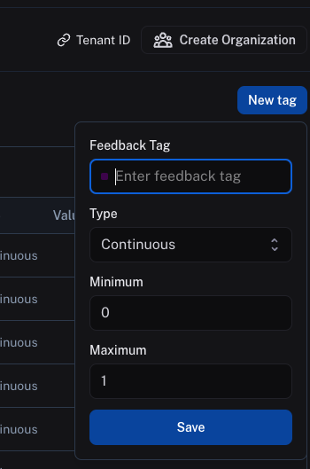
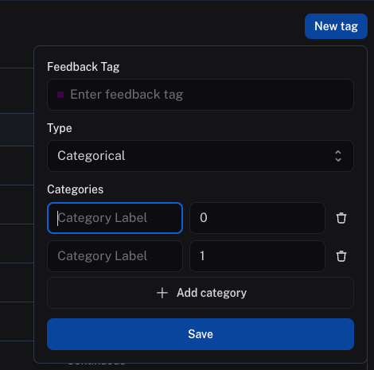

import { RegionalUrl } from "@site/src/components/RegionalUrls";

# Set up feedback criteria

:::tip Recommended Reading
Before diving into this content, it might be helpful to read the following:

- [Conceptual guide on tracing and feedback](../../concepts/tracing)
- [Reference guide on feedback data format](../../reference/data_formats/feedback_data_format)

:::

Feedback criteria are represented in the application as feedback tags. For human feedback, you can set up new feedback criteria as continuous feedback or categorical feedback.

To set up a new feedback criteria, follow <RegionalUrl text='this link' suffix='/settings/workspaces/feedbacks'/> to view all existing tags for your workspace, then click **New Tag**.

## Continuous feedback

For continuous feedback, you can enter a feedback tag name, then select a minimum and maximum value. Every value, including floating-point numbers, within this range will be accepted as feedback scores.

## Categorical feedback

For categorical feedback, you can enter a feedback tag name, then add a list of categories, each category mapping to a score. When you provide feedback, you can select one of these categories as the feedback score.
Both the category label and the score will be logged as feedback in `value` and `score` fields, respectively.

