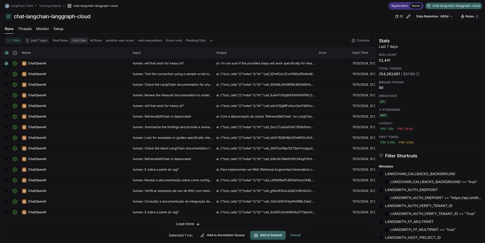
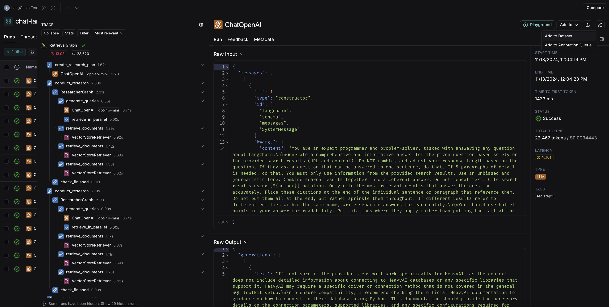
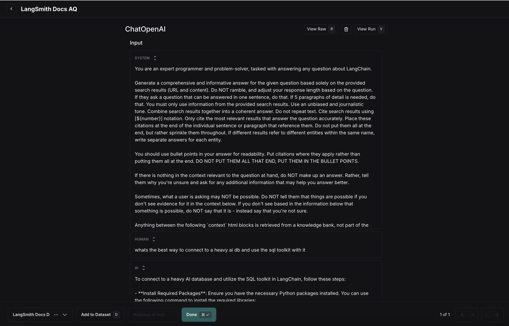
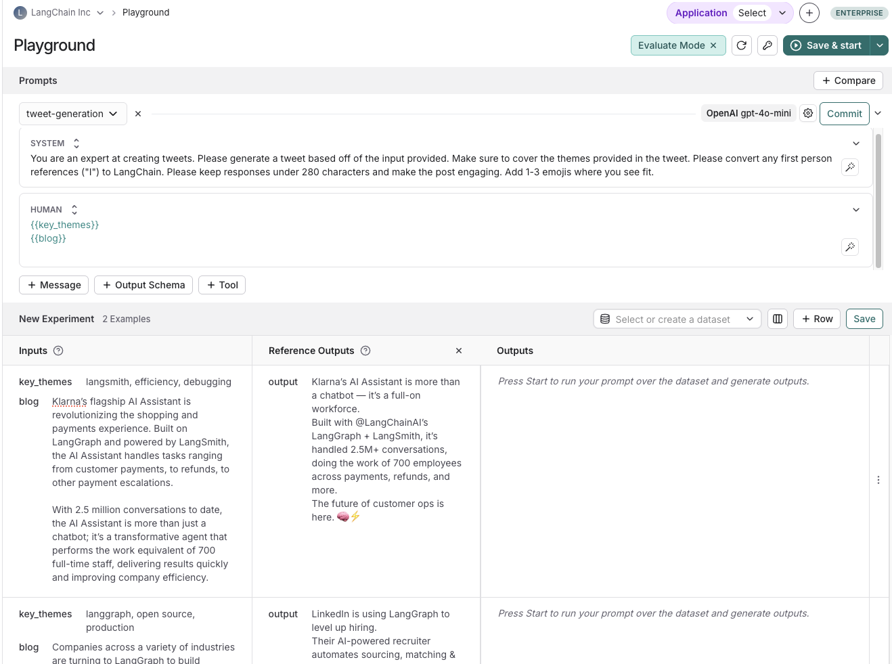
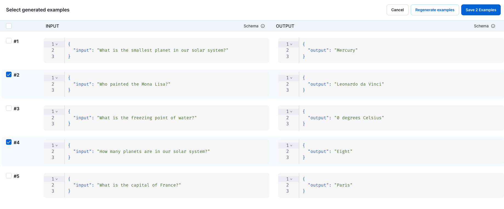
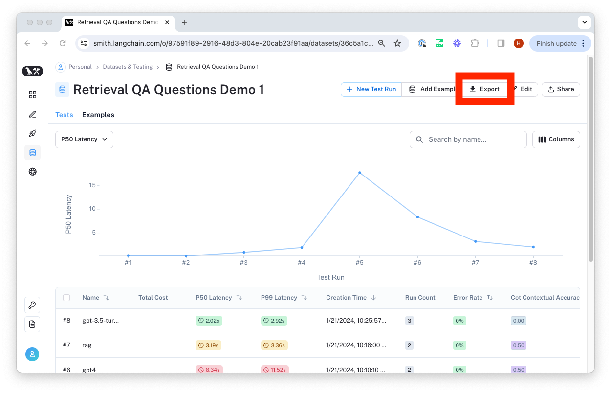
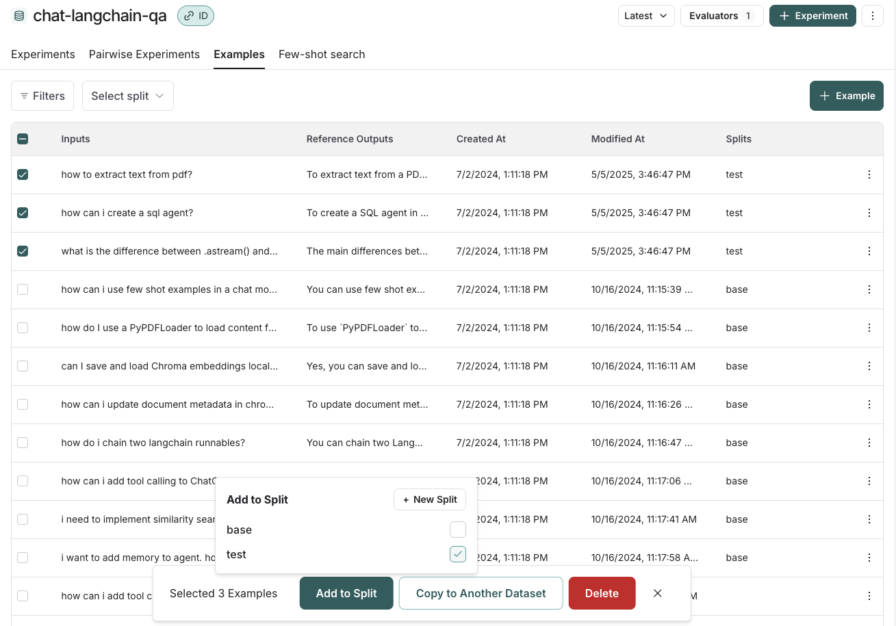
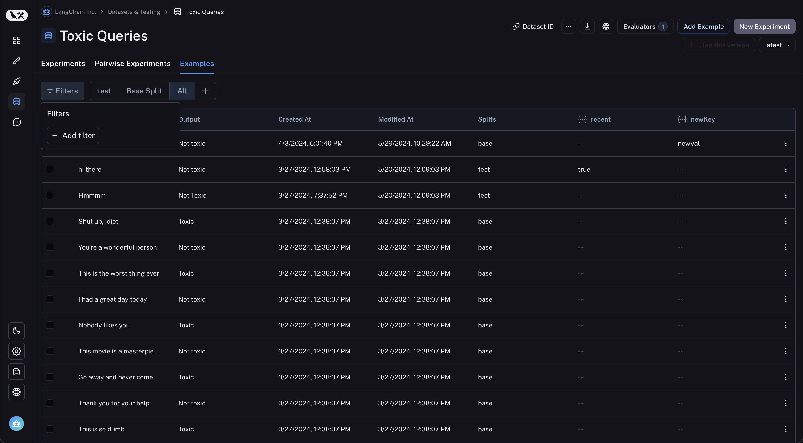
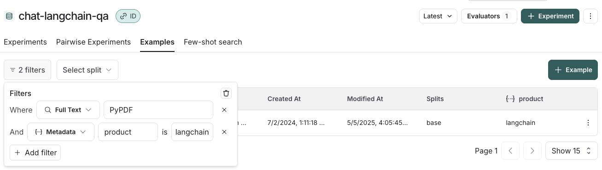

# Creating and Managing Datasets in the UI

[Datasets](/evaluation/concepts#datasets) let you collect and store the data you want to evaluate over. They enable you to perform repeatable evaluations over time using consistent data. Datasets are made up of [examples](/evaluation/concepts#examples), which store inputs, outputs, and optionally, reference outputs.

:::tip Recommended Reading
For more information on datasets, evaluations and examples, read the [concepts guide on evaluation and datasets](../concepts#datasets-and-examples).
:::

This guide outlines the various methods for creating and editing datasets in LangSmith's UI. 

## Create a Dataset

### From the Datasets page

On the **Datasets & Experiments** page, click **+New Dataset**, then choose to either **Create an empty dataset** or **Import** an existing dataset from CSV or JSONL file. You can optionally create a [dataset schema](/evaluation/how_to_guides/manage_datasets_in_application#create-a-dataset-schema) to validate your dataset. 

### From the Playground

On the [**Playground**](/prompt_engineering/concepts#prompt-playground) page, select **Set up Evaluation**, click **+New** if you're starting a new dataset or select from an existing dataset. 

## Add Examples to a Dataset

### Manually from a tracing project 
A common pattern for constructing datasets is to convert notable traces from your application into dataset examples. This approach requires that you have [tracing to LangSmith configured](/observability/how_to_guides#tracing-configuration). 

:::tip
A powerful technique to build datasets is to filter-down into the most interesting traces, such as traces that were tagged with poor user feedback, and add them to a dataset.
For tips on how to filter traces, see the [filtering traces](../../../observability/how_to_guides/filter_traces_in_application) guide.
:::

There are two ways to manually add data from a tracing projects to datasets.

1) Multi-select runs from the runs table:

2) Navigate to the run details page and click `Add to -> Dataset` on the top right corner:

When you select a dataset from the run details page, a modal will pop up letting you know if any [transformations](/reference/evaluation/dataset_transformations) were applied or if schema validation failed. For example, the screenshot below shows a dataset that is using transformations to optimize for collecting LLM runs. 

You can then optionally edit the run before adding it to the dataset.

### Automatically from a tracing project

You can use [run rules](../../../observability/how_to_guides/rules) to automatically add traces to a dataset based on certain conditions. For example, you could add all traces that are [tagged](/observability/concepts#tags) with a specific use case or have a [low feedback score](/observability/concepts#feedback). 

### From examples in an Annotation Queue

:::tip
If you rely on subject matter experts to build meaningful datasets, use [annotation queues](/evaluation/how_to_guides/annotation_queues) to provide a streamlined view for human reviewiers to review and optionally modify the inputs/outputs/reference outputs from a trace before it is added to the dataset. 
:::

Annotation queues are can be optionally configured with a default dataset, though you can add runs to any dataset by using the dataset switcher on the bottom of the screen. Once you select the right dataset, you click `Add to Dataset` or hit the hot key `D` to add the run to it.

Any modifications you make to the run in your annotation queue will carry over to the dataset, and all metadata associated with the run will also be copied.

Note you can also set up rules to add runs that meet specific criteria to an annotation queue using [automation rules](/observability/how_to_guides/rules). 

### From the prompt playground

On the **Playground** page, select **Set up Evaluation**, click **+New** if you're starting a new dataset or select from an existing dataset. 

:::note
Creating datasets inline in the playground is not supported for datasets that have nested keys. In order to add/edit examples with nested keys, you must edit [from the datasets page](/evaluation/how_to_guides/manage_datasets_in_application#from-the-datasets-page). 
:::

Create a dataset from scratch in the [playground](/prompt_engineering/concepts#prompt-playground). 

### From the datasets page

From the **Datasets & Experiments** page, select a dataset, go to the **Examples** tab, and **+ Example`**. This will let you define examples in JSON inline.

#### Add synthetic examples created by an LLM via the Datasets UI

If you have a schema defined on your dataset, when you click `+ Example` you'll see an option to `Generate examples`. This will use an LLM to create synthetic examples.

You have to do the following:

1. **Select few-shot examples**: Choose a set of examples to guide the LLM's generation. You can manually select these examples from your dataset or use the automatic selection option.
2. **Specify the number of examples**: Enter the number of synthetic examples you want to generate.
3. **Configure API Key**: Ensure your OpenAI API key is entered at the "API Key" link.
   

After clicking "Generate," the examples will appear on the page. You can choose which examples to add to your dataset, with the option to edit them before finalizing.
Each example will be validated against your specified dataset schema and tagged as "synthetic" in the source metadata.

## Create a dataset schema 

LangSmith datasets store arbitrary JSON objects. We recommend (but do not require) that you define a schema for your dataset to ensure that they confirm to a specific JSON schema. Dataset schemas are defined with standard [JSON schema](https://json-schema.org/), with the addition of a few [prebuilt types](/reference/data_formats/dataset_json_types)
that make it easier to type common primitives like messages and tools.

Certain fields in your schema have a `+ Transformations` option.
Transformations are preprocessing steps that, if enabled, update your examples when you add them to the dataset.
For example the `convert to OpenAI messages` transformation will convert message-like objects, like LangChain messages, to OpenAI message format.

For the full list of available transformations, see [our reference](/reference/evaluation/dataset_transformations).

:::note
If you plan to collect production traces in your dataset from LangChain
[ChatModels](https://python.langchain.com/docs/concepts/chat_models/)
or from OpenAI calls using the [LangSmith OpenAI wrapper](/observability/how_to_guides/annotate_code#wrap-the-openai-client), we offer a prebuilt Chat Model schema that converts messages and tools into industry standard openai formats that can be used downstream with any model for testing. You can also customize the template settings to match your use case.

Please see the [dataset transformations reference](/reference/evaluation/dataset_transformations) for more information.
:::

## Export a dataset

You can export your LangSmith dataset to CSV or OpenAI evals format directly from the web application.

To do so, click "Export Dataset" from the homepage.
To do so, select a dataset, click on "Examples", and then click the "Export Dataset" button at the top of the examples table.

This will open a modal where you can select the format you want to export to.

## Create and manage dataset splits

Dataset splits are divisions of your dataset that you can use to segment your data. For example, it is common
in machine learning workflows to split datasets into training, validation, and test sets. This can be useful
to prevent overfitting - where a model performs well on the training data but poorly on unseen data. In evaluation
workflows, it can be useful to do this when you have a dataset with multiple categories that you may want to evaluate
separately; or if you are testing a new use case that you may want to include in your dataset in the future, but want
to keep separate for now. Note that the same effect can be achieved manually via metadata - but we expect splits
to be used for higher level organization of your dataset to split it into separate groups for evaluation, whereas
metadata would be used more for storing information on your examples like tags and information about its origin.

In machine learning, it is best practice to keep your splits separate (each example belongs to exactly one split).
However, we allow you to select multiple splits for the same example in LangSmith because it can make sense for
some evaluation workflows - for example, if an example falls into multiple categories on which you may want to
evaluate your application.

In order to create and manage splits in the app, you can select some examples in your dataset and click "Add to Split". From the resulting popup menu,
you can select and unselect splits for the selected examples, or create a new split.

## Edit example metadata

You can add metadata to your examples by clicking on an example and then clicking on the "Metadata" tab in the side pane.
From this page, you can update/delete existing metadata, or add new metadata. You may use this to store information about
your examples, such as tags or version info, which you can [then filter by when you call `list_examples` in the SDK](./manage_datasets_programmatically#list-examples-by-metadata).

## Filter examples

You can filter examples by metadata key/value or full-text search. To filter examples, click "Filter" in the top left of the table:

Next, click "Add filter" and select "Full Text" or "Metadata" from the resulting dropdown. You may add multiple filters, and only examples that satisfy all of the
filters will be displayed in the table.

