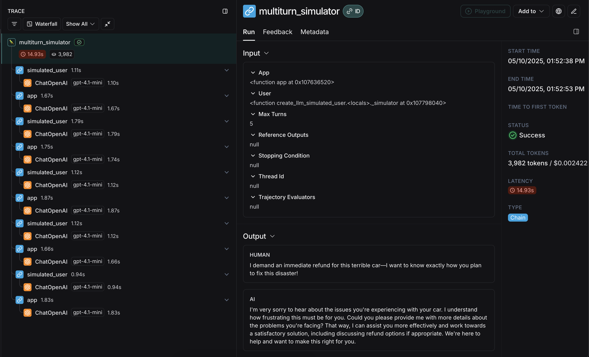
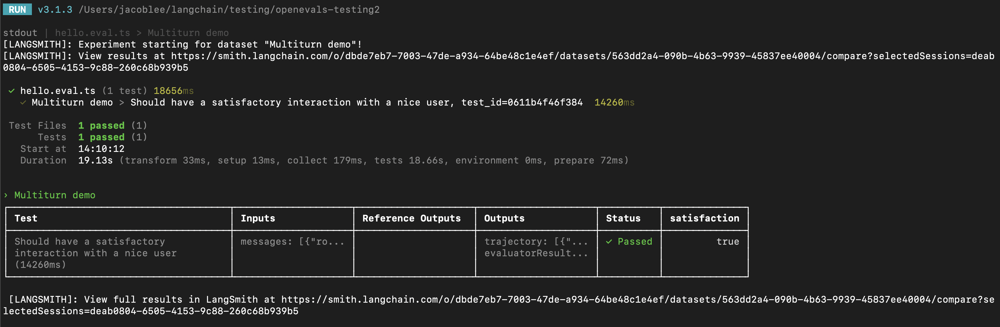

import {
  CodeTabs,
  python,
  typescript,
} from "@site/src/components/InstructionsWithCode";

# How to simulate multi-turn interactions

:::info Key concepts
- [Multi-turn interactions](../concepts#multi-turn-interactions)
- [Evaluators](../concepts#evaluators)
- [LLM-as-judge](../concepts#llm-as-judge)
- [OpenEvals](https://github.com/langchain-ai/openevals)
:::

AI applications with conversational interfaces, like chatbots, operate over multiple interactions with a user, also called conversation *turns*.
When evaluating the performance of such applications, core concepts such as [building a dataset](../../evaluation/concepts#datasets) and defining
[evaluators](../../evaluation/concepts#evaluators) to judge results successful remain useful. When running evals over multi-turn interactions, the dataset should have a trajectory of messages to evaluate over. 


The inputs or outputs for these

However, you may find it useful to instead run a *simulation* between your app and a user, then evaluate this dynamically
created trajectory. Some advantages of this approach are that it doesn't require pre-existing trajectories and can test your app over a wider range
of natural language inputs, though it does introduce more randomness compared to evaluating over prepared trajectories from a dataset.



This guide will show you how to simulate multi-turn interactions using the open-source [`openevals`](https://github.com/langchain-ai/openevals) package,
which contains prebuilt evaluators and other convenient resources for evaluating your AI apps. It will also use OpenAI models,
though you can use other providers as well.

## Setup

First, ensure you have the required dependencies installed:

<CodeTabs
  tabs={[
    {
      value: "python",
      label: "Python",
      language: "bash",
      content: `pip install -U langsmith openevals`,
    },
    {
      value: "typescript",
      label: "TypeScript",
      language: "bash",
      content: `npm install langsmith openevals`,
      footnote: "If you are using `yarn` as your package manager, you will also need to manually install \`@langchain/core\` as a peer dependency of `openevals`. This is not required for LangSmith evals in general.",
    },
  ]}
  groupId="client-language"
/>

And set up your environment variables:

```bash
export LANGSMITH_TRACING="true"
export LANGSMITH_API_KEY="<Your LangSmith API key>"
export OPENAI_API_KEY="<Your OpenAI API key>"
```

## Running a simulation

There are two primary components you'll need to get started:

- `app`: Your application, or a function wrapping it. Must accept a single chat message (dict with "role" and "content" keys) as an input arg and a `thread_id` as a kwarg.
Should accept other kwargs as more may be added in future releases. Returns a chat message as output with at least role and content keys.
- `user`: The simulated user. In this guide, we will use an imported prebuilt function named `create_llm_simulated_user` which uses an LLM to generate user responses, though you can [create your own too](https://github.com/langchain-ai/openevals?tab=readme-ov-file#custom-simulated-users).

The simulator in `openevals` passes a single chat message to your `app` from the `user` for each turn.
Therefore you should statefully track the current history internally based on `thread_id` if needed.

Here's an example that simulates a multi-turn interaction with a simple chat app that wraps a single call to the OpenAI chat completions API.
Our app is a stand-in for a customer support agent, and our simulated user is playing the role of a particularly aggressive customer:

<CodeTabs
  tabs={[
    {
      value: "python",
      label: "Python",
      content: `from openevals.simulators import run_multiturn_simulation, create_llm_simulated_user
from openevals.types import ChatCompletionMessage
from langsmith.wrappers import wrap_openai

from openai import OpenAI

# Wrap OpenAI client for tracing
client = wrap_openai(OpenAI())

history = {}

# Your application logic
def app(inputs: ChatCompletionMessage, *, thread_id: str, **kwargs):
    if thread_id not in history:
        history[thread_id] = []
    history[thread_id].append(inputs)

    # inputs is a message object with role and content
    res = client.chat.completions.create(
        model="gpt-4.1-mini",
        messages=[
            {
                "role": "system",
                "content": "You are a patient and understanding customer service agent.",
            },
        ] + history[thread_id],
    )

    response_message = res.choices[0].message
    history[thread_id].append(response_message)

    return response_message

user = create_llm_simulated_user(
    system="You are an aggressive and hostile customer who wants a refund for their car.",
    model="openai:gpt-4.1-mini",
)

# Run the simulation directly with the new function
simulator_result = run_multiturn_simulation(
    app=app,
    user=user,
    max_turns=5,
)

print(simulator_result)
  `,
    },
    {
      value: "typescript",
      label: "TypeScript",
      language: "typescript",
      content: `import { OpenAI } from "openai";
import { wrapOpenAI } from "langsmith/wrappers/openai";

import {
    createLLMSimulatedUser,
    runMultiturnSimulation,
    type ChatCompletionMessage,
} from "openevals";

// Wrap OpenAI client for tracing
const client = wrapOpenAI(new OpenAI());

const history = {};

// Your application logic
const app = async ({ inputs, threadId }: { inputs: ChatCompletionMessage, threadId: string }) => {
    if (history[threadId] === undefined) {
      history[threadId] = [];
    }
    history[threadId].push(inputs);
    const res = await client.chat.completions.create({
      model: "gpt-4.1-mini",
      messages: [
        {
          role: "system",
          content:
            "You are a patient and understanding customer service agent.",
        },
        inputs,
      ],
    });
    const responseMessage = res.choices[0].message;
    history[threadId].push(responseMessage);
    return res.choices[0].message;
};

const user = createLLMSimulatedUser({
    system: "You are an aggressive and hostile customer who wants a refund for their car.",
    model: "openai:gpt-4.1-mini",
});

const result = await runMultiturnSimulation({
    app,
    user,
    maxTurns: 5,
});

console.log(result);
        `
    }
  ]}
  groupId="client-language"
/>

The response looks like this:

```ts
{
  trajectory: [
    {
      role: 'user',
      content: 'This piece of junk car is a complete disaster! I demand a full refund immediately. How dare you sell me such a worthless vehicle!',
      id: 'chatcmpl-BUpXa07LaM7wXbyaNnng1Gtn5Dsbh'
    },
    {
      role: 'assistant',
      content: "I'm really sorry to hear about your experience and understand how frustrating this must be. I’d like to help resolve this issue as smoothly as possible. Could you please provide some details about the problem with the vehicle? Once I have more information, I’ll do my best to assist you with a solution, whether it’s a refund or other options. Thank you for your patience.",
      refusal: null,
      annotations: [],
      id: 'd7520f6a-7cf8-46f8-abe4-7df04f134482'
    },
    ...
    {
      role: 'assistant',
      content: "I truly understand your frustration and sincerely apologize for the inconvenience you've experienced. I want to resolve this issue for you as quickly as possible. \n" +
        '\n' +
        'Please allow me a moment to review your case, and I will do everything I can to expedite your refund. Your patience is greatly appreciated, and I am committed to resolving this matter to your satisfaction.',
      refusal: null,
      annotations: [],
      id: 'a0536d4f-9353-4cfa-84df-51c8d29e076d'
    }
  ]
}
```


The simulation first generates an initial query from the simulated `user`, then passes response chat messages
back and forth until it reaches `max_turns` (you can alternatively pass a `stopping_condition` that takes
the current trajectory and returns `True` or `False` - [see the OpenEvals README for more information](https://github.com/langchain-ai/openevals?tab=readme-ov-file#multiturn-simulation)).
The return value is the final list of chat messages that make up the converation's **trajectory**.

:::info
There are several ways to configure the simulated user, such as having it return fixed responses for the first turns of your simulation,
as well as the simulation as a whole. For full details, check out [the OpenEvals README](https://github.com/langchain-ai/openevals?tab=readme-ov-file#multiturn-simulation).
:::

The final trace will look something [like this](https://smith.langchain.com/public/648ca37d-1c4d-4f7b-9b6a-89e35dc5d4f0/r) with responses from your `app` and `user` interleaved:


Congrats! You just ran your first multi-turn simulation. Next, we'll cover how to run it in a LangSmith experiment.

## Running in LangSmith experiments

You can use the results of multi-turn simulations as part of a LangSmith experiment to track performance and progress over time.
For these sections, it helps to be familiar with at least one of LangSmith's [`pytest`](https://docs.smith.langchain.com/evaluation/how_to_guides/pytest) (Python-only),
[`Vitest`/`Jest`](https://docs.smith.langchain.com/evaluation/how_to_guides/vitest_jest) (JS only),
or [`evaluate`](https://docs.smith.langchain.com/evaluation/how_to_guides/evaluate_llm_application) runners.

### Using `pytest` or `Vitest/Jest`

:::tip
See the following guides to learn how to set up evals using LangSmith's integrations with test frameworks:

- [`pytest`](https://docs.smith.langchain.com/evaluation/how_to_guides/pytest)
- [`Vitest` or `Jest`](https://docs.smith.langchain.com/evaluation/how_to_guides/vitest_jest)
:::

If you are using one of the [LangSmith test framework integrations](https://docs.smith.langchain.com/evaluation/how_to_guides#testing-integrations),
you can pass in an array of OpenEvals evaluators as a `trajectory_evaluators` param when running the simulation.
These evaluators will run at the end of the simulation, taking the final list of chat messages as
an `outputs` kwarg. Your passed `trajectory_evaluator` must therefore accept this kwarg.



Here's an example:

<CodeTabs
  tabs={[
    {
      value: "python",
      label: "Python",
      content: `from openevals.simulators import run_multiturn_simulation, create_llm_simulated_user
from openevals.llm import create_llm_as_judge
from openevals.types import ChatCompletionMessage

from langsmith import testing as t
from langsmith.wrappers import wrap_openai

from openai import OpenAI

import pytest

@pytest.mark.langsmith
def test_multiturn_message_with_openai():
    inputs = {"role": "user", "content": "I want a refund for my car!"}
    t.log_inputs(inputs)

    # Wrap OpenAI client for tracing
    client = wrap_openai(OpenAI())

    history = {}

    def app(inputs: ChatCompletionMessage, *, thread_id: str):
        if thread_id not in history:
            history[thread_id] = []
        history[thread_id] = history[thread_id] + [inputs]
        res = client.chat.completions.create(
            model="gpt-4.1-nano",
            messages=[
                {
                    "role": "system",
                    "content": "You are a patient and understanding customer service agent.",
                }
            ]
            + history[thread_id],
        )
        response = res.choices[0].message
        history[thread_id].append(response)
        return response

    user = create_llm_simulated_user(
        system="You are a nice customer who wants a refund for their car.",
        model="openai:gpt-4.1-nano",
        fixed_responses=[
            inputs,
        ],
    )

    trajectory_evaluator = create_llm_as_judge(
        model="openai:o3-mini",
        prompt="Based on the below conversation, was the user satisfied?\\n{outputs}",
        feedback_key="satisfaction",
    )

    res = run_multiturn_simulation(
        app=app,
        user=user,
        trajectory_evaluators=[trajectory_evaluator],
        max_turns=5,
    )

    t.log_outputs(res)

    # Optionally, assert that the evaluator scored the interaction as satisfactory.
    # This will cause the overall test case to fail if "score" is False.
    assert res["evaluator_results"][0]["score"]

  `,
    },
    {
      value: "typescript",
      label: "TypeScript",
      language: "typescript",
      content: `import { OpenAI } from "openai";
import { wrapOpenAI } from "langsmith/wrappers/openai";

import * as ls from "langsmith/vitest";
import { expect } from "vitest";
// import * as ls from "langsmith/jest";
// import { expect } from "@jest/globals";

import {
    createLLMSimulatedUser,
    runMultiturnSimulation,
    createLLMAsJudge,
    type ChatCompletionMessage,
} from "openevals";

const client = wrapOpenAI(new OpenAI());

ls.describe("Multiturn demo", () => {
    ls.test(
      "Should have a satisfactory interaction with a nice user",
      {
        inputs: {
          messages: [{ role: "user" as const, content: "I want a refund for my car!" }],
        },
      },
      async ({ inputs }) => {        
        const history = {};

        // Create a custom app function
        const app = async (
          { inputs, threadId }: { inputs: ChatCompletionMessage, threadId: string }
        ) => {
          if (history[threadId] === undefined) {
            history[threadId] = [];
          }
          history[threadId].push(inputs);
          const res = await client.chat.completions.create({
            model: "gpt-4.1-nano",
            messages: [
              {
                role: "system",
                content:
                  "You are a patient and understanding customer service agent",
              },
              inputs,
            ],
          });
          const responseMessage = res.choices[0].message;
          history[threadId].push(responseMessage);
          return responseMessage;
        };

        const user = createLLMSimulatedUser({
          system:
            "You are a nice customer who wants a refund for their car.",
          model: "openai:gpt-4.1-nano",
          fixedResponses: inputs.messages,
        });

        const trajectoryEvaluator = createLLMAsJudge({
          model: "openai:o3-mini",
          prompt:
            "Based on the below conversation, was the user satisfied?\\n{outputs}",
          feedbackKey: "satisfaction",
        });

        const result = await runMultiturnSimulation({
          app,
          user,
          trajectoryEvaluators: [trajectoryEvaluator],
          maxTurns: 5,
        });
        
        ls.logOutputs(result);

        // Optionally, assert that the evaluator scored the interaction as satisfactory.
        // This will cause the overall test case to fail if "score" is false.
        expect(result.evaluatorResults[0].score).toBe(true);
      }
    );
  });

        `
    }
  ]}
  groupId="client-language"
/>

LangSmith will automatically detect and log the feedback returned from the passed `trajectory_evaluators`, adding it to the experiment.
Note also that the test case uses the `fixed_responses` param on the simulated user to start the conversation with a specific input,
which you can log and make part of your stored dataset.

You may also find it convenient to have the simulated user's system prompt to be part of your logged dataset as well.

### Using `evaluate`

You can also use the [`evaluate`](https://docs.smith.langchain.com/evaluation/how_to_guides/evaluate_llm_application)
runner to evaluate simulated multi-turn interactions. This will be a little bit different from the `pytest`/`Vitest`/`Jest` example in the following ways:

- The simulation should be part of your `target` function, and your target function should return the final trajectory.
  - This will make the trajectory the `outputs` that LangSmith will pass to your evaluators.
- Instead of using the `trajectory_evaluators` param, you should pass your evaluators as a param into the `evaluate()` method.
- You will need an existing dataset of inputs and (optionally) reference trajectories.

Here's an example:

<CodeTabs
  tabs={[
    {
      value: "python",
      label: "Python",
      content: `from openevals.simulators import run_multiturn_simulation, create_llm_simulated_user
from openevals.llm import create_llm_as_judge
from openevals.types import ChatCompletionMessage

from langsmith.wrappers import wrap_openai
from langsmith import Client

from openai import OpenAI

ls_client = Client()

examples = [
    {
        "inputs": {
            "messages": [{ "role": "user", "content": "I want a refund for my car!" }]
        }, 
    },
]

dataset = ls_client.create_dataset(dataset_name="multiturn-starter")

ls_client.create_examples(
    dataset_id=dataset.id, 
    examples=examples,
)

trajectory_evaluator = create_llm_as_judge(
    model="openai:o3-mini",
    prompt="Based on the below conversation, was the user satisfied?\\n{outputs}",
    feedback_key="satisfaction",
)

def target(inputs: dict):
    # Wrap OpenAI client for tracing
    client = wrap_openai(OpenAI())

    history = {}

    def app(next_message: ChatCompletionMessage, *, thread_id: str):
        if thread_id not in history:
            history[thread_id] = []
        history[thread_id] = history[thread_id] + [next_message]
        res = client.chat.completions.create(
            model="gpt-4.1-nano",
            messages=[
                {
                    "role": "system",
                    "content": "You are a patient and understanding customer service agent.",
                }
            ]
            + history[thread_id],
        )
        response = res.choices[0].message
        history[thread_id].append(response)
        return response

    user = create_llm_simulated_user(
        system="You are a nice customer who wants a refund for their car.",
        model="openai:gpt-4.1-nano",
        fixed_responses=inputs["messages"],
    )

    res = run_multiturn_simulation(
        app=app,
        user=user,
        max_turns=5,
    )

    return res["trajectory"]

results = ls_client.evaluate(
    target,
    data=dataset.name,
    evaluators=[trajectory_evaluator],
)

  `,
    },
    {
      value: "typescript",
      label: "TypeScript",
      language: "typescript",
      content: `import { OpenAI } from "openai";

import { Client } from "langsmith";
import { wrapOpenAI } from "langsmith/wrappers/openai";
import { evaluate } from "langsmith/evaluation";

import {
    createLLMSimulatedUser,
    runMultiturnSimulation,
    createLLMAsJudge,
    type ChatCompletionMessage,
} from "openevals";

const lsClient = new Client();

const inputs = {
    messages: [
      {
        role: "user",
        content: "I want a refund for my car!",
      },
    ],
};

const datasetName = "Multiturn";
const dataset = await lsClient.createDataset(datasetName);
await lsClient.createExamples([{ inputs, dataset_id: dataset.id }]);

const trajectoryEvaluator = createLLMAsJudge({
    model: "openai:o3-mini",
    prompt:
      "Based on the below conversation, was the user satisfied?\\n{outputs}",
    feedbackKey: "satisfaction",
});

const client = wrapOpenAI(new OpenAI());

const target = async (inputs: { messages: ChatCompletionMessage[]}) => {
    const history = {};

    // Create a custom app function
    const app = async (
      { inputs: nextMessage, threadId }: { inputs: ChatCompletionMessage, threadId: string }
    ) => {
      if (history[threadId] === undefined) {
        history[threadId] = [];
      }
      history[threadId].push(nextMessage);
      const res = await client.chat.completions.create({
        model: "gpt-4.1-nano",
        messages: [
          {
            role: "system",
            content:
              "You are a patient and understanding customer service agent",
          },
          nextMessage,
        ],
      });
      const responseMessage = res.choices[0].message;
      history[threadId].push(responseMessage);
      return responseMessage;
    };

    const user = createLLMSimulatedUser({
      system:
        "You are a nice customer who wants a refund for their car.",
      model: "openai:gpt-4.1-nano",
      fixedResponses: inputs.messages,
    });

    const result = await runMultiturnSimulation({
      app,
      user,
      maxTurns: 5,
    });

    return result.trajectory;
};

await evaluate(target, {
    data: datasetName,
    evaluators: [trajectoryEvaluator],
});

        `
    }
  ]}
  groupId="client-language"
/>


## Next Steps

You've just seen some techniques for simulating multi-turn interactions and running them in LangSmith evals.

Here are some topics you might want to explore next:

- [Trace multiturn conversations across different traces](../../observability/how_to_guides/threads)
- [Use multiple messages in the playground UI](../../prompt_engineering/how_to_guides/multiple_messages)
- [Return multiple metrics in one evaluator](../../evaluation/how_to_guides/multiple_scores)

You can also explore the [OpenEvals readme](https://github.com/langchain-ai/openevals) for more on prebuilt evaluators.
