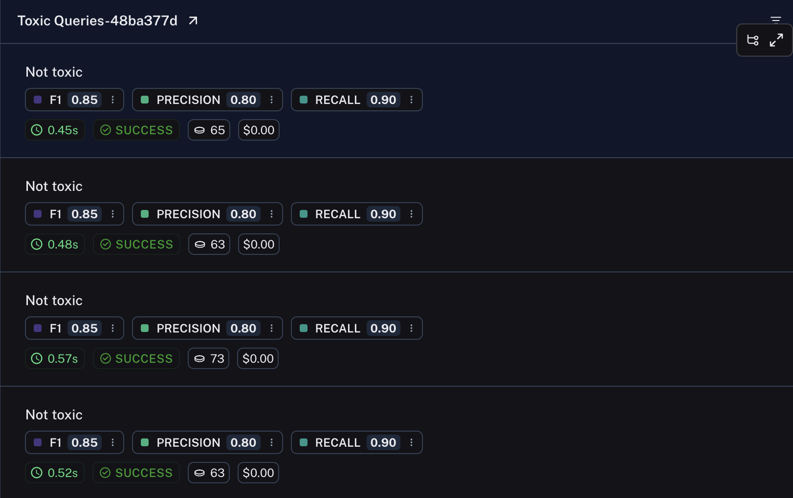

import {
  CodeTabs,
  python,
  typescript,
} from "@site/src/components/InstructionsWithCode";

# How to return multiple scores in one evaluator

Sometimes it is useful for a [custom evaluator function](./custom_evaluator) or [summary evaluator function](./summary) to return multiple metrics.
For example, if you have multiple metrics being generated by an LLM judge, you can save time and money by making a single LLM call that generates multiple metrics instead of making multiple LLM calls.

To return multiple scores using the Python SDK, simply return a list of dictionaries/objects of the following form:

```python
[
    # 'key' is the metric name
    # 'score' is the value of a numerical metric
    {"key": string, "score": number},
    # 'value' is the value of a categorical metric
    {"key": string, "value": string},
    ... # You may log as many as you wish
]
```

To do so with the JS/TS SDK, return an object with a 'results' key and then a list of the above form

```js
{results: [{ key: string, score: number }, ...]};
```

Each of these dictionaries can contain any or all of the [feedback fields](/reference/data_formats/feedback_data_format); check out the linked document for more information.

Example:

<CodeTabs
  groupId="client-language"
  tabs={[
    python({caption: "Requires `langsmith>=0.1.145`"})`
        def multiple_scores(outputs: dict, reference_outputs: dict) -> list[dict]:
            # Replace with real evaluation logic.
            precision = 0.8
            recall = 0.9
            f1 = 0.85

            return [
                {"key": "precision", "score": precision},
                {"key": "recall", "score": recall},
                {"key": "f1", "score": f1},
            ]
    `,
    typescript({
      caption:
        "Support for multiple scores is available in `langsmith@0.1.32` and higher",
    })`
      import type { Run, Example } from "langsmith/schemas";

      function multipleScores(rootRun: Run, example: Example) {
        // Your evaluation logic here
        return {
            results: [
                { key: "precision", score: 0.8 },
                { key: "recall", score: 0.9 },
                { key: "f1", score: 0.85 },
            ],
        };
      }
    `,

]}
/>

Rows from the resulting experiment will display each of the scores.



## Related

- [Return categorical vs numerical metrics](./metric_type)
