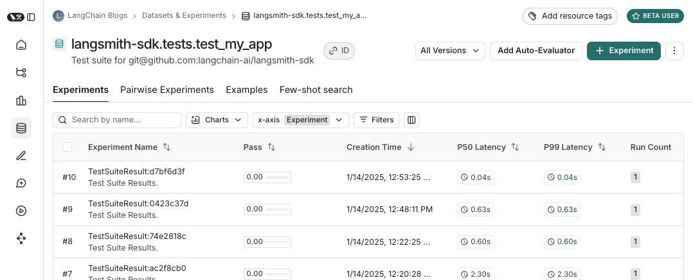
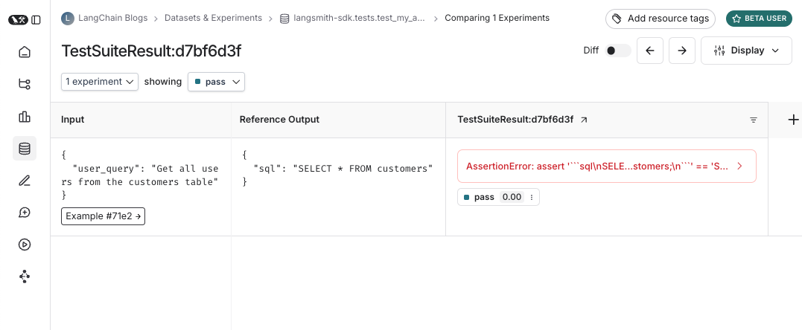

# How to run evals with pytest (beta)

The LangSmith pytest plugin lets Python developers define their datasets and evaluations as pytest test cases.
Compared to the default `evaluate()` evaluation flow, this is useful when:
- Each example requires different evaluation logic
- You want to assert binary expectations, and both track these assertions in LangSmith and raise assertion errors locally (e.g. in CI pipelines)
- You want pytest-like terminal outputs

:::info Installation

Requires Python SDK version `langsmith>=0.3`.

For extra features like rich terminal outputs and test caching install with `pip install -U "langsmith[pytest]"`.

:::

:::info For JS/TS

The JS/TS SDK has an analogous [Vitest/Jest integration](./vitest_jest).

:::

## Define and run tests

The pytest integration lets you define datasets and evaluators as test cases.

To track a test in LangSmith add the `@pytest.mark.langsmith` decorator.
Every decorated test case will be synced to a dataset example. 
When you run the test suite, the dataset will be updated and a new experiment will be created with one result for each test case.

```python
#region
###################### my_app/main.py ######################
import openai
from langsmith import traceable, wrappers

oai_client = wrappers.wrap_openai(openai.OpenAI())

@traceable 
def generate_sql(user_query: str) -> str:
    result = oai_client.chat.completions.create(
        model="gpt-4o-mini",
        messages=[
            {"role": "system", "content": "Convert the user query to a SQL query."},
            {"role": "user", "content": user_query},
        ],
    )
    return result.choices[0].message.content
#endregion

###################### tests/test_my_app.py ######################
import pytest
from langsmith import testing as t

@pytest.mark.langsmith  # <-- Mark as a LangSmith test case
def test_sql_generation_select_all() -> None:
    user_query = "Get all users from the customers table"
    t.log_inputs({"user_query": user_query})  # <-- Log example inputs, optional

    sql = generate_sql(user_query)
    t.log_outputs({"sql": sql})  # <-- Log run outputs, optional

    expected = "SELECT * FROM customers;"
    t.log_reference_outputs({"sql": expected})  # <-- Log example reference outputs, optional

    assert sql == expected  # <-- Test result automatically logged under 'pass' feedback key
```

When you run this test it will have a default `pass` boolean feedback key based on the test case passing / failing.
It will also track any inputs, outputs, and reference (expected) outputs that you log.

Use `pytest` as you normally would to run the tests:

```bash
pytest tests/
```

In most cases we recommend setting a test suite name:

```bash
LANGSMITH_TEST_SUITE='SQL app tests' pytest tests/
```

Each time you run this test suite, LangSmith:
- creates a [dataset](../concepts/#datasets) for each test file. If a dataset for this test file already exists it will be updated
- creates an [experiment](../concepts/#experiment) in each created/updated dataset
- creates an experiment row for each test case
- collects the pass/fail rate under the `pass` feedback key for each test case

Here's what a test suite dataset looks like:



And what an experiment against that test suite looks like:



## Trace inputs, outputs, and reference outputs

Every time we run a test we're syncing it to a dataset example and tracing it as a run.
There's a few different ways that we can trace the example inputs and reference outputs and the run outputs.
The simplest is to use the `log_inputs`, `log_outputs`, and `log_reference_outputs` methods.
You can run these any time in a test to update the example and run for that test:

```python
import pytest
from langsmith import testing as t

@pytest.mark.langsmith
def test_foo() -> None:
    t.log_inputs({"a": 1, "b": 2})
    t.log_reference_outputs({"foo": "bar"})
    t.log_outputs({"foo": "baz"})
    assert True
```

Running this test will create/update an example with name "test_foo", inputs `{"a": 1, "b": 2}`, reference outputs `{"foo": "bar"}` and trace a run with outputs `{"foo": "baz"}`.

Another way to define example inputs and reference outputs is via pytest fixtures/parametrizations.
By default any arguments to your test function will be logged as inputs on the corresponding example.
If certain arguments are meant to represet reference outputs, you can specify that they should be logged as such using `@pytest.mark.langsmith(output_keys=["name_of_ref_output_arg"])`:

```python
import pytest

@pytest.fixture
def c() -> int:
    return 5

@pytest.fixture
def d() -> int:
    return 6

@pytest.mark.langsmith(output_keys=["d"])
def test_cd(c: int, d: int) -> None:
    result = 2 * c
    t.log_outputs({"d": result})  # Log run outputs
    assert result == d
```

This will create/sync an example with name "test_cd", inputs `{"c": 5}` and reference outputs `{"d": 6}`, and run output `{"d": 10}`.

## Trace feedback

By default LangSmith collects the pass/fail rate under the `pass` feedback key for each test case.
You can add additional feedback with `log_feedback`:

```python
import openai
import pytest
from langsmith import wrappers
from langsmith import testing as t

oai_client = wrappers.wrap_openai(openai.OpenAI())

@pytest.mark.langsmith
def test_offtopic_input() -> None:
    user_query = "whats up"
    t.log_inputs({"user_query": user_query})
    
    sql = generate_sql(user_query)
    t.log_outputs({"sql": sql})
    
    expected = "Sorry that is not a valid query."
    t.log_reference_outputs({"sql": expected})
    
    # Use this context manager to trace any steps used for generating evaluation 
    # feedback separately from the main application logic
    with t.trace_feedback():
        instructions = (
            "Return 1 if the ACTUAL and EXPECTED answers are semantically equivalent, "
            "otherwise return 0. Return only 0 or 1 and nothing else."
        )        
        grade = oai_client.chat.completions.create(
            model="gpt-4o-mini",
            messages=[
                {"role": "system", "content": instructions},
                {"role": "user", "content": f"ACTUAL: {sql}\nEXPECTED: {expected}"},
            ],
        )
        score = float(grade.choices[0].message.content)
        t.log_feedback(key="correct", score=score)

    assert score

```

Note the use of the `trace_feedback()` context manager. This makes it so that the LLM-as-judge call is traced separately from the rest of the test case. 
Instead of showing up in the main test case run it will instead show up in the trace for the `correct` feedback key.

## Trace intermediate calls

LangSmith will automatically trace any traceable intermediate calls that happen in the course of test case execution.

## Grouping tests into a test suite

By default, all tests within a given file will be grouped as a single "test suite" with a corresponding dataset.
You can configure which test suite a test belongs to by passing the `test_suite_name` parameter to `@pytest.mark.langsmith` for case-by-case grouping, or you can set the `LANGSMITH_TEST_SUITE` env var to group all tests from an execution into a single test suite:

```bash
LANGSMITH_TEST_SUITE="SQL app tests" pytest tests/
```

We generally recommend setting `LANGSMITH_TEST_SUITE` to get a consolidated view of all of your results.

## Naming experiments

You can name an experiment using the `LANGSMITH_EXPERIMENT` env var:

```bash
LANGSMITH_TEST_SUITE="SQL app tests" LANGSMITH_EXPERIMENT="baseline" pytest tests/
```

## Caching

LLMs on every commit in CI can get expensive. 
To save time and resources, LangSmith lets you cache HTTP requests to disk.
To enable caching, install with `langsmith[pytest]` and set env var `LANGSMITH_TEST_CACHE=/my/cache/path`:

```bash
pip install -U "langsmith[pytest]"
LANGSMITH_TEST_CACHE=tests/cassettes pytest tests/my_llm_tests
```

All requests will be cached to `tests/cassettes` and loaded from there on subsequent runs. If you check this in to your repository, your CI will be able to use the cache as well.

## pytest features

`@pytest.mark.langsmith` is designed to stay out of your way and works well with familiar `pytest` features. 

### Parametrize with `pytest.mark.parametrize`

You can use the `parametrize` decorator as before. 
This will create a new test case for each parametrized instance of the test.

```python
@pytest.mark.langsmith(output_keys=["expected_sql"])
@pytest.mark.parametrize(
    "user_query, expected_sql",
    [
        ("Get all users from the customers table", "SELECT * FROM customers"),
        ("Get all users from the orders table", "SELECT * FROM orders"),
    ],
)
def test_sql_generation_parametrized(user_query, expected_sql):
    sql = generate_sql(user_query)
    assert sql == expected_sql
```

**Note:** as the parametrized list grows, you may consider using `evaluate()` instead. This parallelizes the evaluation and makes it easier to control individual experiments and the corresponding dataset.

### Parallelize with `pytest-xdist`

You can use [pytest-xdist](https://pytest-xdist.readthedocs.io/en/stable/) as you normally would to parallelize test execution:

```bash
pip install -U pytest-xdist
pytest -n auto tests
```

### Async tests with `pytest-asyncio`

`@pytest.mark.langsmith` works with sync or async tests, so you can run async tests exactly as before.

### Watch mode with `pytest-watch`

Use watch mode to quickly iterate on your tests. We *highly* recommend ony using this with test caching (see below) enabled to avoid unnecessary LLM calls:

```bash
pip install pytest-watch
LANGSMITH_TEST_CACHE=tests/cassettes ptw tests/my_llm_tests
```

## Rich outputs

If you'd like to see a rich display of the LangSmith results of your test run you can specify `--output='ls'`:

```bash
pytest --output='ls' tests
```

You'll get a nice table per test suite that updates live as the results are uploaded to LangSmith:


Some important notes for using this feature:
- Make sure you've installed `pip install -U "langsmith[pytest]"`
- Rich outputs do not currently work with `pytest-xdist`

## Dry-run mode

If you want to run the tests without syncing the results to LangSmith, you can set `LANGSMITH_TEST_TRACKING=false` in your environment.

```bash
LANGSMITH_TEST_TRACKING=false pytest tests/
```

The tests will run as normal, but the experiment logs will not be sent to LangSmith.

## Legacy

#### `@test` / `@unit` decorator

The legacy method for marking test cases is using the `@test` or `@unit` decorators:

```python
from langsmith import test

@test
def test_foo() -> None:
    pass
```

#### Expectations 

LangSmith provides an `expect` utility to help define expectations about your LLM output. For example:

```python
from langsmith import expect

@pytest.mark.langsmith
def test_sql_generation_select_all():
    user_query = "Get all users from the customers table"
    sql = generate_sql(user_query)
    expect(sql).to_contain("customers")
```

This will log the binary "expectation" score to the experiment results, additionally `assert`ing that the expectation is met possibly triggering a test failure.

`expect` also provides "fuzzy match" methods. For example:

```python
@pytest.mark.langsmith(output_keys=["expectation"])
@pytest.mark.parametrize(
    "query, expectation",
    [
       ("what's the capital of France?", "Paris"),
    ],
)
def test_embedding_similarity(query, expectation):
    prediction = my_chatbot(query)
    expect.embedding_distance(
        # This step logs the distance as feedback for this run
        prediction=prediction, expectation=expectation
    # Adding a matcher (in this case, 'to_be_*"), logs 'expectation' feedback
    ).to_be_less_than(0.5) # Optional predicate to assert against
    expect.edit_distance(
        # This computes the normalized Damerau-Levenshtein distance between the two strings
        prediction=prediction, expectation=expectation
    # If no predicate is provided below, 'assert' isn't called, but the score is still logged
    )
```

This test case will be assigned 4 scores:

1. The `embedding_distance` between the prediction and the expectation
2. The binary `expectation` score (1 if cosine distance is less than 0.5, 0 if not)
3. The `edit_distance` between the prediction and the expectation
4. The overall test pass/fail score (binary)

The `expect` utility is modeled off of [Jest](https://jestjs.io/docs/expect)'s expect API, with some off-the-shelf functionality to make it easier to grade your LLMs.
