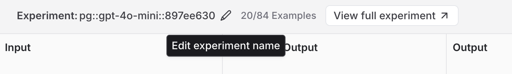
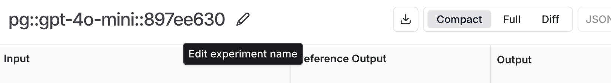

import Admonition from "@theme/Admonition";

# Renaming an experiment 

This guide outlines the available methods to rename an experiment in the LangSmith UI. There are two ways to rename an experiment:

1. **Within the Playground**
2. **Within the Experiments View**

Note that experiment names must be unique per workspace.

---

## 1. Renaming an experiment in the Playground

When running experiments in the Playground, a default name with the format `pg::prompt-name::model::uuid` (eg. `pg::gpt-4o-mini::897ee630`) is automatically assigned. 

You can rename an experiment immediately after running it by editing its name in the Playground table header.

## 2. Renaming an experiment in the experiments view

When viewing results in the experiments view, you can rename an experiment by using the pencil icon beside the experiment name.

