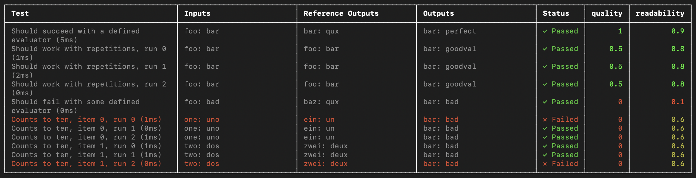
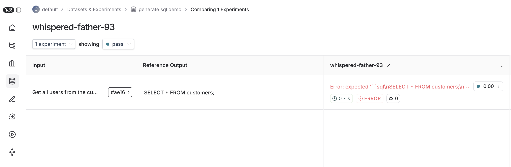

import {
  CodeTabs,
} from "@site/src/components/InstructionsWithCode";

# How to run evals with Vitest/Jest (beta)

LangSmith provides integrations with Vitest and Jest that allow JavaScript and TypeScript developers define their datasets and evaluate using familiar syntax.



Compared to the `evaluate()` evaluation flow, this is useful when:

- Each example requires different evaluation logic
- You want to assert binary expectations, and both track these assertions in LangSmith and raise assertion errors locally (e.g. in CI pipelines)
- You want to take advantage of mocks, watch mode, local results, or other features of the Vitest/Jest ecosystem

:::info Installation

Requires JS/TS SDK version `langsmith>=0.3`.

:::

:::info For Python

The Python SDK has an analogous [pytest integration](./pytest).

:::

## Setup

Set up the integrations as follows. Note that while you can add LangSmith evals alongside your other unit tests (as standard `*.test.ts` files)
using your existing test config files, the below examples will also set up a separate test config file and command to run your evals.
It will assume you end your test files with `.eval.ts`.

This ensures that the custom test reporter and other LangSmith touchpoints do not modify your existing test outputs.

### Vitest

Install the required development dependencies if you have not already:

<CodeTabs
  groupId="client-language"
  tabs={[
    {
      value: "typescript",
      label: "yarn",
      language: "bash",
      content: `yarn add -D vitest dotenv`,
    },
    {
      value: "npm",
      label: "npm",
      language: "bash",
      content: `npm install -D vitest dotenv`,
    },
    {
      value: "pnpm",
      label: "pnpm",
      language: "bash",
      content: `pnpm add -D vitest dotenv`,
    },
  ]}
/>

Then create a separate `ls.vitest.config.ts` file with the following base config:

```ts
import { defineConfig } from "vitest/config";

export default defineConfig({
  test: {
    include: ["**/*.eval.?(c|m)[jt]s"],
    reporters: ["langsmith/vitest/reporter"],
    setupFiles: ["dotenv/config"],
  },
});
```

- `include` ensures that only files ending with some variation of `eval.ts` in your project are run
- `reporters` is responsible for nicely formatting your output as shown above
- `setupFiles` runs `dotenv` to load environment variables before running your evals

Finally, add the following to the `scripts` field in your `package.json` to run Vitest with the config you just created:

```json
{
  "name": "YOUR_PROJECT_NAME",
  "scripts": {
    "eval": "vitest run --config ls.vitest.config.ts"
  },
  "dependencies": {
    ...
  },
  "devDependencies": {
    ...
  }
}
```

Note that the above script disables Vitest's default watch mode for running evals since many evaluators
may include longer running LLM calls.

### Jest

Install the required development dependencies if you have not already:

<CodeTabs
  groupId="client-language"
  tabs={[
    {
      value: "typescript",
      label: "yarn",
      language: "bash",
      content: `yarn add -D jest dotenv`,
    },
    {
      value: "npm",
      label: "npm",
      language: "bash",
      content: `npm install -D jest dotenv`,
    },
    {
      value: "pnpm",
      label: "pnpm",
      language: "bash",
      content: `pnpm add -D jest dotenv`,
    },
  ]}
/>

:::info

The setup instructions below are for basic JS files and CJS. To add support for TypeScript and ESM, see Jest's official docs
or use [Vitest](#vitest).

:::

Then create a separate config file named `ls.jest.config.cjs`:

```ts
module.exports = {
  testMatch: ["**/*.eval.?(c|m)[jt]s"],
  reporters: ["langsmith/jest/reporter"],
  setupFiles: ["dotenv/config"],
};
```

- `testMatch` ensures that only files ending with some variation of `eval.js` in your project are run
- `reporters` is responsible for nicely formatting your output as shown above
- `setupFiles` runs `dotenv` to load environment variables before running your evals

Finally, add the following to the `scripts` field in your `package.json` to run Jest with the config you just created:

```json
{
  "name": "YOUR_PROJECT_NAME",
  "scripts": {
    "eval": "jest --config ls.jest.config.cjs"
  },
  "dependencies": {
    ...
  },
  "devDependencies": {
    ...
  }
}
```

## Define and run evals

You can now define evals as tests using familiar Vitest/Jest syntax, with a few caveats:

- You should import `describe` and `test` from the `langsmith/jest` or `langsmith/vitest` entrypoint
- You must wrap your test cases in a `describe` block
- When declaring tests, the signature is slightly different - there is an extra argument containing example inputs and expected outputs

Try it out by creating a file named `sql.eval.ts` (or `sql.eval.js` if you are using Jest without TypeScript)
and pasting the below contents into it:

```ts
import * as ls from "langsmith/vitest";
import { expect } from "vitest";
// import * as ls from "langsmith/jest";
// import { expect } from "@jest/globals";

import OpenAI from "openai";
import { traceable } from "langsmith/traceable";
import { wrapOpenAI } from "langsmith/wrappers/openai";

// Add "openai" as a dependency and set OPENAI_API_KEY as an environment variable
const tracedClient = wrapOpenAI(new OpenAI());

const generateSql = traceable(async (userQuery: string) => {
  const result = await tracedClient.chat.completions.create({
    model: "gpt-4o-mini",
    messages: [{
      role: "system",
      content: "Convert the user query to a SQL query.",
    }, {
      role: "user",
      content: userQuery,
    }]
  });
  return result.choices[0].message.content;
});

ls.describe("generate sql demo", () => {
  ls.test(
    "generates select all",
    {
      inputs: { userQuery: "Get all users from the customers table" },
      referenceOutputs: { sql: "SELECT * FROM customers;" }
    },
    async ({ inputs, referenceOutputs }) => {
      const sql = await generateSql(inputs.userQuery);
      ls.logOutputs({ sql }); // <-- Log run outputs, optional
      expect(sql).toEqual(referenceOutputs.sql); // <-- Assertion result logged under 'pass' feedback key
    }
  )
});
```

You can think of each `ls.test()` case as corresponding to a dataset example, and `ls.describe()` as defining a LangSmith dataset.
If you have LangSmith [tracing environment variables](../../index) set when you run the test suite, the SDK does the following:

- creates a [dataset](../concepts/#datasets) with the same name as the name passed to `ls.describe()` in LangSmith if it does not exist
- creates an example in the dataset for each input and expected output passed into a test case if a matching one does not already exist
- creates a new [experiment](../concepts/#experiment) with one result for each test case
- collects the pass/fail rate under the `pass` feedback key for each test case

When you run this test it will have a default `pass` boolean feedback key based on the test case passing / failing.
It will also track any outputs that you log with the `ls.logOutputs()` or return from the test function as "actual" result values
from your app for the experiment.

Now use the `eval` script we set up in the previous step to run the test:

<CodeTabs
  groupId="client-language"
  tabs={[
    {
      value: "typescript",
      label: "yarn",
      language: "bash",
      content: `yarn run eval`,
    },
    {
      value: "npm",
      label: "npm",
      language: "bash",
      content: `npm run eval`,
    },
    {
      value: "pnpm",
      label: "pnpm",
      language: "bash",
      content: `pnpm run eval`,
    },
  ]}
/>

Here's what an experiment against that test suite looks like:



## Trace feedback

By default LangSmith collects the pass/fail rate under the `pass` feedback key for each test case.
You can add additional feedback with `ls.logFeedback()`:

```ts
import * as ls from "langsmith/vitest";
// import * as ls from "langsmith/jest";

import OpenAI from "openai";
import { traceable } from "langsmith/traceable";
import { wrapOpenAI } from "langsmith/wrappers/openai";

// Add "openai" as a dependency and set OPENAI_API_KEY as an environment variable
const tracedClient = wrapOpenAI(new OpenAI());

const myEvaluator = async (params: {
  outputs: { sql: string };
  referenceOutputs: { sql: string }, 
}) => {
  const instructions = [
    "Return 1 if the ACTUAL and EXPECTED answers are semantically equivalent, ",
    "otherwise return 0. Return only 0 or 1 and nothing else.",
  ].join("\n");
  const grade = await tracedClient.chat.completions.create({
    model: "gpt-4o-mini",
    messages: [{
      role: "system",
      content: instructions,
    }, {
      role: "user",
      content: `ACTUAL: ${outputs.sql}\nEXPECTED: ${referenceOutputs.sql}`,
    }]
  });
  const score = parseInt(grade.choices[0].message.content);
  return { key: "correctness", score };
}

ls.describe("generate sql demo", () => {
  ls.test(
    "offtopic input",
    {
      inputs: { userQuery: "whats up" },
      referenceOutputs: { sql: "sorry that is not a valid query" }
    },
    async ({ inputs, referenceOutputs }) => {
      const sql = await generateSql(inputs.userQuery);
      const wrappedEvaluator = ls.wrapEvaluator(myEvaluator);
      // Will automatically log "correctness" as feedback
      await wrappedEvaluator({
        outputs: { sql },
        referenceOutputs
      });
      // You can also manually log feedback with `ls.logFeedback()`
      ls.logFeedback({
        key: "harmfulness",
        score: 0.2,
      });
    }
  );
});
```

Note the use of `ls.wrapEvaluator()` around our evaluator function.
This makes it so that the LLM-as-judge call is traced separately from the rest of the test case to avoid clutter, and conveniently
creates feedback if the return value from the wrapped function matches `{ key: string; score: number | boolean }`.
In this case, instead of showing up in the main test case run, the evaluator trace will instead show up in a trace associated with the `correctness` feedback key.

## Running multiple examples against a test case

You can run the same test case over multiple examples and parameterize your tests using `ls.test.each()`.
This is useful when you want to evaluate your app the same way against different inputs:

```ts
import * as ls from "langsmith/vitest";
// import * as ls from "langsmith/jest";

const DATASET = [{
  inputs: { userQuery: "whats up" },
  referenceOutputs: { sql: "sorry that is not a valid query" }
}, {
  inputs: { userQuery: "what color is the sky?" },
  referenceOutputs: { sql: "sorry that is not a valid query" }
}, {
  inputs: { userQuery: "how are you today?" },
  referenceOutputs: { sql: "sorry that is not a valid query" }
}];

ls.describe("generate sql demo", () => {
  ls.test.each(DATASET)(
    "offtopic inputs",
    async ({ inputs, referenceOutputs }) => {
      ...
    },
  )
});
```

If you have tracking enabled, each example in the local dataset will be synced to the one created in LangSmith.

## Log outputs

Every time we run a test we're syncing it to a dataset example and tracing it as a run.
To trace final outputs for the run, you can use `ls.logOutputs()` like this:

```ts
import * as ls from "langsmith/vitest";
// import * as ls from "langsmith/jest";

ls.describe("generate sql demo", () => {
  ls.test(
    "offtopic input",
    {
      inputs: { userQuery: "..." },
      referenceOutputs: { sql: "..." }
    },
    async ({ inputs, referenceOutputs }) => {
      ls.logOutputs({ sql: "SELECT * FROM users;" })
    },
  )
});
```

The logged outputs will appear in your reporter summary and in LangSmith.

You can also directly return a value from your test function:

```ts
import * as ls from "langsmith/vitest";
// import * as ls from "langsmith/jest";

ls.describe("generate sql demo", () => {
  ls.test(
    "offtopic input",
    {
      inputs: { userQuery: "..." },
      referenceOutputs: { sql: "..." }
    },
    async ({ inputs, referenceOutputs }) => {
      return { sql: "SELECT * FROM users;" }
    },
  );
});
```

However keep in mind if you do this that if your test fails to complete due to a failed assertion or other error, your output will not appear.

## Trace intermediate calls

LangSmith will automatically trace any traceable intermediate calls that happen in the course of test case execution.

## Focusing or skipping tests

You can chain the Vitest/Jest `.skip` and `.only` methods on `ls.test()` and `ls.describe()`:

```ts
import * as ls from "langsmith/vitest";
// import * as ls from "langsmith/jest";

ls.describe("generate sql demo", () => {
  ls.test.skip(
    "offtopic input",
    {
      inputs: { userQuery: "..." },
      referenceOutputs: { sql: "..." }
    },
    async ({ inputs, referenceOutputs }) => {
      return { sql: "SELECT * FROM users;" }
    },
  );
  ls.test.only(
    "other",
    {
      inputs: { userQuery: "..." },
      referenceOutputs: { sql: "..." }
    },
    async ({ inputs, referenceOutputs }) => {
      return { sql: "SELECT * FROM users;" }
    },
  );
});
```


## Dry-run mode

If you want to run the tests without syncing the results to LangSmith, you can set omit your LangSmith tracing environment variables or set
`LANGSMITH_TEST_TRACKING=false` in your environment.

The tests will run as normal, but the experiment logs will not be sent to LangSmith.
