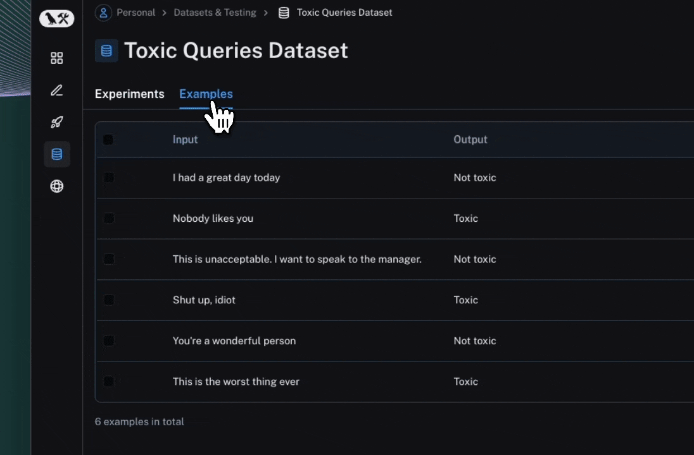

import {
  CodeTabs,
  python,
  typescript,
  ShellBlock,
} from "@site/src/components/InstructionsWithCode";
import { RegionalUrl } from "@site/src/components/RegionalUrls";
import Tabs from '@theme/Tabs';
import TabItem from '@theme/TabItem';

# Evaluation Quick Start

Evaluations are a quantitative way to measure performance of LLM applications, which is important beacause LLMs don't always behave predictably — small changes in prompts, models, or inputs can significantly impact results. Evaluations provide a structured way to identify failures, compare changes across different versions of your application, and build more reliable AI applications.

Evaluations are made up of three components:
1. A [dataset](/evaluation/concepts#datasets) with test inputs and optionally expected outputs.
2. A [target function](/evaluation/how_to_guides/define_target) that defines what you're evaluating. For example, this may be one LLM call that includes the new prompt you are testing, a part of your application or your end to end application. 
3. [Evaluators](/evaluation/concepts#evaluators) that score your target function's outputs.

This quick start guides you through running a simple evaluation to test the correctness of LLM responses with the LangSmith SDK or UI. 

<Tabs className="interface-tabs" queryString="mode">
  <TabItem value="sdk" label="SDK">

## 1. Install Dependencies

<CodeTabs
  tabs={[
    {
      value: "python",
      label: "Python",
      language: "bash",
      content: `pip install -U langsmith openai pydantic`,
    },
    {
      value: "typescript",
      label: "TypeScript",
      language: "bash",
      content: `yarn add langsmith openai zod`,
    },
  ]}
  groupId="client-language"
/>

## 2. Create an API key

To create an API key head to the <RegionalUrl text='Settings page' suffix='/settings' />. Then click **Create API Key.**

## 3. Set up your environment

<CodeTabs
  tabs={[
    ShellBlock(`export LANGSMITH_TRACING=true
export LANGSMITH_API_KEY="<your-langchain-api-key>"

# The example uses OpenAI, but it's not necessary in general
export OPENAI_API_KEY="<your-openai-api-key>"`),
  ]}
  groupId="client-language"
/>

## 4. Import dependencies

<CodeTabs
  tabs={[
    {
      value: "python",
      label: "Python",
      content: `from langsmith import wrappers, Client
from pydantic import BaseModel, Field
from openai import OpenAI

client = Client()
openai_client = wrappers.wrap_openai(OpenAI())`,
    },
    {
      value: "typescript",
      label: "TypeScript",
      content: `import { Client } from "langsmith";
import OpenAI from "openai";
import { z } from "zod";
import { zodResponseFormat } from "openai/helpers/zod";
import type { EvaluationResult } from "langsmith/evaluation";
import { evaluate } from "langsmith/evaluation";   


const client = new Client();

const openai = new OpenAI();`,
    },
  ]}
  groupId="client-language"
/>

## 5. Create a dataset

<CodeTabs
  tabs={[
    {
value: "python",
label: "Python",
content: `# For other dataset creation methods, see:
# https://docs.smith.langchain.com/evaluation/how_to_guides/manage_datasets_programmatically
# https://docs.smith.langchain.com/evaluation/how_to_guides/manage_datasets_in_application


# Programmatically create a dataset in LangSmith
dataset = client.create_dataset(
    dataset_name="Sample dataset", description="A sample dataset in LangSmith."
)

# Create examples
examples = [
    {
        "inputs": {"question": "Which country is Mount Kilimanjaro located in?"},
        "outputs": {"answer": "Mount Kilimanjaro is located in Tanzania."},
    },
    {
        "inputs": {"question": "What is Earth's lowest point?"},
        "outputs": {"answer": "Earth's lowest point is The Dead Sea."},
    },
]

# Add examples to the dataset
client.create_examples(dataset_id=dataset.id, examples=examples)
`,
    },
    {
      value: "typescript",
      label: "TypeScript",
      content: `
// For other dataset creation methods, see: 
// https://docs.smith.langchain.com/evaluation/how_to_guides/manage_datasets_programmatically 
// https://docs.smith.langchain.com/evaluation/how_to_guides/manage_datasets_in_application
    
// Create inputs and reference outputs
const examples: [string, string][] = [
  [
    "Which country is Mount Kilimanjaro located in?",
    "Mount Kilimanjaro is located in Tanzania.",
  ],
  [
    "What is Earth's lowest point?",
    "Earth's lowest point is The Dead Sea.",
  ],
];

const inputs = examples.map(([inputPrompt]) => ({
  question: inputPrompt,
}));
const outputs = examples.map(([, outputAnswer]) => ({
  answer: outputAnswer,
}));

// Programmatically create a dataset in LangSmith
const dataset = await client.createDataset("Sample dataset", {
  description: "A sample dataset in LangSmith.",
});

// Add examples to the dataset
await client.createExamples({
  inputs,
  outputs,
  datasetId: dataset.id,
});
`,
},
]}
groupId="client-language"
/>

## 6. Define what you're evaluating

<CodeTabs
  tabs={[
    {
      value: "python",
      label: "Python",
      content: `# Define the application logic you want to evaluate inside a target function
# The SDK will automatically send the inputs from the dataset to your target function
def target(inputs: dict) -> dict:
    response = openai_client.chat.completions.create(
        model="gpt-4o-mini",
        messages=[
            {"role": "system", "content": "Answer the following question accurately"},
            {"role": "user", "content": inputs["question"]},
        ],
    )
    return { "response": response.choices[0].message.content.strip() }
  `},
    {
      value: "typescript",
      label: "TypeScript",
      content: `// Define the application logic you want to evaluate inside a target function
// The SDK will automatically send the inputs from the dataset to your target function
async function target(inputs: string): Promise<{ response: string }> {
  const response = await openai.chat.completions.create({
    model: "gpt-4o-mini",
    messages: [
      { role: "system", content: "Answer the following question accurately" },
      { role: "user", content: inputs },
    ],
  });
  return { response: response.choices[0].message.content?.trim() || "" };
}
`,
    },
  ]}
  groupId="client-language"
/>

## 7. Define evaluator

<CodeTabs
  tabs={[
    {
      value: "python",
      label: "Python",
      content: `# Define instructions for the LLM judge evaluator
instructions = """Evaluate Student Answer against Ground Truth for conceptual similarity and classify true or false: 
- False: No conceptual match and similarity
- True: Most or full conceptual match and similarity
- Key criteria: Concept should match, not exact wording.
"""

# Define output schema for the LLM judge
class Grade(BaseModel):
    score: bool = Field(
        description="Boolean that indicates whether the response is accurate relative to the reference answer"
    )

# Define LLM judge that grades the accuracy of the response relative to reference output
def accuracy(outputs: dict, reference_outputs: dict) -> bool:
    response = openai_client.beta.chat.completions.parse(
        model="gpt-4o-mini",
        messages=[
            {"role": "system", "content": instructions},
            {
                "role": "user",
                "content": f"""Ground Truth answer: {reference_outputs["answer"]}; 
                Student's Answer: {outputs["response"]}"""
            },
        ],
        response_format=Grade,
    )
    return response.choices[0].message.parsed.score`,
    },
    {
      value: "typescript",
      label: "TypeScript",
      content: `// Define instructions for the LLM judge evaluator
const instructions = \`Evaluate Student Answer against Ground Truth for conceptual similarity and classify true or false: 
- False: No conceptual match and similarity
- True: Most or full conceptual match and similarity
- Key criteria: Concept should match, not exact wording.
\`;

// Define context for the LLM judge evaluator
const context = \`Ground Truth answer: {reference}; Student's Answer: {prediction}\`;

// Define output schema for the LLM judge
const ResponseSchema = z.object({
  score: z
    .boolean()
    .describe(
      "Boolean that indicates whether the response is accurate relative to the reference answer"
    ),
});

// Define LLM judge that grades the accuracy of the response relative to reference output
async function accuracy({
  outputs,
  referenceOutputs,
}: {
  outputs?: Record<string, string>;
  referenceOutputs?: Record<string, string>;
}): Promise<EvaluationResult> {
  const response = await openai.chat.completions.create({
    model: "gpt-4o-mini",
    messages: [
      { role: "system", content: instructions },
      { role: "user", content: context.replace("{prediction}", outputs?.answer || "").replace("{reference}", referenceOutputs?.answer || "") }
    ],
    response_format: zodResponseFormat(ResponseSchema, "response")
  });

  return {
    key: "accuracy",
    score: ResponseSchema.parse(JSON.parse(response.choices[0].message.content || "")).score,
  };
}`,
    },
  ]}
  groupId="client-language"
/>

## 8. Run and view results

<CodeTabs tabs={[
  
  {
    value: "python",
    label: "Python",
    content: `# After running the evaluation, a link will be provided to view the results in langsmith
experiment_results = client.evaluate(
    target,
    data="Sample dataset",
    evaluators=[
        accuracy,
        # can add multiple evaluators here
    ],
    experiment_prefix="first-eval-in-langsmith",
    max_concurrency=2,
)
`},
    {
      value: "typescript",
      label: "TypeScript",
      content: `// After running the evaluation, a link will be provided to view the results in langsmith
await evaluate(
  (exampleInput) => {
    return target(exampleInput.question);
  },
  {
    data: "Sample dataset",
    evaluators: [
      accuracy,
      // can add multiple evaluators here
    ],
    experimentPrefix: "first-eval-in-langsmith",
    maxConcurrency: 2,
  }
);
`,
    },
  ]}
  groupId="client-language"
/>

Click the link printed out by your evaluation run to access the LangSmith Experiments UI, and explore the results of your evaluation.



## Next steps

:::tip
To learn more about running experiments in LangSmith, read the [evaluation conceptual guide](./evaluation/concepts).
:::

- See the [How-to guides](./evaluation/how_to_guides) for answers to “How do I….?” format questions.
- For end-to-end walkthroughs see [Tutorials](./evaluation/tutorials).
- For comprehensive descriptions of every class and function see the [API reference](https://langsmith-sdk.readthedocs.io/en/latest/evaluation.html).

If you prefer video tutorials, check out the [Datasets, Evaluators, and Experiments videos](https://academy.langchain.com/pages/intro-to-langsmith-preview) from the Introduction to LangSmith Course.

  </TabItem >
  <TabItem value="ui" label="UI">

  
  ## 1. Navigate to the Playground
    LangSmith's [Prompt Playground](/prompt_engineering/concepts#prompt-playground) makes it possible run evaluations over diffrent prompts, new models or test different model configuration. Go to LangSmith's **Playground** in the UI. 
  
  ## 2. Create a prompt
  Modify the system prompt to:
  ```
  Answer the following question accurately:
  ```
  
  ## 3. Create a dataset
  Click **Set up Evaluation**, then use the **+ New** button in the dropdown to create a new dataset.
  
  Add the following examples to the dataset:
  | Inputs | Reference Outputs | 
  |----------|----------|
  | question: Which country is Mount Kilimanjaro located in?    | output: Mount Kilimanjaro is located in Tanzania.  |
  | question: What is Earth's lowest point?    | output: Earth's lowest point is The Dead Sea.  | 
  
  Press **Save** to save your newly created dataset. 

  ## 4. Add an evaluator
  
  Click **+Evaluator**. Select **Correctness** from the pre-built evaluator options. Press **Save**.

  ## 5. Run your evaluation
  
  Press **Start** on the top right to run your evaluation. Running this evaluation will create an experiment that you can view in full by clicking the experiment name. 
  
   
   
   ## Next steps

  :::tip
  To learn more about running experiments in LangSmith, read the [evaluation conceptual guide](./evaluation/concepts).
  :::

  See the [How-to guides](./evaluation/how_to_guides) for answers to “How do I….?” format questions.
  - Learn how to [create and manage datasets in the UI](/evaluation/how_to_guides/manage_datasets_in_application#set-up-your-dataset)
  - Learn how to [run an evaluation from the prompt playground](/evaluation/how_to_guides/run_evaluation_from_prompt_playground)
  
  If you prefer video tutorials, check out the [Playground videos](https://academy.langchain.com/pages/intro-to-langsmith-preview) from the Introduction to LangSmith Course.

  
    </TabItem>
  </Tabs>