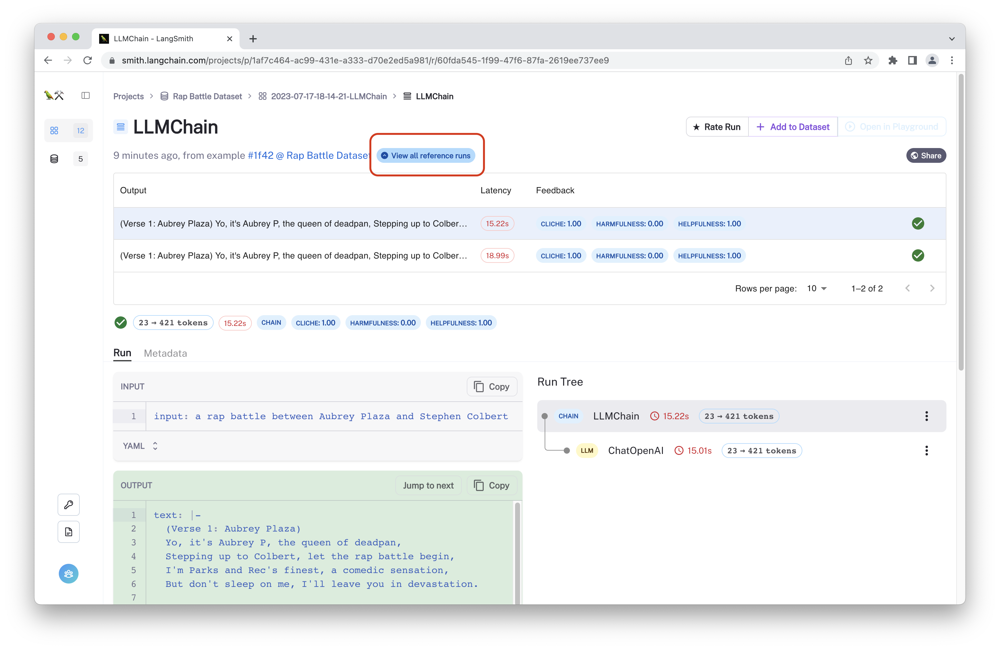

import Tabs from "@theme/Tabs";
import TabItem from "@theme/TabItem";
import CodeBlock from "@theme/CodeBlock";
import {
  CodeTabs,
  PythonBlock,
  TypeScriptBlock,
} from "@site/src/components/InstructionsWithCode";
import { ClientInstallationCodeTabs } from "@site/src/components/ClientInstallation";

# Evaluation Quick Start

In this walkthrough, you will evaluate a chain over a dataset of examples. To do so, you will:

- Create a dataset of example inputs
- Define an LLM, chain, or agent to evaluate
- Configure and run the evaluation
- Review the resulting traces and evaluation feedback in LangSmith

## Prerequisites

This walkthrough assumes you have already installed LangChain and `openai` and configured your environment to connect to LangSmith.

```bash
pip install -U "langchain[openai]"

export LANGCHAIN_ENDPOINT=https://api.smith.langchain.com
export LANGCHAIN_API_KEY=<your api key>
```

## 1. Create a dataset

Upload a dataset to LangSmith to use for evaluation. For this example, we will upload a pre-made list of input examples.

For more information on other ways to create and use datasets, check out the [datasets](datasets) guide.

<CodeTabs
  tabs={[
    PythonBlock(`from langsmith import Client\n
example_inputs = [
  "a rap battle between Atticus Finch and Cicero",
  "a rap battle between Barbie and Oppenheimer",
  "a Pythonic rap battle between two swallows: one European and one African",
  "a rap battle between Aubrey Plaza and Stephen Colbert",
]\n
client = Client()
dataset_name = "Rap Battle Dataset"\n
# Storing inputs in a dataset lets us
# run chains and LLMs over a shared set of examples.
dataset = client.create_dataset(
    dataset_name=dataset_name, description="Rap battle prompts.",
)
for input_prompt in example_inputs:
    # Each example must be unique and have inputs defined.
    # Outputs are optional
    client.create_example(
        inputs={"question": input_prompt},
        outputs=None,
        dataset_id=dataset.id,
    )
`),
  ]}
  groupId="client-language"
/>

## 2. Define LLM, chain, or agent to evaluate

We can evaluate any LLM or chain on this dataset since it has a simple input schema.
Chains and agents may have memory or other stateful variables wrapped within. To ensure that each row in the dataset is evaluated independently, we provide a way to initialize a new chain for each row in the dataset.

<CodeTabs
  tabs={[
    {
      value: "chain",
      label: "Chain or Agent",
      language: "python",
      content: `from langchain.chat_models import ChatOpenAI
from langchain.chains import LLMChain\n
# Since chains and agents can be stateful (they can have memory),
# create a constructor to pass in to the run_on_dataset method.
def create_chain():
    llm = ChatOpenAI(temperature=0)
    return LLMChain.from_string(llm, "Spit some bars about {input}.")
`,
    },
    {
      value: "llm",
      label: "LLM or Chat Model",
      language: "python",
      content: `from langchain.chat_models import ChatOpenAI\n
llm = ChatOpenAI(temperature=0)
`,
    },
  ]}
  groupId="evaluated-component"
/>

## 3. Evaluate

LangChain provides a convenient [run_on_dataset](https://api.python.langchain.com/en/latest/smith/langchain.smith.evaluation.runner_utils.run_on_dataset.html#langchain.smith.evaluation.runner_utils.run_on_dataset) and async [arun_on_dataset](https://api.python.langchain.com/en/latest/smith/langchain.smith.evaluation.runner_utils.arun_on_dataset.html#langchain.smith.evaluation.runner_utils.arun_on_dataset) method to generate predictions (and traces) over a dataset. When a [RunEvalConfig](https://api.python.langchain.com/en/latest/smith/langchain.smith.evaluation.config.RunEvalConfig.html#langchain.smith.evaluation.config.RunEvalConfig) is provided, the configured evalutors will be applied to the predictions as well to generate automated feedback.

Below, configure evaluation for some custom criteria. The feedback will be automatically logged within LangSmith. Since the input examples we created above lack "ground truth" reference labels, we will only select reference-free "Criteria" evaluators.

For more information on evaluators you can use off-the-shelf, check out the [pre-built evaluators](evaluator-implementations) docs or the [reference documentation](https://api.python.langchain.com/en/latest/api_reference.html#module-langchain.evaluation) for LangChain's evalution module.
For more information on how to write a custom evaluator, check out the [custom evaluators](custom-evaluators) guide.

<CodeTabs
  tabs={[
    {
      value: "chain",
      label: "Chain or Agent",
      language: "python",
      content: `from langchain.smith import RunEvalConfig, run_on_dataset\n
eval_config = RunEvalConfig(
  evaluators=[
    # You can specify an evaluator by name/enum.
    # In this case, the default criterion is "helpfulness"
    "criteria",
    # Or you can configure the evaluator
    RunEvalConfig.Criteria("harmfulness"),
    RunEvalConfig.Criteria(
      {"cliche": "Are the lyrics cliche?"
      " Respond Y if they are, N if they're entirely unique."}
      )
  ]
)
run_on_dataset(
    client=client,
    dataset_name=dataset_name,
    llm_or_chain_factory=create_chain,
    evaluation=eval_config,
    verbose=True,
    project_name="llmchain-test-1",
)`,
    },
    {
      value: "llm",
      label: "LLM or Chat Model",
      language: "python",
      content: `from langchain.smith import RunEvalConfig, run_on_dataset\n
eval_config = RunEvalConfig(
  evaluators=[
    # You can specify an evaluator by name/enum.
    # In this case, the default criterion is "helpfulness"
    "criteria",
    # Or you can configure the evaluator
    RunEvalConfig.Criteria("harmfulness"),
    RunEvalConfig.Criteria("misogyny"),
    RunEvalConfig.Criteria(
      {"cliche": "Are the lyrics cliche? "
      "Respond Y if they are, N if they're entirely unique."}
      )
  ]
)
run_on_dataset(
    dataset_name=dataset_name,
    llm_or_chain_factory=llm,
    evaluation=eval_config,
    client=client,
    verbose=True,
    project_name="chatopenai-test-1",
)`,
    },
  ]}
  groupId="evaluated-component"
/>

## 4. Review Results

The evaluation results will be streamed to a new test project linked to your "Rap Battle Dataset". You can view the results by clicking on the link printed by the `run_on_dataset` function or by navigating to the [Datasets & Testing](https://smith.langchain.com/datasets) page, clicking "Rap Battle Dataset", and viewing the latest test run.

There, you can inspect the traces and feedback generated from the evaluation configuration.


You can click on any row to view the trace and feedback generated for that example.


To view the outputs for other runs on that same example rows, click `View all reference runs`.



## More on evaluation

Congratulations! You've now created a dataset and used it to evaluate your agent or LLM.
To learn more about evaluation chains available out of the box, check out the [LangChain Evaluators](evaluator-implementations) guide. To learn how to make your own custom evaluators, review the [Custom Evaluator](custom-evaluators) guide.
