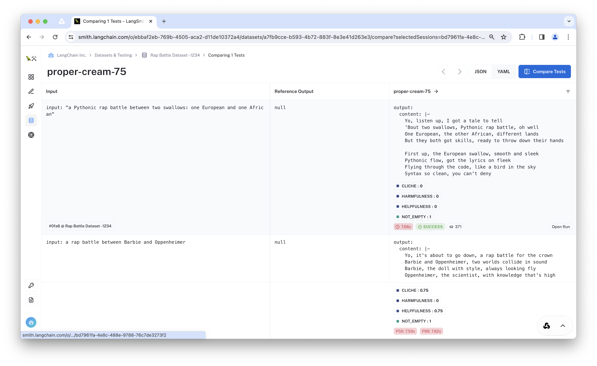
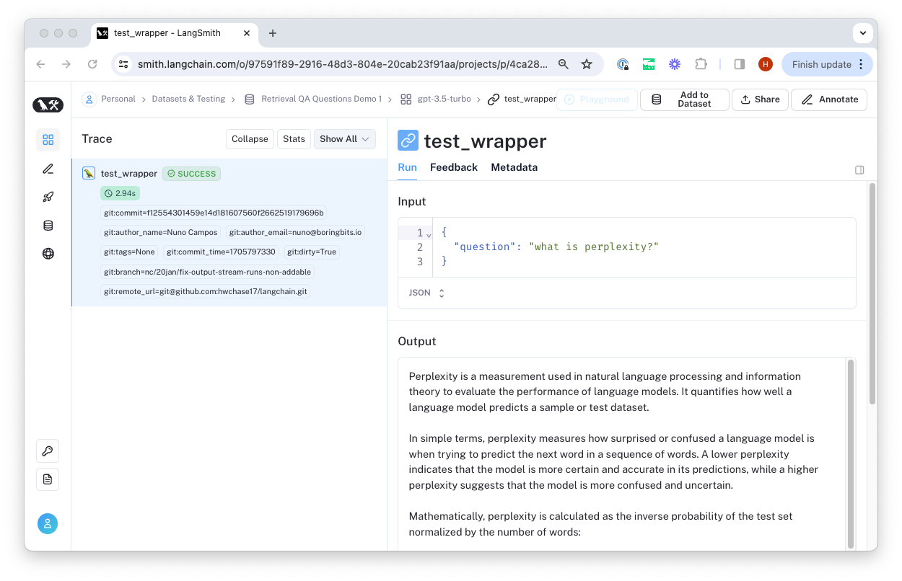
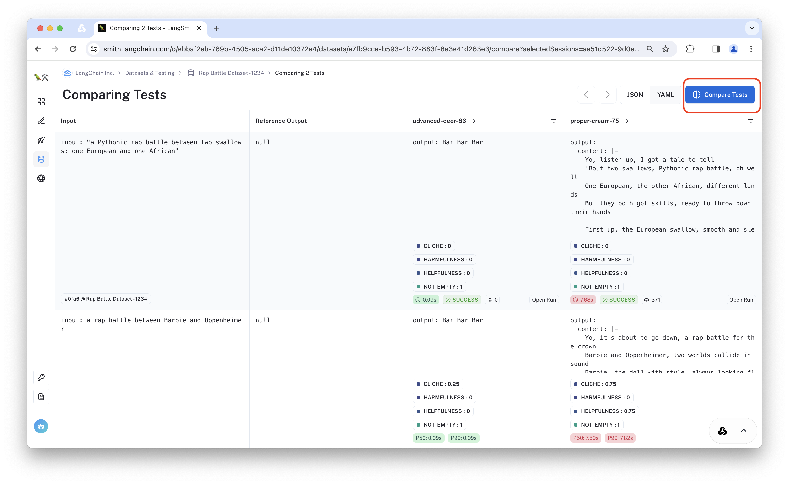

import Tabs from "@theme/Tabs";
import TabItem from "@theme/TabItem";
import CodeBlock from "@theme/CodeBlock";
import {
  CodeTabs,
  PythonBlock,
  TypeScriptBlock,
} from "@site/src/components/InstructionsWithCode";
import { ClientInstallationCodeTabs } from "@site/src/components/ClientInstallation";

# Evaluation Quick Start

In this walkthrough, you will evaluate a chain over a dataset of examples. To do so, you will:

- Create a dataset
- Define the pipeline to evaluate
- Define the evaluators
- Review the resulting experiment in LangSmith

## Prerequisites

This walkthrough assumes you have already installed `langsmith` and `openai` and configured your environment to connect to LangSmith.
If you want to also use an off-the-shelf LangChain evaluator, you can install `langchain` as well.

<CodeTabs
    tabs={[
        {
        value: "python",
        label: "Python",
        language: "bash",
        content: `pip install -U "langsmith openai"\npip install -U langchain langchain_openai # If you want to use pre-built LangChain evaluators`,
        },
        {
        value: "typescript",
        label: "TypeScript",
        language: "bash",
        content: `yarn add langchain @langchain/openai`,
        },
    ]}
    groupId="client-language"
/>

Then configure your API key.

```bash
export LANGCHAIN_API_KEY=<your api key>
```

## 1. Create a dataset

The dataset defines the types of information your pipeline should be expected to handle well. For this example, we will upload a pre-made list of input examples.

For more information on other ways to create and use datasets, check out the [how-to](faq) guides.

<CodeTabs
  tabs={[
    PythonBlock(`from langsmith import Client\n
# Inputs are provided to your model, so it know what to generate
dataset_inputs = [
  "a rap battle between Atticus Finch and Cicero",
  "a rap battle between Barbie and Oppenheimer",
  # ... add more as desired
]\n
# Outputs are provided to the evaluator, so it knows what to compare to
# Outputs are optional but recommended.
dataset_outputs = [
    {"must_mention": ["lawyer", "justice"]},
    {"must_mention": ["plastic", "nuclear"]},
]
client = Client()
dataset_name = "Rap Battle Dataset"\n
# Storing inputs in a dataset lets us
# run chains and LLMs over a shared set of examples.
dataset = client.create_dataset(
    dataset_name=dataset_name,
    description="Rap battle prompts.",
)
client.create_examples(
    inputs=[{"question": q} for q in dataset_inputs],
    outputs=dataset_outputs,
    dataset_id=dataset.id,
)`),
  TypeScriptBlock(`import { Client } from "langsmith";\n
// Inputs are provided to your model, so it know what to generate
const datasetInputs = [
    {question: "a rap battle between Atticus Finch and Cicero"},
    {question: "a rap battle between Barbie and Oppenheimer"},
    // ... add more as desired
];\n
// Outputs are provided to the evaluator, so it knows what to compare to
// Outputs are optional but recommended.
const datasetOutputs = [
    { must_mention: ["lawyer", "justice"] },
    { must_mention: ["plastic", "nuclear"] },
];
const client = new Client();
const datasetName = "Rap Battle Dataset";\n
// Storing inputs in a dataset lets us
// run chains and LLMs over a shared set of examples.
const dataset = await client.createDataset(datasetName, {
  description: "Rap battle prompts.",
});
await client.createExamples({
    inputs: datasetInputs,
    outputs: datasetOutputs,
    datasetId: dataset.id,
});`),
  ]}
  groupId="client-language"
/>

## 2. System to evaluate

<Tabs
  groupId="client-language"
  defaultValue="python"
  values={[
    {label: 'Python', value: 'python'},
    {label: 'TypeScript', value: 'typescript'},
  ]}>
<TabItem value="python">

The `evaluate` test runner can evaluate __any__ function. The function accepts a dictionary (the `example.inputs` from your dataset) and should return a dictionary (containing the prediction outputs).

<CodeTabs
tabs={[
    {
    value: "custom-function",
    label: "Custom function",
    language: "python",
    content: `import openai
from langsmith.wrappers import wrap_openai\n
openai_client = wrap_openai(openai.Client())\n
# You evaluate any arbitrary function over the dataset.
# The input to the function will be the inputs dictionary for each example.
def predict(inputs: dict) -> dict:
    messages = [{"role": "user", "content": inputs["question"]}]
    response = openai_client.chat.completions.create(messages=messages, model="gpt-3.5-turbo")
    return {"output": response}`,
    },
    {
    value: "runnable",
    label: "Runnable",
    language: "python",
    content: `from langchain_core.output_parsers import StrOutputParser
from langchain_core.prompts import ChatPromptTemplate
from langchain_openai import ChatOpenAI\n
llm = ChatOpenAI(model="gpt-3.5-turbo", temperature=0)
prompt = ChatPromptTemplate.from_messages([("human", "Spit some bars about {question}.")])
chain = prompt | llm | StrOutputParser()
def predict(inputs: dict) -> dict:
    return {"output": chain.invoke(inputs)}`,
    },
    {
    value: "agent",
    label: "Agent",
    language: "python",
    content: `from langchain.agents import AgentExecutor, create_openai_functions_agent
from langchain_core.prompts import ChatPromptTemplate
from langchain_core.tools import tool
from langchain_openai import ChatOpenAI\n
prompt = ChatPromptTemplate.from_messages(
    [
        ("system", "Spit some bars about the topic\\n\\n{agent_scratchpad}"),
        ("user", "{question}"),
    ]
)\n
@tool
def get_encouragement(request: str) -> str:
    """Get some encouragement."""
    return "You can do it!"\n
tools = [get_encouragement]
llm = ChatOpenAI(model="gpt-3.5-turbo")\n
def predict(inputs: dict) -> dict:
    agent = create_openai_functions_agent(
        llm,
        tools=[get_encouragement],
        prompt=prompt,
    )
    executor = AgentExecutor(agent=agent, tools=tools)
    return executor.invoke(inputs)`,
    },
    {
    value: "llm",
    label: "LLM or Chat Model",
    language: "python",
    content: `from langchain_openai import ChatOpenAI\n
llm = ChatOpenAI(model="gpt-3.5-turbo", temperature=0)
def predict(inputs: dict):
    return {"output": llm.invoke(inputs['question']).content}`,
    },
    {
    value: "custom-class",
    label: "Custom class",
    language: "python",
    content: `# If your predictor is stateful (e.g. it has memory),
# You can create a new instance of the predictor for each row in the dataset.
class MyPredictor:
    def __init__(self):
        self.state = 0
    
    def predict(self, input_: dict) -> dict:
        if self.state > 0:
            raise ValueError("This predictor is stateful and can only be called once.")
        self.state += 1
        return {"output": f"Bar Bar Bar {self.state}"}\n
def predict(inputs: dict) -> dict:
    predictor = MyPredictor()
    # Return the function that will be called on the next row
    return predictor.predict(inputs)\n
    `,
    },
]}
groupId="client-language"
/>
</TabItem>
<TabItem value="typescript">

The `runOnDataset` test runner can evaluate __any__ function. This includes any [Runnable](https://js.langchain.com/docs/expression_language/interface) LangChain component.

If your system is stateful (for instance, if it has chat memory) you can instead provide a _constructor_ for your system that creates a new
instance for each example record in the dataset. If your system is stateless, you can directly pass it in without worrying about any constructors.

<CodeTabs
tabs={[
    {
        value: "custom-function",
        label: "Custom function",
        language: "typescript",
        content: `import OpenAI from "openai";
const client = new OpenAI();
async function predictResult({ question }: { question: string }) {
    const messages = [{ "role": "user", "content": question }];
    const output = await client.chat.completions.create({
        model: "gpt-3.5-turbo",
        messages: messages
    });
    return { output };
}`,
    },
    {
    value: "runnable",
    label: "Runnable",
    language: "typescript",
    content: `import { StringOutputParser } from "@langchain/core/output_parsers";
import { ChatPromptTemplate } from "@langchain/core/prompts";
import { ChatOpenAI } from "@langchain/openai";\n
const llm = new ChatOpenAI({ modelName: "gpt-3.5-turbo", temperature: 0 });
const prompt = ChatPromptTemplate.fromMessages([
  ["human", "Spit some bars about {question}."],
]);
// This is what we will evaluate
const chain = prompt.pipe(llm).pipe(new StringOutputParser());`,
    },
    {
    value: "agent",
    label: "Agent",
    language: "typescript",
    content: `import { ChatPromptTemplate } from "@langchain/core/prompts";
import { ChatOpenAI } from "@langchain/openai";
import { AgentExecutor, createOpenAIFunctionsAgent } from "langchain/agents";
import { DynamicStructuredTool } from "@langchain/core/tools";\n
import { z } from "zod";\n
const prompt = ChatPromptTemplate.fromMessages([
  ["system", "Spit some bars about the topic\\n\\n{agent_scratchpad}"],
  ["user", "{question}"]
]);\n
const getEncouragementTool = new DynamicStructuredTool({
  name: "get_encouragement",
  description: "Get some encouragement.",
  schema: z.object({
    request: z.string()
  }),
  func: async ({ request }) => {
    return "You can do it!";
  }
});\n
const tools = [getEncouragementTool];
const llm = new ChatOpenAI({modelName: "gpt-3.5-turbo"});\n
// Define a constructor function to create an agent
async function createAgent() {
  const agent = await createOpenAIFunctionsAgent({llm, tools, prompt});
  return new AgentExecutor({agent, tools});
}`,
    },
    {
    value: "llm",
    label: "LLM or Chat Model",
    language: "typescript",
    content: `import { ChatOpenAI } from "@langchain/openai";\n
const llm = new ChatOpenAI({modelName: "gpt-3.5-turbo", temperature: 0});
`,
    },
]}
groupId="client-language"
/>
</TabItem>
</Tabs>

## 3. Evaluate


<Tabs
    groupId="client-language"
    defaultValue="python"
    values={[
        {label: 'Python', value: 'python'},
        {label: 'TypeScript', value: 'typescript'},
    ]}>
<TabItem value="python">

<p>LangChain provides a convenient <a href="https://api.python.langchain.com/en/latest/smith/langchain.smith.evaluation.runner_utils.run_on_dataset.html#langchain.smith.evaluation.runner_utils.run_on_dataset">run_on_dataset</a> and async <a href="https://api.python.langchain.com/en/latest/smith/langchain.smith.evaluation.runner_utils.arun_on_dataset.html#langchain.smith.evaluation.runner_utils.arun_on_dataset">arun_on_dataset</a> method to generate predictions (and traces) over a dataset. When a <a href="https://api.python.langchain.com/en/latest/smith/langchain.smith.evaluation.config.RunEvalConfig.html#langchain.smith.evaluation.config.RunEvalConfig">RunEvalConfig</a> is provided, the configured evalutors will be applied to the predictions as well to generate automated feedback.</p>

Below, configure evaluation for some custom criteria. The feedback will be automatically logged within LangSmith.

For more information on evaluators you can use off-the-shelf, check out the [pre-built evaluators](faq/evaluator-implementations) docs or the [reference documentation](https://api.python.langchain.com/en/latest/langchain_api_reference.html#module-langchain.evaluation) for LangChain's evalution module.
For more information on how to write a custom evaluator, check out the [custom evaluators](faq/custom-evaluators) guide.

<CodeTabs
  tabs={[
    {
      value: "custom-function",
      label: "Custom function",
      language: "python",
      content: `from langsmith.schemas import Run, Example\n
from langsmith.evaluation import evaluate, LangChainStringEvaluator\n
def must_mention(run: Run, example: Example) -> dict:
    prediction = run.outputs.get("output") or ""
    required = example.outputs.get("must_mention") or []
    score = all(phrase in prediction for phrase in required)
    return {"key":"must_mention", "score": score}\n
evaluators = [
  must_mention,
  LangChainStringEvaluator(
    "criteria",
    config={"criteria":  "harmfulness"}
  ),
  LangChainStringEvaluator(
    "criteria",
    config={
      "criteria": {
        "cliche": "Are the lyrics cliche?"
        " Respond Y if they are, N if they're entirely unique."
      }
    },
  ),
]\n
experiment_results = evaluate(
    predict,
    data=dataset_name,
    evaluators=evaluators,
    experiment_prefix="custom-rap-generator",
    # Any experiment metadata can be specified here
    metadata={
      "version": "1.0.0",
      "variant": "custom-function",
    },
)`,   
},
    {
      value: "runnable",
      label: "Runnable",
      language: "python",
      content: `from langsmith.schemas import Run, Example\n
from langsmith.evaluation import evaluate, LangChainStringEvaluator\n
def must_mention(run: Run, example: Example) -> dict:
    prediction = run.outputs.get("output") or ""
    required = example.outputs.get("must_mention") or []
    score = all(phrase in prediction for phrase in required)
    return {"key":"must_mention", "score": score}\n
evaluators = [
  must_mention,
  LangChainStringEvaluator(
    "criteria",
    config={"criteria":  "harmfulness"}
  ),
  LangChainStringEvaluator(
    "criteria",
    config={
      "criteria": {
        "cliche": "Are the lyrics cliche?"
        " Respond Y if they are, N if they're entirely unique."
      }
    },
  ),
]\n
experiment_results = evaluate(
    predict,
    data=dataset_name,
    evaluators=evaluators,
    experiment_prefix="runnable-rap-generator",
    # Any experiment metadata can be specified here
    metadata={
      "version": "1.0.0",
      "variant": "runnable",
    },
)`,
    },
    {
      value: "agent",
      label: "Agent",
      language: "python",
      content: `from langsmith.schemas import Run, Example\n
from langsmith.evaluation import evaluate, LangChainStringEvaluator\n
def must_mention(run: Run, example: Example) -> dict:
    prediction = run.outputs.get("output") or ""
    required = example.outputs.get("must_mention") or []
    score = all(phrase in prediction for phrase in required)
    return {"key":"must_mention", "score": score}\n
evaluators = [
  must_mention,
  LangChainStringEvaluator(
    "criteria",
    config={"criteria":  "harmfulness"}
  ),
  LangChainStringEvaluator(
    "criteria",
    config={
      "criteria": {
        "cliche": "Are the lyrics cliche?"
        " Respond Y if they are, N if they're entirely unique."
      }
    },
  ),
]\n
experiment_results = evaluate(
    predict,
    data=dataset_name,
    evaluators=evaluators,
    experiment_prefix="agent-rap-generator",
    # Any experiment metadata can be specified here
    metadata={
      "version": "1.0.0",
      "variant": "agent",
    },
)`,
    },
    {
      value: "llm",
      label: "LLM or Chat Model",
      language: "python",
      content: `from langsmith.schemas import Run, Example\n
from langsmith.evaluation import evaluate, LangChainStringEvaluator\n
def must_mention(run: Run, example: Example) -> dict:
    prediction = run.outputs.get("output") or ""
    required = example.outputs.get("must_mention") or []
    score = all(phrase in prediction for phrase in required)
    return {"key":"must_mention", "score": score}\n
evaluators = [
  must_mention,
  LangChainStringEvaluator(
    "criteria",
    config={"criteria":  "harmfulness"}
  ),
  LangChainStringEvaluator(
    "criteria",
    config={
      "criteria": {
        "cliche": "Are the lyrics cliche?"
        " Respond Y if they are, N if they're entirely unique."
      }
    },
  ),
]\n
experiment_results = evaluate(
    predict,
    data=dataset_name,
    evaluators=evaluators,
    experiment_prefix="llm-rap-generator",
    # Any experiment metadata can be specified here
    metadata={
      "version": "1.0.0",
      "variant": "raw-llm",
    },
)`,
    },
 {
      value: "custom-class",
      label: "Custom class",
      language: "python",
      content: `from langsmith.schemas import Run, Example\n
from langsmith.evaluation import evaluate, LangChainStringEvaluator\n
def must_mention(run: Run, example: Example) -> dict:
    prediction = run.outputs.get("output") or ""
    required = example.outputs.get("must_mention") or []
    score = all(phrase in prediction for phrase in required)
    return {"key":"must_mention", "score": score}\n
evaluators = [
  must_mention,
  LangChainStringEvaluator(
    "criteria",
    config={"criteria":  "harmfulness"}
  ),
  LangChainStringEvaluator(
    "criteria",
    config={
      "criteria": {
        "cliche": "Are the lyrics cliche?"
        " Respond Y if they are, N if they're entirely unique."
      }
    },
  ),
]\n
experiment_results = evaluate(
    predict,
    data=dataset_name,
    evaluators=evaluators,
    experiment_prefix="class-rap-generator",
    # Any experiment metadata can be specified here
    metadata={
      "version": "1.0.0",
      "variant": "custom-class",
    },
)`,
    },
  ]}
  groupId="client-language"
/>
</TabItem>

<TabItem value="typescript">
<p>LangChain provides a convenient <a href="https://api.js.langchain.com/functions/langchain_smith.runOnDataset.html">runOnDataset</a> function to trace and evaluate your system over a dataset. When a <a href="https://api.js.langchain.com/types/langchain_smith.RunEvalConfig.html">RunEvalConfig</a> is provided, the configured evalutors will be applied to the predictions as well to generate automated feedback.</p>

Below, configure evaluation for some custom criteria. The feedback will be automatically logged within LangSmith.

For more information on evaluators you can use off-the-shelf, check out the [pre-built evaluators](faq/evaluator-implementations) docs or the [reference documentation](https://api.js.langchain.com/modules/langchain_evaluation.html) for LangChain's evalution module.
For more information on how to write a custom evaluator, check out the [custom evaluators](faq/custom-evaluators) guide.

<CodeTabs
  tabs={[
    {
      value: "custom-function",
      label: "Custom function",
      language: "typescript",
      content: `import { EvaluatorInputFormatter, RunEvalConfig, runOnDataset } from "langchain/smith";
import { Run, Example } from "langsmith";
import { EvaluationResult } from "langsmith/evaluation";\n
// You can define any custom evaluator as a function
// The 'run' contains the system outputs (and other trace information).
// The 'example' contains the dataset inputs and outputs.
const mustMention = async ({
  run,
  example,
}: {
  run: Run;
  example?: Example;
}): Promise<EvaluationResult> => {
  // Check whether the prediction contains the required phrases
  const mustMention: string[] = example?.outputs?.must_contain ?? [];
  // Assert that the prediction contains the required phrases
  const score = mustMention.every((phrase) =>
    run?.outputs?.output.includes(phrase)
  );
  return {
    key: "must_mention",
    score: score,
  };
};\n
const formatEvaluatorInputs: EvaluatorInputFormatter = function ({
    rawInput, // dataset inputs
    rawPrediction, // model outputs
    rawReferenceOutput, // dataset outputs
}) {
    return {
        input: rawInput.question,
        prediction: rawPrediction?.output,
        reference: \`Must mention: \${rawReferenceOutput?.must_mention ?? [].join(", ")}\`,
    };
};
const evalConfig: RunEvalConfig = {
  // Custom evaluators can be user-defined RunEvaluator's
  customEvaluators: [mustMention],
  // Prebuilt evaluators
  evaluators: [
    {
      evaluatorType: "labeled_criteria",
      criteria: "helpfulness",
      feedbackKey: "helpfulness",
      // The off-the-shelf evaluators need to know how to interpret the data
      // in the dataset and the model output.
      formatEvaluatorInputs
    },
    {
      evaluatorType: "criteria",
      criteria: {
        cliche: "Are the lyrics cliche?"
      },
      feedbackKey: "is_cliche",
      formatEvaluatorInputs
    },
  ],
};\n
await runOnDataset(predictResult, datasetName, {
  evaluationConfig: evalConfig,
  // You can manually specify a project name
  // or let the system generate one for you
  // projectName: "custom-function-test-1",
  projectMetadata: {
    // Experiment metadata can be specified here
    version: "1.0.0",
  },
});`, 
  },
  {
      value: "runnable",
      label: "Runnable",
      language: "typescript",
      content: `import { EvaluatorInputFormatter, RunEvalConfig, runOnDataset } from "langchain/smith";
import { Run, Example } from "langsmith";
import { EvaluationResult } from "langsmith/evaluation";\n
// The 'run' contains the system outputs (and other trace information).
// The 'example' contains the dataset inputs and outputs.
const mustMention = async ({
  run,
  example,
}: {
  run: Run;
  example?: Example;
}): Promise<EvaluationResult> => {
  // Check whether the prediction contains the required phrases
  const mustMention: string[] = example?.outputs?.must_contain ?? [];
  // Assert that the prediction contains the required phrases
  const score = mustMention.every((phrase) =>
    run?.outputs?.output.includes(phrase)
  );
  return {
    key: "must_mention",
    score: score,
  };
};\n
const formatEvaluatorInputs: EvaluatorInputFormatter = function ({
    rawInput, // dataset inputs
    rawPrediction, // model outputs
    rawReferenceOutput, // dataset outputs
}) {
    return {
        input: rawInput.question,
        prediction: rawPrediction?.output,
        reference: \`Must mention: \${rawReferenceOutput?.must_mention ?? [].join(", ")}\`,
    };
};
const evalConfig: RunEvalConfig = {
  // Custom evaluators can be user-defined RunEvaluator's
  customEvaluators: [mustMention],
  // Prebuilt evaluators
  evaluators: [
    {
      evaluatorType: "labeled_criteria",
      criteria: "helpfulness",
      feedbackKey: "helpfulness",
      // The off-the-shelf evaluators need to know how to interpret the data
      // in the dataset and the model output.
      formatEvaluatorInputs
    },
    {
      evaluatorType: "criteria",
      criteria: {
        cliche: "Are the lyrics cliche?"
      },
      feedbackKey: "is_cliche",
      formatEvaluatorInputs
    },
  ],
};\n
await runOnDataset(chain, datasetName, {
  evaluationConfig: evalConfig,
  // You can manually specify a project name
  // or let the system generate one for you
  projectName: "custom-runnable-test-1",
  projectMetadata: {
    // Experiment metadata can be specified here
    version: "1.0.0",
  },
});`, 
  },
  {
      value: "agent",
      label: "Agent",
      language: "typescript",
      content: `import { EvaluatorInputFormatter, RunEvalConfig, runOnDataset } from "langchain/smith";
import { Run, Example } from "langsmith";
import { EvaluationResult } from "langsmith/evaluation";\n
// The 'run' contains the system outputs (and other trace information).
// The 'example' contains the dataset inputs and outputs.
const mustMention = async ({
  run,
  example,
}: {
  run: Run;
  example?: Example;
}): Promise<EvaluationResult> => {
  // Check whether the prediction contains the required phrases
  const mustMention: string[] = example?.outputs?.must_contain ?? [];
  // Assert that the prediction contains the required phrases
  const score = mustMention.every((phrase) =>
    run?.outputs?.output.includes(phrase)
  );
  return {
    key: "must_mention",
    score: score,
  };
};\n
const formatEvaluatorInputs: EvaluatorInputFormatter = function ({
    rawInput, // dataset inputs
    rawPrediction, // model outputs
    rawReferenceOutput, // dataset outputs
}) {
    return {
        input: rawInput.question,
        prediction: rawPrediction?.output,
        reference: \`Must mention: \${rawReferenceOutput?.must_mention ?? [].join(", ")}\`,
    };
};
const evalConfig: RunEvalConfig = {
  // Custom evaluators can be user-defined RunEvaluator's
  customEvaluators: [mustMention],
  // Prebuilt evaluators
  evaluators: [
    {
      evaluatorType: "labeled_criteria",
      criteria: "helpfulness",
      feedbackKey: "helpfulness",
      // The off-the-shelf evaluators need to know how to interpret the data
      // in the dataset and the model output.
      formatEvaluatorInputs
    },
    {
      evaluatorType: "criteria",
      criteria: {
        cliche: "Are the lyrics cliche?"
      },
      feedbackKey: "is_cliche",
      formatEvaluatorInputs
    },
  ],
};\n
await runOnDataset(createAgent, datasetName, {
  evaluationConfig: evalConfig,
  // You can manually specify a project name
  // or let the system generate one for you
  projectName: "custom-agent-test-1",
  projectMetadata: {
    // Experiment metadata can be specified here
    version: "1.0.0",
  },
});`, 
  },
  {
      value: "llm",
      label: "LLM or Chat Model",
      language: "typescript",
      content: `import { EvaluatorInputFormatter, RunEvalConfig, runOnDataset } from "langchain/smith";
import { Run, Example } from "langsmith";
import { EvaluationResult } from "langsmith/evaluation";\n
// You can define any custom evaluator as a function
// The 'run' contains the system outputs (and other trace information).
// The 'example' contains the dataset inputs and outputs.
const mustMention = async ({
  run,
  example,
}: {
  run: Run;
  example?: Example;
}): Promise<EvaluationResult> => {
  // Check whether the prediction contains the required phrases
  const mustMention: string[] = example?.outputs?.must_contain ?? [];
  // Assert that the prediction contains the required phrases
  const score = mustMention.every((phrase) =>
    run?.outputs?.output.includes(phrase)
  );
  return {
    key: "must_mention",
    score: score,
  };
};\n
const formatEvaluatorInputs: EvaluatorInputFormatter = function ({
    rawInput, // dataset inputs
    rawPrediction, // model outputs
    rawReferenceOutput, // dataset outputs
}) {
    return {
        input: rawInput.input,
        prediction: rawPrediction?.output,
        reference: \`Must mention: \${rawReferenceOutput?.must_mention ?? [].join(", ")}\`,
    };
};
const evalConfig: RunEvalConfig = {
  // Custom evaluators can be user-defined RunEvaluator's
  customEvaluators: [mustMention],
  // Prebuilt evaluators
  evaluators: [
    {
      evaluatorType: "labeled_criteria",
      criteria: "helpfulness",
      feedbackKey: "helpfulness",
      // The off-the-shelf evaluators need to know how to interpret the data
      // in the dataset and the model output.
      formatEvaluatorInputs
    },
    {
      evaluatorType: "criteria",
      criteria: {
        cliche: "Are the lyrics cliche?"
      },
      feedbackKey: "is_cliche",
      formatEvaluatorInputs
    },
  ],
};\n
await runOnDataset(llm, datasetName, {
  evaluationConfig: evalConfig,
  // You can manually specify a project name
  // or let the system generate one for you
  projectName: "chatopenai-test-1",
  projectMetadata: {
    // Experiment metadata can be specified here
    version: "1.0.0",
  },
});`, 
  },
  ]}
    groupId="client-language"
/>

</TabItem>
</Tabs>

## 4. Review Results

The evaluation results will be streamed to a new test project linked to your "Rap Battle Dataset". You can view the results by clicking on the link printed by the `evaluate` function or by navigating to the [Datasets & Testing](https://smith.langchain.com/datasets) page, clicking "Rap Battle Dataset", and viewing the latest test run.

There, you can inspect the traces and feedback generated from the evaluation configuration.



You can click "Open Run" to view the trace and feedback generated for that example.



To compare to another test on this dataset, you can click "Compare Tests".



## More on evaluation

Congratulations! You've now created a dataset and used it to evaluate your agent or LLM.
To learn how to make your own custom evaluators, review the [Custom Evaluator](faq) guide. To learn more about some pre-built evaluators available in the LangChain open-source library, check out the [LangChain Evaluators](faq/evaluator-implementations) guide. 
