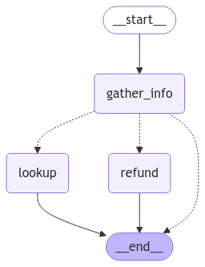
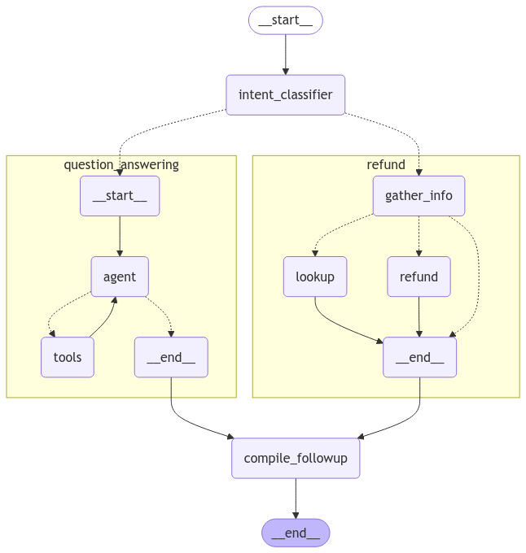

import { RegionalUrl } from "@site/src/components/RegionalUrls";

# Evaluate an agent

:::info Key concepts
[Agent evaluation](../concepts#agents) | [Evaluators](../concepts#evaluators) | [LLM-as-judge evaluators](../concepts#llm-as-judge)
:::

In this tutorial, we'll build a customer support bot that helps users navigate a digital music store. Then, we'll go through the three most effective types of evaluations to run on chat bots:

- [Final response](../concepts#evaluating-an-agents-final-response): Evaluate the agent's final response.
- [Trajectory](../concepts#evaluating-an-agents-trajectory): Evaluate whether the agent took the expected path (e.g., of tool calls) to arrive at the final answer.
- [Single step](../concepts#evaluating-a-single-step-of-an-agent): Evaluate any agent step in isolation (e.g., whether it selects the appropriate first tool for a given ).

We'll build our agent using [LangGraph](https://github.com/langchain-ai/langgraph), but the techniques and LangSmith functionality shown here are framework-agnostic.

## Setup

### Configure the environment

Let's install the required dependencies:

```bash
pip install -U langgraph langchain langchain-community langchain-openai
```

and set up our environment variables for OpenAI and <RegionalUrl text='LangSmith'/>:

```python
#region
import getpass
import os

def _set_env(var: str) -> None:
    if not os.environ.get(var):
        os.environ[var] = getpass.getpass(f"Set {var}: ")

os.environ["LANGCHAIN_TRACING_V2"] = "true"
_set_env("LANGCHAIN_API_KEY")
_set_env("OPENAI_API_KEY")
#endregion
```

### Download the database

We will create a SQLite database for this tutorial. SQLite is a lightweight database that is easy to set up and use.
We will load the `chinook` database, which is a sample database that represents a digital media store.
Find more information about the database [here](https://www.sqlitetutorial.net/sqlite-sample-database/).

For convenience, we have hosted the database in a public GCS bucket:

```python
#region
import requests

url = "https://storage.googleapis.com/benchmarks-artifacts/chinook/Chinook.db"

response = requests.get(url)

if response.status_code == 200:
    # Open a local file in binary write mode
    with open("chinook.db", "wb") as file:
        # Write the content of the response (the file) to the local file
        file.write(response.content)
    print("File downloaded and saved as Chinook.db")
else:
    print(f"Failed to download the file. Status code: {response.status_code}")
#endregion
```

Here's a sample of the data in the db:

```python
#region [collapsed]
import sqlite3

conn = sqlite3.connect("chinook.db")
cursor = conn.cursor()

# Fetch all results
cursor.execute("SELECT * FROM Artist LIMIT 10;").fetchall()
#endregion
```

```console
[(1, 'AC/DC'), (2, 'Accept'), (3, 'Aerosmith'), (4, 'Alanis Morissette'), (5, 'Alice In Chains'), (6, 'Antônio Carlos Jobim'), (7, 'Apocalyptica'), (8, 'Audioslave'), (9, 'BackBeat'), (10, 'Billy Cobham')]
```

And here's the database schema (image from https://github.com/lerocha/chinook-database):


### Define the customer support agent

We'll create a [LangGraph](https://langchain-ai.github.io/langgraph/) agent with limited access to our database. For demo purposes, our agent will support two basic types of requests:

- Lookup: The customer can look up song titles, artist names, and albums based on other identifying information. For example: "What songs do you have by Jimi Hendrix?"
- Refund: The customer can request a refund on their past purchases. For example: "My name is Claude Shannon and I'd like a refund on a purchase I made last week, could you help me?"

For the purpose of this demo, we'll model a "refund" by just deleting the relevant rows from our database. We won't worry about things like user auth for the sake of this demo.

We'll implement both of these functionalities as subgraphs that a parent graph routes to.

#### Refund agent

Let's create an agent that can help a user get a refund on a recent purchase. We'll need to be able to find and delete the relevant Invoice / InvoiceLines.

First let's write some SQL helper functions that will take care of actually querying the DB once we've collected the necessary args.
We'll have one helper for executing the refund and one for returning all of the purchases that match a user's information.

Note that we design these helpers so that we can easily test them without updating our database. Specifically we provide an option to "mock" the refund functionality.

```python
import sqlite3

#region [collapsed]
def _refund(invoice_id: int | None, invoice_line_ids: list[int] | None, mock: bool = False) -> float:
    """Given an Invoice ID and/or Invoice Line IDs, delete the relevant Invoice/InvoiceLine records in the Chinook DB.

    Args:
        invoice_id: The Invoice to delete.
        invoice_line_ids: The Invoice Lines to delete.
        mock: If True, do not actually delete the specified Invoice/Invoice Lines. Used for testing purposes.

    Returns:
        float: The total dollar amount that was deleted (or mock deleted).
    """

    if invoice_id is None and invoice_line_ids is None:
        return 0.0

    # Connect to the Chinook database
    conn = sqlite3.connect("chinook.db")
    cursor = conn.cursor()

    total_refund = 0.0

    try:
        # If invoice_id is provided, delete entire invoice and its lines
        if invoice_id is not None:
            # First get the total amount for the invoice
            cursor.execute(
                """
                SELECT Total
                FROM Invoice
                WHERE InvoiceId = ?
            """,
                (invoice_id,),
            )

            result = cursor.fetchone()
            if result:
                total_refund += result[0]

            # Delete invoice lines first (due to foreign key constraints)
            if not mock:
                cursor.execute(
                    """
                    DELETE FROM InvoiceLine
                    WHERE InvoiceId = ?
                """,
                    (invoice_id,),
                )

                # Then delete the invoice
                cursor.execute(
                    """
                    DELETE FROM Invoice
                    WHERE InvoiceId = ?
                """,
                    (invoice_id,),
                )

        # If specific invoice lines are provided
        if invoice_line_ids is not None:
            # Get the total amount for the specified invoice lines
            placeholders = ",".join(["?" for _ in invoice_line_ids])
            cursor.execute(
                f"""
                SELECT SUM(UnitPrice * Quantity)
                FROM InvoiceLine
                WHERE InvoiceLineId IN ({placeholders})
            """,
                invoice_line_ids,
            )

            result = cursor.fetchone()
            if result and result[0]:
                total_refund += result[0]

            if not mock:
                # Delete the specified invoice lines
                cursor.execute(
                    f"""
                    DELETE FROM InvoiceLine
                    WHERE InvoiceLineId IN ({placeholders})
                """,
                    invoice_line_ids,
                )

        # Commit the changes
        conn.commit()

    except sqlite3.Error as e:
        # Roll back in case of error
        conn.rollback()
        raise e

    finally:
        # Close the connection
        conn.close()

    return float(total_refund)

#endregion

#region [collapsed]
def _lookup(
    customer_first_name: str,
    customer_last_name: str,
    customer_phone: str,
    track_name: str | None,
    album_title: str | None,
    artist_name: str | None,
    purchase_date_iso_8601: str | None,
) -> list[dict]:
    """Find all of the Invoice Line IDs in the Chinook DB for the given filters.

    Returns:
        a list of dictionaries that contain keys: {
            'invoice_line_id',
            'track_name',
            'artist_name',
            'purchase_date',
            'quantity_purchased',
            'price_per_unit'
        }
    """

    # Connect to the database
    conn = sqlite3.connect("chinook.db")
    cursor = conn.cursor()

    # Base query joining all necessary tables
    query = """
    SELECT
        il.InvoiceLineId,
        t.Name as track_name,
        art.Name as artist_name,
        i.InvoiceDate as purchase_date,
        il.Quantity as quantity_purchased,
        il.UnitPrice as price_per_unit
    FROM InvoiceLine il
    JOIN Invoice i ON il.InvoiceId = i.InvoiceId
    JOIN Customer c ON i.CustomerId = c.CustomerId
    JOIN Track t ON il.TrackId = t.TrackId
    JOIN Album alb ON t.AlbumId = alb.AlbumId
    JOIN Artist art ON alb.ArtistId = art.ArtistId
    WHERE c.FirstName = ?
    AND c.LastName = ?
    AND c.Phone = ?
    """

    # Parameters for the query
    params = [customer_first_name, customer_last_name, customer_phone]

    # Add optional filters
    if track_name:
        query += " AND t.Name = ?"
        params.append(track_name)

    if album_title:
        query += " AND alb.Title = ?"
        params.append(album_title)

    if artist_name:
        query += " AND art.Name = ?"
        params.append(artist_name)

    if purchase_date_iso_8601:
        query += " AND date(i.InvoiceDate) = date(?)"
        params.append(purchase_date_iso_8601)

    # Execute query
    cursor.execute(query, params)

    # Fetch results
    results = cursor.fetchall()

    # Convert results to list of dictionaries
    output = []
    for row in results:
        output.append(
            {
                "invoice_line_id": row[0],
                "track_name": row[1],
                "artist_name": row[2],
                "purchase_date": row[3],
                "quantity_purchased": row[4],
                "price_per_unit": row[5],
            }
        )

    # Close connection
    conn.close()

    return output
#endregion
```

Now let's define our graph. We'll use a simple extraction and routing architecture:

- First we'll extract any relevant info about the customer and their purchase
- If we have enough purchase information to execute the refund, we'll route to the refund node
- If we have enough customer information to look up the customer's purchases, we'll route to the lookup node
- Otherwise we'll respond directly to the user requesting that they provide the necessary info

Our graph state will contain the messages to and from the user, all of the information we've gathered about the user from the conversation so far, and the followup text to next send to the user.

````python
#region
from typing import Literal
import json

from langchain.chat_models import init_chat_model
from langchain_core.runnables import RunnableConfig
from langgraph.graph import END, StateGraph
from langgraph.graph.message import AnyMessage, add_messages
from langgraph.types import Command, interrupt
from tabulate import tabulate
from typing_extensions import Annotated, TypedDict
#endregion

# Graph state.
#region
class State(TypedDict):
    """Agent state."""
    messages: Annotated[list[AnyMessage], add_messages]
    followup: str | None

    invoice_id: int | None
    invoice_line_ids: list[int] | None
    customer_first_name: str | None
    customer_last_name: str | None
    customer_phone: str | None
    track_name: str | None
    album_title: str | None
    artist_name: str | None
    purchase_date_iso_8601: str | None
#endregion

# Instructions for extracting the user/purchase info from the conversation.
#region
gather_info_instructions = """You are managing an online music store that sells song tracks. \
Customers can buy multiple tracks at a time and these purchases are recorded in a database as \
an Invoice per purchase and an associated set of Invoice Lines for each purchased track.

Your task is to help customers who would like a refund for one or more of the tracks they've \
purchased. In order for you to be able refund them, the customer must specify the Invoice ID \
to get a refund on all the tracks they bought in a single transaction, or one or more Invoice \
Line IDs if they would like refunds on individual tracks.

Often a user will not know the specific Invoice ID(s) or Invoice Line ID(s) for which they \
would like a refund. In this case you can help them look up their invoices by asking them to \
specify:
- Required: Their first name, last name, and phone number.
- Optionally: The track name, artist name, album name, or purchase date.

If the customer has not specified the required information (either Invoice/Invoice Line IDs \
or first name, last name, phone) then please ask them to specify it."""
#endregion

# Extraction schema, mirrors the graph state.
#region
class PurchaseInformation(TypedDict):
    """All of the known information about the invoice / invoice lines the customer would like refunded. Do not make up values, leave fields as null if you don't know their value."""

    invoice_id: int | None
    invoice_line_ids: list[int] | None
    customer_first_name: str | None
    customer_last_name: str | None
    customer_phone: str | None
    track_name: str | None
    album_title: str | None
    artist_name: str | None
    purchase_date_iso_8601: str | None
    followup: Annotated[
        str | None,
        ...,
        "If the user hasn't enough identifying information, please tell them what the required information is and ask them to specify it.",
    ]
#endregion

# Model for performing extraction.
info_llm = init_chat_model("gpt-4o-mini").with_structured_output(
    PurchaseInformation, method="json_schema", include_raw=True
)

# Graph node for extracting user info and routing to lookup/refund/END.
#region
async def gather_info(state: State) -> Command[Literal["lookup", "refund", END]]:
    info = await info_llm.ainvoke(
        [
            {"role": "system", "content": gather_info_instructions},
            *state["messages"],
        ]
    )
    parsed = info["parsed"]
    if any(parsed[k] for k in ("invoice_id", "invoice_line_ids")):
        goto = "refund"
    elif all(
        parsed[k]
        for k in ("customer_first_name", "customer_last_name", "customer_phone")
    ):
        goto = "lookup"
    else:
        goto = END
    update = {"messages": [info["raw"]], **parsed}
    return Command(update=update, goto=goto)
#endregion

# Graph node for executing the refund.
# Note that here we inspect the runtime config for an "env" variable.
# If "env" is set to "test", then we don't actually delete any rows from our database.
# This will become important when we're runnign our evaluations.
#region
def refund(state: State, config: RunnableConfig) -> dict:
    # Whether to mock the deletion. True if the configurable var 'env' is set to 'test'.
    mock = config.get("configurable", {}).get("env", "prod") == "test"
    refunded = _refund(
        invoice_id=state["invoice_id"], invoice_line_ids=state["invoice_line_ids"], mock=mock
    )
    response = f"You have been refunded a total of: ${refunded:.2f}. Is there anything else I can help with?"
    return {
        "messages": [{"role": "assistant", "content": response}],
        "followup": response,
    }
#endregion

# Graph node for looking up the users purchases
#region
def lookup(state: State) -> dict:
    args = (
        state[k]
        for k in (
            "customer_first_name",
            "customer_last_name",
            "customer_phone",
            "track_name",
            "album_title",
            "artist_name",
            "purchase_date_iso_8601",
        )
    )
    results = _lookup(*args)
    if not results:
        response = "We did not find any purchases associated with the information you've provided. Are you sure you've entered all of your information correctly?"
        followup = response
    else:
        response = f"Which of the following purchases would you like to be refunded for?\n\n```json{json.dumps(results, indent=2)}\n```"
        followup = f"Which of the following purchases would you like to be refunded for?\n\n{tabulate(results, headers='keys')}"
    return {
        "messages": [{"role": "assistant", "content": response}],
        "followup": followup,
        "invoice_line_ids": [res["invoice_line_id"] for res in results],
    }
#endregion

# Building our graph
graph_builder = StateGraph(State)

graph_builder.add_node(gather_info)
graph_builder.add_node(refund)
graph_builder.add_node(lookup)

graph_builder.set_entry_point("gather_info")
graph_builder.add_edge("lookup", END)
graph_builder.add_edge("refund", END)

refund_graph = graph_builder.compile()
````

We can visualize our refund graph:

```python
# Assumes you're in an interactive Python environment
#region [collapsed]
from IPython.display import Image, display

display(Image(refund_graph.get_graph(xray=True).draw_mermaid_png()))
#endregion
```



#### Lookup agent

For the lookup (i.e. question-answering) agent, we'll use a simple ReACT architecture and give the agent tools for looking up track names, artist names, and album names based on various filters. For example, you can look up albums by a particular artist, artists who released songs with a specific name, etc.

```python
#region
from langchain.embeddings import init_embeddings
from langchain_core.tools import tool
from langchain_core.vectorstores import InMemoryVectorStore
from langgraph.prebuilt import create_react_agent
#endregion

#region
# Our SQL queries will only work if we filter on the exact string values that are in the DB.
# To ensure this, we'll create vectorstore indexes for all of the artists, tracks and albums
# ahead of time and use those to disambiguate the user input. E.g. if a user searches for
# songs by "prince" and our DB records the artist as "Prince", ideally when we query our
# artist vectorstore for "prince" we'll get back the value "Prince", which we can then
# use in our SQL queries.
#endregion
#region [collapsed]
def index_fields() -> tuple[InMemoryVectorStore, InMemoryVectorStore, InMemoryVectorStore]:
    """Create an index for all artists, an index for all albums, and an index for all songs."""
    try:
        # Connect to the chinook database
        conn = sqlite3.connect("chinook.db")
        cursor = conn.cursor()

        # Fetch all results
        tracks = cursor.execute("SELECT Name FROM Track").fetchall()
        artists = cursor.execute("SELECT Name FROM Artist").fetchall()
        albums = cursor.execute("SELECT Title FROM Album").fetchall()
    finally:
        # Close the connection
        if conn:
            conn.close()

    embeddings = init_embeddings("openai:text-embedding-3-small")

    track_store = InMemoryVectorStore(embeddings)
    artist_store = InMemoryVectorStore(embeddings)
    album_store = InMemoryVectorStore(embeddings)

    track_store.add_texts([t[0] for t in tracks])
    artist_store.add_texts([a[0] for a in artists])
    album_store.add_texts([a[0] for a in albums])
    return track_store, artist_store, album_store
#endregion

track_store, artist_store, album_store = index_fields()

# Agent tools
@tool
#region [collapsed]
def lookup_track(
    track_name: str | None = None,
    album_title: str | None = None,
    artist_name: str | None = None,
) -> list[dict]:
    """Lookup a track in Chinook DB based on identifying information about.

    Returns:
        a list of dictionaries per matching track that contain keys {'track_name', 'artist_name', 'album_name'}
    """
    conn = sqlite3.connect("chinook.db")
    cursor = conn.cursor()

    query = """
    SELECT DISTINCT t.Name as track_name, ar.Name as artist_name, al.Title as album_name
    FROM Track t
    JOIN Album al ON t.AlbumId = al.AlbumId
    JOIN Artist ar ON al.ArtistId = ar.ArtistId
    WHERE 1=1
    """
    params = []

    if track_name:
        track_name = track_store.similarity_search(track_name, k=1)[0].page_content
        query += " AND t.Name LIKE ?"
        params.append(f"%{track_name}%")
    if album_title:
        album_title = album_store.similarity_search(album_title, k=1)[0].page_content
        query += " AND al.Title LIKE ?"
        params.append(f"%{album_title}%")
    if artist_name:
        artist_name = artist_store.similarity_search(artist_name, k=1)[0].page_content
        query += " AND ar.Name LIKE ?"
        params.append(f"%{artist_name}%")

    cursor.execute(query, params)
    results = cursor.fetchall()

    tracks = [
        {"track_name": row[0], "artist_name": row[1], "album_name": row[2]}
        for row in results
    ]

    conn.close()
    return tracks
#endregion

@tool
#region [collapsed]
def lookup_album(
    track_name: str | None = None,
    album_title: str | None = None,
    artist_name: str | None = None,
) -> list[dict]:
    """Lookup an album in Chinook DB based on identifying information about.

    Returns:
        a list of dictionaries per matching album that contain keys {'album_name', 'artist_name'}
    """
    conn = sqlite3.connect("chinook.db")
    cursor = conn.cursor()

    query = """
    SELECT DISTINCT al.Title as album_name, ar.Name as artist_name
    FROM Album al
    JOIN Artist ar ON al.ArtistId = ar.ArtistId
    LEFT JOIN Track t ON t.AlbumId = al.AlbumId
    WHERE 1=1
    """
    params = []

    if track_name:
        query += " AND t.Name LIKE ?"
        params.append(f"%{track_name}%")
    if album_title:
        query += " AND al.Title LIKE ?"
        params.append(f"%{album_title}%")
    if artist_name:
        query += " AND ar.Name LIKE ?"
        params.append(f"%{artist_name}%")

    cursor.execute(query, params)
    results = cursor.fetchall()

    albums = [{"album_name": row[0], "artist_name": row[1]} for row in results]

    conn.close()
    return albums
#endregion

@tool
#region [collapsed]
def lookup_artist(
    track_name: str | None = None,
    album_title: str | None = None,
    artist_name: str | None = None,
) -> list[str]:
    """Lookup an album in Chinook DB based on identifying information about.

    Returns:
        a list of matching artist names
    """
    conn = sqlite3.connect("chinook.db")
    cursor = conn.cursor()

    query = """
    SELECT DISTINCT ar.Name as artist_name
    FROM Artist ar
    LEFT JOIN Album al ON al.ArtistId = ar.ArtistId
    LEFT JOIN Track t ON t.AlbumId = al.AlbumId
    WHERE 1=1
    """
    params = []

    if track_name:
        query += " AND t.Name LIKE ?"
        params.append(f"%{track_name}%")
    if album_title:
        query += " AND al.Title LIKE ?"
        params.append(f"%{album_title}%")
    if artist_name:
        query += " AND ar.Name LIKE ?"
        params.append(f"%{artist_name}%")

    cursor.execute(query, params)
    results = cursor.fetchall()

    artists = [row[0] for row in results]

    conn.close()
    return artists
#endregion

# Agent model
qa_llm = init_chat_model("claude-3-5-sonnet-latest")
# The prebuilt ReACT agent only expects State to have a 'messages' key, so the
# state we defined for the refund agent can also be passed to our lookup agent.
qa_graph = create_react_agent(qa_llm, [lookup_track, lookup_artist, lookup_album])
```

```python
display(Image(qa_graph.get_graph(xray=True).draw_mermaid_png()))
```


#### Parent agent

Now let's define a parent agent that combines our two task-specific agents.
The only job of the parent agent is to route to one of the sub-agents by classifying the user's current intent, and to compile the output into a followup message.

```python
# Schema for routing user intent.
# We'll use structured outputs to enforce that the model returns only
# the desired output.
#region
class UserIntent(TypedDict):
    """The user's current intent in the conversation"""

    intent: Literal["refund", "question_answering"]
#endregion

# Routing model with structured output
router_llm = init_chat_model("gpt-4o-mini").with_structured_output(
    UserIntent, method="json_schema", strict=True
)

# Instructions for routing.
#region
route_instructions = """You are managing an online music store that sells song tracks. \
You can help customers in two types of ways: (1) answering general questions about \
tracks sold at your store, (2) helping them get a refund on a purhcase they made at your store.

Based on the following conversation, determine if the user is currently seeking general \
information about song tracks or if they are trying to refund a specific purchase.

Return 'refund' if they are trying to get a refund and 'question_answering' if they are \
asking a general music question. Do NOT return anything else. Do NOT try to respond to \
the user.
"""
#endregion

# Node for routing.
#region
async def intent_classifier(
    state: State,
) -> Command[Literal["refund_agent", "question_answering_agent"]]:
    response = router_llm.invoke(
        [{"role": "system", "content": route_instructions}, *state["messages"]]
    )
    return Command(goto=response["intent"] + "_agent")
#endregion

# Node for making sure the 'followup' key is set before our agent run completes.
#region
def compile_followup(state: State) -> dict:
    """Set the followup to be the last message if it hasn't explicitly been set."""
    if not state.get("followup"):
        return {"followup": state["messages"][-1].content}
    return {}
#endregion

# Agent definition
graph_builder = StateGraph(State)
graph_builder.add_node(intent_classifier)
# Since all of our subagents have compatible state,
# we can add them as nodes directly.
graph_builder.add_node("refund_agent", refund_graph)
graph_builder.add_node("question_answering_agent", qa_graph)
graph_builder.add_node(compile_followup)

graph_builder.set_entry_point("intent_classifier")
graph_builder.add_edge("refund_agent", "compile_followup")
graph_builder.add_edge("question_answering_agent", "compile_followup")
graph_builder.add_edge("compile_followup", END)

graph = graph_builder.compile()
```

We can visualize our compiled parent graph including all of its subgraphs:

```python
display(Image(graph.get_graph().draw_mermaid_png()))
```



#### Try it out

Let's give our custom support agent a whirl!

```python
#region
state = await graph.ainvoke(
    {"messages": [{"role": "user", "content": "what james brown songs do you have"}]}
)
print(state["followup"])
#endregion
```

```console
#region [collapsed]
I found 20 James Brown songs in the database, all from the album "Sex Machine". Here they are:

1. Please Please Please
2. Think
3. Night Train
4. Out Of Sight
5. Papa's Got A Brand New Bag Pt.1
6. I Got You (I Feel Good)
7. It's A Man's Man's Man's World
8. Cold Sweat
9. Say It Loud, I'm Black And I'm Proud Pt.1
10. Get Up (I Feel Like Being A) Sex Machine
11. Hey America
12. Make It Funky Pt.1
13. I'm A Greedy Man Pt.1
14. Get On The Good Foot
15. Get Up Offa That Thing
16. It's Too Funky In Here
17. Living In America
18. I'm Real
19. Hot Pants Pt.1
20. Soul Power (Live)

This includes many of his most famous hits like "I Got You (I Feel Good)", "It's A Man's Man's Man's World", and "Living In America". All these tracks are collected on the album "Sex Machine".
#endregion
```

```python
#region
state = await graph.ainvoke({"messages": [
    {
        "role": "user",
        "content": "my name is Aaron Mitchell and my number is +1 (204) 452-6452. I bought some songs by Led Zeppelin that i'd like refunded",
    }
]})
print(state["followup"])
#endregion
```

```console
#region [collapsed]
Which of the following purchases would you like to be refunded for?

  invoice_line_id  track_name                        artist_name    purchase_date          quantity_purchased    price_per_unit
-----------------  --------------------------------  -------------  -------------------  --------------------  ----------------
              267  How Many More Times               Led Zeppelin   2009-08-06 00:00:00                     1              0.99
              268  What Is And What Should Never Be  Led Zeppelin   2009-08-06 00:00:00                     1              0.99
#endregion
```

## Evaluations

Now that we've got a testable version of our agent, let's run some evaluations.
Agent evaluation can focus on at least 3 things:

- [Final response](../concepts#evaluating-an-agents-final-response): The inputs are a prompt and an optional list of tools. The output is the final agent response.
- [Trajectory](../concepts#evaluating-an-agents-trajectory): As before, the inputs are a prompt and an optional list of tools. The output is the list of tool calls
- [Single step](../concepts#evaluating-a-single-step-of-an-agent): As before, the inputs are a prompt and an optional list of tools. The output is the tool call.

Let's run each type of evaluation:

### Final response evaluator

First, let's create a [dataset](../concepts#datasets) that evaluates end-to-end performance of the agent.
For simplicity we'll use the same dataset for final response and trajectory evaluation, so we'll add both ground-truth responses and trajectories for each example question.
We'll cover the trajectories in the next section.

```python
from langsmith import Client

client = Client()

# Create a dataset
#region
examples = [
    {
        "question": "How many songs do you have by James Brown",
        "response": "We have 20 songs by James Brown",
        "trajectory": ["question_answering_agent", "lookup_track"]
    },
    {
        "question": "My name is Aaron Mitchell and I'd like a refund.",
        "response": "I need some more information to help you with the refund. Please specify your phone number, the invoice ID, or the line item IDs for the purchase you'd like refunded.",
        "trajectory": ["refund_agent"],
    },
    {
        "question": "My name is Aaron Mitchell and I'd like a refund on my Led Zeppelin purchases. My number is +1 (204) 452-6452",
        "response": 'Which of the following purchases would you like to be refunded for?\n\n  invoice_line_id  track_name                        artist_name    purchase_date          quantity_purchased    price_per_unit\n-----------------  --------------------------------  -------------  -------------------  --------------------  ----------------\n              267  How Many More Times               Led Zeppelin   2009-08-06 00:00:00                     1              0.99\n              268  What Is And What Should Never Be  Led Zeppelin   2009-08-06 00:00:00                     1              0.99',
        "trajectory": ["refund_agent", "lookup"],
    },
    {
        "question": "Who recorded Wish You Were Here again? What other albums of there's do you have?",
        "response": "Wish You Were Here is an album by Pink Floyd",
        "trajectory": ["question_answering_agent", "lookup_album"],
    },
    {
        "question": "I want a full refund for invoice 237",
        "response": "You have been refunded $0.99.",
        "trajectory": ["refund_agent", "refund"],
    },
]
#endregion

dataset_name = "Chinook Customer Service Bot: E2E"

#region
if not client.has_dataset(dataset_name=dataset_name):
    dataset = client.create_dataset(dataset_name=dataset_name)
    client.create_examples(
        inputs=[{"question": ex["question"]} for ex in examples],
        outputs=[{"response": ex["response"], "trajectory": ex["trajectory"]} for ex in examples],
        dataset_id=dataset.id
    )
#endregion
```

We'll create a custom [LLM-as-judge](../concepts#llm-as-judge) evaluator that uses another model to compare our agent's output on each example to the reference response, and judge if they're equivalent or not:

```python
# LLM-as-judge instructions
#region
grader_instructions = """You are a teacher grading a quiz.

You will be given a QUESTION, the GROUND TRUTH (correct) RESPONSE, and the STUDENT RESPONSE.

Here is the grade criteria to follow:
(1) Grade the student responses based ONLY on their factual accuracy relative to the ground truth answer.
(2) Ensure that the student response does not contain any conflicting statements.
(3) It is OK if the student response contains more information than the ground truth response, as long as it is factually accurate relative to the  ground truth response.

Correctness:
True means that the student's response meets all of the criteria.
False means that the student's response does not meet all of the criteria.

Explain your reasoning in a step-by-step manner to ensure your reasoning and conclusion are correct."""
#endregion

# LLM-as-judge output schema
#region
class Grade(TypedDict):
    """Compare the expected and actual answers and grade the actual answer."""
    reasoning: Annotated[str, ..., "Explain your reasoning for whether the actual response is correct or not."]
    is_correct: Annotated[bool, ..., "True if the student response is mostly or exactly correct, otherwise False."]
#endregion

# Judge LLM
grader_llm = init_chat_model("gpt-4o-mini", temperature=0).with_structured_output(Grade, method="json_schema", strict=True)

# Evaluator function
#region
async def final_answer_correct(inputs: dict, outputs: dict, reference_outputs: dict) -> bool:
    """Evaluate if the final response is equivalent to reference response."""

    # Note that we assume the outputs has a 'response' dictionary. We'll need to make sure
    # that the target function we define includes this key.
    user = f"""QUESTION: {inputs['question']}
    GROUND TRUTH RESPONSE: {reference_outputs['response']}
    STUDENT RESPONSE: {outputs['response']}"""

    grade = await grader_llm.ainvoke([{"role": "system", "content": grader_instructions}, {"role": "user", "content": user}])
    return grade["is_correct"]
#endregion
```

Now we can run our evaluation. Our evaluator assumes that our target function returns a 'response' key, so lets define a target function that does so.

Also remember that in our refund graph we made the refund node configurable, so that if we specified `config={"env":  "test"}`, we would mock out the refunds without actually updating the DB.
We'll use this configurable variable in our target `run_graph` method when invoking our graph:

```python
# Target function
#region
async def run_graph(inputs: dict) -> dict:
    """Run graph and track the trajectory it takes along with the final response."""
    result = await graph.ainvoke({"messages": [
        { "role": "user", "content": inputs['question']},
    ]}, config={"env": "test"})
    return {"response": result["followup"]}
#endregion

# Evaluation job and results
experiment_results = await client.aevaluate(
    run_graph,
    data=dataset_name,
    evaluators=[final_answer_correct],
    experiment_prefix="sql-agent-gpt4o-e2e",
    num_repetitions=1,
    max_concurrency=4,
)
experiment_results.to_pandas()
```

You can see what these results look like here: [LangSmith link](https://smith.langchain.com/public/708d08f4-300e-4c75-9677-c6b71b0d28c9/d).

### Trajectory evaluator

The more complex your agent, the more opportunities for it to fail.
In such cases, it can be valuable to have non-binary evaluations that give your agent partial credit for taking some correct steps even if it doesn't get to the correct final answer.
Trajectory evaluations do just this—we can compare the actual sequence of steps the agent took to the desired sequence of steps, and score it based on the number of correct steps it took.
In this case, we've defined our end-to-end dataset to include an ordered subsequence of steps we expect our agent to have taken.
Let's write an evaluator that checks the actual agent trajectory to see how many of the desired steps were taken:

```python
#region
def trajectory_subsequence(outputs: dict, reference_outputs: dict) -> float:
    """Check how many of the desired steps the agent took."""
    if len(reference_outputs['trajectory']) > len(outputs['trajectory']):
        return False

    i = j = 0
    while i < len(reference_outputs['trajectory']) and j < len(outputs['trajectory']):
        if reference_outputs['trajectory'][i] == outputs['trajectory'][j]:
            i += 1
        j += 1

    return i / len(reference_outputs['trajectory'])
#endregion
```

Now we can run our evaluation. Our evaluator assumes that our target function returns a 'trajectory' key, so lets define a target function that does so. We'll need to usage [LangGraph's streaming capabilities](https://langchain-ai.github.io/langgraph/concepts/streaming/) to record the trajectory.

Note that we are reusing the same dataset as for our final response evaluation, so we could have run both evaluators together and defined a target function that returns both "response" and "trajectory".
In practice it's often useful to have separate datasets for each type of evaluation, which is why we show them separately here:

```python
#region
async def run_graph(inputs: dict) -> dict:
    """Run graph and track the trajectory it takes along with the final response."""
    trajectory = []
    # Set subgraph=True to stream events from subgraphs of the main graph: https://langchain-ai.github.io/langgraph/how-tos/streaming-subgraphs/
    # Set stream_mode="debug" to stream all possible events: https://langchain-ai.github.io/langgraph/concepts/streaming
    async for namespace, chunk in graph.astream({"messages": [
            {
                "role": "user",
                "content": inputs['question'],
            }
        ]}, subgraphs=True, stream_mode="debug"):
        # Event type for entering a node
        if chunk['type'] == 'task':
            # Record the node name
            trajectory.append(chunk['payload']['name'])
            # Given how we defined our dataset, we also need to track when specific tools are
            # called by our question answering ReACT agent. These tool calls can be found
            # when the ToolsNode (named "tools") is invoked by looking at the AIMessage.tool_calls
            # of the latest input message.
            if chunk['payload']['name'] == 'tools' and chunk['type'] == 'task':
                for tc in chunk['payload']['input']['messages'][-1].tool_calls:
                    trajectory.append(tc['name'])

    return {"trajectory": trajectory}
#endregion

experiment_results = await client.aevaluate(
    run_graph,
    data=dataset_name,
    evaluators=[trajectory_subsequence],
    experiment_prefix="sql-agent-gpt4o-trajectory",
    num_repetitions=1,
    max_concurrency=4,
)
experiment_results.to_pandas()
```

You can see what these results look like here: [LangSmith link](https://smith.langchain.com/public/708d08f4-300e-4c75-9677-c6b71b0d28c9/d).

### Single step evaluators

While end-to-end tests give you the most signal about your agents performance, for the sake of debugging and iterating on your agent it can be helpful to pinpoint specific steps that are difficult and evaluate them directly.

In our case, a crucial part of our agent is that it routes the user's intention correctly into either the "refund" path or the "question answering" path. Let's create a dataset and run some evaluations to directly stress test this one component.

```python
# Create dataset
#region
examples = [
    {"messages": [{"role": "user", "content": "i bought some tracks recently and i dont like them"}], "route": "refund_agent"},
    {"messages": [{"role": "user", "content": "I was thinking of purchasing some Rolling Stones tunes, any recommendations?"}], "route": "question_answering_agent"},
    {"messages": [{"role": "user", "content": "i want a refund on purchase 237"}, {"role": "assistant", "content": "I've refunded you a total of $1.98. How else can I help you today?"}, {"role": "user", "content": "did prince release any albums in 2000?"}], "route": "question_answering_agent"},
    {"messages": [{"role": "user", "content": "i purchased a cover of Yesterday recently but can't remember who it was by, which versions of it do you have?"}], "route": "question_answering_agent"},
]
#endregion

dataset_name = "Chinook Customer Service Bot: Intent Classifier"
#region
if not client.has_dataset(dataset_name=dataset_name):
    dataset = client.create_dataset(dataset_name=dataset_name)
    client.create_examples(
        inputs = [{"messages": ex["messages"]} for ex in examples],
        outputs = [{"route": ex["route"]} for ex in examples],
        dataset_id=dataset.id
    )
#endregion

# Evaluator
def correct(outputs: dict, reference_outputs: dict) -> bool:
    """Check if the agent chose the correct route."""
    return outputs["route"] == reference_outputs["route"]

# Target function for running the relevant step
async def run_intent_classifier(inputs: dict) -> dict:
    # Note that we can access and run the intent_classifier node of our graph directly.
    command = await graph.nodes['intent_classifier'].ainvoke(inputs)
    return {"route": command.goto}

# Run evaluation
experiment_results = await client.aevaluate(
    run_intent_classifier,
    data=dataset_name,
    evaluators=[correct],
    experiment_prefix="sql-agent-gpt4o-intent-classifier",
    max_concurrency=4,
)
```

You can see what these results look like here: [LangSmith link](https://smith.langchain.com/public/f133dae2-8a88-43a0-9bfd-ab45bfa3920b/d).

## Reference code

Here's a consolidated script with all the above code:

````python
#region [collapsed]
import json
import sqlite3
from typing import Literal

from langchain.chat_models import init_chat_model
from langchain.embeddings import init_embeddings
from langchain_core.runnables import RunnableConfig
from langchain_core.tools import tool
from langchain_core.vectorstores import InMemoryVectorStore
from langgraph.graph import END, StateGraph
from langgraph.graph.message import AnyMessage, add_messages
from langgraph.prebuilt import create_react_agent
from langgraph.types import Command, interrupt
from langsmith import Client
import requests
from tabulate import tabulate
from typing_extensions import Annotated, TypedDict

url = "https://storage.googleapis.com/benchmarks-artifacts/chinook/Chinook.db"

response = requests.get(url)

if response.status_code == 200:
    # Open a local file in binary write mode
    with open("chinook.db", "wb") as file:
        # Write the content of the response (the file) to the local file
        file.write(response.content)
    print("File downloaded and saved as Chinook.db")
else:
    print(f"Failed to download the file. Status code: {response.status_code}")


def _refund(
    invoice_id: int | None, invoice_line_ids: list[int] | None, mock: bool = False
) -> float:
    """Given an Invoice ID and/or Invoice Line IDs, delete the relevant Invoice/InvoiceLine records in the Chinook DB.

    Args:
        invoice_id: The Invoice to delete.
        invoice_line_ids: The Invoice Lines to delete.
        mock: If True, do not actually delete the specified Invoice/Invoice Lines. Used for testing purposes.

    Returns:
        float: The total dollar amount that was deleted (or mock deleted).
    """

    if invoice_id is None and invoice_line_ids is None:
        return 0.0

    # Connect to the Chinook database
    conn = sqlite3.connect("chinook.db")
    cursor = conn.cursor()

    total_refund = 0.0

    try:
        # If invoice_id is provided, delete entire invoice and its lines
        if invoice_id is not None:
            # First get the total amount for the invoice
            cursor.execute(
                """
                SELECT Total
                FROM Invoice
                WHERE InvoiceId = ?
            """,
                (invoice_id,),
            )

            result = cursor.fetchone()
            if result:
                total_refund += result[0]

            # Delete invoice lines first (due to foreign key constraints)
            if not mock:
                cursor.execute(
                    """
                    DELETE FROM InvoiceLine
                    WHERE InvoiceId = ?
                """,
                    (invoice_id,),
                )

                # Then delete the invoice
                cursor.execute(
                    """
                    DELETE FROM Invoice
                    WHERE InvoiceId = ?
                """,
                    (invoice_id,),
                )

        # If specific invoice lines are provided
        if invoice_line_ids is not None:
            # Get the total amount for the specified invoice lines
            placeholders = ",".join(["?" for _ in invoice_line_ids])
            cursor.execute(
                f"""
                SELECT SUM(UnitPrice * Quantity)
                FROM InvoiceLine
                WHERE InvoiceLineId IN ({placeholders})
            """,
                invoice_line_ids,
            )

            result = cursor.fetchone()
            if result and result[0]:
                total_refund += result[0]

            if not mock:
                # Delete the specified invoice lines
                cursor.execute(
                    f"""
                    DELETE FROM InvoiceLine
                    WHERE InvoiceLineId IN ({placeholders})
                """,
                    invoice_line_ids,
                )

        # Commit the changes
        conn.commit()

    except sqlite3.Error as e:
        # Roll back in case of error
        conn.rollback()
        raise e

    finally:
        # Close the connection
        conn.close()

    return float(total_refund)


def _lookup(
    customer_first_name: str,
    customer_last_name: str,
    customer_phone: str,
    track_name: str | None,
    album_title: str | None,
    artist_name: str | None,
    purchase_date_iso_8601: str | None,
) -> list[dict]:
    """Find all of the Invoice Line IDs in the Chinook DB for the given filters.

    Returns:
        a list of dictionaries that contain keys: {
            'invoice_line_id',
            'track_name',
            'artist_name',
            'purchase_date',
            'quantity_purchased',
            'price_per_unit'
        }
    """

    # Connect to the database
    conn = sqlite3.connect("chinook.db")
    cursor = conn.cursor()

    # Base query joining all necessary tables
    query = """
    SELECT
        il.InvoiceLineId,
        t.Name as track_name,
        art.Name as artist_name,
        i.InvoiceDate as purchase_date,
        il.Quantity as quantity_purchased,
        il.UnitPrice as price_per_unit
    FROM InvoiceLine il
    JOIN Invoice i ON il.InvoiceId = i.InvoiceId
    JOIN Customer c ON i.CustomerId = c.CustomerId
    JOIN Track t ON il.TrackId = t.TrackId
    JOIN Album alb ON t.AlbumId = alb.AlbumId
    JOIN Artist art ON alb.ArtistId = art.ArtistId
    WHERE c.FirstName = ?
    AND c.LastName = ?
    AND c.Phone = ?
    """

    # Parameters for the query
    params = [customer_first_name, customer_last_name, customer_phone]

    # Add optional filters
    if track_name:
        query += " AND t.Name = ?"
        params.append(track_name)

    if album_title:
        query += " AND alb.Title = ?"
        params.append(album_title)

    if artist_name:
        query += " AND art.Name = ?"
        params.append(artist_name)

    if purchase_date_iso_8601:
        query += " AND date(i.InvoiceDate) = date(?)"
        params.append(purchase_date_iso_8601)

    # Execute query
    cursor.execute(query, params)

    # Fetch results
    results = cursor.fetchall()

    # Convert results to list of dictionaries
    output = []
    for row in results:
        output.append(
            {
                "invoice_line_id": row[0],
                "track_name": row[1],
                "artist_name": row[2],
                "purchase_date": row[3],
                "quantity_purchased": row[4],
                "price_per_unit": row[5],
            }
        )

    # Close connection
    conn.close()

    return output


# Graph state.
class State(TypedDict):
    """Agent state."""

    messages: Annotated[list[AnyMessage], add_messages]
    followup: str | None

    invoice_id: int | None
    invoice_line_ids: list[int] | None
    customer_first_name: str | None
    customer_last_name: str | None
    customer_phone: str | None
    track_name: str | None
    album_title: str | None
    artist_name: str | None
    purchase_date_iso_8601: str | None


# Instructions for extracting the user/purchase info from the conversation.
gather_info_instructions = """You are managing an online music store that sells song tracks. \
Customers can buy multiple tracks at a time and these purchases are recorded in a database as \
an Invoice per purchase and an associated set of Invoice Lines for each purchased track.

Your task is to help customers who would like a refund for one or more of the tracks they've \
purchased. In order for you to be able refund them, the customer must specify the Invoice ID \
to get a refund on all the tracks they bought in a single transaction, or one or more Invoice \
Line IDs if they would like refunds on individual tracks.

Often a user will not know the specific Invoice ID(s) or Invoice Line ID(s) for which they \
would like a refund. In this case you can help them look up their invoices by asking them to \
specify:
- Required: Their first name, last name, and phone number.
- Optionally: The track name, artist name, album name, or purchase date.

If the customer has not specified the required information (either Invoice/Invoice Line IDs \
or first name, last name, phone) then please ask them to specify it."""


# Extraction schema, mirrors the graph state.
class PurchaseInformation(TypedDict):
    """All of the known information about the invoice / invoice lines the customer would like refunded. Do not make up values, leave fields as null if you don't know their value."""

    invoice_id: int | None
    invoice_line_ids: list[int] | None
    customer_first_name: str | None
    customer_last_name: str | None
    customer_phone: str | None
    track_name: str | None
    album_title: str | None
    artist_name: str | None
    purchase_date_iso_8601: str | None
    followup: Annotated[
        str | None,
        ...,
        "If the user hasn't enough identifying information, please tell them what the required information is and ask them to specify it.",
    ]


# Model for performing extraction.
info_llm = init_chat_model("gpt-4o-mini").with_structured_output(
    PurchaseInformation, method="json_schema", include_raw=True
)


# Graph node for extracting user info and routing to lookup/refund/END.
async def gather_info(state: State) -> Command[Literal["lookup", "refund", END]]:
    info = await info_llm.ainvoke(
        [
            {"role": "system", "content": gather_info_instructions},
            *state["messages"],
        ]
    )
    parsed = info["parsed"]
    if any(parsed[k] for k in ("invoice_id", "invoice_line_ids")):
        goto = "refund"
    elif all(
        parsed[k]
        for k in ("customer_first_name", "customer_last_name", "customer_phone")
    ):
        goto = "lookup"
    else:
        goto = END
    update = {"messages": [info["raw"]], **parsed}
    return Command(update=update, goto=goto)


# Graph node for executing the refund.
# Note that here we inspect the runtime config for an "env" variable.
# If "env" is set to "test", then we don't actually delete any rows from our database.
# This will become important when we're runnign our evaluations.
def refund(state: State, config: RunnableConfig) -> dict:
    # Whether to mock the deletion. True if the configurable var 'env' is set to 'test'.
    mock = config.get("configurable", {}).get("env", "prod") == "test"
    refunded = _refund(
        invoice_id=state["invoice_id"],
        invoice_line_ids=state["invoice_line_ids"],
        mock=mock,
    )
    response = f"You have been refunded a total of: ${refunded:.2f}. Is there anything else I can help with?"
    return {
        "messages": [{"role": "assistant", "content": response}],
        "followup": response,
    }


# Graph node for looking up the users purchases
def lookup(state: State) -> dict:
    args = (
        state[k]
        for k in (
            "customer_first_name",
            "customer_last_name",
            "customer_phone",
            "track_name",
            "album_title",
            "artist_name",
            "purchase_date_iso_8601",
        )
    )
    results = _lookup(*args)
    if not results:
        response = "We did not find any purchases associated with the information you've provided. Are you sure you've entered all of your information correctly?"
        followup = response
    else:
        response = f"Which of the following purchases would you like to be refunded for?\n\n```json{json.dumps(results, indent=2)}\n```"
        followup = f"Which of the following purchases would you like to be refunded for?\n\n{tabulate(results, headers='keys')}"
    return {
        "messages": [{"role": "assistant", "content": response}],
        "followup": followup,
        "invoice_line_ids": [res["invoice_line_id"] for res in results],
    }


# Building our graph
graph_builder = StateGraph(State)

graph_builder.add_node(gather_info)
graph_builder.add_node(refund)
graph_builder.add_node(lookup)

graph_builder.set_entry_point("gather_info")
graph_builder.add_edge("lookup", END)
graph_builder.add_edge("refund", END)

refund_graph = graph_builder.compile()


# Our SQL queries will only work if we filter on the exact string values that are in the DB.
# To ensure this, we'll create vectorstore indexes for all of the artists, tracks and albums
# ahead of time and use those to disambiguate the user input. E.g. if a user searches for
# songs by "prince" and our DB records the artist as "Prince", ideally when we query our
# artist vectorstore for "prince" we'll get back the value "Prince", which we can then
# use in our SQL queries.
def index_fields() -> (
    tuple[InMemoryVectorStore, InMemoryVectorStore, InMemoryVectorStore]
):
    """Create an index for all artists, an index for all albums, and an index for all songs."""
    try:
        # Connect to the chinook database
        conn = sqlite3.connect("chinook.db")
        cursor = conn.cursor()

        # Fetch all results
        tracks = cursor.execute("SELECT Name FROM Track").fetchall()
        artists = cursor.execute("SELECT Name FROM Artist").fetchall()
        albums = cursor.execute("SELECT Title FROM Album").fetchall()
    finally:
        # Close the connection
        if conn:
            conn.close()

    embeddings = init_embeddings("openai:text-embedding-3-small")

    track_store = InMemoryVectorStore(embeddings)
    artist_store = InMemoryVectorStore(embeddings)
    album_store = InMemoryVectorStore(embeddings)

    track_store.add_texts([t[0] for t in tracks])
    artist_store.add_texts([a[0] for a in artists])
    album_store.add_texts([a[0] for a in albums])
    return track_store, artist_store, album_store


track_store, artist_store, album_store = index_fields()


# Agent tools
@tool
def lookup_track(
    track_name: str | None = None,
    album_title: str | None = None,
    artist_name: str | None = None,
) -> list[dict]:
    """Lookup a track in Chinook DB based on identifying information about.

    Returns:
        a list of dictionaries per matching track that contain keys {'track_name', 'artist_name', 'album_name'}
    """
    conn = sqlite3.connect("chinook.db")
    cursor = conn.cursor()

    query = """
    SELECT DISTINCT t.Name as track_name, ar.Name as artist_name, al.Title as album_name
    FROM Track t
    JOIN Album al ON t.AlbumId = al.AlbumId
    JOIN Artist ar ON al.ArtistId = ar.ArtistId
    WHERE 1=1
    """
    params = []

    if track_name:
        track_name = track_store.similarity_search(track_name, k=1)[0].page_content
        query += " AND t.Name LIKE ?"
        params.append(f"%{track_name}%")
    if album_title:
        album_title = album_store.similarity_search(album_title, k=1)[0].page_content
        query += " AND al.Title LIKE ?"
        params.append(f"%{album_title}%")
    if artist_name:
        artist_name = artist_store.similarity_search(artist_name, k=1)[0].page_content
        query += " AND ar.Name LIKE ?"
        params.append(f"%{artist_name}%")

    cursor.execute(query, params)
    results = cursor.fetchall()

    tracks = [
        {"track_name": row[0], "artist_name": row[1], "album_name": row[2]}
        for row in results
    ]

    conn.close()
    return tracks


@tool
def lookup_album(
    track_name: str | None = None,
    album_title: str | None = None,
    artist_name: str | None = None,
) -> list[dict]:
    """Lookup an album in Chinook DB based on identifying information about.

    Returns:
        a list of dictionaries per matching album that contain keys {'album_name', 'artist_name'}
    """
    conn = sqlite3.connect("chinook.db")
    cursor = conn.cursor()

    query = """
    SELECT DISTINCT al.Title as album_name, ar.Name as artist_name
    FROM Album al
    JOIN Artist ar ON al.ArtistId = ar.ArtistId
    LEFT JOIN Track t ON t.AlbumId = al.AlbumId
    WHERE 1=1
    """
    params = []

    if track_name:
        query += " AND t.Name LIKE ?"
        params.append(f"%{track_name}%")
    if album_title:
        query += " AND al.Title LIKE ?"
        params.append(f"%{album_title}%")
    if artist_name:
        query += " AND ar.Name LIKE ?"
        params.append(f"%{artist_name}%")

    cursor.execute(query, params)
    results = cursor.fetchall()

    albums = [{"album_name": row[0], "artist_name": row[1]} for row in results]

    conn.close()
    return albums


@tool
def lookup_artist(
    track_name: str | None = None,
    album_title: str | None = None,
    artist_name: str | None = None,
) -> list[str]:
    """Lookup an album in Chinook DB based on identifying information about.

    Returns:
        a list of matching artist names
    """
    conn = sqlite3.connect("chinook.db")
    cursor = conn.cursor()

    query = """
    SELECT DISTINCT ar.Name as artist_name
    FROM Artist ar
    LEFT JOIN Album al ON al.ArtistId = ar.ArtistId
    LEFT JOIN Track t ON t.AlbumId = al.AlbumId
    WHERE 1=1
    """
    params = []

    if track_name:
        query += " AND t.Name LIKE ?"
        params.append(f"%{track_name}%")
    if album_title:
        query += " AND al.Title LIKE ?"
        params.append(f"%{album_title}%")
    if artist_name:
        query += " AND ar.Name LIKE ?"
        params.append(f"%{artist_name}%")

    cursor.execute(query, params)
    results = cursor.fetchall()

    artists = [row[0] for row in results]

    conn.close()
    return artists


# Agent model
qa_llm = init_chat_model("claude-3-5-sonnet-latest")
# The prebuilt ReACT agent only expects State to have a 'messages' key, so the
# state we defined for the refund agent can also be passed to our lookup agent.
qa_graph = create_react_agent(qa_llm, [lookup_track, lookup_artist, lookup_album])


# Schema for routing user intent.
# We'll use structured outputs to enforce that the model returns only
# the desired output.
class UserIntent(TypedDict):
    """The user's current intent in the conversation"""

    intent: Literal["refund", "question_answering"]


# Routing model with structured output
router_llm = init_chat_model("gpt-4o-mini").with_structured_output(
    UserIntent, method="json_schema", strict=True
)

# Instructions for routing.
route_instructions = """You are managing an online music store that sells song tracks. \
You can help customers in two types of ways: (1) answering general questions about \
tracks sold at your store, (2) helping them get a refund on a purhcase they made at your store.

Based on the following conversation, determine if the user is currently seeking general \
information about song tracks or if they are trying to refund a specific purchase.

Return 'refund' if they are trying to get a refund and 'question_answering' if they are \
asking a general music question. Do NOT return anything else. Do NOT try to respond to \
the user.
"""


# Node for routing.
async def intent_classifier(
    state: State,
) -> Command[Literal["refund_agent", "question_answering_agent"]]:
    response = router_llm.invoke(
        [{"role": "system", "content": route_instructions}, *state["messages"]]
    )
    return Command(goto=response["intent"] + "_agent")


# Node for making sure the 'followup' key is set before our agent run completes.
def compile_followup(state: State) -> dict:
    """Set the followup to be the last message if it hasn't explicitly been set."""
    if not state.get("followup"):
        return {"followup": state["messages"][-1].content}
    return {}


# Agent definition
graph_builder = StateGraph(State)
graph_builder.add_node(intent_classifier)
# Since all of our subagents have compatible state,
# we can add them as nodes directly.
graph_builder.add_node("refund_agent", refund_graph)
graph_builder.add_node("question_answering_agent", qa_graph)
graph_builder.add_node(compile_followup)

graph_builder.set_entry_point("intent_classifier")
graph_builder.add_edge("refund_agent", "compile_followup")
graph_builder.add_edge("question_answering_agent", "compile_followup")
graph_builder.add_edge("compile_followup", END)

graph = graph_builder.compile()


client = Client()

# Create a dataset
examples = [
    {
        "question": "How many songs do you have by James Brown",
        "response": "We have 20 songs by James Brown",
        "trajectory": ["question_answering_agent", "lookup_tracks"],
    },
    {
        "question": "My name is Aaron Mitchell and I'd like a refund.",
        "response": "I need some more information to help you with the refund. Please specify your phone number, the invoice ID, or the line item IDs for the purchase you'd like refunded.",
        "trajectory": ["refund_agent"],
    },
    {
        "question": "My name is Aaron Mitchell and I'd like a refund on my Led Zeppelin purchases. My number is +1 (204) 452-6452",
        "response": "Which of the following purchases would you like to be refunded for?\n\n  invoice_line_id  track_name                        artist_name    purchase_date          quantity_purchased    price_per_unit\n-----------------  --------------------------------  -------------  -------------------  --------------------  ----------------\n              267  How Many More Times               Led Zeppelin   2009-08-06 00:00:00                     1              0.99\n              268  What Is And What Should Never Be  Led Zeppelin   2009-08-06 00:00:00                     1              0.99",
        "trajectory": ["refund_agent", "lookup"],
    },
    {
        "question": "Who recorded Wish You Were Here again? What other albums of there's do you have?",
        "response": "Wish You Were Here is an album by Pink Floyd",
        "trajectory": ["question_answering_agent", "lookup_album"],
    },
    {
        "question": "I want a full refund for invoice 237",
        "response": "You have been refunded $2.97.",
        "trajectory": ["refund_agent", "refund"],
    },
]

dataset_name = "Chinook Customer Service Bot: E2E"

if not client.has_dataset(dataset_name=dataset_name):
    dataset = client.create_dataset(dataset_name=dataset_name)
    client.create_examples(
        inputs=[{"question": ex["question"]} for ex in examples],
        outputs=[
            {"response": ex["response"], "trajectory": ex["trajectory"]}
            for ex in examples
        ],
        dataset_id=dataset.id,
    )

# LLM-as-judge instructions
grader_instructions = """You are a teacher grading a quiz.

You will be given a QUESTION, the GROUND TRUTH (correct) RESPONSE, and the STUDENT RESPONSE.

Here is the grade criteria to follow:
(1) Grade the student responses based ONLY on their factual accuracy relative to the ground truth answer.
(2) Ensure that the student response does not contain any conflicting statements.
(3) It is OK if the student response contains more information than the ground truth response, as long as it is factually accurate relative to the  ground truth response.

Correctness:
True means that the student's response meets all of the criteria.
False means that the student's response does not meet all of the criteria.

Explain your reasoning in a step-by-step manner to ensure your reasoning and conclusion are correct."""


# LLM-as-judge output schema
class Grade(TypedDict):
    """Compare the expected and actual answers and grade the actual answer."""

    reasoning: Annotated[
        str,
        ...,
        "Explain your reasoning for whether the actual response is correct or not.",
    ]
    is_correct: Annotated[
        bool,
        ...,
        "True if the student response is mostly or exactly correct, otherwise False.",
    ]


# Judge LLM
grader_llm = init_chat_model("gpt-4o-mini", temperature=0).with_structured_output(
    Grade, method="json_schema", strict=True
)


# Evaluator function
async def final_answer_correct(
    inputs: dict, outputs: dict, reference_outputs: dict
) -> bool:
    """Evaluate if the final response is equivalent to reference response."""

    # Note that we assume the outputs has a 'response' dictionary. We'll need to make sure
    # that the target function we define includes this key.
    user = f"""QUESTION: {inputs['question']}
    GROUND TRUTH RESPONSE: {reference_outputs['response']}
    STUDENT RESPONSE: {outputs['response']}"""

    grade = await grader_llm.ainvoke(
        [
            {"role": "system", "content": grader_instructions},
            {"role": "user", "content": user},
        ]
    )
    return grade["is_correct"]


# Target function
async def run_graph(inputs: dict) -> dict:
    """Run graph and track the trajectory it takes along with the final response."""
    result = await graph.ainvoke(
        {
            "messages": [
                {"role": "user", "content": inputs["question"]},
            ]
        },
        config={"env": "test"},
    )
    return {"response": result["followup"]}


# Evaluation job and results
experiment_results = await client.aevaluate(
    run_graph,
    data=dataset_name,
    evaluators=[final_answer_correct],
    experiment_prefix="sql-agent-gpt4o-e2e",
    num_repetitions=1,
    max_concurrency=4,
)
experiment_results.to_pandas()


def trajectory_subsequence(outputs: dict, reference_outputs: dict) -> float:
    """Check how many of the desired steps the agent took."""
    if len(reference_outputs["trajectory"]) > len(outputs["trajectory"]):
        return False

    i = j = 0
    while i < len(reference_outputs["trajectory"]) and j < len(outputs["trajectory"]):
        if reference_outputs["trajectory"][i] == outputs["trajectory"][j]:
            i += 1
        j += 1

    return i / len(reference_outputs["trajectory"])


async def run_graph(inputs: dict) -> dict:
    """Run graph and track the trajectory it takes along with the final response."""
    trajectory = []
    # Set subgraph=True to stream events from subgraphs of the main graph: https://langchain-ai.github.io/langgraph/how-tos/streaming-subgraphs/
    # Set stream_mode="debug" to stream all possible events: https://langchain-ai.github.io/langgraph/concepts/streaming
    async for namespace, chunk in graph.astream(
        {
            "messages": [
                {
                    "role": "user",
                    "content": inputs["question"],
                }
            ]
        },
        subgraphs=True,
        stream_mode="debug",
    ):
        # Event type for entering a node
        if chunk["type"] == "task":
            # Record the node name
            trajectory.append(chunk["payload"]["name"])
            # Given how we defined our dataset, we also need to track when specific tools are
            # called by our question answering ReACT agent. These tool calls can be found
            # when the ToolsNode (named "tools") is invoked by looking at the AIMessage.tool_calls
            # of the latest input message.
            if chunk["payload"]["name"] == "tools" and chunk["type"] == "task":
                for tc in chunk["payload"]["input"]["messages"][-1].tool_calls:
                    trajectory.append(tc["name"])

    return {"trajectory": trajectory}


experiment_results = await client.aevaluate(
    run_graph,
    data=dataset_name,
    evaluators=[trajectory_subsequence],
    experiment_prefix="sql-agent-gpt4o-trajectory",
    num_repetitions=1,
    max_concurrency=4,
)
experiment_results.to_pandas()

# Create dataset
examples = [
    {
        "messages": [
            {
                "role": "user",
                "content": "i bought some tracks recently and i dont like them",
            }
        ],
        "route": "refund_agent",
    },
    {
        "messages": [
            {
                "role": "user",
                "content": "I was thinking of purchasing some Rolling Stones tunes, any recommendations?",
            }
        ],
        "route": "question_answering_agent",
    },
    {
        "messages": [
            {"role": "user", "content": "i want a refund on purchase 237"},
            {
                "role": "assistant",
                "content": "I've refunded you a total of $1.98. How else can I help you today?",
            },
            {"role": "user", "content": "did prince release any albums in 2000?"},
        ],
        "route": "question_answering_agent",
    },
    {
        "messages": [
            {
                "role": "user",
                "content": "i purchased a cover of Yesterday recently but can't remember who it was by, which versions of it do you have?",
            }
        ],
        "route": "question_answering_agent",
    },
]

dataset_name = "Chinook Customer Service Bot: Intent Classifier"
if not client.has_dataset(dataset_name=dataset_name):
    dataset = client.create_dataset(dataset_name=dataset_name)
    client.create_examples(
        inputs=[{"messages": ex["messages"]} for ex in examples],
        outputs=[{"route": ex["route"]} for ex in examples],
        dataset_id=dataset.id,
    )


# Evaluator
def correct(outputs: dict, reference_outputs: dict) -> bool:
    """Check if the agent chose the correct route."""
    return outputs["route"] == reference_outputs["route"]


# Target function for running the relevant step
async def run_intent_classifier(inputs: dict) -> dict:
    # Note that we can access and run the intent_classifier node of our graph directly.
    command = await graph.nodes["intent_classifier"].ainvoke(inputs)
    return {"route": command.goto}


# Run evaluation
experiment_results = await client.aevaluate(
    run_intent_classifier,
    data=dataset_name,
    evaluators=[correct],
    experiment_prefix="sql-agent-gpt4o-intent-classifier",
    max_concurrency=4,
)
experiment_results.to_pandas()
#endregion
````
