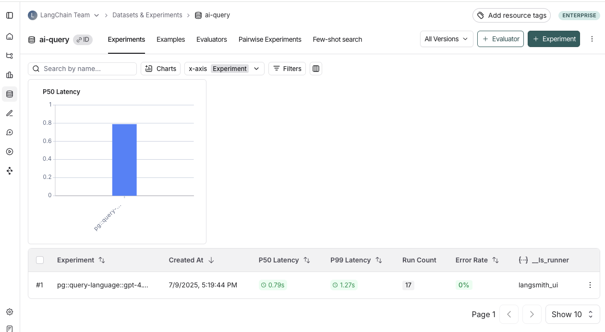

# Improving LLM-as-judge evaluators using human feedback (beta)

:::tip Recommended Reading
Before diving into this content, it might be helpful to read the following:
- [Evaluation concepts](../concepts#evaluators)
- [Creating LLM-as-a-judge evaluators](/evaluation/how_to_guides/llm_as_judge)
:::

Reliable LLM-as-a-judge evaluators are critical for making informed decisions about your AI applications (eg. prompt, model, architecture changes, etc.). But, getting your evaluator prompt just right can be challenging, impacting the trustworthiness of your evaluations

This guide will walk you through **aligning your LLM-as-a-judge evaluator using human feedback**, ultimately improving your evaluator's quality to help you build reliable AI applications.

## How it works 
LangSmith's **Align Evaluator** feature has a series of steps that help you align your LLM-as-a-judge evaluator with human expert feedback:

1. **Select one or more experiments** that contain outputs from your application.
2. Add the selected experiments to an **annotation queue** to label the data.
3. **Test your evaluator prompt** against the labeled examples. Check the cases where your evaluator result is not aligned with the labeled data. This indicates areas where your evaluator prompt needs improvement.
4. **Refine and repeat** to improve evaluator alignment. Update your evaluator prompt and test again

:::note Offline evaluators support only
Currently this feature is only supported for evaluations over a dataset ([offline evaluations](/evaluation/concepts#offline-evaluation)), however we do plan to support this for [online evaluators](/evaluation/concepts#online-evaluation) as well. 
:::

## Prerequisites

In order to get started, you need a [dataset](/evaluation/concepts#datasets) with at least one [experiment](/evaluation/concepts#experiment). 

:::tip Collecting a representative dataset
Datasets should be representative of inputs and outputs you expect to see in production.

While you don’t need to cover every possible scenario, it’s important to include examples across the full range of expected use cases. For example, if you're building a sports bot that answers questions about baseball, basketball, and football, your dataset should include at least one labeled example from each sport.
:::

- You can upload or create a dataset using the [SDK](/evaluation/how_to_guides/manage_datasets_programmatically#create-a-dataset) or the [UI](/evaluation/how_to_guides/manage_datasets_in_application#set-up-your-dataset)
- You can run an experiment using the [SDK](/evaluation/how_to_guides/evaluate_llm_application#run-the-evaluation) or in the [Playground](/evaluation?mode=ui#5-run-your-evaluation)

 

## Getting started

#### Create a new evaluator using labeled data:

1. Navigate to the **Datasets and Experiments** tab
2. Select a dataset
3. Click on **+Evaluator**
4. Choose **Create from labeled data**
5. **Name your feedback key.** This name should reflect what you're evaluating (eg. correctness, hallucination, etc.). It is not possible to change the name of an evaluator after it is created.

#### Align an existing evaluator with experiment data:

1. Navigate to the **Datasets and Experiments** tab
2. Select a dataset
3. Go to the **Evaluators** tab
4. Click on the evaluator you want to align
5. In the "Align Evaluator with experiment data" box, click **Select Experiments**

:::note
Please note that this feature is only supported for **boolean** evaluators created after July 10th, 2025. 
:::

## 1. Select experiments

Select one or more experiments to send for human labeling. This will add all runs from the selected experiments to an [annotation queue](/evaluation/concepts#annotation-queues). 

To add any new experiments to an existing annotation queue, head to the **Evaluators** tab, select the evaluator you are aligning and click **Add to Queue.**

## 2. Label examples

Label examples in the annotation queue by adding a feedback score. Once you've labeled an example, click **Add to Reference Dataset**. 

:::tip Labeling examples
If you have a large number of examples in your experiments, you don't need to label every example to get started. We recommend starting with at least 20 examples, you can always add more later. We recccomend that the examples that you label are diverse (balanced in both 0 and 1 labels) and representative (reflective of real use cases) of your dataset to ensure that you're building a well rounded evaluator prompt. 
:::

## 3. Test your evaluator prompt against the labeled examples

Once you have labeled examples, the next step is iterating on your evaluator prompt to mimic the labeled data as well as possible. This iteration is done in the **Evaluator Playground**. 

To go to the evaluator playground: Click the **View evaluator** button on the top right of the evaluator queue. This will take you to the detail page of the evaluator you are aligning. Click the **Evaluator Playground** button to access the playground.

In the evaluator playground you can create or edit your evaluator prompt and click **Start Alignment** to run it over the set of labeled examples that you created in Step 2. After running your evaluator, you'll see how its generated scores compare to your human labels. The alignment score is the percentage of examples where the evaluator's judgment matches that of the human expert.

## 4. Repeat to improve evaluator alignment
Iterate by updating your prompt and testing again to improve evaluator alignment. 

:::tip
Updates to your evaluator prompt are not saved by default. We reccomend saving your evaluator prompt regularly, and especially after you see your alignment score improve.
:::

Improving the alignment score of your evaluator isn't an exact science but there are a few strategies that are helpful in increasing the alignment score.

**1. Investigate misaligned examples**

Digging into misaligned examples and trying to group them into common failure modes is a great first step for improving your evaluator alignment. To identify the eamples that are misaligned, the alignment column allows for sorting. 

Once you have identified the common failure modes, add instructions to your evaluator prompt so the LLM knows about them. For example, you could explain that "MFA stands for "multi-factor authentication" if you notice it not understanding that specific acronym. Or you could tell it that "a good response will always contain at least 3 potential hotels to book" if it is confused on what good/bad means in your evaluator's context.

**2. Add more labeled examples and validate performance**

To avoid overfitting to the labeled examples, it's important to add more labeled examples and test performance, especially if you started off with a small number of examples.

