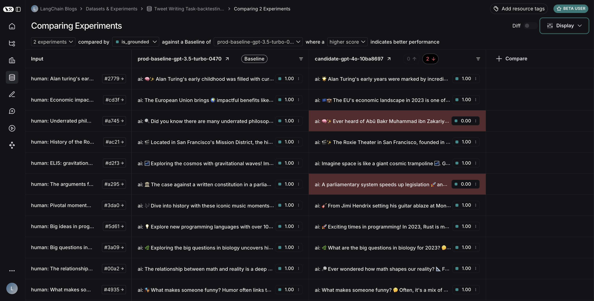

# Backtesting

Deploying your app into production is just one step in a longer journey of continuous improvement. 
You'll likely want to develop other candidate systems that improve on your production model using 
improved prompts, llms, tools, and other techniques. While you may have a set of offline datasets 
you can compare your new system against, it's often useful to compare system performance on more recent production data.
This can help you get a good idea of how the new system performs in the real world.

The basic steps for doing such backtesting are:

1. Sample runs to test against from your production tracing project.
2. Convert these runs to a dataset + initial experiment.
3. Run your new system against the inputs of those runs and compare the results.

You will then have a new dataset of representative inputs you can you can version and backtest your models against.

:::note Ground Truth Data
In most cases, you won't have "ground truth" answers in this case, but you can manually compare and label or use reference-free evaluators to score the outputs.
If your application DOES permit capturing ground-truth labels, then we recommend you use those.
:::

## Prerequisites

Install + set environment variables. This requires `langsmith>=0.1.29` to use the beta utilities.

```python
%%capture --no-stderr
%pip install -U --quiet langsmith langchain_anthropic langchainhub langchain
```

```python
import os

# Set the project name to whichever project you'd like to be testing against
project_name = "Tweet Writing Task"
os.environ["LANGCHAIN_PROJECT"] = project_name
os.environ["LANGCHAIN_API_KEY"] = "YOUR API KEY"
os.environ["LANGCHAIN_TRACING_V2"] = "true"
os.environ["OPENAI_API_KEY"] = "YOUR OPENAI API KEY"
# Optional, you can use DuckDuckGo which requires no API key
os.environ["TAVILY_API_KEY"] = "YOUR TAVILY API KEY"
```

## Create some production runs

If you already have a tracing project with tracing runs, you can skip this step.
For people who don't we will provide some starter code so you can follow along for the rest of the tutorial.

The example app we will make is a Tweet writer:

```python
from langchain_openai import ChatOpenAI
from langchain_core.messages import HumanMessage, convert_to_openai_messages
from langgraph.prebuilt import create_react_agent
from langchain_community.tools import DuckDuckGoSearchRun, TavilySearchResults
from langchain_core.runnables import RunnableLambda
from langchain_core.rate_limiters import InMemoryRateLimiter

rate_limiter = InMemoryRateLimiter(
    requests_per_second=0.08 # If you have a higher tiered API plan you can increase this
)

# We will use GPT-3.5 Turbo as the baseline and compare against GPT-4o
gpt_3_5_turbo = ChatOpenAI(model="gpt-3.5-turbo")

# The modifier is passed as a system message to the agent
modifier = "You are a tweet writing assistant. Use at least 3 emojis in each tweet and remember that tweets are constrained to 280 characters. "
"Please use the search tool to gather recent information on the tweet topic. Respond only with the tweet content."
"Make sure the tweet uses information you retrieved during your search, also mention the source of the information. Make your tweet as engaging as possible."

# Define the tools our agent can use
tools = [TavilySearchResults(max_results=3, rate_limiter=rate_limiter)]
# Use DuckDuckGo if you don't have a Tavily API key
# tools = [DuckDuckGoSearchRun(rate_limiter=rate_limiter)]
agent = create_react_agent(gpt_3_5_turbo, tools=tools, state_modifier=modifier)

def target(inputs):
    raw = agent.invoke(inputs)
    return {"messages": convert_to_openai_messages(raw['messages'])}
    
agent_runnable = RunnableLambda(target)

inputs = [
    "LangChain recent news",
    "The 2024 NFL Season",
    "Agents built using LangGraph",
    "The 2024 United States presidential election",
    "Research related to mechanistic interpretability",
    "The latest frontier LLM models",
    "Host cities for the 2026 world cup",
    "The stock market over the last week",
    "Willow, Google's Quantum Computing Chip",
    "The Billboard 100 for the first week of december 2024"
]

agent_runnable.batch(
    [{"messages": [HumanMessage(content=content)]} for content in inputs],
)
```

## Convert Production Traces to Experiment

The first step is to generate a dataset based on the production _inputs_.
Then copy over all the traces to serve as a baseline experiment. 

### Select runs to backtest on

You can select the runs to backtest on using the `filter` argument of `list_runs`.
The `filter` argument uses the LangSmith [trace query syntax](/reference/data_formats/trace_query_syntax) to select runs.

```python
from datetime import datetime, timedelta, timezone
from uuid import uuid4
from langsmith import Client
from langsmith.beta import convert_runs_to_test

# How we are sampling runs to include in our dataset
end_time = datetime.now(tz=timezone.utc)
start_time = end_time - timedelta(days=1)
run_filter = f'and(gt(start_time, "{start_time.isoformat()}"), lt(end_time, "{end_time.isoformat()}"))'


# Fetch the runs we want to convert to a dataset/experiment
client = Client()

prod_runs = list(
    client.list_runs(
        project_name=project_name,
        execution_order=1,
        filter=run_filter,
    )
)
baseline_experiment_name = f"prod-baseline-gpt-3.5-turbo-{str(uuid4())[:4]}"
```

### Convert runs to experiment

`convert_runs_to_test` is a function which takes some runs and does the following:

1. The inputs, and optionally the outputs, are saved to a dataset as Examples.
2. The inputs and outputs are stored as an experiment, as if you had run the `evaluate`
   function and received those outputs.

```python
# Name of the dataset we want to create
dataset_name = f'{project_name}-backtesting {start_time.strftime("%Y-%m-%d")}-{end_time.strftime("%Y-%m-%d")}'

# This converts the runs to a dataset + experiment
# It does not actually invoke your model
convert_runs_to_test(
    prod_runs,
    # Name of the resulting dataset
    dataset_name=dataset_name,
    # Whether to include the run outputs as reference/ground truth
    include_outputs=False,
    # Whether to include the full traces in the resulting experiment
    # (default is to just include the root run)
    load_child_runs=True,
    # Name of the experiment so we can apply evalautors to it after
    test_project_name=baseline_experiment_name
)
```

Once this step is complete, you should see a new dataset in your LangSmith project 
called "Tweet Writing Task-backtesting TODAYS DATE", with a single experiment like so:


## Benchmark against new system

Now we can start the process of benchmarking our production runs against a new system.

### Define evaluators

First let's define the evaluators we will use to compare the two systems.

```python
import emoji
from pydantic import BaseModel, Field

class Grounded(BaseModel):
    """Whether the tweet was grounded in the retrieved context"""
    grounded: bool = Field(..., description="Is the majorits of the tweet content supported by the retrieved context?")

grounded_model = ChatOpenAI(model = "gpt-4o").with_structured_output(Grounded)

def length_evaluator(outputs):
    return {"key": "satisfies_tweet_length", "score": int(len(outputs["messages"][-1]['content']) <= 280)}
    
def emoji_evaluator(outputs):
    return {"key": "satisfies_emoji_requirement", "score": (len(emoji.emoji_list(outputs["messages"][-1]['content'])) >= 3)}
    
def grounded_evaluator(outputs):
    context = ""
    for message in outputs["messages"]:
        if message['role'] == "tool" and ('status' in message and message['status'] != "error"):
            # Tool message outputs are the results returned from the Tavily/DuckDuckGo tool
            context += message['content']
    return {"key": "grounded_in_context", "score": int(grounded_model.invoke(f"Is the tweet about the following context: {context}?").grounded)}
```

### Evaluate baseline

Now, let's run our evaluators against the baseline experiment.

```python
from langsmith import evaluate

evaluate(
    baseline_experiment_name,
    evaluators=[length_evaluator, emoji_evaluator, grounded_evaluator],
)
```

### Define and evaluate new system

Now, let's define and evaluate our new system. In this example our new system
will be the same as the old system, but will use GPT-4o instead of GPT-3.5.

```python
gpt_4o = ChatOpenAI(model="gpt-4o")
new_agent = create_react_agent(gpt_4o, tools=tools, state_modifier=modifier)

def new_target(inputs):
    raw = new_agent.invoke(inputs)
    return {"messages": convert_to_openai_messages(raw['messages'])}

evaluate(
    new_target,
    data = dataset_name,
    evaluators = [length_evaluator, emoji_evaluator, grounded_evaluator],
    experiment_prefix="new-baseline-gpt-4o",
)
```

## Compare results

Your dataset should now have two experiments:


We can see that the GPT-4o model does a better job of writing tweets that are
under 280 characters. We can enter the comparison view to see the exact runs on 
which GPT-4o is better than GPT-3.5:



## Next steps

This was a simple example to show how you could backtest your production system against a new system.
There are many different ways to do this backtesting, including using targeted filters
to select the production runs you want to improve on, or using human preference
data instead of evlautors defined in code.
